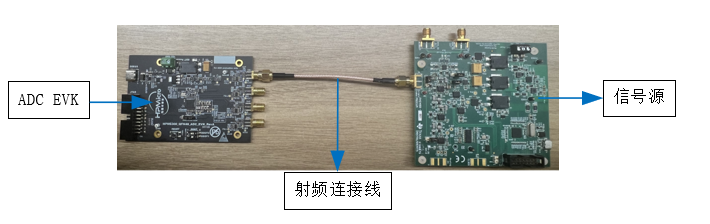

# HPM ADC EVK

## Overview

HPM series MCU is a high-performance real-time RISC-V microcontroller from Shanghai HPM Semiconductor Technology Co., Ltd., which provides great computing power and efficient control capability for industrial automation and edge computing applications. Shanghai HPM  Semiconductor has currently released multiple series of high-performance microcontroller products, such as HPM6700/6400, HPM6300, HPM6200, HPM5300, etc.
The HPM6700/6400 series microcontrollers are equipped with three 12 bit and one 16 bit ADC controller, the HPM6300 and HPM6200 series microcontrollers are equipped with three 16 bit ADC controllers, and the HPM5300 series microcontrollers are equipped with two 16 bit microcontrollers. The 12 bit ADC supports a maximum sampling rate of 5MSPS, while the 16 bit ADC supports a maximum sampling rate of 2MSPS. Supports multiple sampling modes such as read, cycle, sequence, and preemption. The input mode supports single ended (12 bit, 16 bit) and differential input (12 bit), and supports configurable resolution and sampling cycle number, as well as DMA conversion results written into memory.
For the HPM series MCU high-precision ADC, HPM Semiconductor has launched a series of ADC EVK to evaluate ADC performance, which includes ADC EVK hardware design drawings, ADC EVK user guide, ADC design guide, and ADC test code. Intended to help users achieve optimal ADC performance.
  
## Test samples
### adc16_sinad(ADC batch sampling demo)
#### Overview

In this example, ADC16 batch samples several data from the specified channel and outputs them to the serial port terminal.
The default sampling rate is 2MSPS.

The sampled data can be imported into scientific computing software for sinad and thd analysis.

#### Hardware Support

Please read user guide  [HPM5300_ADC_EVK User Guide](doc/HPM5300_ADC_EVK_UG_V1.0.pdf)  
Please read hardware schematic [HPM5300_ADC_EVK_RevA](hardware/HPM5300_ADC_EVK_RevA.pdf)  
Please See the hardware engineering path (hpm_apps/apps/adc/hardware/HPM5300_ADC_EVK_RevA-Project Files) 

Please read user guide [HPM62\6300_ADC_EVK User Guide](doc/HPM62_6300_ADC_EVK_UG_V1.0.pdf)  
Please read hardware schematic [HPM62\6300_ADC_EVK_RevA](hardware/HPM62_63_144_ADC_EVK_RevB.pdf)  
Please See the hardware engineering path (hpm_apps/apps/adc/hardware/HPM62\6300_ADC_EVK_RevA-Project Files) 
  
Please read user guide [HPM6750_ADC_EVK User Guide](doc/HPM6750_ADC_EVK_UG_V1.0.pdf)   
Please read hardware schematic [HPM6750_ADC_EVK_RevA](hardware/HPM6750_ADC_EVK_RevA.pdf)  
Please See the hardware engineering path (hpm_apps/apps/adc/hardware/HPM675000_ADC_EVK_RevA-Project Files)

#### Device Connection

- Connect PC USB to DEBUG Type-C interface
- Connect the debugger to the JTAG interface
- Connect the signal source to the signal input SMA interface   

- The signal source connection diagram is as follows:  
  
The signal source motherboard model is PSIEVMTI and the manufacturer is Texas Instruments.

#### Port Settings

- Serial port baud rate is set to ``115200bps``, with ``one stop bit`` and ``no parity bit``

#### Create Project

- windows GUI create project  


- windows cmd create project  
  Please read [HPM5300_ADC_EVK User Guide](doc/HPM5300_ADC_EVK_UG_V1.0.pdf)  as reference.

#### Running the example

When the project runs correctly, the serial port terminal will output the following information:
```
==============================
 hpm5300evk clock summary
==============================
cpu0:		 360000000Hz
ahb:		 180000000Hz
mchtmr0:	 24000000Hz
xpi0:		 114285714Hz
==============================
hpm_sdk: 1.4.0

----------------------------------------------------------------------
$$\   $$\ $$$$$$$\  $$\      $$\ $$\
$$ |  $$ |$$  __$$\ $$$\    $$$ |\__|
$$ |  $$ |$$ |  $$ |$$$$\  $$$$ |$$\  $$$$$$$\  $$$$$$\   $$$$$$\
$$$$$$$$ |$$$$$$$  |$$\$$\$$ $$ |$$ |$$  _____|$$  __$$\ $$  __$$\
$$  __$$ |$$  ____/ $$ \$$$  $$ |$$ |$$ /      $$ |  \__|$$ /  $$ |
$$ |  $$ |$$ |      $$ |\$  /$$ |$$ |$$ |      $$ |      $$ |  $$ |
$$ |  $$ |$$ |      $$ | \_/ $$ |$$ |\$$$$$$$\ $$ |      \$$$$$$  |
\__|  \__|\__|      \__|     \__|\__| \_______|\__|       \______/
----------------------------------------------------------------------
This is an ADC16 demo for sinad test:

[16:21:03.612]receive←◆adc data buff is full, buffer start addr:80014. end addr:88010
Ch: 3 val: 59604 0%
 Ch: 3 val: 59611 0%
 Ch: 3 val: 59615 0%
 Ch: 3 val: 59622 0%
 Ch: 3 val: 59621 0%
 Ch: 3 val: 59620 0%
 Ch: 3 val: 59608 0%
 Ch: 3 val: 59617 0%
 Ch: 3 val: 59619 0%
 Ch: 3 val: 59626 0%
 Ch: 3 val: 59619 0%s
 Ch: 3 val: 59619 0%
 Ch: 3 val: 59619 0%
 Ch: 3 val: 59615 0%
 Ch: 3 val: 59625 0%
 Ch: 3 val: 59608 0%
 Ch: 3 val: 59617 0%
 Ch: 3 val: 59621 0%
 Ch: 3 val: 59620 0%
 Ch: 3 val: 59625 0%
 Ch: 3 val: 59628 0%
 Ch: 3 val: 59622 0%
 Ch: 3 val: 59616 0%
 Ch: 3 val: 59608 0%
 Ch: 3 val: 59612 0%
 Ch: 3 val: 59625 0%
 Ch: 3 val: 59612 0%
 Ch: 3 val: 59625 0%
 Ch: 3 val: 59615 0%
 Ch: 3 val: 59617 0%
 Ch: 3 val: 59617 0%
 Ch: 3 val: 59619 0%
```

### adc16_inl_dnl(ADC Batch Sampling Data and Writing to USB Disk Demo)
#### Overview

In this example, ADC16 batch samples  data from the specified channel and save them to USB disk.
The default sampling rate is 664KSPS.

The sampled data can be imported into scientific computing software for inl and dnl analysis.

#### Hardware Support

Please read hardware schematic [HPM6750_ADC_EVK_RevA](hardware/HPM6750_ADC_EVK_RevA.pdf)  
Please read user guide [HPM6750_ADC_EVK User Guide](doc/HPM6750_ADC_EVK_UG_V1.0.pdf)  
Please See the hardware engineering path (hpm_apps/apps/adc/hardware/HPM675000_ADC_EVK_RevA-Project Files) 

#### Device Connection

- Connect PC USB to DEBUG Type-C interface
- Connect the debugger to the JTAG interface
- Connect the USB disk to USB0 port
- Connect the signal source to the signal input SMA interface  
- The signal source connection diagram is as follows:  
  
The signal source motherboard model is PSIEVMTI and the manufacturer is Texas Instruments. 
Note: USB disk need to be formated to FAT32  


#### Port Settings

- Serial port baud rate is set to ``115200bps``, with ``one stop bit`` and ``no parity bit``

#### Create Project

- windows GUI create project  
 

- windows cmd create project  
  Please read [HPM6750_ADC_EVK User Guide](doc/HPM6750_ADC_EVK_UG_V1.0.pdf)  as reference.

#### Running the example

When the project runs correctly, the serial port terminal will output the following information:
```
==============================
 hpm6750_adc_evk clock summary
==============================
cpu0:		 648000000Hz
cpu1:		 648000000Hz
axi0:		 200000000Hz
axi1:		 200000000Hz
axi2:		 200000000Hz
ahb:		 200000000Hz
mchtmr0:	 24000000Hz
mchtmr1:	 24000000Hz
xpi0:		 133333333Hz
xpi1:		 400000000Hz
femc:		 166666666Hz
display:	 74250000Hz
cam0:		 59400000Hz
cam1:		 59400000Hz
jpeg:		 200000000Hz
pdma:		 200000000Hz
==============================
hpm_sdk: 1.4.0

----------------------------------------------------------------------
$$\   $$\ $$$$$$$\  $$\      $$\ $$\
$$ |  $$ |$$  __$$\ $$$\    $$$ |\__|
$$ |  $$ |$$ |  $$ |$$$$\  $$$$ |$$\  $$$$$$$\  $$$$$$\   $$$$$$\
$$$$$$$$ |$$$$$$$  |$$\$$\$$ $$ |$$ |$$  _____|$$  __$$\ $$  __$$\
$$  __$$ |$$  ____/ $$ \$$$  $$ |$$ |$$ /      $$ |  \__|$$ /  $$ |
$$ |  $$ |$$ |      $$ |\$  /$$ |$$ |$$ |      $$ |      $$ |  $$ |
$$ |  $$ |$$ |      $$ | \_/ $$ |$$ |\$$$$$$$\ $$ |      \$$$$$$  |
\__|  \__|\__|      \__|     \__|\__| \_______|\__|       \______/
----------------------------------------------------------------------
--------------------------------------------------------------------

- Host example

- if you find any bugs or get any questions, feel free to file an

- issue at https:/*github.com/hathach/tinyusb

--------------------------------------------------------------------


This Host demo is configured to support:

  - RTOS = None

  - Mass Storage

USB0 Host Mass Storage Demo


A MassStorage device is mounted.

USB 3.0  ProductCode      rev 2.00

Disk Size: 122800 MB

Block Count = 251494400, Block Size: 512

FatFs mount succeeded!
The USBHost.txt is open.
write udisk...

write udisk...

write udisk...

write udisk...

...(Omit here)


Write the USBHost.txt file done with 10200samples!

Direcotry Path: /

File   Name: USBHost.txt

```  
## API

:::{eval-rst}

About software API: `API doc <doc/api/index.html>`_ 。
:::