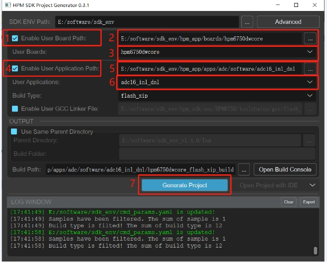

# HPM ADC EVK

## 概述

HPM系列MCU是来自上海先楫半导体科技有限公司的高性能实时RISC-V微控制器，为工业自动化及边缘计算应用提供了极大的算力、高效的控制能力。上海先楫半导体目前已经发布了如 HPM6700/6400、HPM6300、HPM6200、HPM5300等多个系列的高性能微控制器产品。 

HPM6700/6400系列微控制器内置3个12位和1个16位ADC控制器，HPM6300和HPM6200系列微控制器内置3个16位ADC控制器，HPM5300系列微控制内置2个16位微控制器。其中12位ADC支持最高采样率5MSPS，16位ADC支持最高采样率2MSPS。支持读取、周期、序列、抢占多种采样模式，输入模式支持单端（12位，16位）和 差分输入（12位），并且支持可配置分辨率和采样周期数，以及DMA转换结果写入内存中。

针对HPM系列MCU高精度ADC，先楫半导体推出系列ADC EVK用于评估ADC性能，其中包含了ADC EVK硬件设计图纸，ADC EVK用户指南，ADC设计指南，以及ADC测试代码。旨在帮助用户实现最佳ADC性能。 

## 测试用例

### adc16_sinad(16位ADC批量采样例程)

#### 概述

在该示例中，ADC16批量采样指定通道的若干数据并输出到串口终端。默认采样率为2MSPS。  

采样后的数据导入科学计算软件中可用作sinad和thd分析。

#### 硬件支持

HPM5300:查看用户指南 [HPM5300_ADC_EVK用户指南](doc/HPM5300_ADC_EVK_UG_V1.0.pdf)  
HPM5300:查看硬件原理图 [HPM5300_ADC_EVK_RevA](hardware/HPM5300_ADC_EVK_RevA.pdf)  
HPM5300:硬件工程路径见：(hpm_app/apps/adc/hardware/HPM5300_ADC_EVK_RevA-工程文件)   

HPM62\6300: 查看用户指南 [HPM62\6300_ADC_EVK用户指南](doc/HPM62_6300_ADC_EVK_UG_V1.0.pdf)  
HPM62\6300: 查看硬件原理图 [HPM62\6300_ADC_EVK_RevA](hardware/HPM62_63_144_ADC_EVK_RevB.pdf)  
HPM62\6300: 硬件工程路径见：(hpm_app/apps/adc/hardware/HPM62\6300_ADC_EVK_RevA-工程文件)   

HPM6750: 查看用户指南 [HPM67500_ADC_EVK用户指南](doc/HPM6750_ADC_EVK_UG_V1.0.pdf)  
HPM6750: 查看硬件原理图 [HPM67500_ADC_EVK_RevA](hardware/HPM6750_ADC_EVK_RevA.pdf)  
HPM6750:硬件工程路径见：(hpm_app/apps/adc/hardware/HPM6750_ADC_EVK_RevA-工程文件)  

HPM6E00: 查看用户指南 [HPM6E00_ADC_EVK用户指南](doc/HPM6E00_ADC_EVK_UG_V1.0.pdf)  
HPM6E00: 查看硬件原理图 [HPM6E00_ADC_EVK_RevA](hardware/HPM6E00ADCEVKRevC.pdf)  
HPM6E00:硬件工程路径见：(hpm_app/apps/adc/hardware/HPM6E00ADCEVKRevC-工程文件)  


#### 设备连接

- 连接PC USB到DEBUG Type-C接口
- 连接调试器到JTAG接口
- 连接信号源到信号输入SMA接口  

- 信号源连接示意图如下：   
  
信号源主板型号为PSIEVMTI，制造厂商为德州仪器 Texas Instruments


#### 端口设置

-  串口波特率设置为``115200bps``，``1个停止位``，``无奇偶校验位``

#### 创建工程

- windows下GUI工程构建   


- windows下命令行工程构建  
  请参考 [HPM5300_ADC_EVK用户指南](doc/HPM5300_ADC_EVK_UG_V1.0.pdf) 

#### 运行现象

当工程正确运行后，串口终端会输出如下信息：
```
==============================
 hpm5300evk clock summary
==============================
cpu0:		 360000000Hz
ahb:		 180000000Hz
mchtmr0:	 24000000Hz
xpi0:		 114285714Hz
==============================
hpm_sdk: 1.4.0

----------------------------------------------------------------------
$$\   $$\ $$$$$$$\  $$\      $$\ $$\
$$ |  $$ |$$  __$$\ $$$\    $$$ |\__|
$$ |  $$ |$$ |  $$ |$$$$\  $$$$ |$$\  $$$$$$$\  $$$$$$\   $$$$$$\
$$$$$$$$ |$$$$$$$  |$$\$$\$$ $$ |$$ |$$  _____|$$  __$$\ $$  __$$\
$$  __$$ |$$  ____/ $$ \$$$  $$ |$$ |$$ /      $$ |  \__|$$ /  $$ |
$$ |  $$ |$$ |      $$ |\$  /$$ |$$ |$$ |      $$ |      $$ |  $$ |
$$ |  $$ |$$ |      $$ | \_/ $$ |$$ |\$$$$$$$\ $$ |      \$$$$$$  |
\__|  \__|\__|      \__|     \__|\__| \_______|\__|       \______/
----------------------------------------------------------------------
This is an ADC16 demo for sinad test:

[16:21:03.612]收←◆adc data buff is full, buffer start addr:80014. end addr:88010
Ch: 3 val: 59604 0%
 Ch: 3 val: 59611 0%
 Ch: 3 val: 59615 0%
 Ch: 3 val: 59622 0%
 Ch: 3 val: 59621 0%
 Ch: 3 val: 59620 0%
 Ch: 3 val: 59608 0%
 Ch: 3 val: 59617 0%
 Ch: 3 val: 59619 0%
 Ch: 3 val: 59626 0%
 Ch: 3 val: 59619 0%
 Ch: 3 val: 59619 0%
 Ch: 3 val: 59619 0%
 Ch: 3 val: 59615 0%
 Ch: 3 val: 59625 0%
 Ch: 3 val: 59608 0%
 Ch: 3 val: 59617 0%
 Ch: 3 val: 59621 0%
 Ch: 3 val: 59620 0%
 Ch: 3 val: 59625 0%
 Ch: 3 val: 59628 0%
 Ch: 3 val: 59622 0%
 Ch: 3 val: 59616 0%
 Ch: 3 val: 59608 0%
 Ch: 3 val: 59612 0%
 Ch: 3 val: 59625 0%
 Ch: 3 val: 59612 0%
 Ch: 3 val: 59625 0%
 Ch: 3 val: 59615 0%
 Ch: 3 val: 59617 0%
 Ch: 3 val: 59617 0%
 Ch: 3 val: 59619 0%
 ```  

### adc16_inl_dnl(ADC批量采样数据并写入U盘例程)
#### 概述

在该示例中，ADC16批量采样指定通道的若干数据并写入U盘中。默认采样率为664KSPS。

采样后的数据导入科学计算软件中可用作inl和dnl等静态特性分析。

#### 硬件支持
HPM6750:查看硬件原理图 [HPM6750_ADC_EVK_RevA](hardware/HPM6750_ADC_EVK_RevA.pdf)  
HPM6750:查看用户指南 [HPM6750_ADC_EVK用户指南](doc/HPM6750_ADC_EVK_UG_V1.0.pdf)  
HPM6750:硬件工程路径见：(hpm_app/apps/adc/hardware/HPM6750_ADC_EVK_RevA-工程文件)  

#### 设备连接

- 连接PC USB到DEBUG Type-C接口
- 连接调试器到JTAG接口
- 连接U盘到USB0接口
- 连接信号源到信号输入SMA接口  
- 信号源连接示意图如下： 
   
 
信号源主板型号为PSIEVMTI，制造厂商为德州仪器 Texas Instruments  

注意:U盘需要格式化成FAT32格式  


#### 端口设置

-  串口波特率设置为``115200bps``，``1个停止位``，``无奇偶校验位``

#### 创建工程

- windows下GUI工程构建  
  

- windows下命令行工程构建  
  请参考 [HPM6750_ADC_EVK用户指南](doc/HPM6750_ADC_EVK_UG_V1.0.pdf)  

#### 运行现象

当工程正确运行后，串口终端会输出如下信息：
```
==============================
 hpm6750_adc_evk clock summary
==============================
cpu0:		 648000000Hz
cpu1:		 648000000Hz
axi0:		 200000000Hz
axi1:		 200000000Hz
axi2:		 200000000Hz
ahb:		 200000000Hz
mchtmr0:	 24000000Hz
mchtmr1:	 24000000Hz
xpi0:		 133333333Hz
xpi1:		 400000000Hz
femc:		 166666666Hz
display:	 74250000Hz
cam0:		 59400000Hz
cam1:		 59400000Hz
jpeg:		 200000000Hz
pdma:		 200000000Hz
==============================
hpm_sdk: 1.4.0

----------------------------------------------------------------------
$$\   $$\ $$$$$$$\  $$\      $$\ $$\
$$ |  $$ |$$  __$$\ $$$\    $$$ |\__|
$$ |  $$ |$$ |  $$ |$$$$\  $$$$ |$$\  $$$$$$$\  $$$$$$\   $$$$$$\
$$$$$$$$ |$$$$$$$  |$$\$$\$$ $$ |$$ |$$  _____|$$  __$$\ $$  __$$\
$$  __$$ |$$  ____/ $$ \$$$  $$ |$$ |$$ /      $$ |  \__|$$ /  $$ |
$$ |  $$ |$$ |      $$ |\$  /$$ |$$ |$$ |      $$ |      $$ |  $$ |
$$ |  $$ |$$ |      $$ | \_/ $$ |$$ |\$$$$$$$\ $$ |      \$$$$$$  |
\__|  \__|\__|      \__|     \__|\__| \_______|\__|       \______/
----------------------------------------------------------------------
--------------------------------------------------------------------

- Host example

- if you find any bugs or get any questions, feel free to file an

- issue at https:/*github.com/hathach/tinyusb

--------------------------------------------------------------------


This Host demo is configured to support:

  - RTOS = None

  - Mass Storage

USB0 Host Mass Storage Demo


A MassStorage device is mounted.

USB 3.0  ProductCode      rev 2.00

Disk Size: 122800 MB

Block Count = 251494400, Block Size: 512

FatFs mount succeeded!
The USBHost.txt is open.
write udisk...

write udisk...

write udisk...

write udisk...

...（此处省略）


Write the USBHost.txt file done with 10200samples!

Direcotry Path: /

File   Name: USBHost.txt

```  
## 软件API

:::{eval-rst}

关于软件API 请查看 `方案API 文档 <../../_static/apps/adc/html/index.html>`_ 。
:::


