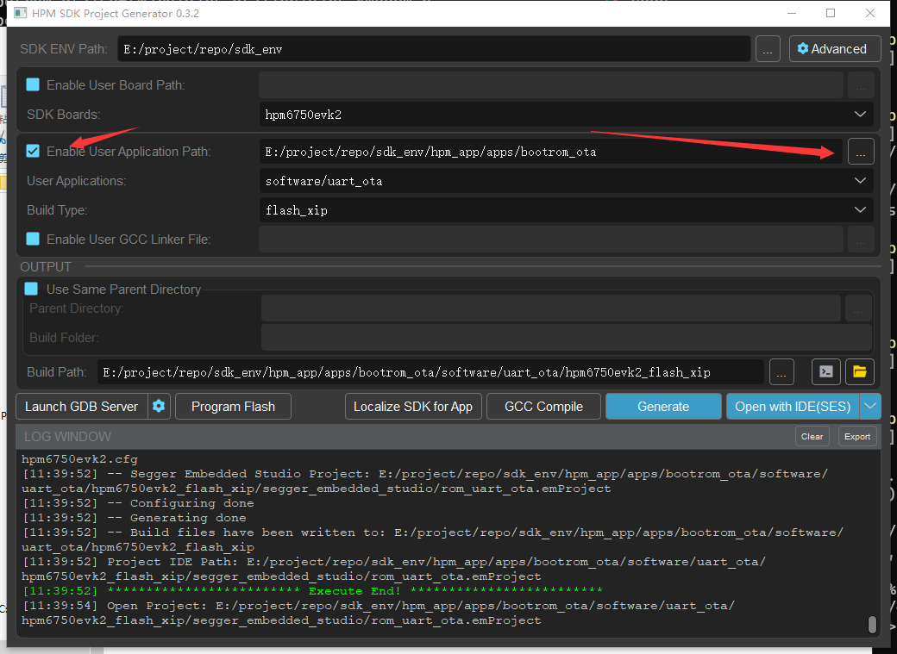

# Bootrom OTA

## Overview

This section primarily introduces how to use the **SEC_IMG_OFFSET** feature provided by the bootrom for OTA upgrades. For OTA upgrades, we use the UART xmodem functionality, and the firmware is encrypted.

The layout of the XPI NOR boot image in FLASH is shown in the figure:


Typically, we only use boot image 0, but when there is an OTA upgrade or an OTA encryption requirement, we need to use boot image 1. When BootROM starts, it checks whether the **SEC_IMG_OFFSET** in the OTP is 0. If it is 0, it indicates that there is only one image. If it is not 0, it indicates the presence of a second image. BootROM then compares the **SW_VERSION** of the two images and selects the one with the larger **SW_VERSION** as the latest image to execute. If both **SW_VERSIONs** are equal, the first image is considered the latest one to execute. The **SW_VERSION** is stored in the firmware container header.

Furthermore, in practical use, we often need to encrypt the firmware. In such cases, the **EXIP BLOB** feature is used to store keys and other information required for encryption. Additionally, the entire HPM series supports in-place decryption and execution of XPI NOR images. When the **EXIP BLOB** feature is enabled, the BootROM will decrypt the image in-place and execute it during the boot phase, which is highly convenient.

## Demo

Next, we will discuss how to download the firmware to both images using the UART xmodem feature. Since xmodem only handles data transmission and does not perform integrity checks, we have added header information to the firmware for validation purposes. Therefore, before programming, we need to package the firmware and add the header information using the packaging tool **pack_img.py**. The structure of the header information is as follows:

```
typedef struct
{
    uint32_t magic;
    uint32_t device;
    uint32_t len;
    uint32_t checksum;
} user_fota_header_t;
```

The overall code execution process is as follows:

```
    ota_board_flash_init();
    ota_index = ota_check_current_otaindex();
    printf("now runing OTA%d...\n", ota_index+1);


    ret = xmodemReceive(NULL, 0, writefile);
    if (ret > 0)
       ota_board_complete_reset();
```

- Configure the xpi flash controller
- Obtain the index of the currently executing image
- Execute the xmodem protocol to program the header information and firmware into the flash
- After programming is complete, perform firmware verification, and if the verification is successful, reset the system

For programming the flash, we primarily use the `ota_board_auto_write` API, which includes the functionalities of **switching images**, **programming the header information**, and **programming the firmware**. The code is as follows:

```
bool ota_board_auto_write(void const *src, uint32_t len)
{
    static uint32_t offset = 0;
    uint8_t ota_index;

    user_fota_header_t *current_header = (user_fota_header_t *)src;
    if (current_header->magic == USER_UPGREAD_FLAG_MAGIC &&
        current_header->device == BOARD_DEVICE_ID) {
        ota_index = ota_check_current_otaindex();
        if (ota_index == 1) {
            memcpy(&current_fota_header, current_header, sizeof(user_fota_header_t));
            // printf("ota1, length:%d,checksem:0x%08x\n", current_header->len, current_header->checksum);
            ota_board_header_write(0, &current_fota_header);
            current_addr = FLASH_APP1_ALL_IMG_ADDR;
            offset = 0;
            src = src + sizeof(user_fota_header_t);
            len -= sizeof(user_fota_header_t);
            //printf("ota data download...\n");
        } else if (ota_index == 0) {
            memcpy(&current_fota_header, current_header, sizeof(user_fota_header_t));
            ota_board_header_write(1, &current_fota_header);
            current_addr = FLASH_APP2_ALL_IMG_ADDR;
            offset = 0;
            src = src + sizeof(user_fota_header_t);
            len -= sizeof(user_fota_header_t);
            //printf("ota data download...\n");
        }
    }

    if (current_addr != 0) {
        ota_board_flash_write(current_addr + offset, src, len);
        offset += len;
        if (offset >= current_fota_header.len) {
            //complete checksum and reset
            //ota_board_complete_reset();
            offset = 0;
            return true;
        }
    }
    return false;
}
```

## Build



## OTA Guide

Refer to [HPM BootROM OTA guide](doc/HPM_BootROM_OTA操作说明_V2.0.pdf)

## API

:::{eval-rst}

About software API: `API doc <doc/api/index.html>`_ 。
:::