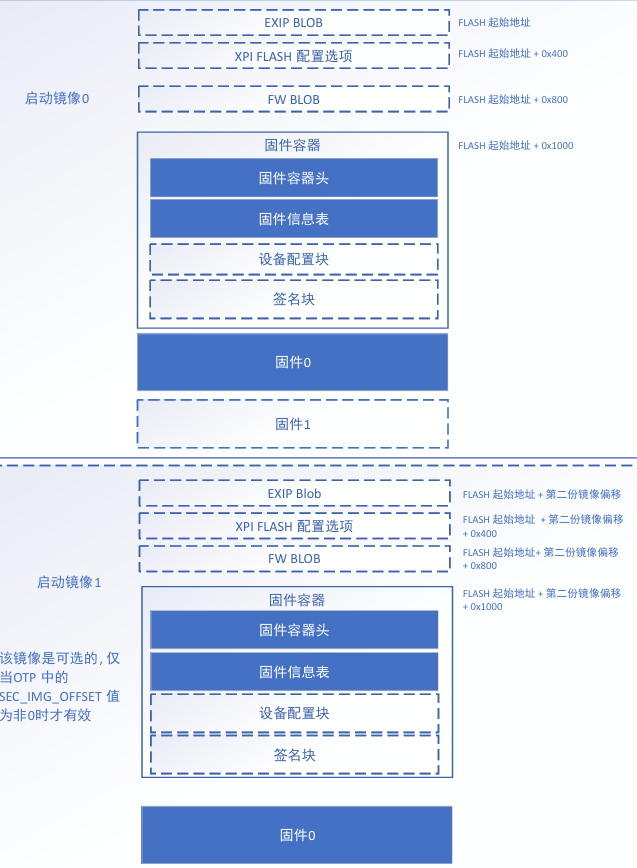
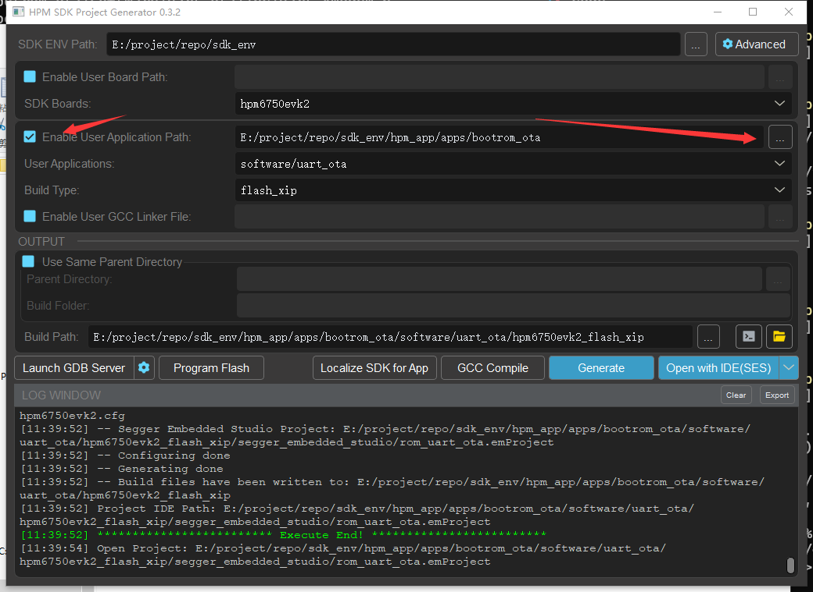

# Bootrom OTA

## 概述

本节主要介绍如何借助 bootrom 自带的 **SEC_IMG_OFFSET** 功能进行 OTA 升级。OTA 升级我们采用 UART xmodem 功能，并且运行的是加密固件。

XPI NOR 的启动镜像在FLASH中的布局如图所示：



通常来说，我们只使用启动镜像0，但是当我们有 OTA 升级或者是 OTA 加密需求的时候，这个时候我们就需要用到启动镜像1。BootROM在启动时，判断OTP中的 **SEC_IMG_OFFSET** 是否为0，如果为0，说明只有一份镜像；如果不为0，则说明存在第二份镜像。BootROM通过对比两份镜像中的 **SW_VERSION** 大小,选择 **SW_VERSION** 更大的一份作为最新的IMAGE执行，若两份 **SW_VERSION** 相等，则认为第一份为最新的IMAGE执行。其中 **SW_VERSION** 存放在固件容器头中。
其次，我们在实际使用中，通常需要对固件进行加密，此时，会用到 **EXIP BLOB** 功能, 用于存放加密所需要的密钥等信息。并且，HPM 全系列都支持 XPI NOR 的原地解密执行，当开启了 **EXIP BLOB** 功能后，bootrom 启动阶段会对镜像原地解密并执行，十分方便。

## 例程

接下来就是如何将固件下载到两份镜像中，这里我们使用 uart xmodem 功能。
由于 xmodem 只负责传输数据，不具备完整性校验，因此，我们在固件中增加了头部信息，用于对固件进行校验, 所以我们在烧录之前，还需要对固件进行打包增加头部信息，需要用到打包工具 **pack_img.py**。头部信息结构参考如下：

```
typedef struct
{
    uint32_t magic;
    uint32_t device;
    uint32_t len;
    uint32_t checksum;
} user_fota_header_t;
```

整体代码执行流程如下：

```
    ota_board_flash_init();
    ota_index = ota_check_current_otaindex();
    printf("now runing OTA%d...\n", ota_index+1);


    ret = xmodemReceive(NULL, 0, writefile);
    if (ret > 0)
       ota_board_complete_reset();
```

- 配置 xpi flash 控制器
- 获取当前执行的镜像 index
- 执行 xmodem 协议，将头部信息和固件烧录到 flash 中
- 烧录完成后，执行固件校验，校验成功后 reset

烧录到 flash 我们主要使用 `ota_board_auto_write` api，功能包含 **切换镜像** + **烧录头部信息** + **烧录固件**， 代码如下：

```
bool ota_board_auto_write(void const *src, uint32_t len)
{
    static uint32_t offset = 0;
    uint8_t ota_index;

    user_fota_header_t *current_header = (user_fota_header_t *)src;
    if (current_header->magic == USER_UPGREAD_FLAG_MAGIC &&
        current_header->device == BOARD_DEVICE_ID) {
        ota_index = ota_check_current_otaindex();
        if (ota_index == 1) {
            memcpy(&current_fota_header, current_header, sizeof(user_fota_header_t));
            // printf("ota1, length:%d,checksem:0x%08x\n", current_header->len, current_header->checksum);
            ota_board_header_write(0, &current_fota_header);
            current_addr = FLASH_APP1_ALL_IMG_ADDR;
            offset = 0;
            src = src + sizeof(user_fota_header_t);
            len -= sizeof(user_fota_header_t);
            //printf("ota data download...\n");
        } else if (ota_index == 0) {
            memcpy(&current_fota_header, current_header, sizeof(user_fota_header_t));
            ota_board_header_write(1, &current_fota_header);
            current_addr = FLASH_APP2_ALL_IMG_ADDR;
            offset = 0;
            src = src + sizeof(user_fota_header_t);
            len -= sizeof(user_fota_header_t);
            //printf("ota data download...\n");
        }
    }

    if (current_addr != 0) {
        ota_board_flash_write(current_addr + offset, src, len);
        offset += len;
        if (offset >= current_fota_header.len) {
            //complete checksum and reset
            //ota_board_complete_reset();
            offset = 0;
            return true;
        }
    }
    return false;
}
```

## 工程构建



## OTA 烧录说明

参考 [HPM BootROM OTA 操作说明](doc/HPM_BootROM_OTA操作说明_V2.0.pdf)

## 软件API

:::{eval-rst}

关于软件API 请查看 `方案API 文档 <doc/api/index_zh.html>`_ 。
:::
