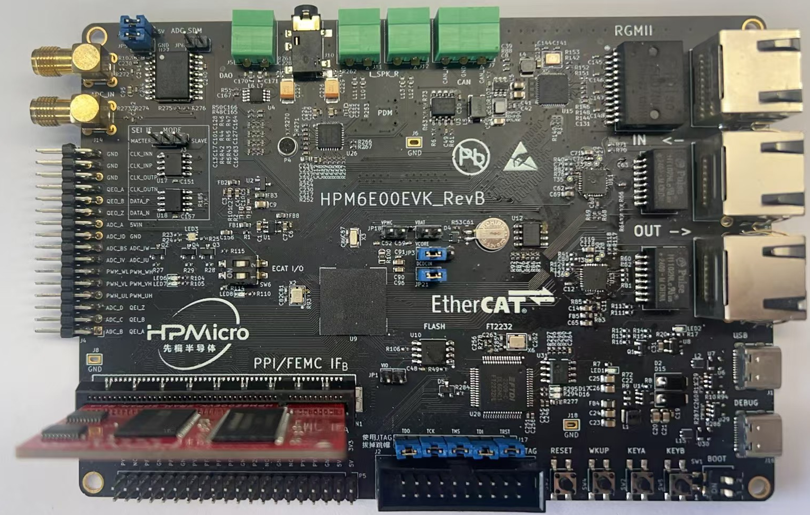
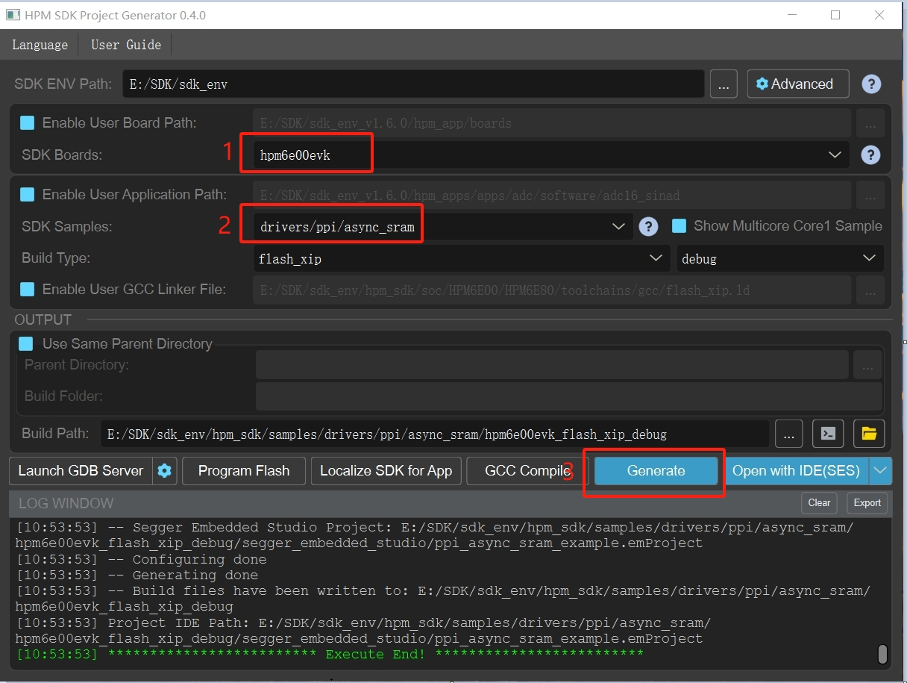

# HPM子板系列

## 概述

HPM系列MCU是来自上海先楫半导体科技有限公司的高性能实时RISC-V微控制器，为工业自动化及边缘计算应用提供了极大的算力、高效的控制能力。上海先楫半导体目前已经发布了如 HPM5300、HPM6700/6400、HPM6300、HPM6200、HPM6E00等多个系列的高性能微控制器产品。

为了帮助用户更加全面开发先楫MCU性能，先楫半导体推出配合HPMEVK开发板使用的子板系列，部分子板不售卖，只提供硬件设计资料包括硬件设计图纸、用户指南，以及软件测试例程。


## HPM6E00EVKSRAMSDRAM 子板

本示例工程介绍使用HPM6E00EVK_SRAM子板配合HPM6E00EVK开发板使用PPI外设读写外部异步SRAM存储器。

### 硬件支持

HPM6E00:查看硬件原理图 [HPM6E00EVKSRAMSDRAMRevA](doc/HPM6E00EVKSRAMSDRAMRevA.pdf)   
HPM6E00:硬件工程路径见：(hpm_apps\apps\daugherboard\hardware\HPM6E00\HPM6E00EVKSRAMDRAMRevA-工程文件)   


#### 设备连接

- 连接PC USB到DEBUG Type-C接口
- 连接调试器到JTAG接口
- 将此子板源插到到HPM6E00EVK对应接口

- 连接示意图如下：   
 
主板型号为HPM6E00EVK，主板使用详情请参:[HPM6E00EVK_用户指南](doc/HPM6E00EVK_UG_V1.0.pdf)


#### 端口设置

-  串口波特率设置为``115200bps``，``1个停止位``，``无奇偶校验位``  


### 测试用例

#### async_sram(PPI ASYNC SRAM 例程)

使用此例程更多详细信息，参考路径：(hpm_sdk\samples\drivers\ppi\async_sram)

#### 创建工程

- windows下GUI工程构建   


- windows下命令行工程构建  
  请参考 [HPM6E00EVK_用户指南](doc/HPM6E00EVK_UG_V1.0.pdf)   


#### 运行现象

当工程正确运行后，串口终端会输出如下信息：
```
 hpm6e00evk clock summary
==============================
cpu0:		 600000000Hz
cpu1:		 600000000Hz
ahb:		 200000000Hz
axif:		 200000000Hz
axis:		 200000000Hz
axic:		 200000000Hz
axin:		 100000000Hz
xpi0:		 133333333Hz
femc:		 166666666Hz
mchtmr0:	 24000000Hz
mchtmr1:	 24000000Hz
==========
[11:33:17.359]收←◆====================

----------------------------------------------------------------------
$$\   $$\ $$$$$$$\  $$\      $$\ $$\
$$ |  $$ |$$  __$$\ $$$\    $$$ |\__|
$$ |  $$ |$$ |  $$ |$$$$\  $$$$ |$$\  $$$$$$$\  $$$$$$\   $$$$$$\
$$$$$$$$ |$$$$$$$  |$$\$$\$$ $$ |$$ |$$  _____|$$  __$$\ $$  __$$\
$$  __$$ |$$  ____/ $$ \$$$  $$ |$$ |$$ /      $$ |  \__|$$
[11:33:17.392]收←◆ /  $$ |
$$ |  $$ |$$ |      $$ |\$  /$$ |$$ |$$ |      $$ |      $$ |  $$ |
$$ |  $$ |$$ |      $$ | \_/ $$ |$$ |\$$$$$$$\ $$ |      \$$$$$$  |
\__|  \__|\__|      \__|     \__|\__| \_______|\__|       \______/
----------------------------------------------------------------------
ppi sram example
comparison test: from 0xf8000000 to 0xf8020000

[11:33:17.438]收←◆**  u32 comparison succeeded
**  u16 comparison succeeded

[11:33:17.502]收←◆**  u8 comparison succeeded
 ```  


## API

:::{eval-rst}

关于软件API 请查看 `方案API 文档 <../../_static/apps/daugherboard/html/index.html>`_ 。
:::


