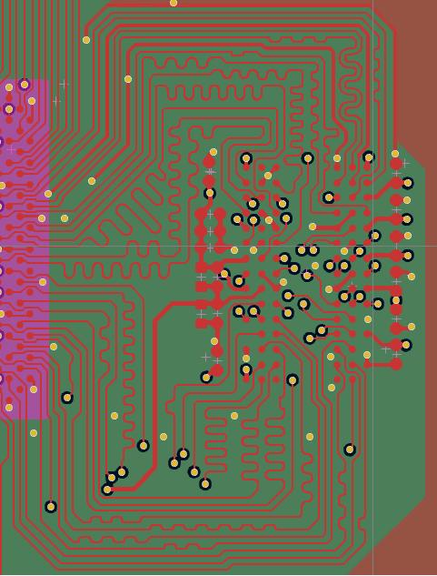

# HPM6880 DDR Hardware Design Suggestions

## Overview
Shanghai Xianji Semiconductor Technology Co., Ltd. has launched the domestically produced high-performance microcontroller HPM6800 series,   

dedicated to providing single master digital instruments and HMI solutions. Its products have a main frequency of up to 600MHz and are equipped with RISC-V cores,  

With a computing power of up to 1710 DMIPS, it has an enhanced image system as follows:  

- 2.5D OpenVG 1.1 GPU  

- Two 4-lane MIPI-DSI/LVDS-Tx display interfaces  

- 2 Lane MIPI-CSI/LVDS-Rx camera interfaces  

- LCD controller supports multiple layers of Alpha blending  

- 1920 x 1080 resolution display screen with a refresh rate of up to 60fps   

- Integrated JPEG codec enables fast JPEG encoding and decoding, reducing processor load  

- Includes 1 DDR controller, supporting DDR2-800, DDR3-1333, DDR3L-1333  


## Hardware design requirements

### Power supply  

The HPM6880 chip is equipped with a built-in DCDC_1.2V core power supply,  

The customer only needs to provide a 3V3 main power supply  

It is recommended to use a DCDC chip with a current capacity of at least 2A for the input power supply,  

And connect a magnetic bead in series at the input end of the 3V3 power supply,  

To suppress high-frequency noise and peak interference on the power line.  

In addition, the HPM6800 chip has a built-in DDR DCDC power module,  

Only a simple peripheral circuit is needed to power DDR2 and DDR3,  

The power module can be programmed internally to set its output voltage.  

### Layout
In the case of sufficient space for single board PCB design,  

Priority should be given to leaving the layout and wiring space required for DDR circuit modules,  

Copy the DDR template provided by Xianji,  

This includes the relative position between the chip and DDR particles, the position of the power filter capacitor,   

the position of the Vref circuit, and the spacing between copper layers.

### Wiring
DDR includes data and address lines, with a total of 16 bits for the data line. The specific routing requirements are recommended as follows:  

There are a total of 16 data lines, which are divided into 2 groups for equal length design. Each group of data lines includes 8 data lines,   

as well as corresponding DQSP, DQSN, and DQM. A total of 11 lines are designed for equal length with an error of 5mil,  

When routing, the same group and layer are used. The DQS differential line has an internal isometric error of 5mil and is ground wrapped.  

A through hole is drilled every 400mil, and the data line is based on DQS.  

Address lines: Address lines, clock lines, and control lines are collectively referred to as address lines.   

All address lines are designed to be of equal length with an error of 10 mils,  

The internal error of the clock differential line is 5mil, and it is ground wrapped. A through hole is drilled every 400mil,   

and an equal length design is carried out based on the clock line.  

The crosstalk of the serpentine winding itself during equal length wiring can affect signal delay, and the spacing between equal length winding is over 3W,  

When making equal lengths, it is necessary to consider the delay of through-holes, simplify the design,   

and ensure that the number of through-holes in the same group is consistent to offset the difference in through-hole distance.  


View the top layer of wiring   

    

View wiring L3 layer [L3_Bottom]  

  
  
### Impedance control
Equal length is the most basic requirement in DDR design, followed by impedance control.   

DDR2/DDR3 has a single terminal impedance of 50ohm and a differential impedance of 100ohm, and the impedance design should be as close as possible,  

The Xianji DEMO adopts a 1080 layer structure with 4 layers of boards. If the customer uses a 6-layer board design, it also ensures impedance control of the board,  

 that is, there is a corresponding complete reference plane for wiring.

## DDR DEMO board
This process provides two design source files, DDR2 DEMO board and DDR3l DEMO board, for customer reference.     

Among them, DDR3l can also refer to HPM6880EVK.revC and be designed using KICAD software.

The directory paths for the two DEMO board projects are as follows: "hpm.app \ apps \ ddr \ hardware".  


Overall design of DEMO board:  

HPM6880 adopts BGA417 packaging, which optimizes the position of PAD for easy wiring, allowing it to still be laid out using a 4-layer board even with 417 pins,   

saving PCB costs for customers.  

The board adopts a 4-layer board structure, with a stacked structure of 1080, L1, L3 layers for wiring, L2 and L4 as reference layers,   

L2 layer providing a complete ground plane, and L4 layer containing DDR power supply copper laying (as a reference layer for L3 layer wiring).  

Three sets of differential pairs have a wiring width of 3.8 mils and a spacing of 8.2 mils,   

while the remaining single end wiring has a wiring width of 4 mils and a spacing of over 3 watts.  

Perform ground wrapping on both DQS and clock lines, and ensure that all routing has a complete reference layer.   

The actual impedance may have some deviation from the design impedance.

### DDR DEMO schematic diagram
View hardware schematic[HPM6880-DDR2-CORE-Reva](doc/../hardware/HPM6880_DDR2_CORE_RevA.pdf)   

View hardware schematic[HPM6880-DDR3-CORE-RevB](doc/../hardware/HPM6880_DDR3_CORE_RevB.pdf)   

###DDR DEMO device connection  

-Connect the DDR power supply and choose either internal or external power supply.   

Be careful not to plug in both jump caps as it may cause a short circuit in the power supply  

-Insert JP7 and JP8 adjustment caps and connect the serial port cable  

-Connect PC USB to J1 UART Type-C interface  

-Connect the debugger to the JTAG interface  

The physical DDR2 is shown in the figure:

     

The physical DDR3 is shown in the figure:  

  

#### Port settings  

-Set the serial baud rate to 115200bps, with 1 stop bit and no parity bit``  

### DDR DEMO performance testing  

Create a ramstress stress stress testing process using the flash_xip option.  

Create the project as shown in the figure:  

-GUI Engineering Construction under Windows


After the default SDK process is created, run DDR3. If testing DDR2, you need to modify the DDR usage type in board. h,
```
/* dram section */ 

#define DDR_TYPE_DDR2                   (0U)
#define DDR_TYPE_DDR3L                  (1U)
#define BOARD_DDR_TYPE                  DDR_TYPE_DDR2
```

In the void init_ddr2:800 (void) function, you can choose to configure the DDR2 output voltage and DDR clock frequency。 

```
/* Enable On-chip DCDC 1.8V output */
 HPM_PCFG->DCDCM_MODE = PCFG_DCDCM_MODE_VOLT_SET(1800) | PCFG_DCDCM_MODE_MODE_SET(1);

 /* Change DDR clock to 200MHz, namely: DDR2-800 */
 clock_set_source_divider(clock_axif, clk_src_pll1_clk0, 4);

```
Similarly, in void init_ddr3l_1333 (void), there is a parameter setting for DDR3.  

###  DDR2 operation phenomenon

After the project is running correctly, the serial terminal will output the following information,  

This is the pressure test printed LOG for DDR2-800MHZ.
```
==============================
 hpm6800evk clock summary
==============================
cpu0:		 500000000Hz
gpu0:		 400000000Hz
axis:		 200000000Hz
axic:		 200000000Hz
axif:		 200000000Hz
axid:		 266666666Hz
axiv:		 200000000Hz
axig:		 400000000Hz
mchtmr0:	 24000000Hz
xpi0:		 133333333Hz
==============================

----------------------------------------------------------------------
$$\   $$\ $$$$$$$\  $$\      $$\ $$\
$$ |  $$ |$$  __$$\ $$$\    $$$ |\__|
$$ |  $$ |$$ |  $$ |$$$$\  $$$$ |$$\  $$$$$$$\  $$$$$$\   $$$$$$\
$$$$$$$$ |$$$$$$$  |$$\$$\$$ $$ |$$ |$$  _____|$$  __$$\ $$  __$$\
$$  __$$ |$$  ____/ $$ \$$$  $$ |$$ |$$ /      $$ |  \__|$$ /  $$ |
$$ |  $$ |$$ |      $$ |\$  /$$ |$$ |$$ |      $$ |      $$ |  $$ |
$$ |  $$ |$$ |      $$ | \_/ $$ |$$ |\$$$$$$$\ $$ |      \$$$$$$  |
\__|  \__|\__|      \__|     \__|\__| \_______|\__|       \______/
----------------------------------------------------------------------
SDRAM stress start: 0x40000000, length: 0x10000000
fill_selfaddress: 0/16
fill_selfaddress: 1/16
fill_selfaddress: 2/16
fill_selfaddress: 3/16
fill_selfaddress: 4/16
fill_selfaddress: 5/16
fill_selfaddress: 6/16
fill_selfaddress: 7/16
fill_selfaddress: 8/16
fill_selfaddress: 9/16
fill_selfaddress: 10/16
fill_selfaddress: 11/16
```
###  DDR3l operation phenomenon
After the project is running correctly, the serial terminal will output the following information, which is the pressure test printed LOG for DDR3l-1333MHZ.

```

==============================
 hpm6800evk clock summary
==============================
cpu0:		 500000000Hz
gpu0:		 400000000Hz
axis:		 200000000Hz
axic:		 200000000Hz
axif:		 333333333Hz
axid:		 266666666Hz
axiv:		 200000000Hz
axig:		 400000000Hz
mchtmr0:	 24000000Hz
xpi0:		 133333333Hz
==============================

----------------------------------------------------------------------
$$\   $$\ $$$$$$$\  $$\      $$\ $$\
$$ |  $$ |$$  __$$\ $$$\    $$$ |\__|
$$ |  $$ |$$ |  $$ |$$$$\  $$$$ |$$\  $$$$$$$\  $$$$$$\   $$$$$$\
$$$$$$$$ |$$$$$$$  |$$\$$\$$ $$ |$$ |$$  _____|$$  __$$\ $$  __$$\
$$  __$$ |$$  ____/ $$ \$$$  $$ |$$ |$$ /      $$ |  \__|$$ /  $$ |
$$ |  $$ |$$ |      $$ |\$  /$$ |$$ |$$ |      $$ |      $$ |  $$ |
$$ |  $$ |$$ |      $$ | \_/ $$ |$$ |\$$$$$$$\ $$ |      \$$$$$$  |
\__|  \__|\__|      \__|     \__|\__| \_______|\__|       \______/
----------------------------------------------------------------------
SDRAM stress start: 0x40000000, length: 0x20000000
fill_selfaddress: 0/16
fill_selfaddress: 1/16
fill_selfaddress: 2/16
fill_selfaddress: 3/16
fill_selfaddress: 4/16
fill_selfaddress: 5/16
fill_selfaddress: 6/16
fill_selfaddress: 7/16
```

## DOC

:::{eval-rst}

About software API: `API doc <doc/api/index.html>`_ 。
:::