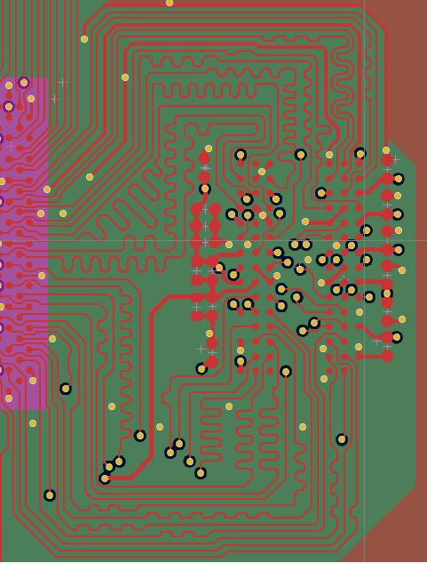
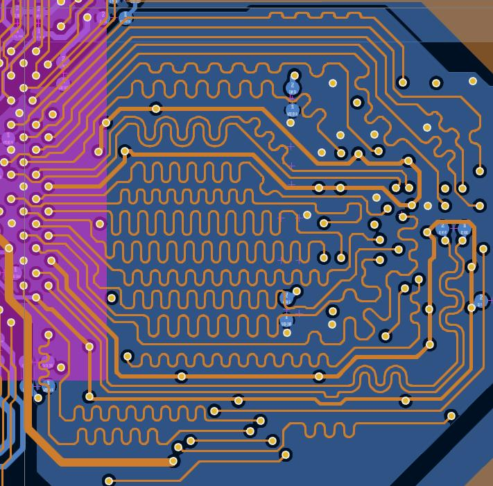
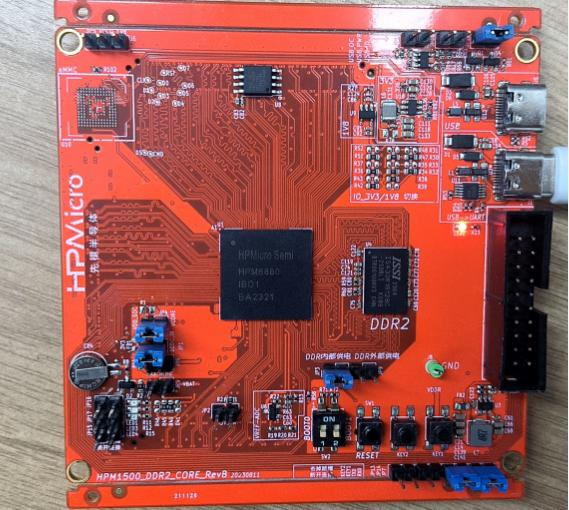
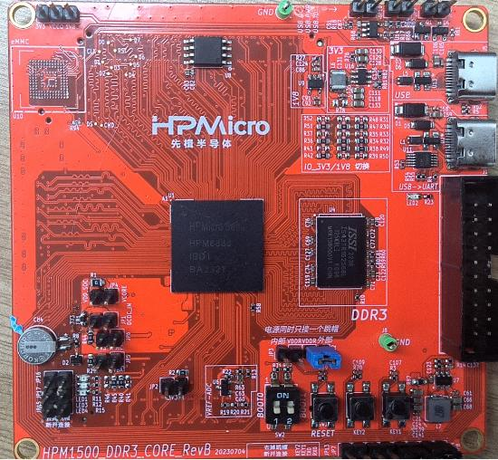
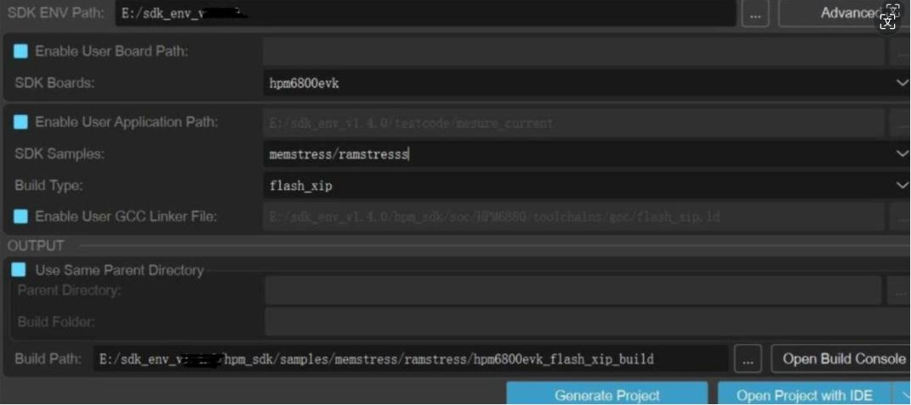

# HPM6880 DDR硬件设计建议

## 概述

上海先楫半导体科技有限公司推出了国产高性能微控制器HPM6800系列，致力于提供单主控的数字仪表及HMI解决方案，其产品主频高达600MHz，内置RISC-V内核，  

算力高达1710DMIPS，其具有增强图像系统如下：  

-  2.5D OpenVG 1.1 GPU

-  2 个 4 Lane MIPI-DSI/LVDS-Tx 显示接口

-  2 个 2 Lane MIPI-CSI/LVDS-Rx 摄像头接口 

-  LCD 控制器支持多图层 Alpha-blending

-  1920×1080 分辨率显示屏刷新率可达60fps 

-  集成 JPEG 编解码器可实现快速 JPEG 编码和解码， 减轻处理器负荷

-  包含1个DDR控制器，支持 DDR2-800、DDR3-1333，DDR3L-1333  

本文主要介绍HPM6880 单颗DDR2，单颗DDR3l硬件设计要求，并分别提供两种DDR的DEMO源文件以做参考，建议客户直接使用DEMO提供的原理图和PCB进行设计。


## 硬件设计要求

### 电源

HPM6880 芯片内置DCDC_1.2V核心电源，客户只需提供3V3主电源（建议使用DCDC芯片，电流能力至少2A)的输入电源，  

且在3V3的电源输入端串接一个磁珠，以抑制电源线上的高频噪声和尖峰干扰。  

此外，HPM6800芯片内置DDR的DCDC电源模块，只需简单的外围电路即可为DDR2和DDR3供电，该电源模块可以内部编程设置其输出电压。

### 布局

在单板PCB设计空间足够的情况下，优先考虑留出DDR电路模块所需要的布局布线空间，拷贝先楫提供的DDR模板，  

包括芯片与DDR颗粒相对位置、电源滤波电容位置、Vref 电路位置、铺铜间距等。

### 布线

DDR包含数据和地址线，其中数据线共16位，具体走线要求建议如下：

一共有16位数据线，其分为2组进行等长设计，每组数据线包括8根数据线，及对应的DQSP,DQSN和DQM，共11根线进行等长，误差在5mil，

走线时同组同层，DQS 差分线对内等长误差5mil，并且对其进行包地处理，每隔400mil打一个过孔，数据线以DQS为基准。

地址线：地址线、时钟线、控制线统称为地址线，所有地址线进行等长设计，误差在10mil，

时钟差分线对内误差5mil，并且对其进行包地处理，每隔400mil打一个过孔，以时钟线为基准进行等长设计。

等长走线时蛇形绕线自身的串扰会影响信号延时，走线绕等长是间距在3W以上， 

在做等长时，需要考虑过孔的延时，简化设计，同组走线过孔数量一致，以此抵消过孔距离差异。

查看布线top层  

     

查看布线L3层  

     


###  阻抗控制

在DDR设计中等长是最基本的要求，其次是阻抗的控制，DDR2/DDR3 单端阻抗50ohm，差分阻抗100ohm，阻抗设计尽量接近，

先楫DEMO中采用了4层板的1080叠层结构，客户如果使用6层板设计，同样保证板子的阻抗控制，即走线都有相应完整的参考平面。

##  DDR DEMO板

本历程提供DDR2 DEMO板和DDR3l DEMO板两种设计源文件供客户参考，其中DDR3l也可以参考HPM6880EVK_RevC ，使用KICAD软件设计。

两个DEMO板工程目录路径如下："hpm_apps\apps\ddr\hardware"。

DEMO板整体设计： 

HPM6880 采用BGA417封装，该封装对PAD进行位置优化使其方便布线，使其在417个引脚情况下，依旧能够使用4层板对其进行Layout，为客户节约PCB成本。

板子采用4层板结构，叠层结构1080，L1,L3层走线， L2和L4作为参考层，L2层提供完整的一个地平面，L4层包含DDR电源铺铜（为L3层走线做参考层）。

3组差分对走线线宽3.8mil，差分对间距8.2mil，其余单端走线线宽4mil，线间距3w以上。

对DQS和时钟线都进行包地处理，所有走线都有完整的参考层，实际阻抗跟设计阻抗有一定误差。

### DDR DEMO 原理图

查看硬件原理图 [HPM6880_DDR2_CORE_RevA](doc/../hardware/HPM6880_DDR2_CORE_RevA.pdf)   

查看硬件原理图 [HPM6880_DDR3_CORE_RevB](doc/../hardware/HPM6880_DDR3_CORE_RevB.pdf)   

### DDR DEMO 设备连接

-  将DDR电源连接上，可以选择内部供电和外部供电任意一种，注意不可以两个跳帽都插上，会导致电源短路

-  插上JP7,JP8 调帽，连接上串口线

-  连接PC USB到 J1 UART Type-C接口

-  连接调试器到JTAG接口

DDR2实物如图所示： 

     

DDR3实物如图所示：

 

#### 端口设置

-  串口波特率设置为``115200bps``，``1个停止位``，``无奇偶校验位``

### DDR DEMO性能测试

创建ramstress 压力测试历程，使用flash_xip 选项。 

创建工程如图：  

- windows下GUI工程构建   



默认SDK历程创建后运行DDR3，如果测试DDR2 ，需要在board.h 中修改DDR使用类型即可，

```
/* dram section */
#define DDR_TYPE_DDR2                   (0U)
#define DDR_TYPE_DDR3L                  (1U)
#define BOARD_DDR_TYPE                  DDR_TYPE_DDR2
```

在void init_ddr2_800(void) 函数中，可以选择配置DDR2输出电压和DDR时钟频率。

```
/* Enable On-chip DCDC 1.8V output */
 HPM_PCFG->DCDCM_MODE = PCFG_DCDCM_MODE_VOLT_SET(1800) | PCFG_DCDCM_MODE_MODE_SET(1);

 /* Change DDR clock to 200MHz, namely: DDR2-800 */
 clock_set_source_divider(clock_axif, clk_src_pll1_clk0, 4);

```
同样，void init_ddr3l_1333(void)中，有DDR3的参数设置。

###  DDR2运行现象

当工程正确运行后，串口终端会输出如下信息，此处是DDR2-800MHZ的压力测试打印LOG。
```
==============================
 hpm6800evk clock summary
==============================
cpu0:		 500000000Hz
gpu0:		 400000000Hz
axis:		 200000000Hz
axic:		 200000000Hz
axif:		 200000000Hz
axid:		 266666666Hz
axiv:		 200000000Hz
axig:		 400000000Hz
mchtmr0:	 24000000Hz
xpi0:		 133333333Hz
==============================

----------------------------------------------------------------------
$$\   $$\ $$$$$$$\  $$\      $$\ $$\
$$ |  $$ |$$  __$$\ $$$\    $$$ |\__|
$$ |  $$ |$$ |  $$ |$$$$\  $$$$ |$$\  $$$$$$$\  $$$$$$\   $$$$$$\
$$$$$$$$ |$$$$$$$  |$$\$$\$$ $$ |$$ |$$  _____|$$  __$$\ $$  __$$\
$$  __$$ |$$  ____/ $$ \$$$  $$ |$$ |$$ /      $$ |  \__|$$ /  $$ |
$$ |  $$ |$$ |      $$ |\$  /$$ |$$ |$$ |      $$ |      $$ |  $$ |
$$ |  $$ |$$ |      $$ | \_/ $$ |$$ |\$$$$$$$\ $$ |      \$$$$$$  |
\__|  \__|\__|      \__|     \__|\__| \_______|\__|       \______/
----------------------------------------------------------------------
SDRAM stress start: 0x40000000, length: 0x10000000
fill_selfaddress: 0/16
fill_selfaddress: 1/16
fill_selfaddress: 2/16
fill_selfaddress: 3/16
fill_selfaddress: 4/16
fill_selfaddress: 5/16
fill_selfaddress: 6/16
fill_selfaddress: 7/16
fill_selfaddress: 8/16
fill_selfaddress: 9/16
fill_selfaddress: 10/16
fill_selfaddress: 11/16
```
###  DDR3l运行现象

当工程正确运行后，串口终端会输出如下信息，此处是DDR3l-1333MHZ 的压力测试打印LOG。

```

==============================
 hpm6800evk clock summary
==============================
cpu0:		 500000000Hz
gpu0:		 400000000Hz
axis:		 200000000Hz
axic:		 200000000Hz
axif:		 333333333Hz
axid:		 266666666Hz
axiv:		 200000000Hz
axig:		 400000000Hz
mchtmr0:	 24000000Hz
xpi0:		 133333333Hz
==============================

----------------------------------------------------------------------
$$\   $$\ $$$$$$$\  $$\      $$\ $$\
$$ |  $$ |$$  __$$\ $$$\    $$$ |\__|
$$ |  $$ |$$ |  $$ |$$$$\  $$$$ |$$\  $$$$$$$\  $$$$$$\   $$$$$$\
$$$$$$$$ |$$$$$$$  |$$\$$\$$ $$ |$$ |$$  _____|$$  __$$\ $$  __$$\
$$  __$$ |$$  ____/ $$ \$$$  $$ |$$ |$$ /      $$ |  \__|$$ /  $$ |
$$ |  $$ |$$ |      $$ |\$  /$$ |$$ |$$ |      $$ |      $$ |  $$ |
$$ |  $$ |$$ |      $$ | \_/ $$ |$$ |\$$$$$$$\ $$ |      \$$$$$$  |
\__|  \__|\__|      \__|     \__|\__| \_______|\__|       \______/
----------------------------------------------------------------------
SDRAM stress start: 0x40000000, length: 0x20000000
fill_selfaddress: 0/16
fill_selfaddress: 1/16
fill_selfaddress: 2/16
fill_selfaddress: 3/16
fill_selfaddress: 4/16
fill_selfaddress: 5/16
fill_selfaddress: 6/16
fill_selfaddress: 7/16
```

## 文档

:::{eval-rst}

关于软件API 请查看 `方案API 文档 <doc/api/index_zh.html>`_ 。
:::


