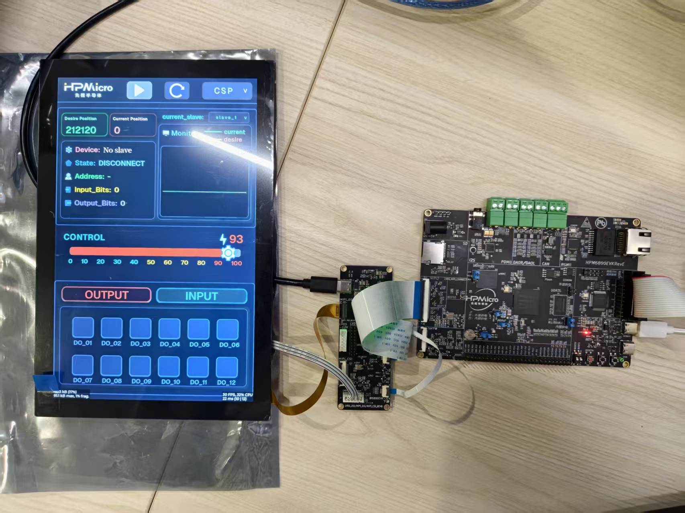
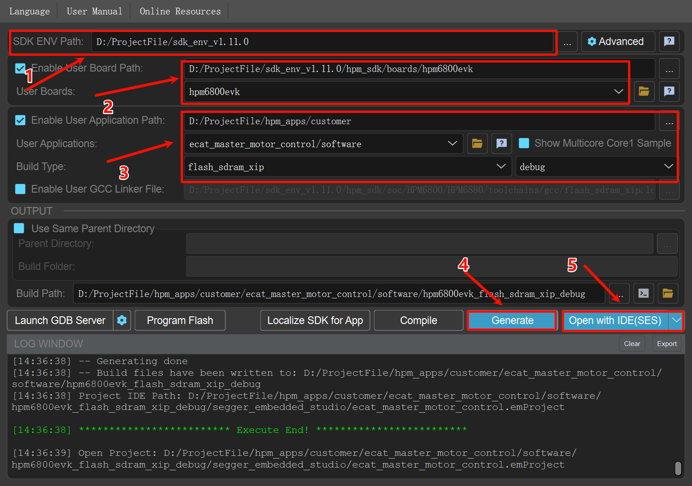
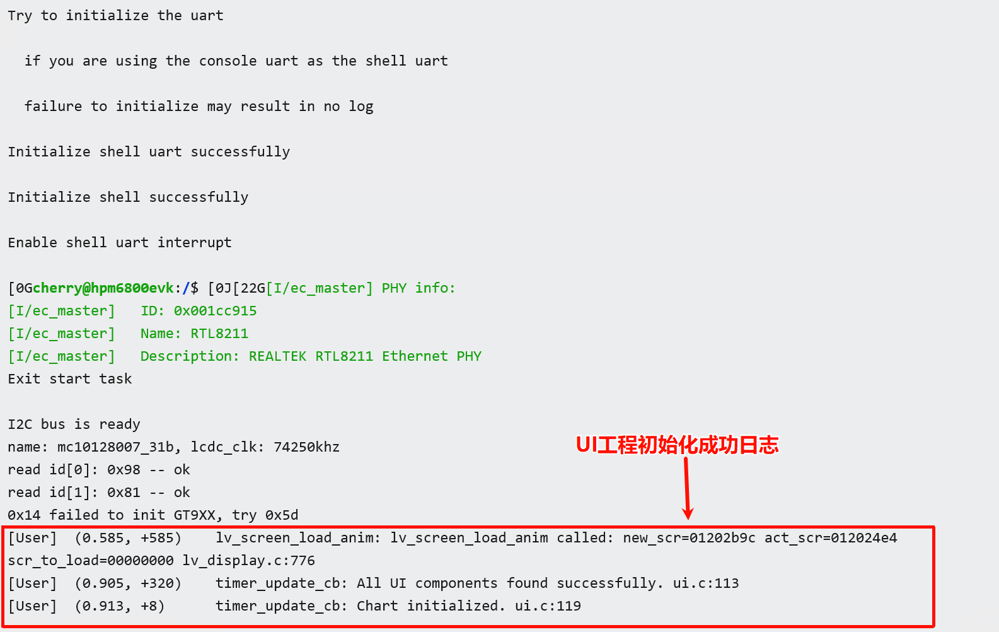
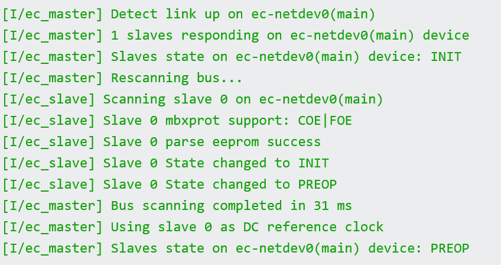
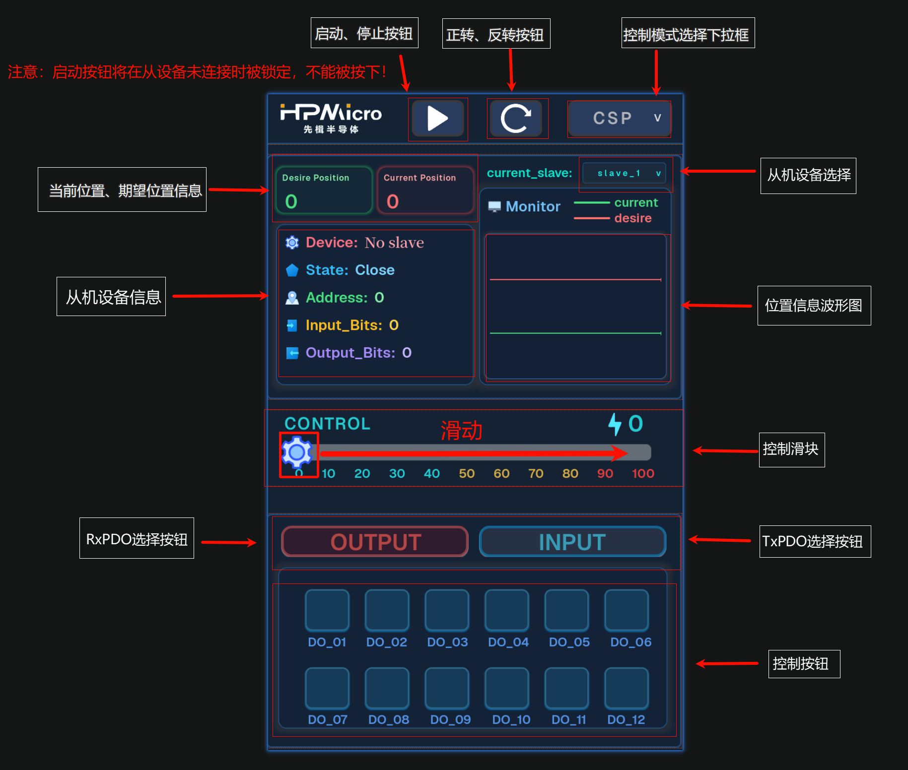

# EtherCAT 主站显控一体电机控制方案

## 依赖SDK 1.11.0

## 概述

本方案基于先楫半导体HPM系列MCU，结合EtherCAT主站技术和LVGL图形界面，实现了一套完整的EtherCAT主站电机控制解决方案。

本方案集成了以下核心功能：
- **EtherCAT主站**：基于开源 CherryECAT 实现的工业级EtherCAT主站
- **CIA402电机控制**：支持CSP（位置控制）、CSV（速度控制）运动控制模式
- **LVGL图形界面**：提供直观的触摸屏控制界面，实时显示电机状态和运动参数
- **FreeRTOS实时操作系统**：确保电机控制的实时性和稳定性
- **命令行交互**：支持Shell命令行调试和配置

## 核心特性

### EtherCAT主站特性
- **异步队列式传输**：一次传输可携带多个datagram
- **零拷贝技术**：直接使用以太网TX/RX缓冲区
- **热插拔支持**：自动扫描总线，拓扑变化时自动更新从站信息
- **自动状态监控**：实时监控从站状态

### 电机控制特性
- **CIA402标准协议**：符合工业标准的电机控制接口
- **多种控制模式**：
  - CSP（位置控制模式）
  - CSV（速度控制模式）
- **设备切换**：支持多台电机设备的切换控制
- **实时反馈**：位置、速度、状态实时显示
- **故障诊断**：连接状态监测和错误提示

### UI界面特性
- **现代化设计**：基于LVGL v9的流畅触摸界面
- **速度控制**：弧形滑块调节目标速度
- **位置控制**：弧形滑块调节目标位置
- **实时波形**：Chart图表显示运动曲线
- **设备管理**：支持多设备选择和状态显示
- **按钮控制**：启动/停止、正转/反转快捷操作

## 硬件要求

### 主控板要求
- **MCU**: HPM6800EVK
- **显示屏**: 1280x800分辨率触摸屏
- **以太网**: 支持EtherCAT通信的以太网接口
- **调试接口**: JTAG/SWD调试接口
- **串口**: UART串口

### 从站设备要求
- 支持CIA402协议的EtherCAT伺服驱动器

## 软件架构

### 系统框架
```
┌─────────────────────────────────────────┐
│         LVGL UI Layer                   │
│  (触摸控制 + 实时显示 + 中文界面)         │
└─────────────┬───────────────────────────┘
              │
┌─────────────┴───────────────────────────┐
│      Application Layer                  │
│  (CIA402控制逻辑 + 数据处理)              │
└─────────────┬───────────────────────────┘
              │
┌─────────────┴───────────────────────────┐
│      CherryECAT Master                  │
│  (PDO通信 + DC同步 + 状态机管理)          │
└─────────────┬───────────────────────────┘
              │
┌─────────────┴───────────────────────────┐
│      FreeRTOS + Ethernet Driver         │
│  (任务调度 + 网络驱动)                    │
└─────────────────────────────────────────┘
```

### 任务结构
- **LVGL Task**: 界面刷新和触摸事件处理
- **EtherCAT Task**: PDO周期性通信和状态监控
- **Shell Task**: 命令行交互和调试

## 设备连接

### 硬件连接示意图
```
[PC调试工具] ──USB──> [HPM主控板] ──JTAG──> [调试器]
                         │
                         │ EtherCAT
                         ├──> [伺服驱动器1] ──> [电机1]
                         │
                         ├──> [伺服驱动器2] ──> [电机2]
                         │
                         └──> [伺服驱动器N] ──> [电机N]
```


### 连接步骤
1. 连接PC USB到主控板的DEBUG Type-C接口
2. 连接调试器到JTAG接口
3. 连接EtherCAT从站设备（伺服驱动器）
4. 连接电机到伺服驱动器
5. 连接显示屏到主控板（如使用UI界面）
6. 上电启动系统

## 端口设置

- **串口波特率**: 115200bps
- **停止位**: 1
- **校验位**: 无
- **数据位**: 8

## 创建工程


## 运行现象

### 系统启动

#### 工程初始化成功串口日志（未连接从设备时）：



#### 从机设备连接成功串口日志：



### UI界面显示

触摸屏会显示电机控制界面，包含以下元素：

**顶部状态栏**:
- HPMicro logo
- 启动按钮
- 正转、反转按钮
- 控制模式下拉框

**设备信息模块**:

**控制区域**:
  - 可拖动调节滑块（0-100）
  - 向右滑动可控制速度或位置
  - 实时数值显示
  
**底部In/Output控制按钮**:
- INPUT模式选择按钮
- OUTPUT模式选择按钮
- 12个位输入/输出按钮



## 功能特性

### 1. 设备管理
- 自动扫描EtherCAT总线上的所有从站
- 支持热插拔检测
- 支持多设备切换控制
- 实时显示设备数量和当前选择

### 2. 控制互斥
- 速度控制和位置控制互斥（速度模式和位置模式同时只能选择一个）
- 界面自动切换显示对应从设备信息

### 3. 视觉反馈

- 按钮按下有视觉反馈
- 期望值和实际值的波形颜色不同，分开显示

### 4. 数据采集
- 波形图实时显示电机运动状态
- 实时显示从设备状态信息


