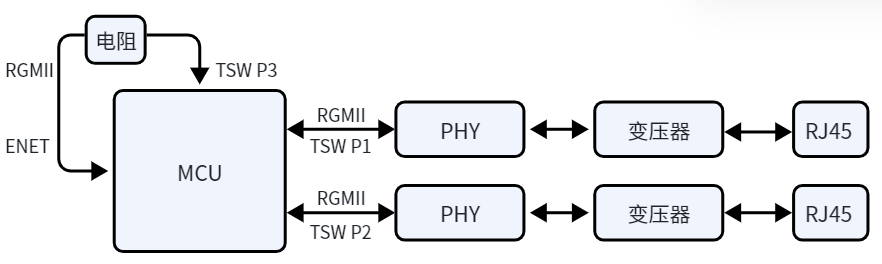
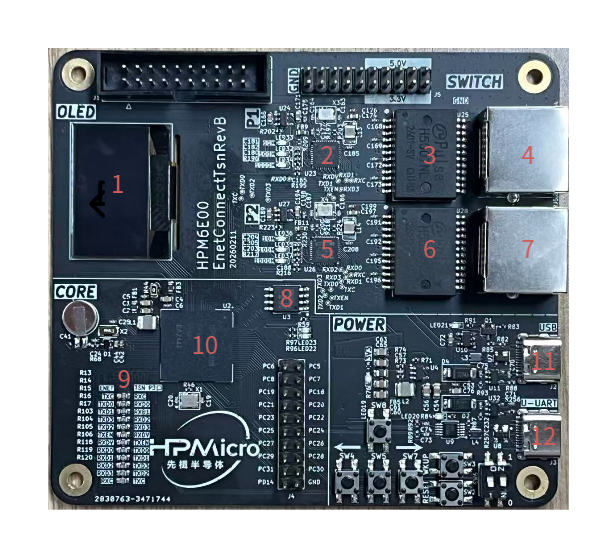
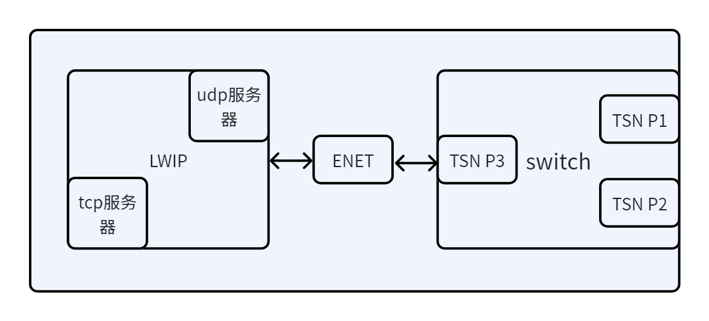
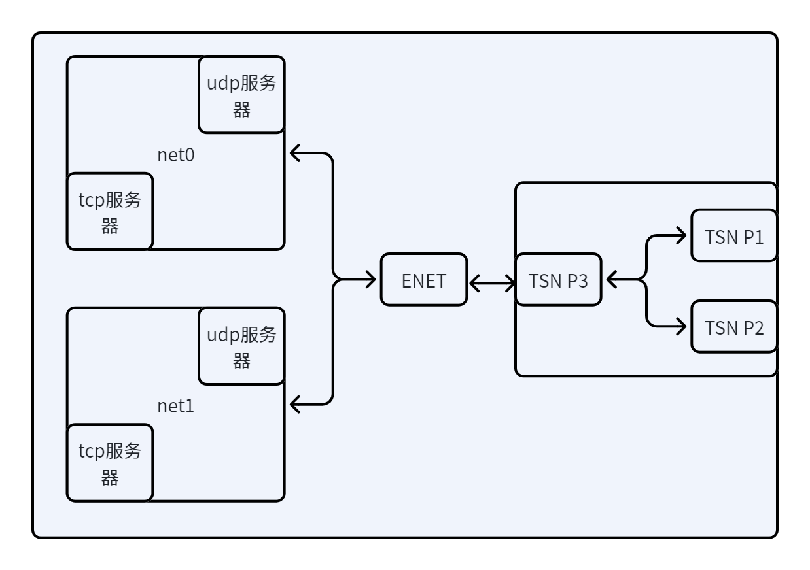
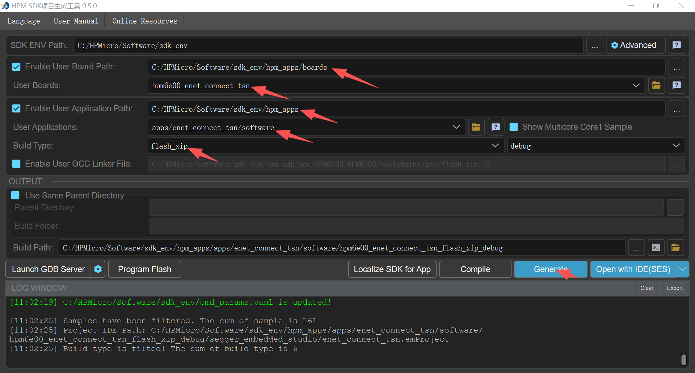
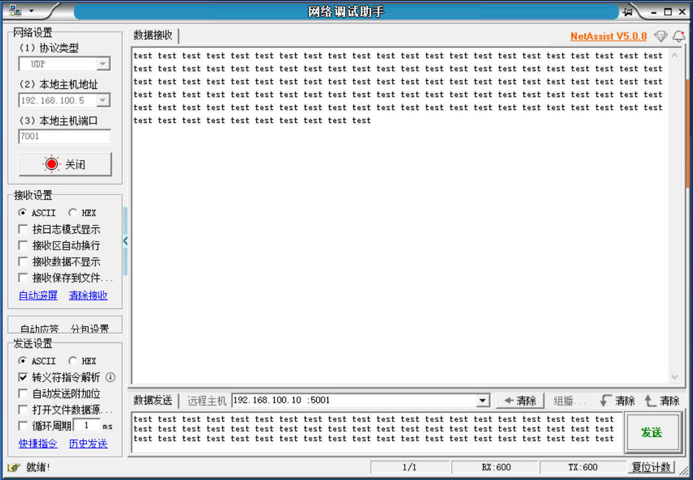
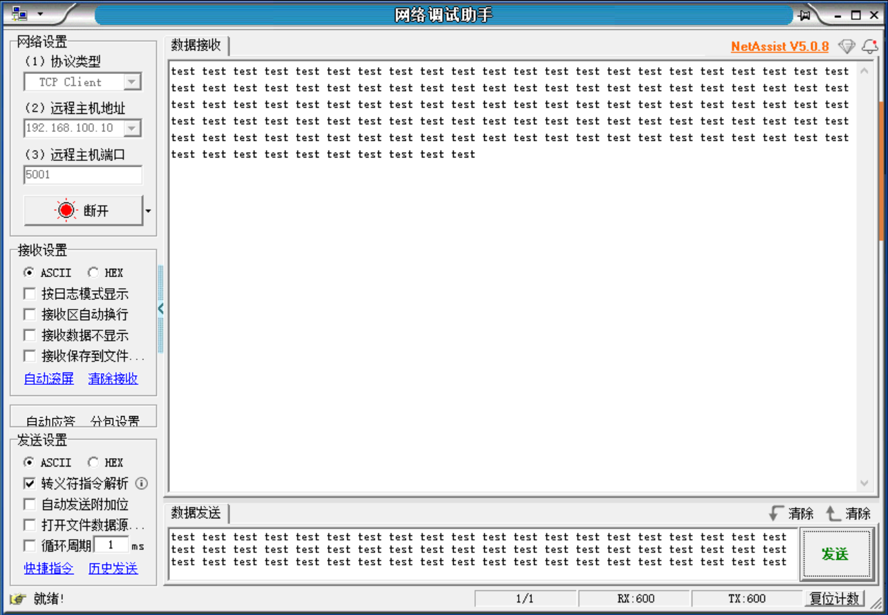
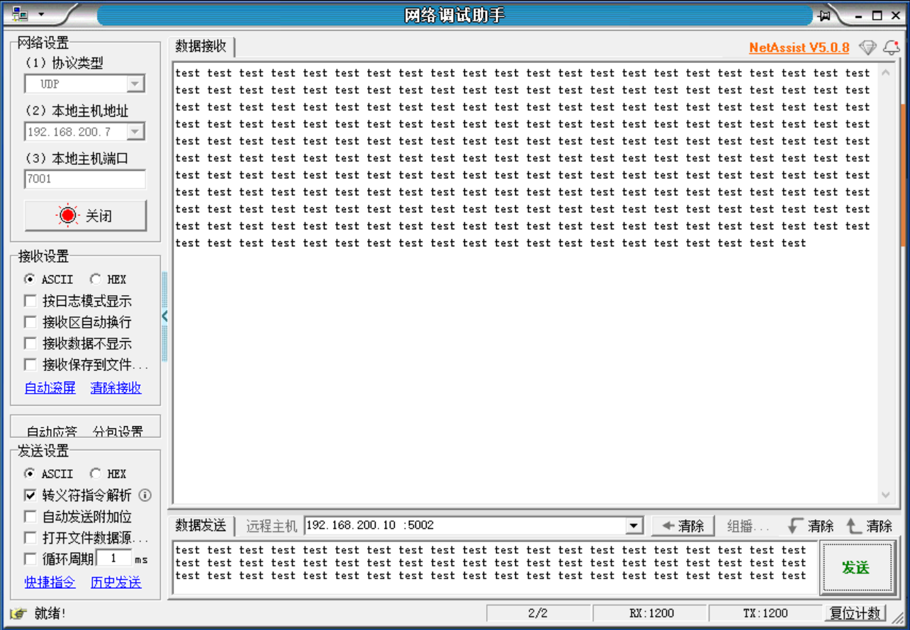

# HPM ENET Connect TSN – Using TSN as an Ethernet Switch

## Depends on SDK1.11.0

## Overview

This solution uses the ENET function of the HPM6E series MCU to replace the CPU PORT function of TSW, helping users quickly build an Ethernet communication system with a switch. The system block diagram is shown below.


P1 and P2 are the TSW's P1 and P2 PORTs, serving as external Ethernet ports. The TSW P3 port is directly connected to the ENET port via a resistor, making the ENET port the internal port.
With this solution, you can utilize both the hardware switching function of TSW for network cascading and the stability of ENET for Ethernet communication.

Features:
1. Both external ports support 10M/100M/1000M Ethernet communication with auto-negotiation.
2. Integrated FreeRTOS, supporting multitasking and the LWIP protocol stack.
3. Supports single NIC mode: the device appears as a single network device with one set of MAC and IP addresses. Either external port can be used for communication.
4. Supports dual NIC mode: the device appears as two network devices with two sets of MAC and IP addresses. Each external port can communicate independently.
5. The hardware includes an SSD1306 OLED display and integrates the U8G2 library.
6. Supports USB SH command line; users can add custom USB SH commands.

## Example Description
The hardware for this solution is [HPM6E00EnetConnectTsnRevB](hardware/HPM6E00EnetConnectTsnRevB.pdf), as shown below.


| No. | Component | Description |
| --- | ---     | --- |
| 1   | OLED Display | Dual-color, SSD306 driver chip |
| 2 5 | YT8531C   | PHY chip, supports 10M/100M/1000M Ethernet |
| 3 6 | H5007NL   | Gigabit network transformer |
| 4 7 | RJ45      | RJ45 Ethernet port |
| 8   | MX25L12833FM2I-10G | FLASH memory |
| 9   | 33Ω resistor | Resistor between TSW P3 port and ENET port |
| 10  | HPM6E80IVM1 | MCU |
| 11  | Type-C port | USB function |
| 12  | Type-C port | USB-to-serial function, LOG output |

### Software
#### Software Architecture
1. All software code is under the `software` directory.
    - `apps`: Application directory, contains all application code.
    - `drivers`: Driver directory, contains all driver code.
2. Includes FreeRTOS tasks, supports multitasking, integrates LWIP protocol stack for Ethernet communication.
    - `main.c`: Main program, includes task creation and scheduling.
    - `FreeRTOSConfig.h`: Configures FreeRTOS parameters.
    - `lwipopts_app.h` and `drivers\enet_tsn\ports\lwipopts.h`: Configure LWIP protocol stack parameters.
    - `csh_config.h` and `shell.h`: Configure USB SH command line parameters.
    - `drivers\enet_tsn\common\netconf.h`: Configures network parameters, including MAC, IP, gateway, subnet mask, etc.
#### Main Software Function Design
1. Both TSW and ENET operate in RGMII mode. TSW P3 and ENET ports are in gigabit mode. After auto-negotiation of communication speed via external ports, you can selectively enable or disable the store-and-forward mode of TSW P1 and P2 PORTs. If the external port is detected as 1000M, store-and-forward mode is disabled; otherwise, it is enabled.
2. Single NIC mode

In this mode, the device acts as a single network device with one set of MAC and IP addresses. Either external port can be used for communication.
3. Dual NIC mode

In this mode, the device acts as two network devices with two sets of MAC and IP addresses. Each external port can communicate independently.
4. Supports the U8G2 library for OLED display control.
    The required driver functions for the U8G2 library are registered in `drivers\drv_oled.c`:
    ```
        u8g2_Setup_ssd1306_128x64_noname_f(
        &u8g2,
        U8G2_R0,
        drv_u8x8_byte_4wire_spi,
        drv_u8x8_gpio_and_delay
        );
    ```
    To use the U8G2 library, configure the `CMakeLists.txt` file:
    set(CONFIG_A_U8G2 1)
    set(CONFIG_A_SSD1306 1)
    sdk_compile_definitions(-DUSE_U8G2=1)
    By default, the U8G2 library is compiled, but its functions are not used.
    The default display is the HPM LOGO.
#### Project Generation
- Use the HPM SDK Project Generator to generate a Segger project.

Select `hpm6e_enet_connect_tsn` for the board and `enet_connect_tsn` for the application.

### Example Testing
1. Single NIC mode test
    - Configuration
    Before generating the project, configure the `CMakeLists.txt` file:
    sdk_compile_definitions(-D_ENET_PORT_COUNT=1)
    To enable the TCP_ECHO function, configure the `CMakeLists.txt` file:
    sdk_compile_definitions(-D_TCP_ECHO=1)
    To use the UDP_ECHO function, configure the `CMakeLists.txt` file:
    sdk_compile_definitions(-D_TCP_ECHO=0)
    After configuring the `CMakeLists.txt` file, regenerate the project.
    - Testing
    In single NIC mode, the default MAC, IP, gateway, subnet mask, etc., are set in `drivers\enet_tsn\common\netconf.h`:
        ```
        /* MAC ADDRESS */
        #ifndef MAC0_CONFIG
        #define MAC0_CONFIG 98:2c:bc:b1:9f:27
        #endif

        /* Static IP ADDRESS */
        #ifndef IP0_CONFIG
        #define IP0_CONFIG 192.168.100.10
        #endif

        /* Netmask */
        #ifndef NETMASK0_CONFIG
        #define NETMASK0_CONFIG 255.255.255.0
        #endif

        /* Gateway Address */
        #ifndef GW0_CONFIG
        #define GW0_CONFIG 192.168.100.1
        #endif
        ```
    1. Enable UDP_ECHO in single NIC mode
    After compiling and downloading to the hardware board, connect one end of the network cable to the PC and the other end to any port on the board. The PC's IP must be in the same subnet as the board's IP. Use the NetAssist tool to connect, set the remote host to the board's IP, and port to 5001, as shown below.
    

    2. Enable TCP_ECHO in single NIC mode
    After compiling and downloading to the hardware board, connect one end of the network cable to the PC and the other end to any port on the board. The PC's IP must be in the same subnet as the board's IP. Use the NetAssist tool to connect, set the remote host to the board's IP, and port to 5001, as shown below.
    

2. Dual NIC mode test
    - Configuration
    Before generating the project, configure the `CMakeLists.txt` file:
    sdk_compile_definitions(-D_ENET_PORT_COUNT=2)
    To enable the TCP_ECHO function, configure the `CMakeLists.txt` file:
    sdk_compile_definitions(-D_TCP_ECHO=1)
    To use the UDP_ECHO function, configure the `CMakeLists.txt` file:
    sdk_compile_definitions(-D_TCP_ECHO=0)
    After configuring the `CMakeLists.txt` file, regenerate the project.
    - Testing
    In dual NIC mode, the default MAC, IP, gateway, subnet mask, etc., are set in `drivers\enet_tsn\common\netconf.h`:
        ```
        /* MAC ADDRESS */
        #ifndef MAC0_CONFIG
        #define MAC0_CONFIG 98:2c:bc:b1:9f:27
        #endif

        #ifndef MAC1_CONFIG
        #define MAC1_CONFIG 98:2c:bc:b1:9f:37
        #endif

        /* Static IP ADDRESS */
        #ifndef IP0_CONFIG
        #define IP0_CONFIG 192.168.100.10
        #endif

        #ifndef IP1_CONFIG
        #define IP1_CONFIG 192.168.200.10
        #endif

        /* Netmask */
        #ifndef NETMASK0_CONFIG
        #define NETMASK0_CONFIG 255.255.255.0
        #endif

        #ifndef NETMASK1_CONFIG
        #define NETMASK1_CONFIG 255.255.255.0
        #endif

        /* Gateway Address */
        #ifndef GW0_CONFIG
        #define GW0_CONFIG 192.168.100.1
        #endif

        #ifndef GW1_CONFIG
        #define GW1_CONFIG 192.168.200.1
        #endif
        ```
    1. Enable UDP_ECHO in dual NIC mode
    After compiling and downloading to the hardware board, connect two network cables between the PC and the two ports on the board. Each PC port's IP must be in the same subnet as the corresponding board port. Use the NetAssist tool to connect, set the remote host: default P1 port IP is 192.168.100.10, port 5001; P2 port IP is 192.168.200.10, port 5002, as shown below.
    
    

    2. Enable TCP_ECHO in dual NIC mode
    After compiling and downloading to the hardware board, connect two network cables between the PC and the two ports on the board. Each PC port's IP must be in the same subnet as the corresponding board port. Use the NetAssist tool to connect, set the remote host: default P1 port IP is 192.168.100.10, port 5001; P2 port IP is 192.168.200.10, port 5002, as shown below.
    
    
