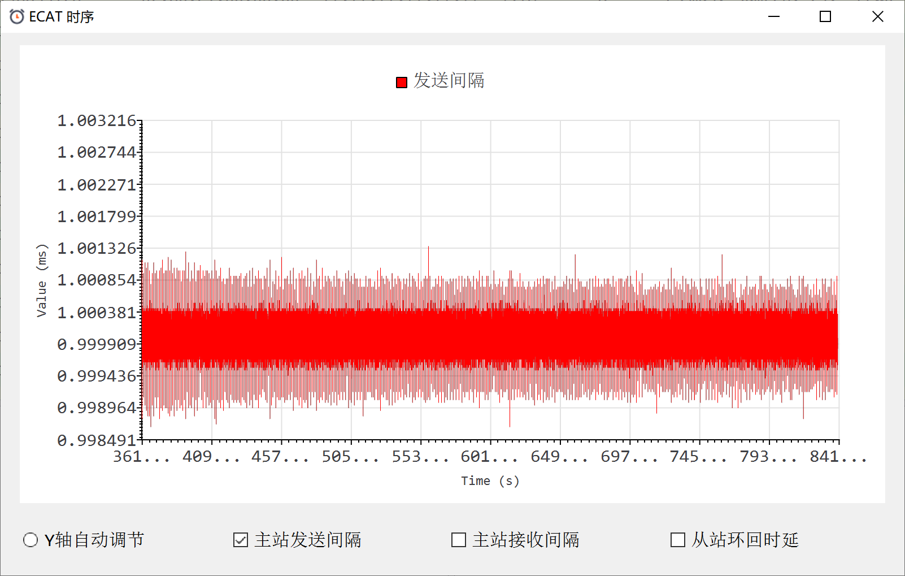
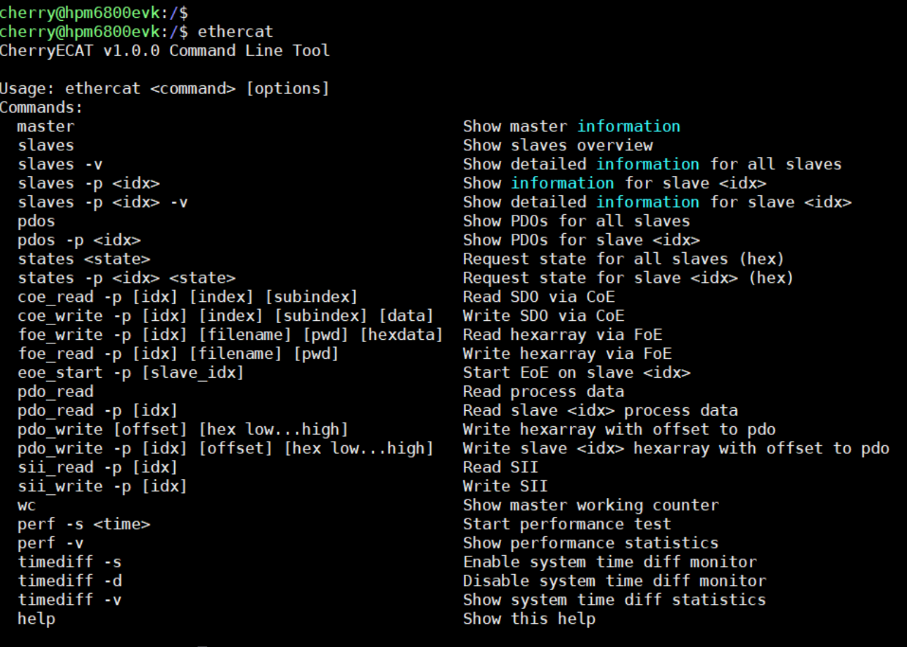
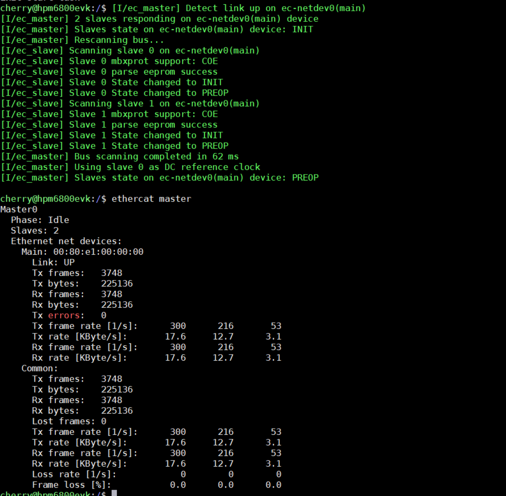
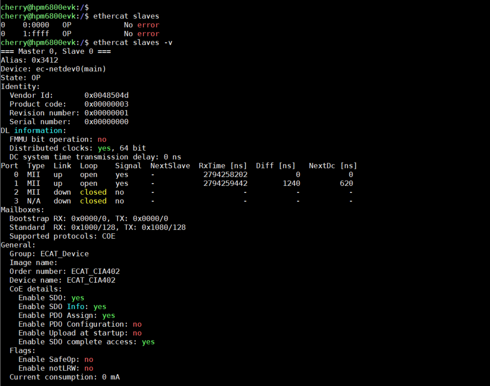
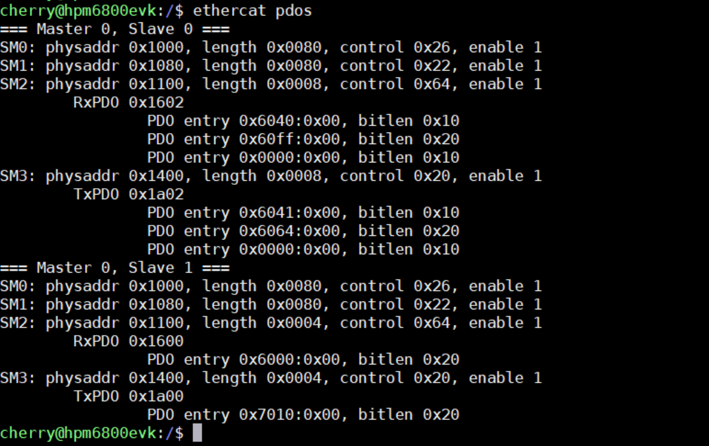
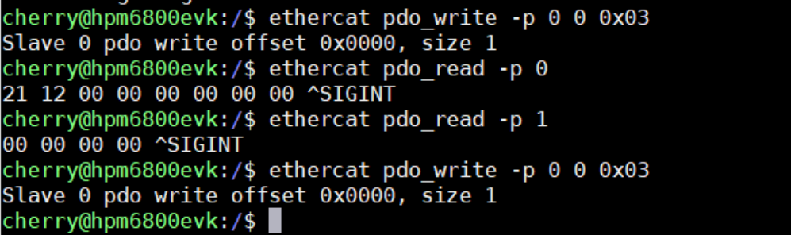
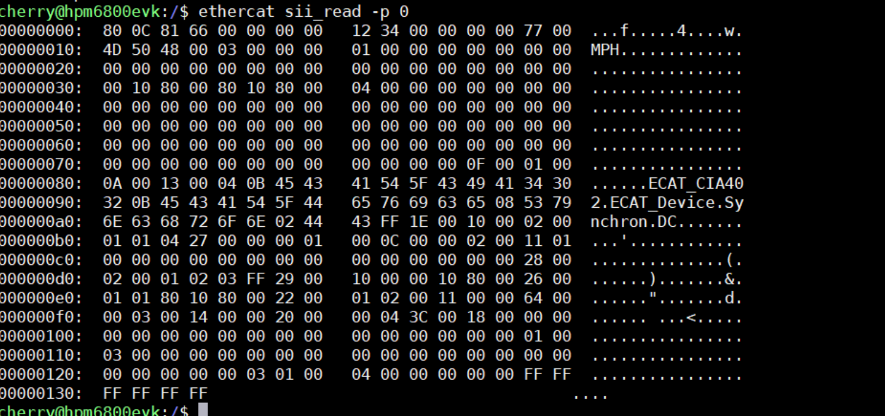
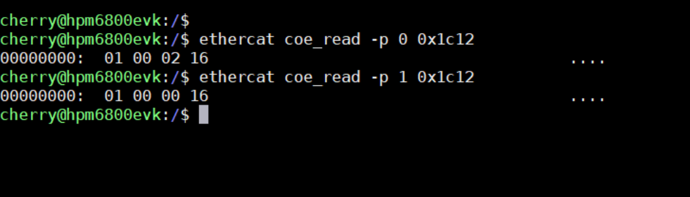

# EtherCAT 主站

## Depend on SDK1.10.0

## Overview

This section is mainly based on the open-source EtherCAT master [CherryECAT](https://github.com/cherry-embedded/CherryECAT), demonstrating the EtherCAT master functionality running on HPMicro MCUs.

## Feature

- ~ 4K ram, ~40K flash(24K + 16K shell cmd, including log)
- Asynchronous queue-based transfer (one transfer can carry multiple datagrams)
- Zero-copy technology: directly use enet tx/rx buffer to fill and parse ethercat data
- Support hot-plugging
	- Automatic scanning bus
	- Automatic updating slave information when the topology changes
- Support automatic monitoring slave status
- Support distributed clocks
- Support CANopen over EtherCAT(COE)
- Support File over EtherCAT(FOE)
- Support Ethernet over EtherCAT(EOE)
- Support Slave SII access
- Support Slave register access
- Support multi master
- **Minimum PDO cyclic time < 40 us (depends on master and slave hardware)**
- **DC jitter < 3us (depends on master and slave hardware)**
- Support ethercat cmd with shell, ref to IgH

The pic shows dc jitter < 3us (hpm6800evk with flash_xip):


## Running the example

The default demo uses shell to test ethercat slave.










- start pdo transfer with 1ms cycle

```
ec_start 1000
```

- control led onoff with ecat_io demo

```
ethercat pdo_write -p 0 0 0x00
ethercat pdo_write -p 0 0 0x01
ethercat pdo_write -p 0 0 0x02
ethercat pdo_write -p 0 0 0x03
```

- control motor in CSV mode with ecat_coe demo

```
ethercat pdo_write -p 0 0 0x0f // motor on
ethercat pdo_write -p 0 2 0xFF000000 // change ObjTargetVelocity to 255, hexdata from low byte to high byte
ethercat pdo_read -p 0 // get ObjStatusWord and ObjPositionActualValue
ethercat pdo_write -p 0 0 0x00 // motor off
```

## API

Refer to CherryECAT API ：https://cherryecat.readthedocs.io/zh-cn/latest/api.html