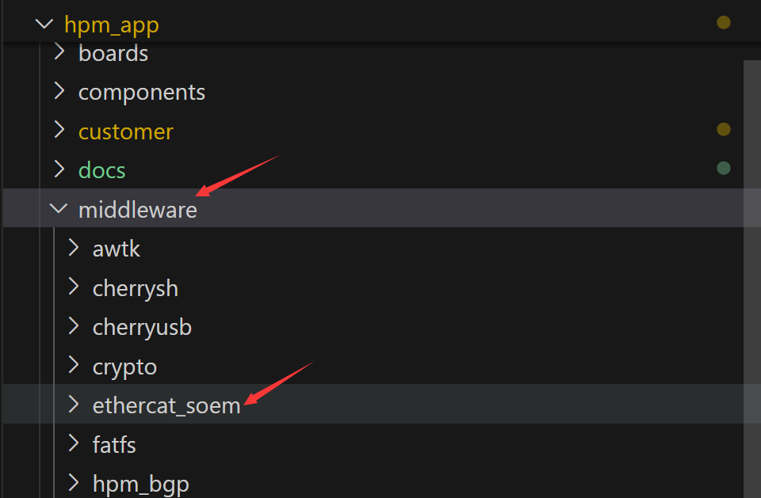
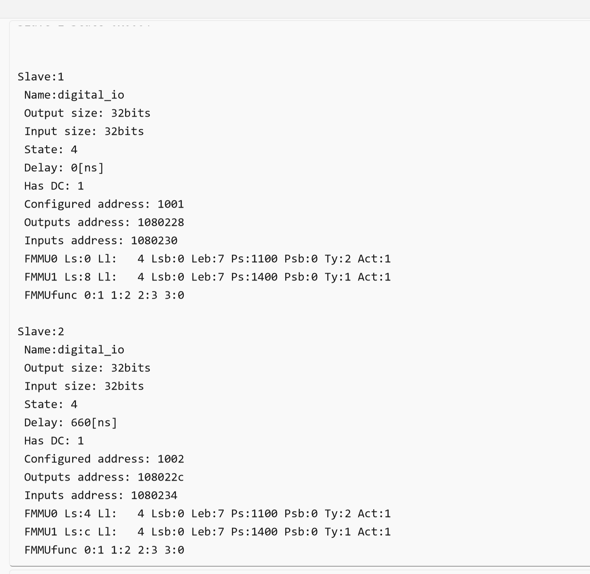
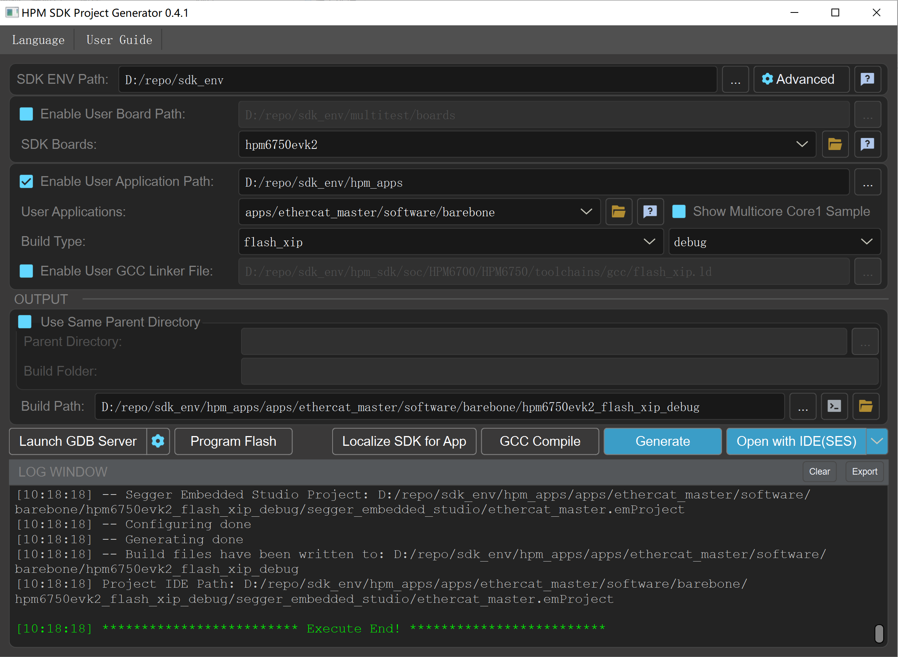

# Ethercat master

## 依赖SDK1.9.0

## 概述

本节主要介绍基于开源 Ethercat 主站 **SOEM** 的使用。由于 **SOEM** 开源协议的限制，故源代码不会放在 SDK 中，请自行下载源代码并安装到下面目录。

SOEM 下载链接：https://github.com/hpmicro/ethercat_soem/releases。



barebone 例程需要搭配 HPM6E00EVK + hpm_sdk 中 ethercat/ecat_io 例程使用。
cia402 例程需要搭配 HPM6E00EVK + hpm_sdk 中 ethercat/ecat_cia402 例程使用。

## 支持情况

- 支持多从站扫描
- 支持多从站 DC 同步，从站本地时钟校准
- 支持 COE
- 支持 PDO 映射
- PDO 通信放在定时器中断中执行，提高实时性

## 例程

### 通用初始化

- 初始化 soem 主站

```
    if (ec_init(NULL) > 0) {
        printf("ec_init succeeded.\n");
    ....

```

- 查找 ethercat 从站设备并进行一些配置

```

    /* find and auto-config slaves */
    if (ec_config_init(FALSE) > 0) {
        printf("%d slaves found and configured.\n", ec_slavecount);
    ....
```

- 使能 DC 并校准系统时间

```
    ec_configdc();
    ec_dcsync0(1, TRUE, 1 * 1000000, 20000); // SYNC0 on slave 1

    uint32 dc_time;
    for (uint16_t i = 0; i < 16000; i++) {
        dc_time = 0;
        ec_FRMW(ec_slave[1].configadr, ECT_REG_DCSYSTIME, 4, &dc_time, EC_TIMEOUTRET);
    }

```

- 使能周期性 PDO 定时器

### barebone 例程


- 读取 IO 输入值，并反转输出 IO，用于控制 HPM6E00EVK 两个 led 反转

```
    uint32_t *output = (uint32_t *)ec_slave[1].outputs;
    uint32_t *input = (uint32_t *)ec_slave[1].inputs;
    output[0] = 0x0000003 ^ output[0];
    printf("ec_slave[1].outputs:%08x\r\n", output[0]);
    printf("ec_slave[1].inputs:%08x\r\n", input[0]);
```

### cia402 例程

- 配置 SDO

- 控制电机进入运行模式，并设置速度为 100

```
    for (uint16_t cnt = 1; cnt <= ec_slavecount; cnt++) {
        TCiA402PDO1602 *output = (TCiA402PDO1602 *)ec_slave[cnt].outputs;
        TCiA402PDO1A02 *input = (TCiA402PDO1A02 *)ec_slave[cnt].inputs;

        status = input->ObjStatusWord;

        switch (status & STATUSWORD_STATE_MASK) {
            case STATUSWORD_STATE_NOTREADYTOSWITCHON:
                break;
            case STATUSWORD_STATE_SWITCHEDONDISABLED:
                output->ObjControlWord = CONTROLWORD_COMMAND_SHUTDOWN; // next state STATE_READY_TO_SWITCH_ON
                break;
            case STATUSWORD_STATE_READYTOSWITCHON:
                output->ObjControlWord = CONTROLWORD_COMMAND_SWITCHON; // next state STATE_SWITCHED_ON
                break;
            case STATUSWORD_STATE_SWITCHEDON:
                output->ObjControlWord = CONTROLWORD_COMMAND_SWITCHON_ENABLEOPERATION; // next state STATE_OPERATION_ENABLED
                break;
            case STATUSWORD_STATE_OPERATIONENABLED:
                output->ObjControlWord = CONTROLWORD_COMMAND_ENABLEOPERATION; // next state STATE_OPERATION_ENABLED
                output->ObjTargetVelocity = 100;
                break;
            default:
                break;
        }
#if DEBUG_ENABLE
        printf("Slave:%d, StatusWord:%04x, Position:%d\n", cnt, input->ObjStatusWord, input->ObjPositionActualValue);
#endif
    }
```

## 运行现象

barebone 例程中 HPM6750EVK2 串联两个 HPM6E00EVK, 并控制 HPM6E00EVK 上两个 led 交替闪烁。




cia402 例程中，HPM6750EVK2 控制 HPM6E00EVK 外接电机，并持续转动


## 工程构建



## API

:::{eval-rst}

关于软件API 请查看 `方案API 文档 <../../_static/apps/ethercat_master/html/index.html>`_ 。
:::
