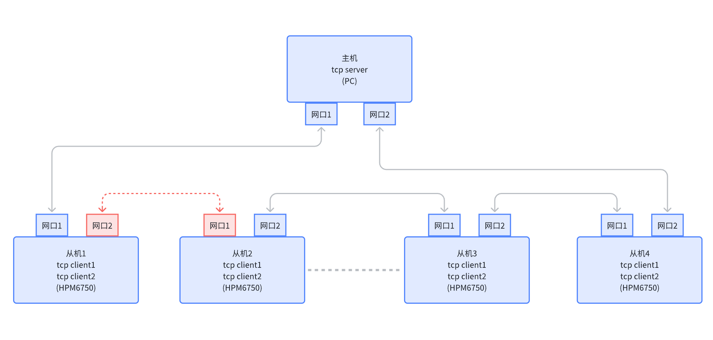
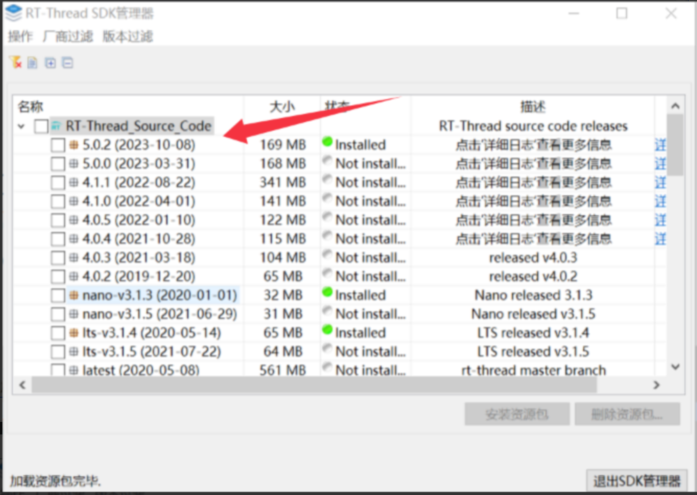
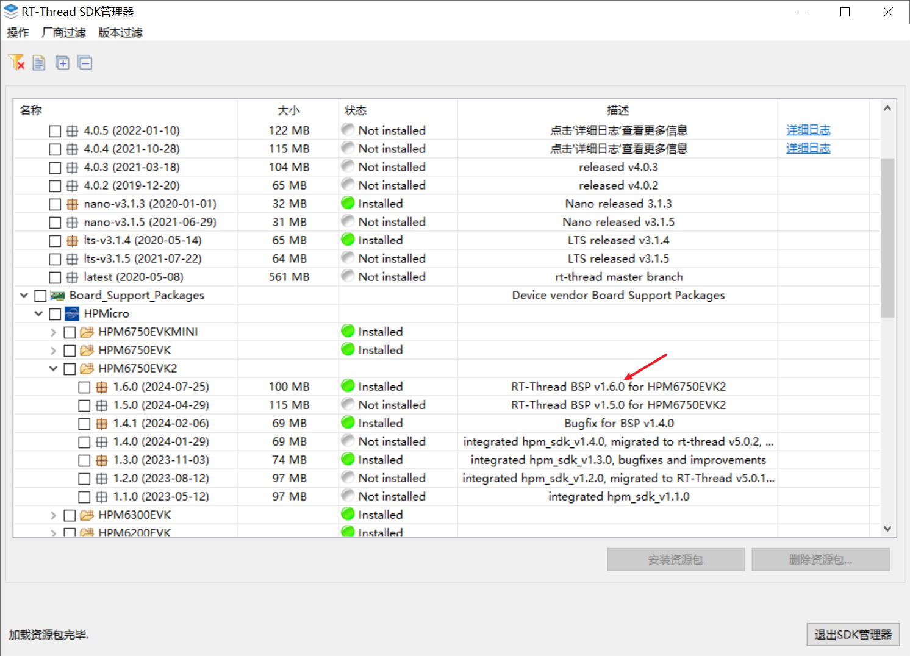
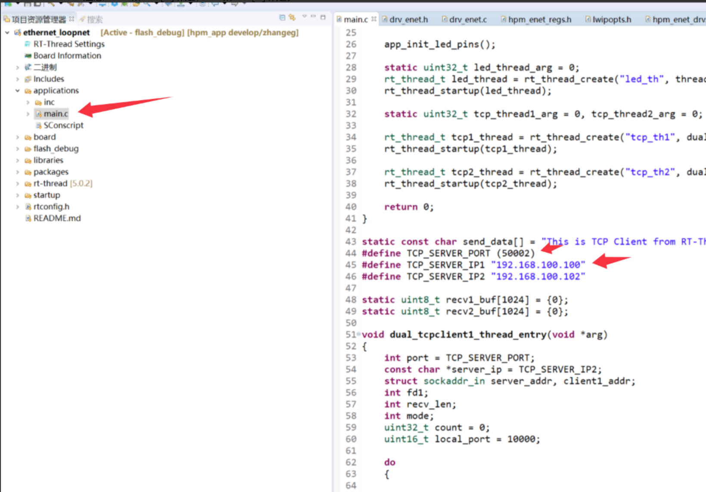
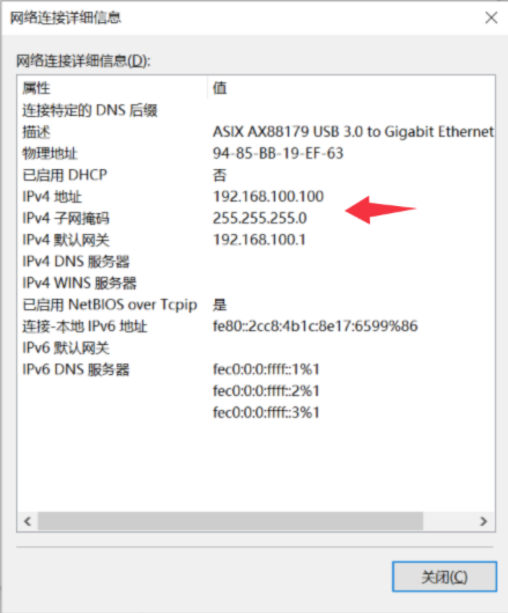
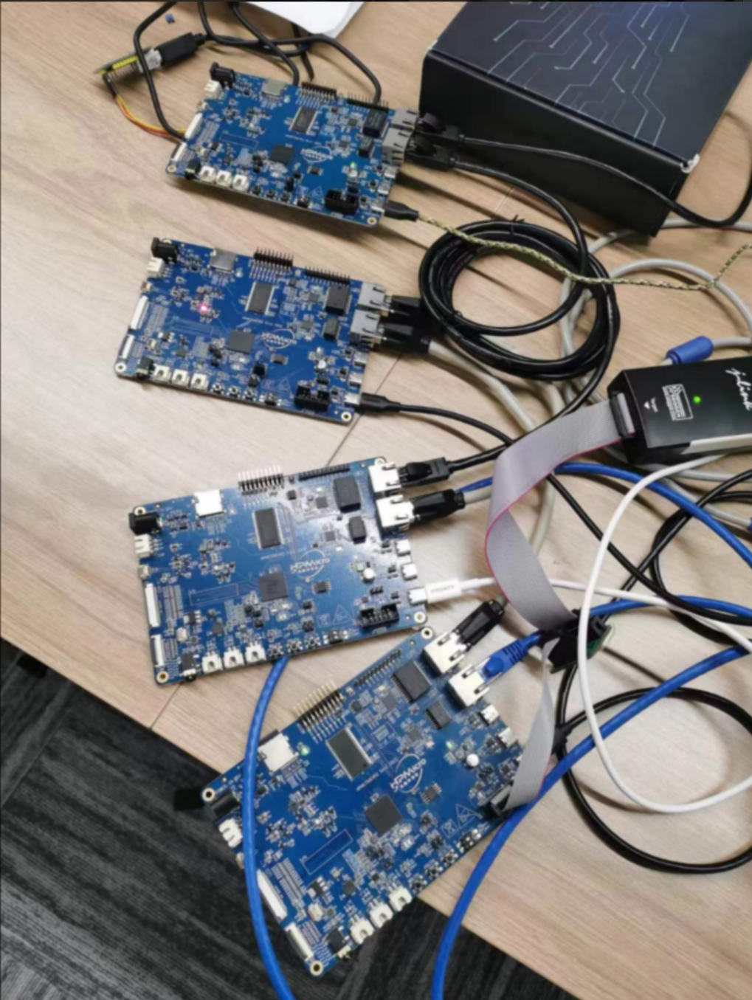
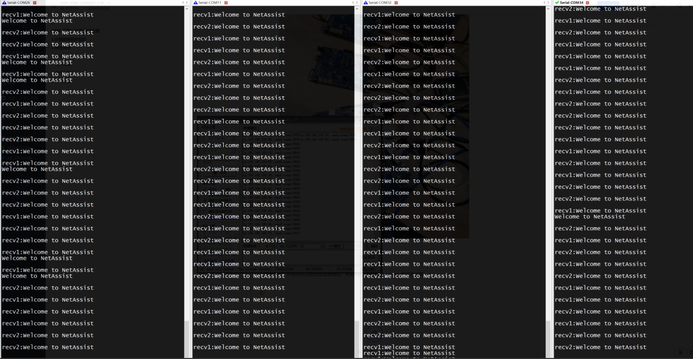
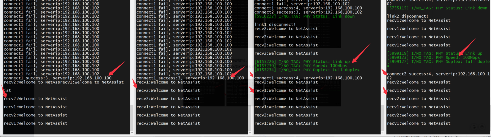
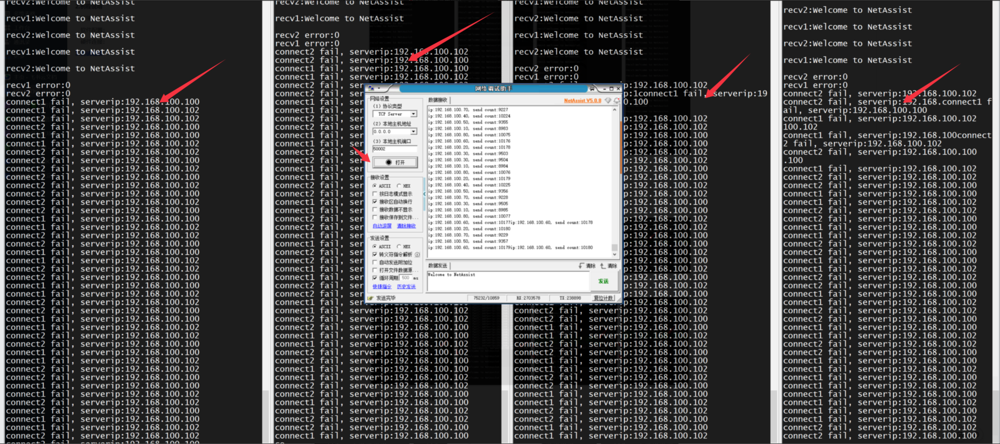
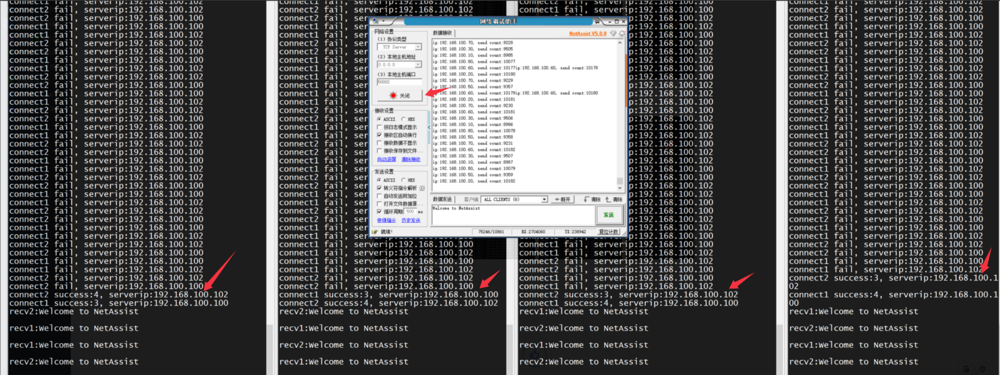

# HPM Dual Port Ring Communication Solution

## Ring network topology

Description: 
1. There is only one master in the whole system, all others are slaves. 
2. The master and all the slaves are connected in series as shown above, and eventually looped back to the master. 
3. The master and all slaves are dual-port devices, so each device has two MAC addresses and two independent IP addresses, and the MAC and IP are bound. 
4. The host and slaves must be on the same network segment, and the IP address of each port must not be repeated. 
5. The host establishes a tcp server, binds IP_ADDR_ANY and any address; that is to say, although only one tcp server is established, valid tcpclient data from both ports will be received by this server.
6. The bottom logic of the slave determines the MAC address and type of Ethernet pyload, and if it is its own data, broadcast packet or multicast packet, submits it to the upper stack for processing, and the rest of the packets are transmitted to another network port for sending. Among them, broadcast and multicast packets should be transmitted to another network port at the same time when they are submitted to the upper-layer stack for processing.
7. Each slave establishes two tcp clients, and each binds to its own IP address. The slave needs to know the two IP addresses of the server connection, the two tcp clients try to connect to the two server ip, after the connection is successful, you can know the current tcp client corresponding to the network port loopback connection is the host's network port.
8. After the slave is physically disconnected (the network cable is disconnected phy disconnected), it will immediately detect the disconnection and report an error. As shown in the following figure: Slave 1 port 2 and Slave 2 port 1 will immediately detect the disconnection and report an error. 
9. The slave is not physically disconnected, but there is a disconnection in the loop, you need to confirm the disconnection by tcp sniffing. As shown in the following figure: Slave 3 port 1 and Slave 4 port 1 will not detect the disconnection immediately, but need to confirm the disconnection by tcp sniffing. Specific tcp sniffing interval and time duration can be set by software. 
10. Slave supports automatic reconnection.

## routine description

### matrix

#### Rtthread: V5.0.2

#### HPMSDK: V1.6.0

#### RT-thread studio IDE

Version number:2.2.6

#### BOARD:

hpm6750evk2

### Software Configuration

#### A. IP address changes

root directory：rtconfig.h
RT_LWIP_IPADDR1
RT_LWIP_IPADDR2

#### B. MAC address modification

libraries/drivers/drv_enet.h
MAC0_ADDR0~MAC1_ADDR1

Note: IP1 is bound to mac[0] and IP2 is bound to mac[1].

#### C. Server IP address changes

applications/main.c
TCP_SERVER_PORT
TCP_SERVER_IP1
TCP_SERVER_IP2

#### D. Host (PC) server configuration

Server-side configuration：

Dual NIC Static IP Configuration on PC：
 

Note: 
1. Make sure that the IP address and MAC address of the master and each slave are different and cannot be repeated; 
2. The master and all the slaves must be under the same network segment, otherwise they cannot communicate.

### hardware connection

The master and all the slaves are connected in series, and the final ring is looped back to the master to form a ring network.

## Test results

1. Normal process: all slaves are automatically connected successfully, and all tcp_client and tcp server communications are normal. Pressure test passed.

2. Abnormal process: Disconnect one of the network cables.
The two slave network ports that are physically disconnected are immediately detected and report an error.
Other slaves that are not physically disconnected, after sniffing for 20s (software modifiable) detect the disconnection and report an error and retry to reconnect.
Communication is normal on all undisconnected links.

3. Abnormal process: Disconnect the network cable and reconnect. Slaves are automatically re-established successfully.

4. Abnormal process: disconnect the server
All hosts will quickly detect a disconnection and attempt to reconnect.

5. Exception process: Re-establish the server
All slaves were reconnected quickly and successfully.

## Software API

:::{eval-rst}

About software API:  `API doc <../../_static/apps/ethernet_loopnet/html/index.html>`_ 。
:::
