# HPM 双网口环网通信方案

## 依赖Rtthread: V5.0.2

## 环网组网拓扑结构

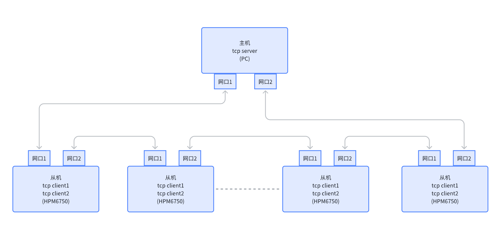

说明：
1. 整个系统中只有一个主机，其它都是从机。
2. 主机和所有从机如上图串联起来，最终环回到主机。
3. 主机和所有从机均是双网口设备，因此每个设备拥有两个MAC地址和两个独立的IP地址，且MAC和IP是绑定对应的。
4. 主机和从机必须在一个网段下，且每个端口的IP不可重复。
5. 主机建立一个tcp server, bind的是IP_ADDR_ANY及任意地址；也就是说虽然只建立了一个tcp server，但是两个网口有效的tcpclient数据都会被此server收到。
6. 从机底层逻辑判断以太网pyload中 MAC地址及Type类型，若为自身数据、广播包、组播包递交上层stack处理，其余数据包透传另外一个网口发送。其中，广播包和组播包在递交上层stack处理时同时也要透传另外一个网口发送。
7. 每个从机建立两个tcp client,且各自bind自身的IP地址。从机需知道server连接的两个IP地址，两个tcp client分别尝试连接两个server ip，连接成功后即可获知当前tcp client对应的网口环回连接的是主机的那个网口。
8. 从机在物理断开后(网线断开phy断连)，会立即检测到断连并报错。如下图：从机1网口2和从机2网口1会立即检测到断连并报错。
9. 从机在物理上未断开，但环路中有断连，需通过tcp嗅探来确认断连。如下图：从机3网口1和从机4网口1并不会立即检测到断连，需tcp嗅探确认断连。具体tcp嗅探间隔及时长软件可设置。
10. 从机支持断连自动重连。
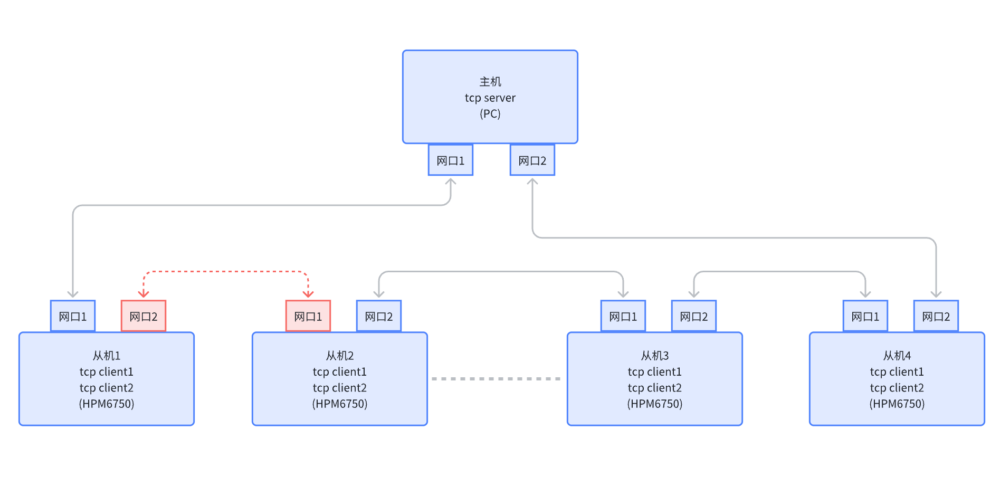

## 例程说明

### 环境

#### Rtthread: V5.0.2

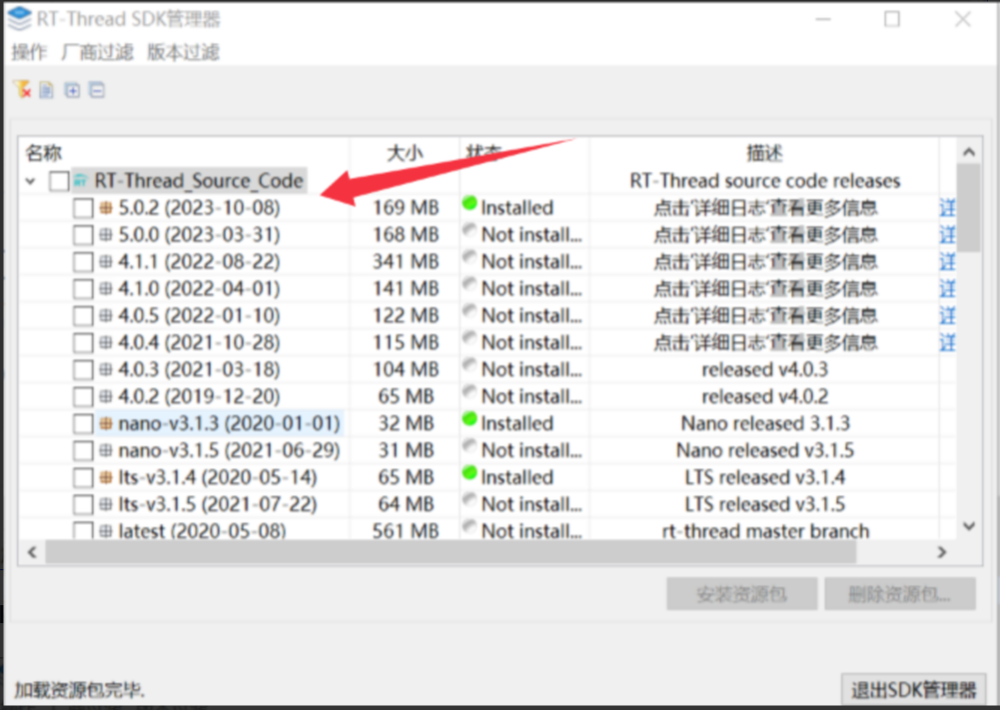

#### HPMSDK: V1.6.0

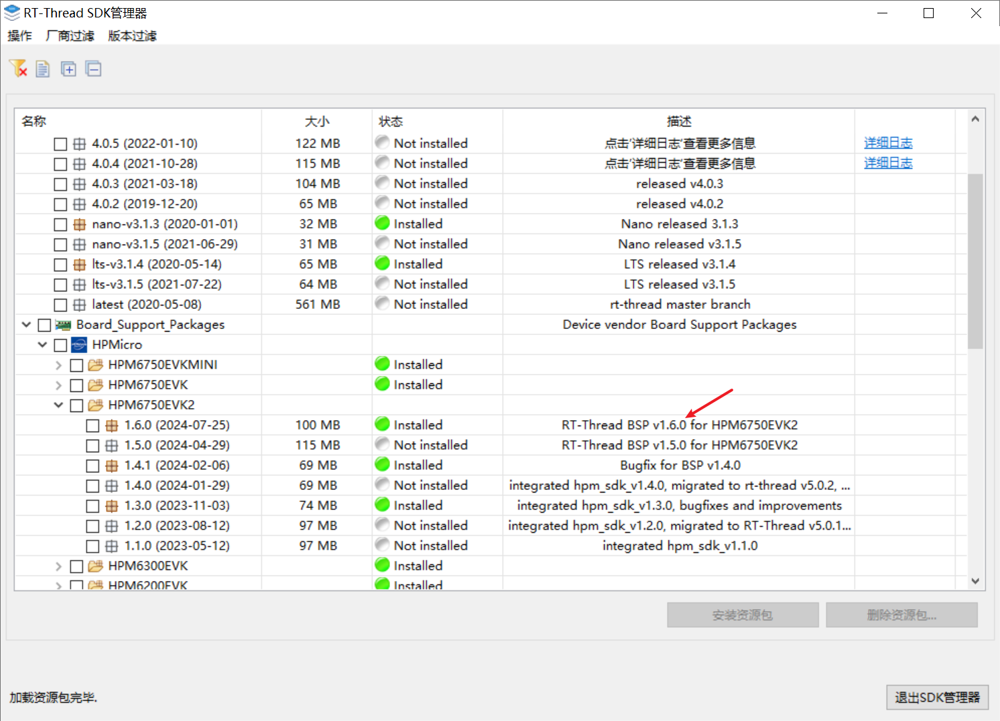

#### RT-thread studio IDE开发

版本号：2.2.6

#### BOARD:

hpm6750evk2

### 软件配置

#### A. IP地址修改

根目录：rtconfig.h
RT_LWIP_IPADDR1
RT_LWIP_IPADDR2
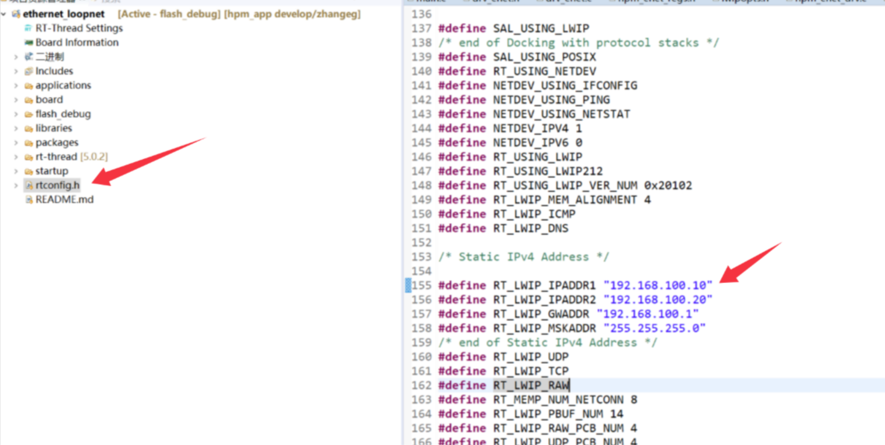

#### B. MAC地址修改

libraries/drivers/drv_enet.h
MAC0_ADDR0~MAC1_ADDR1
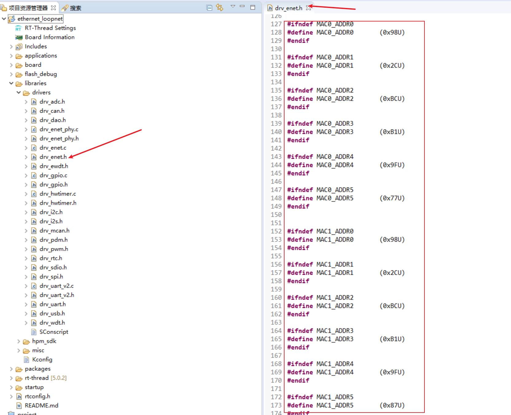
注意：IP1和mac[0]绑定，IP2和mac[1]绑定。

#### C. Server IP地址修改

applications/main.c
TCP_SERVER_PORT
TCP_SERVER_IP1
TCP_SERVER_IP2
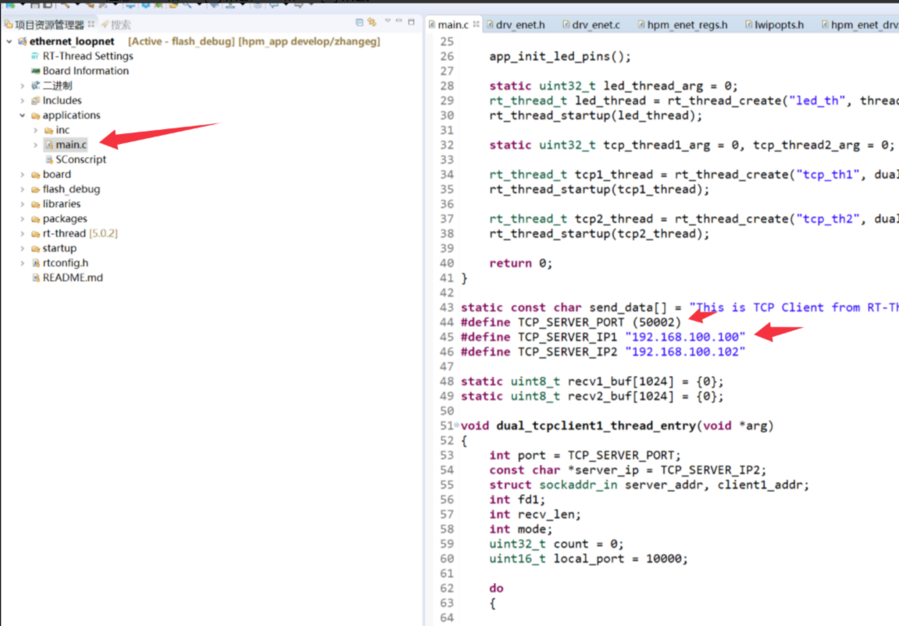

#### D. 主机(PC)server配置

server端配置：
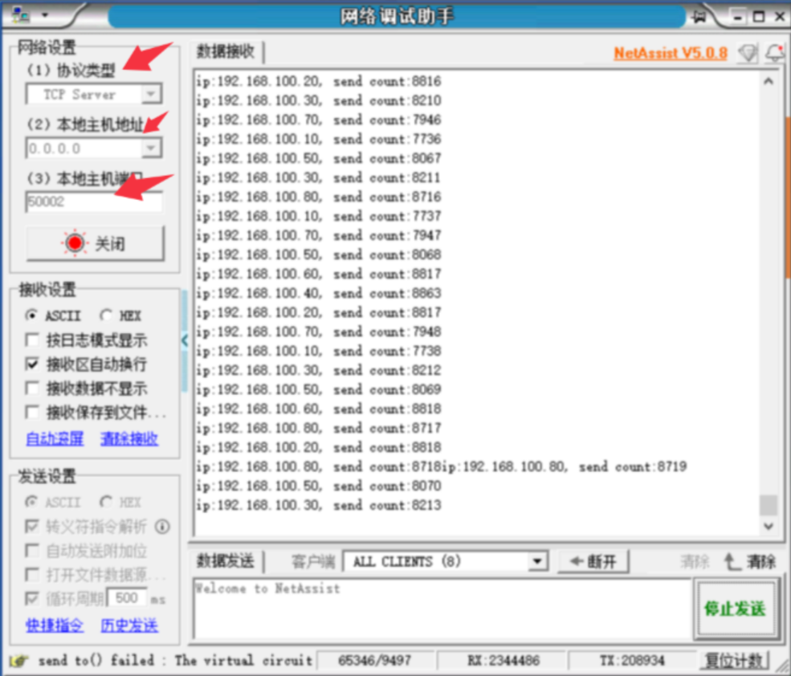

PC上双网卡静态IP配置：
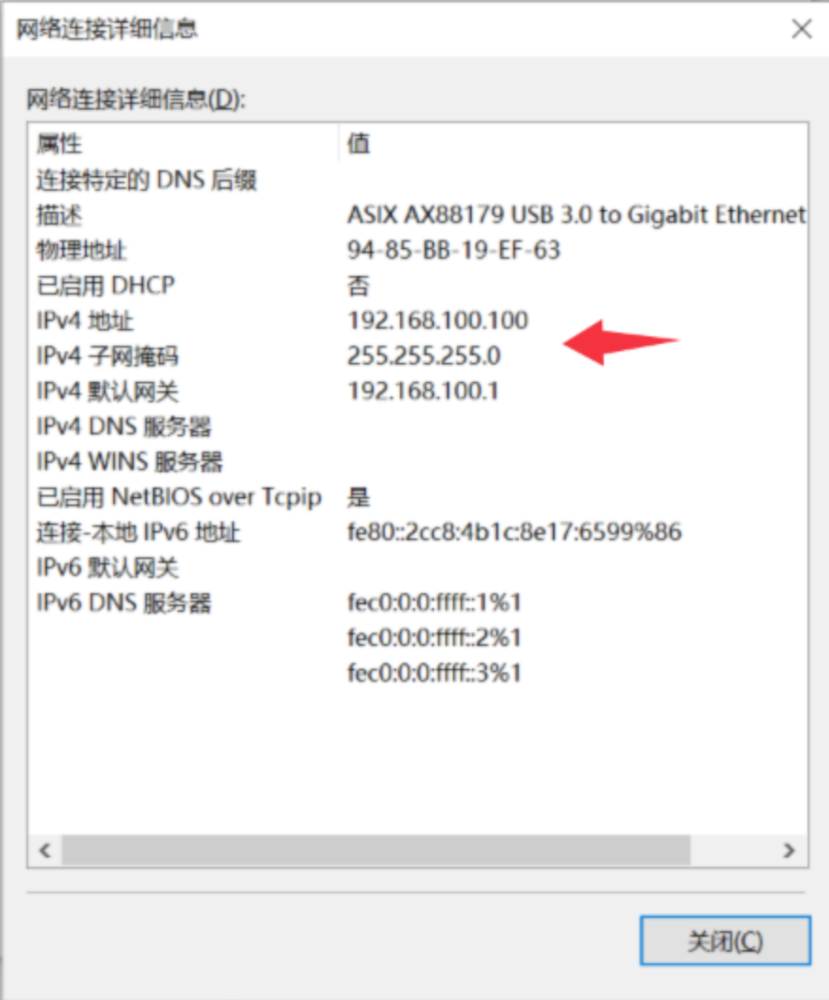 

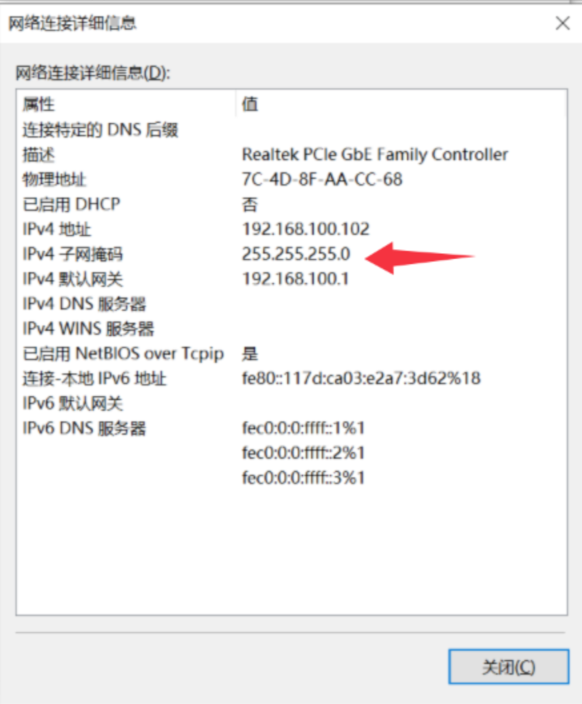

注意：
1.确保主机以及每个从机的IP地址和MAC地址不同，不可重复；
2.主机和所有从机必须在同一网段下，否则无法通信。

### 硬件连接

主机和所有从机串联在一起， 最后环回到主机形成环网。
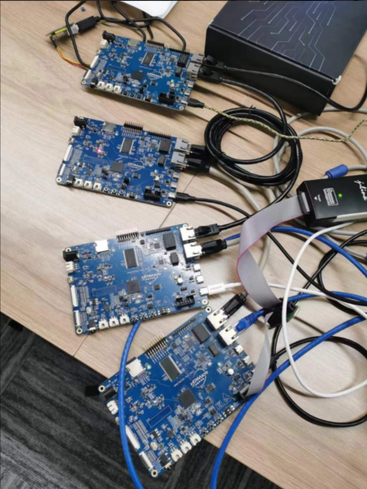

## 测试结果

1.正常流程：所有从机均会自动连接成功，所有tcp_client和tcp server 通信均正常。压测通过。
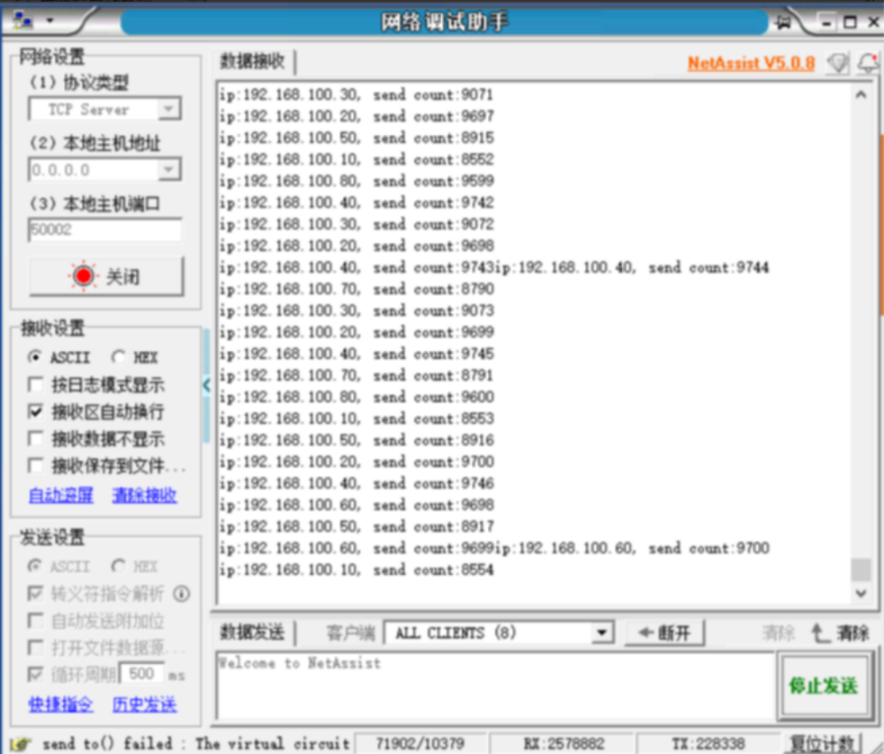
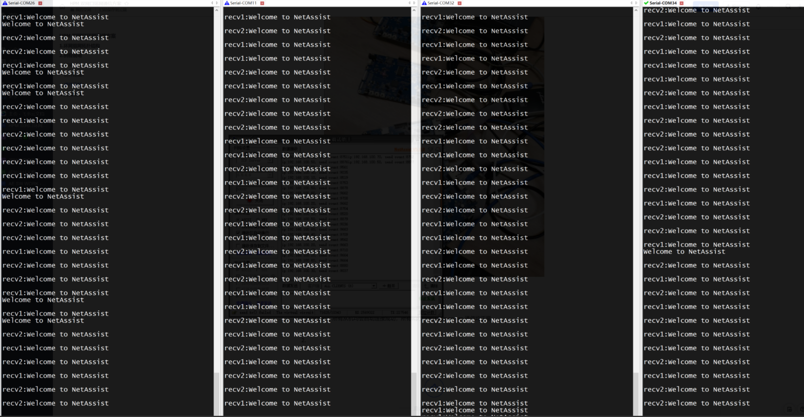

2.异常流程：断开其中一根网线。
物理断开的两个从机网口会立即检测到并报错。
非物理断开的其它从机，经过嗅探20s(软件可修改)后检测到断连并报错后重试重连。
未断开的链路通信均正常。
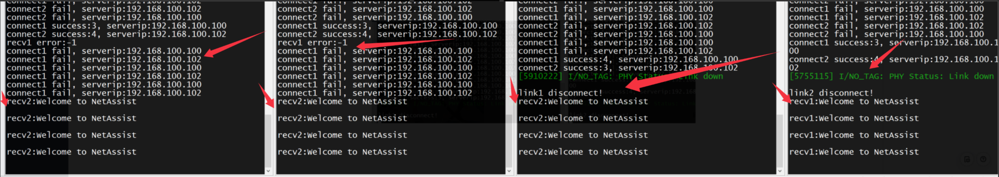

3.异常流程：断开网线重新连接。从机均自动重新建立成功。
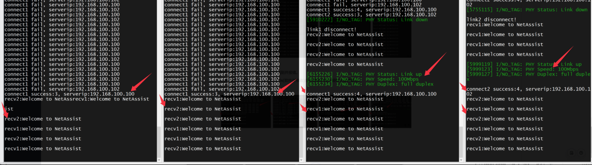

4.异常流程：断开服务器
所有从机会快速检测到断连并尝试重连。
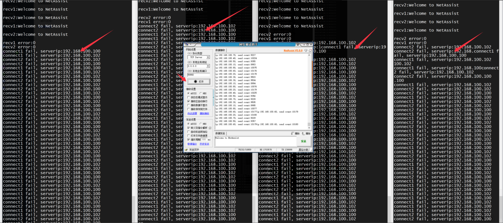

5.异常流程：重新建立服务器
所有从机均快速重连成功。
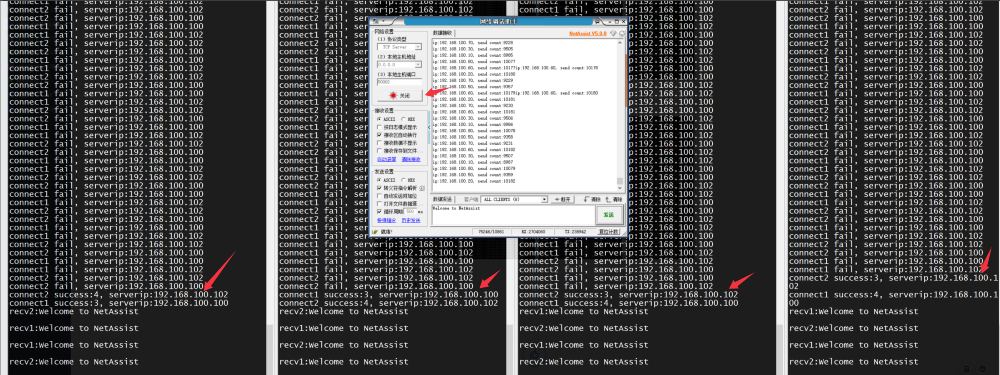

## API

:::{eval-rst}

关于软件API 请查看 `方案API 文档 <../../_static/apps/ethernet_loopnet/html/index.html>`_ 。
:::
