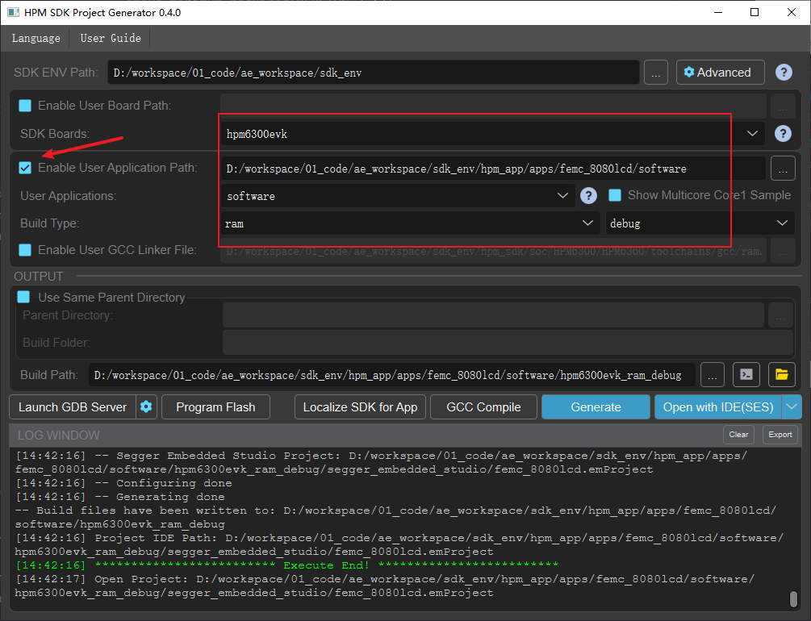
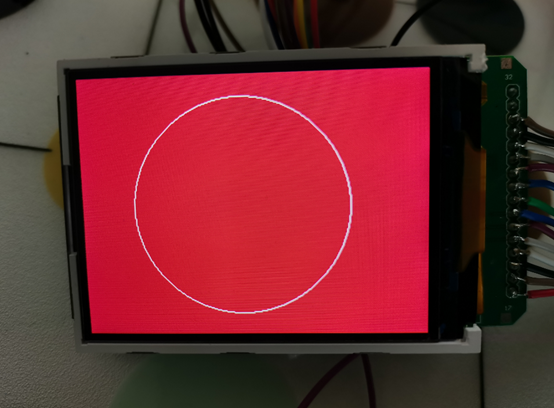
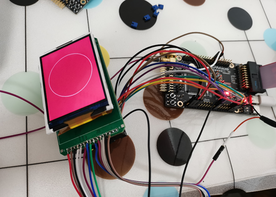

# HPM FEMC驱动8080屏开发

## 依赖SDK1.10.0

## 介绍

本方案介绍了如何用FEMC控制器驱动8080屏。将8080屏通过FEMC控制器挂载，像访问RAM操作，通过读写对应地址即可轻松驱动点亮8080屏，并实现高速的刷新率。

在HPM6700/6400、6300系列微控制器上均带了多功能外部存储器FEMC控制器。

从8080协议时序图和SRAM时序图对比可知，8080并口时序和SRAM时序基本一致。因此，可以使用FEMC控制器来驱动8080屏。

## 应用文档

[HPM_FEMC驱动8080屏开发](doc/HPM_FEMC驱动8080屏开发指南_V1.1.pdf)

## 例程

### FEMC驱动8080屏的配置：

```c
#define SRAM_BASE_ADDR 0x48000000U
#define SRAM_SIZE 2
#define TFTReadData() (*(uint8_t *)0x48000001U)
#define Bank1_LCD_DATA ((uint32_t)0x48000001U)
#define Bank1_LCD_REG ((uint32_t)0x48000000U)
/* LCD write data and register */
#define LCD_WR_DATA(value) ((*(__IO uint8_t *)(Bank1_LCD_DATA)) = ((uint8_t)(value))) // 写数据寄存器
#define LCD_WR_REG(index) ((*(__IO uint8_t *)(Bank1_LCD_REG)) = ((uint8_t)index))     // 写命令寄存器

void femc_lcd8080_config(void)
{
    uint32_t femc_clk_in_hz = board_init_femc_clock();
    femc_config_t config = {0};
    femc_sram_config_t sram_config = {0};
    femc_default_config(HPM_FEMC, &config);
    config.dqs = FEMC_DQS_INTERNAL;
    femc_init(HPM_FEMC, &config);
    femc_get_typical_sram_config(HPM_FEMC, &sram_config);
    sram_config.oeh_in_ns = 100;
    sram_config.oel_in_ns = 70;
    sram_config.weh_in_ns = 35;
    sram_config.wel_in_ns = 35;
    sram_config.ah_in_ns = 50;
    sram_config.as_in_ns = 10;
    sram_config.ceh_in_ns = 10;
    sram_config.ces_in_ns = 15;
    sram_config.base_address = SRAM_BASE_ADDR;
    sram_config.size_in_byte = SRAM_SIZE;
    sram_config.port_size = FEMC_SRAM_PORT_SIZE_8_BITS;
    femc_config_sram(HPM_FEMC, femc_clk_in_hz, &sram_config);
}


```

### 8080屏读写控制：

```c
void lcd8080_read_write_test(void)
{
    for(uint8_t i = 0; i < 0xFF; i++)
    {
        LCD_WR_DATA(i);
    }
    board_delay_ms(100);
    for(uint8_t i = 0; i < 0xFF; i++)
    {
        LCD_WR_REG(i);
    }
    board_delay_ms(100);
    for(uint8_t i = 0; i < 0xFF; i++)
    {
        printf("read:0x%02X\r\n", TFTReadData());
    }
    board_delay_ms(100);
}

```

### pmp初始化修改：

```c
void board_init_pmp(void)
{
    extern uint32_t __noncacheable_start__[];
    extern uint32_t __noncacheable_end__[];
    extern uint32_t __8080_start__[];
    extern uint32_t __8080_end__[];

    uint32_t start_addr = (uint32_t) __noncacheable_start__;
    uint32_t end_addr = (uint32_t) __noncacheable_end__;
    uint32_t length = end_addr - start_addr;
    uint32_t start_addr1 = (uint32_t) __8080_start__;
    uint32_t end_addr1 = (uint32_t) __8080_end__;
    uint32_t length1 = end_addr1 - start_addr1;
    if (length == 0) {
        return;
    }
    if (length1 == 0) {
        return;
    }
    /* Ensure the address and the length are power of 2 aligned */
    assert((length & (length - 1U)) == 0U);
    assert((start_addr & (length - 1U)) == 0U);
    assert((length1 & (length1 - 1U)) == 0U);
    assert((start_addr1 & (length1 - 1U)) == 0U);
    pmp_entry_t pmp_entry[4] = {0};
    pmp_entry[0].pmp_addr = PMP_NAPOT_ADDR(0x0000000, 0x80000000);
    pmp_entry[0].pmp_cfg.val = PMP_CFG(READ_EN, WRITE_EN, EXECUTE_EN, ADDR_MATCH_NAPOT, REG_UNLOCK);

    pmp_entry[1].pmp_addr = PMP_NAPOT_ADDR(0x80000000, 0x80000000);
    pmp_entry[1].pmp_cfg.val = PMP_CFG(READ_EN, WRITE_EN, EXECUTE_EN, ADDR_MATCH_NAPOT, REG_UNLOCK);

    pmp_entry[2].pmp_addr = PMP_NAPOT_ADDR(start_addr, length);
    pmp_entry[2].pmp_cfg.val = PMP_CFG(READ_EN, WRITE_EN, EXECUTE_EN, ADDR_MATCH_NAPOT, REG_UNLOCK);
    pmp_entry[2].pma_addr = PMA_NAPOT_ADDR(start_addr, length);
    pmp_entry[2].pma_cfg.val = PMA_CFG(ADDR_MATCH_NAPOT, MEM_TYPE_MEM_NON_CACHE_BUF, AMO_EN);

    pmp_entry[3].pmp_addr = PMP_NAPOT_ADDR(start_addr1, length1);
    pmp_entry[3].pmp_cfg.val = PMP_CFG(READ_EN, WRITE_EN, EXECUTE_EN, ADDR_MATCH_NAPOT, REG_UNLOCK);
    pmp_entry[3].pma_addr = PMA_NAPOT_ADDR(start_addr1, length1);
    pmp_entry[3].pma_cfg.val = PMA_CFG(ADDR_MATCH_NAPOT, MEM_TYPE_MEM_NON_CACHE_BUF, AMO_EN);
    pmp_config(&pmp_entry[0], ARRAY_SIZE(pmp_entry));
}

```


## 工程路径

- 工程路径：apps/femc_8080lcd/software/


## 工程配置

无

## 工程构建
- windows下工程构建




## 硬件设置
- 本方案使用HPM6364芯片装在HPM6200EVK上，外接8080屏进行测试。

## 工程运行

- 运行工程

## 点亮效果图



- HPM6300evk接8080屏实物图 (注：hpm6200evk上贴HPM6300系列MCU)




## API

:::{eval-rst}

关于软件API 请查看 `方案API 文档 <../../_static/apps/femc_8080lcd/html/index.html>`_ 。
:::
