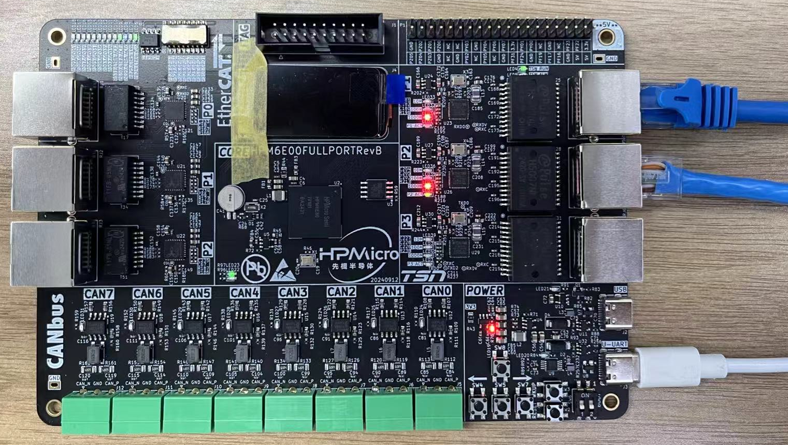
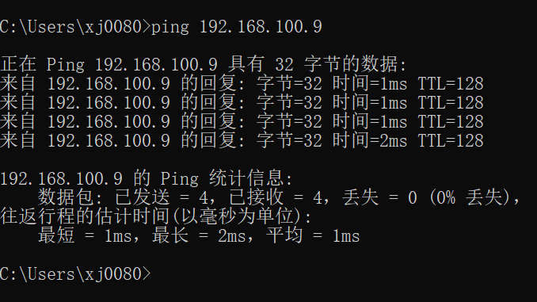
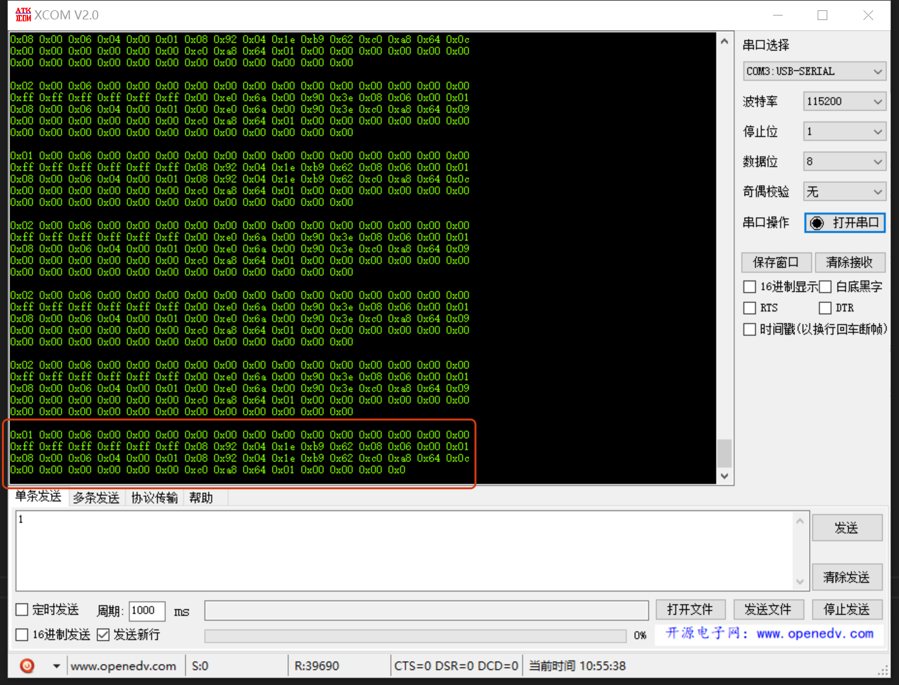
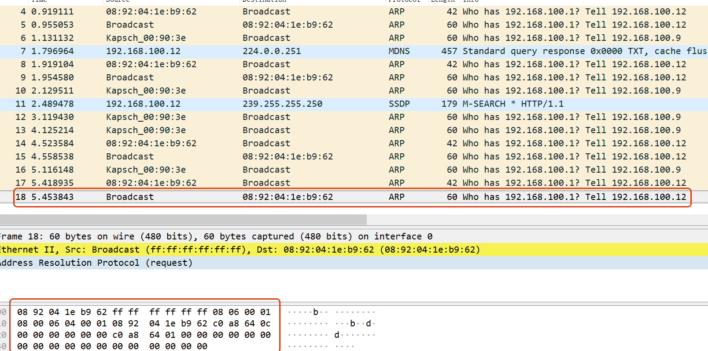
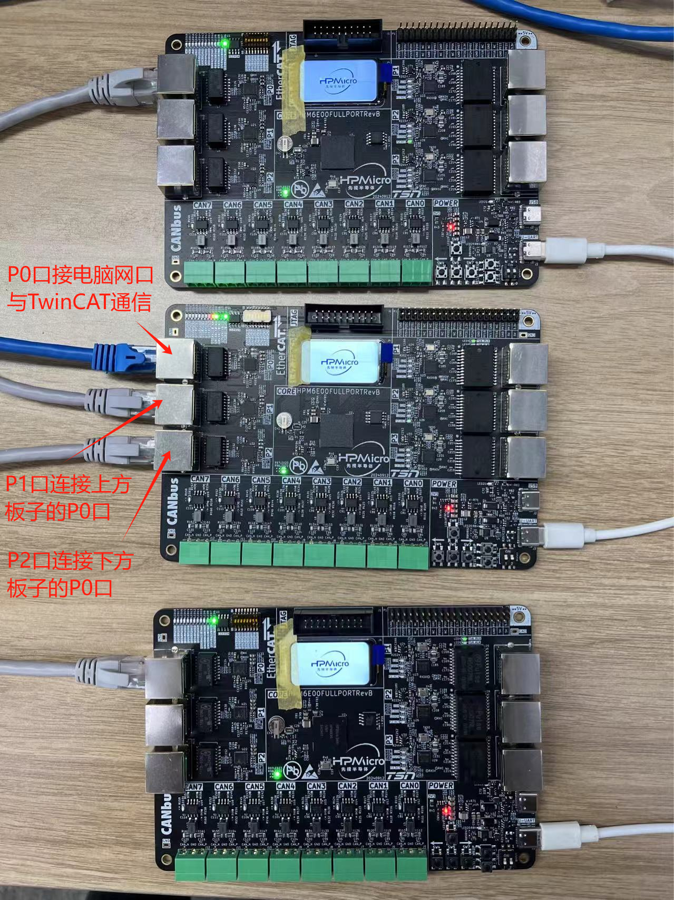
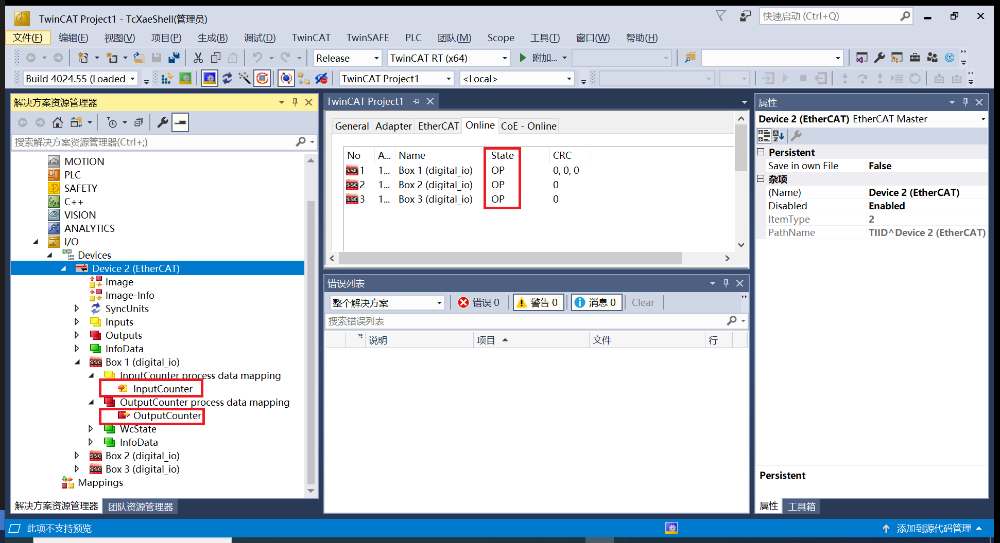

# HPM6E00 FULL PORT

## Depend on SDK1.9.0

## Overview

HPM series MCU is a high-performance real-time RISC-V microcontroller from Shanghai HPM Semiconductor Technology Co., Ltd., which provides great computing power and efficient control capability for industrial automation and edge computing applications.

HPM6E00 series microcontrollers are built with an EtherCAT slave controller (ESC), each of which has three ports P0, P1, P2 for EtherCAT communication, wherein P0 port is the EtherCAT input port. At the same time, the series of microcontrollers built-in a time-sensitive network based switch controller (TSN), each TSN has four ports, CPUPORT, P1, P2, P3, CPUPORT directly to the CPU, the CPU can participate in the data processing of the port, P1, P2, P3 ports for external forwarding. Support 802.1as, 802.1Qav, 802.1Qbv, 802.1Qch, 802.1Qbu, 802.1br, only the CPUPORT supports 802.1Qci and 802.1CB.

ESC and TSN for the HPM6E00 series. HPMicro launches HPM6E00_FULL_PORT board for testing and evaluating ESC and TSN. At the same time, the board carries SPI LCD, 8-way CAN, KEY, LED, USB OTG, USB-UART, etc. For details, refer to the schematic diagram of HPM6E00FULLPORTRevB.

## Features

- It supports the functions of a simple switch. Three external ports and one internal port can pass Ethernet frames with any MAC address.
- It supports the function of static MAC address table configuration. After configuring the static MAC address table, three external ports and one internal port can pass the Ethernet frames for which the table lookup is successful.
- It supports the configuration of a dynamic MAC address table and the dynamic learning function. After learning the source MAC address through ARP packets and configuring the MAC address table, the three external ports and one internal port can pass Ethernet frames for which the table lookup is successful.
- It supports the IO function of the EtherCAT slave controller.

## File Structure

```
full_port ------------------------------->main directory
  ├─doc --------------------------------->document
  │  ├─api
  │  │  └─assets ------------------------>README_zh uses resources such as images, etc
  │  └─doxygen -------------------------->doxygen file used to generate html
  │  └─HPM6E00_FULL_PORT_UG_V1.0.pdf----->use guide
  ├─hardware ---------------------------->hardwre
  │  └─HPM6E00FULLPORTRevB-工程文件 --->project file
  │      └─HPM6E00FULLPORTRevB ------->schematic
  └─software ---------------------------->software
      ├─apps ---------------------------->application demo
      |  ├─ecat_io ---------------------->ESC IO control demo
      │  ├─tsn_dynamic_mac_switch ------->TSN set the MAC dynamically demo
      │  ├─tsn_simplest_switch ---------->TSN simplest switch demo
      │  └─tsn_static_mac_switch -------->TSN set the MAC statically
      └─drivers ------------------------->drivers
          ├─inc ------------------------->driver include
          │  └─tsn ---------------------->TSN driver include
          └─src ------------------------->driver source files
```

full_port main directory, three internal folders and two files, doc, hardware, software, README_zh.md(Chinese), README_en.md(English).

### Hardware Structure

- HPM6E00_FULL_PORT Hardware Schematic: [HPM6E00FULLPORTRevB](hardware/HPM6E00FULLPORTRevB.pdf) 
- HPM6E00_FULL_PORT Hardware Introduction：  [HPM6E00_FULL_PORT User Guide](doc/HPM6E00_FULL_PORT_UG_V1.0.pdf)

### Software Structure

software includes apps and drivers, and drivers includes inc driver header files and src driver source files. Various demo are in apps, and functions are realized by calling functions in drivers. At the same time, a separate folder is created within the apps for each demo, and TSN-related functions start with tsn_, and so on. At the same time, each demo has main.c, global_config.h, CMakeLists.txt.

## Test Demo

### Simplest switch based on TSN(tsn_simplest_switch)

#### Overview

In this demo, the three external ports P1, P2, and P3 of the Switch configured with TSN can forward broadcast frames and unknown frames to each other. The broadcast frame refers to the data frame that enters the Switch through the three external ports and the destination MAC is not found by looking up the table. You can switch the port rate of 10/100/1000M by pressing SW4, SW5, and SW7.

#### Device Connection

- Connect PC USB to DEBUG Type-C interface(J3)
- Connect the debugger to the JTAG interface
  

Connect one end of the two network cables to ports P1 and P2 (any two ports are sufficient), and connect the other end to two PCS.

Note: Ensure that the IP addresses of the two PCS are in the same network segment, and disable the firewall on the PCS. Set the IP address of one PC to 192.168.100.12 and the IP address of the other PC to 192.168.100.9.

#### Port Settings

- Serial port baud rate is set to ``115200bps``, with ``one stop bit`` and ``no parity bit``

#### Create Project

- windows create project
  Please read [HPM6E00_FULL_PORT User Guide](doc/HPM6E00_FULL_PORT_UG_V1.0.pdf)

#### Running the example

When the project runs correctly, the serial port terminal will output the following information:
```
==============================
 hpm6e00_full_port clock summary
==============================
cpu0:		 500000000Hz
cpu1:		 600000000Hz
ahb:		 200000000Hz
axif:		 200000000Hz
axis:		 200000000Hz
axic:		 200000000Hz
axin:		 100000000Hz
xpi0:		 100000000Hz
femc:		 166666666Hz
mchtmr0:	 24000000Hz
mchtmr1:	 24000000Hz
==============================

----------------------------------------------------------------------
$$\   $$\ $$$$$$$\  $$\      $$\ $$\
$$ |  $$ |$$  __$$\ $$$\    $$$ |\__|
$$ |  $$ |$$ |  $$ |$$$$\  $$$$ |$$\  $$$$$$$\  $$$$$$\   $$$$$$\
$$$$$$$$ |$$$$$$$  |$$\$$\$$ $$ |$$ |$$  _____|$$  __$$\ $$  __$$\
$$  __$$ |$$  ____/ $$ \$$$  $$ |$$ |$$ /      $$ |  \__|$$ /  $$ |
$$ |  $$ |$$ |      $$ |\$  /$$ |$$ |$$ |      $$ |      $$ |  $$ |
$$ |  $$ |$$ |      $$ | \_/ $$ |$$ |\$$$$$$$\ $$ |      \$$$$$$  |
\__|  \__|\__|      \__|     \__|\__| \_______|\__|       \______/
----------------------------------------------------------------------
simplest switch

 ```  
You can see this when you ping a PC from another PC


### Static MAC switch based on TSN(tsn_static_mac_switch)

#### Overview

In this example, the three external ports P1, P2, and P3 of TSN's Switch are configured with static MAC tables so that they can forward data by looking up the table. You can switch the port rate of 10/100/1000M by pressing SW4, SW5, and SW7.

#### Static MAC configuration

```
uint8_t u8CpuPortDesMac[6] = {0x4e, 0x00, 0x00, 0x00, 0xf0, 0x50};
uint8_t u8Port1DesMac[6] = {0x08, 0x92, 0x04, 0x1e, 0xb9, 0x62};
uint8_t u8Port2DesMac[6] = {0x00, 0xe0, 0x6a, 0x00, 0x90, 0x3e};
uint8_t u8Port3DesMac[6] = {0x08, 0x92, 0x04, 0x14, 0xf9, 0x40};
```

#### Device Connection

- Connect PC USB to DEBUG Type-C interface(J3)
- Connect the debugger to the JTAG interface
  

PC1's MAC is u8Port1DesMac, and you need to connect network port PC1 to port P1 through network cable; PC2's MAC is u8Port2DesMac, and you need to connect PC2 to port P2 through network cable.

Note: Ensure that the IP addresses of the two PCS are in the same network segment, and disable the firewall on the PCS. Set the IP address of one PC to 192.168.100.12 and the IP address of the other PC to 192.168.100.9.

#### Port Settings

- Serial port baud rate is set to ``115200bps``, with ``one stop bit`` and ``no parity bit``

#### Create Project

- windows create project
  Please read [HPM6E00_FULL_PORT User Guide](doc/HPM6E00_FULL_PORT_UG_V1.0.pdf)

#### Running the example

When the project runs correctly, the serial port terminal will output the following information:
```
==============================
 hpm6e00_full_port clock summary
==============================
cpu0:		 500000000Hz
cpu1:		 600000000Hz
ahb:		 200000000Hz
axif:		 200000000Hz
axis:		 200000000Hz
axic:		 200000000Hz
axin:		 100000000Hz
xpi0:		 100000000Hz
femc:		 166666666Hz
mchtmr0:	 24000000Hz
mchtmr1:	 24000000Hz
==============================

----------------------------------------------------------------------
$$\   $$\ $$$$$$$\  $$\      $$\ $$\
$$ |  $$ |$$  __$$\ $$$\    $$$ |\__|
$$ |  $$ |$$ |  $$ |$$$$\  $$$$ |$$\  $$$$$$$\  $$$$$$\   $$$$$$\
$$$$$$$$ |$$$$$$$  |$$\$$\$$ $$ |$$ |$$  _____|$$  __$$\ $$  __$$\
$$  __$$ |$$  ____/ $$ \$$$  $$ |$$ |$$ /      $$ |  \__|$$ /  $$ |
$$ |  $$ |$$ |      $$ |\$  /$$ |$$ |$$ |      $$ |      $$ |  $$ |
$$ |  $$ |$$ |      $$ | \_/ $$ |$$ |\$$$$$$$\ $$ |      \$$$$$$  |
\__|  \__|\__|      \__|     \__|\__| \_______|\__|       \______/
----------------------------------------------------------------------
static mac switch

 ``` 
cpu port receives PC1/PC2 data frames and displays them in the serial port terminal


The wireshark exchanges the location of the received data frame with the source MAC address and sends the frame to PC1/PC2. Then the Wireshark can view the frame


You can see this when you ping a PC from another PC


### Dynamic MAC switch based on TSN(tsn_dynamic_mac_switch)

#### Overview

In this example, the three external ports P1, P2, and P3 of the TSN Switch automatically learn the dynamic MAC address table through the ARP protocol, so that they can forward data by looking up the table. You can switch the port rate of 10/100/1000M by pressing SW4, SW5, and SW7.

#### Dynamic MAC configuration

The MAC address table is automatically learned and configured using the ARP protocol between PCS.

#### Device Connection

- Connect PC USB to DEBUG Type-C interface(J3)
- Connect the debugger to the JTAG interface
  

Connect one end of the two network cables to ports P1 and P2 (any two ports are sufficient), and connect the other end to two PCS.

Note: Ensure that the IP addresses of the two PCS are in the same network segment, and disable the firewall on the PCS. Set the IP address of one PC to 192.168.100.12 and the IP address of the other PC to 192.168.100.9.

#### Port Settings

- Serial port baud rate is set to ``115200bps``, with ``one stop bit`` and ``no parity bit``

#### Create Project

- windows create project
  Please read [HPM6E00_FULL_PORT User Guide](doc/HPM6E00_FULL_PORT_UG_V1.0.pdf)

#### Running the example

When the project runs correctly, the serial port terminal will output the following information:
```
==============================
 hpm6e00_full_port clock summary
==============================
cpu0:		 500000000Hz
cpu1:		 600000000Hz
ahb:		 200000000Hz
axif:		 200000000Hz
axis:		 200000000Hz
axic:		 200000000Hz
axin:		 100000000Hz
xpi0:		 100000000Hz
femc:		 166666666Hz
mchtmr0:	 24000000Hz
mchtmr1:	 24000000Hz
==============================

----------------------------------------------------------------------
$$\   $$\ $$$$$$$\  $$\      $$\ $$\
$$ |  $$ |$$  __$$\ $$$\    $$$ |\__|
$$ |  $$ |$$ |  $$ |$$$$\  $$$$ |$$\  $$$$$$$\  $$$$$$\   $$$$$$\
$$$$$$$$ |$$$$$$$  |$$\$$\$$ $$ |$$ |$$  _____|$$  __$$\ $$  __$$\
$$  __$$ |$$  ____/ $$ \$$$  $$ |$$ |$$ /      $$ |  \__|$$ /  $$ |
$$ |  $$ |$$ |      $$ |\$  /$$ |$$ |$$ |      $$ |      $$ |  $$ |
$$ |  $$ |$$ |      $$ | \_/ $$ |$$ |\$$$$$$$\ $$ |      \$$$$$$  |
\__|  \__|\__|      \__|     \__|\__| \_______|\__|       \______/
----------------------------------------------------------------------
dynamic mac switch

 ``` 

You can see this when you ping a PC from another PC


### IO control based on ESC(ecat_io)

#### Overview

In this example, by configuring the ESC function, EtherCAT's three ports P0,P1,P2 achieve 'YYY' type communication and control IO.

#### Device Connection

- Connect PC USB to DEBUG Type-C interface(J3)
- Connect the debugger to the JTAG interface
- Connect EtherCAT's three ports
 

#### Port Settings

- Serial port baud rate is set to ``115200bps``, with ``one stop bit`` and ``no parity bit``

#### Create Project

- windows create project
  Please read [HPM6E00_FULL_PORT User Guide](doc/HPM6E00_FULL_PORT_UG_V1.0.pdf)
  
- For details about SSC code generation in ecat_io demo, see SDK ecat_io demo SSC generation process.
  Note: This routine is a three-port ESC IO control, all configuration files need to use this routine, such as xml files and xlsx files.
  C:\TwinCAT\3.1\Config\Io\EtherCAT xml use this demo SSC/ESI/ECAT_IO.xml.


#### Running the example

When the project runs correctly, the serial port terminal will output the following information:
```
==============================
 hpm6e00_full_port clock summary
==============================
cpu0:		 500000000Hz
cpu1:		 600000000Hz
ahb:		 200000000Hz
axif:		 200000000Hz
axis:		 200000000Hz
axic:		 200000000Hz
axin:		 100000000Hz
xpi0:		 133333333Hz
femc:		 166666666Hz
mchtmr0:	 24000000Hz
mchtmr1:	 24000000Hz
==============================

----------------------------------------------------------------------
$$\   $$\ $$$$$$$\  $$\      $$\ $$\
$$ |  $$ |$$  __$$\ $$$\    $$$ |\__|
$$ |  $$ |$$ |  $$ |$$$$\  $$$$ |$$\  $$$$$$$\  $$$$$$\   $$$$$$\
$$$$$$$$ |$$$$$$$  |$$\$$\$$ $$ |$$ |$$  _____|$$  __$$\ $$  __$$\
$$  __$$ |$$  ____/ $$ \$$$  $$ |$$ |$$ /      $$ |  \__|$$ /  $$ |
$$ |  $$ |$$ |      $$ |\$  /$$ |$$ |$$ |      $$ |      $$ |  $$ |
$$ |  $$ |$$ |      $$ | \_/ $$ |$$ |\$$$$$$$\ $$ |      \$$$$$$  |
\__|  \__|\__|      \__|     \__|\__| \_______|\__|       \______/
----------------------------------------------------------------------
ecat_io

EEPROM loading successful, no checksum error.

 ``` 

Using TwinCAT to control the onboard EtherCAT, you can see

Box1, Box2, Box3 respectively represent the devices connected to ports P0, P1, and P2. You can see that the devices are in OP state. Meanwhile, InputCounter and OutputCounter of each device can be modified online. InputCounter is the input, that is, the status of SW1 DIP switch can be displayed on InputCounter in real time. OutputCounter is the output. TwinCAT is used to modify the parameter in real time. The value can be reflected in LED11-18.

## API

:::{eval-rst}

About software API: `API doc <../../_static/apps/full_port/html/index.html>`_ 。
:::


