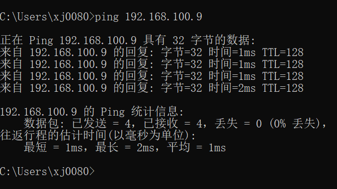
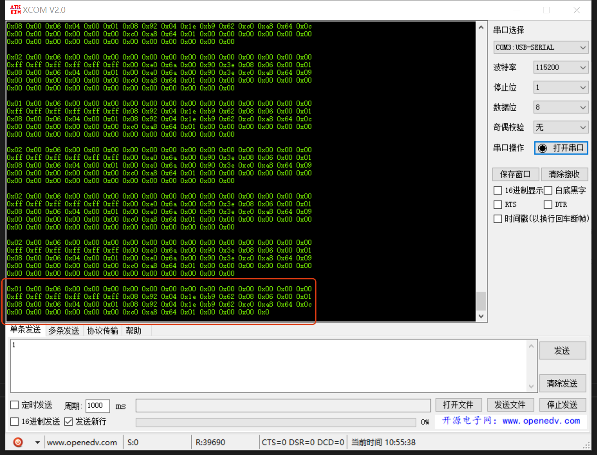
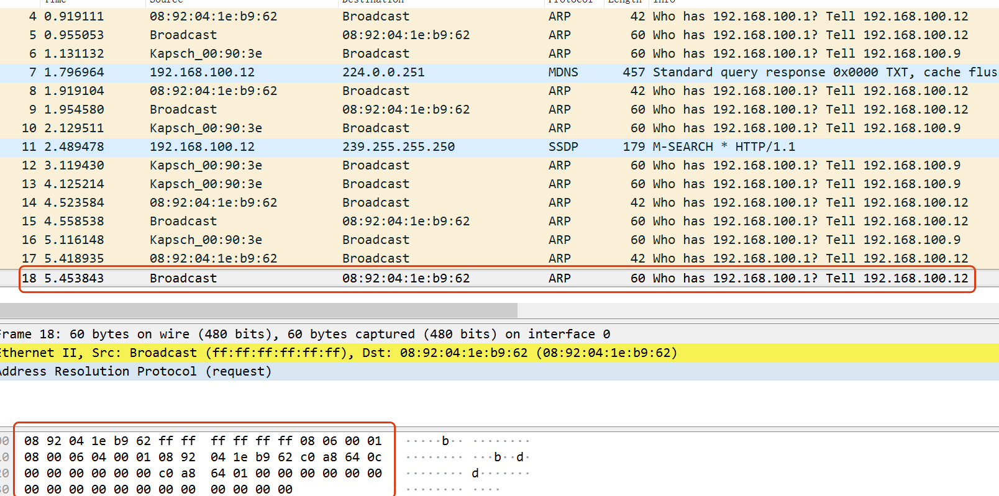

# HPM6E00 FULL PORT

## 依赖SDK1.9.0

## 概述

HPM系列MCU是来自上海先楫半导体科技有限公司的高性能实时RISC-V微控制器，为工业自动化及边缘计算应用提供了极大的算力、高效的控制能力。

HPM6E00系列微控制器内置一个EtherCAT从站控制器(ESC)，每个ESC存在三个端口P0，P1，P2用于EtherCAT通信，其中P0口为EtherCAT输入口。同时，该系列微控制器内置一个基于时间敏感网络的交换机控制器(TSN)，每个TSN存在四个端口，CPUPORT，P1，P2，P3，其中，CPUPORT直接给到CPU，CPU可以参与该端口的数据处理，P1，P2，P3端口用于对外转发。支持802.1as，802.1Qav，802.1Qbv，802.1Qch，802.1Qbu，802.1br，只有CPUPORT支持802.1Qci和802.1CB。

针对HPM6E00系列的ESC和TSN。先楫半导体推出HPM6E00_FULL_PORT板，用于测试评估ESC和TSN。同时，该板子板载SPI LCD，8路CAN，KEY，LED，USB OTG，USB-UART等，具体可参考《HPM6E00FULLPORTRevB》原理图。

## 特性
- 支持简单交换机功能，三个外部端口及一个内部端口可以通过任意MAC的以太网帧
- 支持静态MAC表配置功能，配置静态MAC表后，三个外部端口及一个内部端口可以通过查表成功的以太网帧
- 支持动态MAC表配置及动态学习功能，通过ARP包学习源MAC并配置MAC表后，三个外部端口及一个内部端口可以通过查表成功的以太网帧
- 支持Ethercat从控制器 IO功能

## 文件结构

```
full_port ------------------------------->主目录
  ├─doc --------------------------------->文档
  │  ├─api
  │  │  └─assets ------------------------>README_zh 使用的资源，如图片等
  │  └─doxygen -------------------------->doxygen文件 用于生成html
  │  └─HPM6E00_FULL_PORT_UG_V1.0.pdf----->用户指导手册
  ├─hardware ---------------------------->硬件
  │  └─HPM6E00FULLPORTRevB-工程文件 --->工程文件
  │      └─HPM6E00FULLPORTRevB ------->原理图
  └─software ---------------------------->软件
      ├─apps ---------------------------->应用例程
      |  ├─ecat_io ---------------------->ESC IO控制例程
      │  ├─tsn_dynamic_mac_switch ------->TSN动态设置MAC例程
      │  ├─tsn_simplest_switch ---------->TSN简单交换
      │  └─tsn_static_mac_switch -------->TSN静态设置MAC例程
      └─drivers ------------------------->驱动
          ├─inc ------------------------->驱动头文件
          │  └─tsn ---------------------->TSN驱动头文件
          └─src ------------------------->源码文件
```

full_port为主目录，内部三个文件夹和两个文件，doc，hardware，software，README_zh.md(中文)，README_en.md(英文)。

### 硬件结构

- HPM6E00_FULL_PORT硬件原理图: [HPM6E00FULLPORTRevB](hardware/HPM6E00FULLPORTRevB.pdf) 
- HPM6E00_FULL_PORT硬件介绍：  [HPM6E00_FULL_PORT用户指南](doc/HPM6E00_FULL_PORT_UG_V1.0.pdf)

### 软件结构

software内包括apps及drivers，drivers内包括inc驱动头文件及src驱动源文件。apps内为各种例程，通过调用drivers内函数实现功能。同时，apps内为每个例程单独建立一个文件夹，TSN相关的功能以tsn_开头，依次类推。同时，每个例程内存在main.c，global_config.h，CMakeLists.txt。

## 测试用例

### 基于TSN的简单交换(tsn_simplest_switch)

#### 概述

在该示例中，配置TSN的Switch的三个外端口P1，P2，P3可以相互转发广播帧和未知帧，广播帧指目的mac为0xFFFFFFFFFFFF，未知帧指通过三个外端口进入到Switch的数据帧，目的MAC未通过查表找到。通过按键SW4，SW5，SW7可以切换端口速率10/100/1000M。

#### 设备连接

- 连接PC USB到DEBUG Type-C接口(J3)
- 连接调试器到JTAG接口
  
两根网线一端连接板子P1，P2口(随意两个口即可)，另一端分别连接两台PC。
注：保证两台PC的IP在一个网段，同时需要关闭PC的防火墙。这里设置一台PC的IP为192.168.100.12，另一台PC的IP为192.168.100.9。

#### 端口设置

- 串口波特率设置为``115200bps``，``1个停止位``，``无奇偶校验位``

#### 创建工程

- windows下工程构建   
  请参考：[HPM6E00_FULL_PORT用户指南](doc/HPM6E00_FULL_PORT_UG_V1.0.pdf)

#### 运行现象

当工程正确运行后，串口终端会输出如下信息：
```
==============================
 hpm6e00_full_port clock summary
==============================
cpu0:		 500000000Hz
cpu1:		 600000000Hz
ahb:		 200000000Hz
axif:		 200000000Hz
axis:		 200000000Hz
axic:		 200000000Hz
axin:		 100000000Hz
xpi0:		 100000000Hz
femc:		 166666666Hz
mchtmr0:	 24000000Hz
mchtmr1:	 24000000Hz
==============================

----------------------------------------------------------------------
$$\   $$\ $$$$$$$\  $$\      $$\ $$\
$$ |  $$ |$$  __$$\ $$$\    $$$ |\__|
$$ |  $$ |$$ |  $$ |$$$$\  $$$$ |$$\  $$$$$$$\  $$$$$$\   $$$$$$\
$$$$$$$$ |$$$$$$$  |$$\$$\$$ $$ |$$ |$$  _____|$$  __$$\ $$  __$$\
$$  __$$ |$$  ____/ $$ \$$$  $$ |$$ |$$ /      $$ |  \__|$$ /  $$ |
$$ |  $$ |$$ |      $$ |\$  /$$ |$$ |$$ |      $$ |      $$ |  $$ |
$$ |  $$ |$$ |      $$ | \_/ $$ |$$ |\$$$$$$$\ $$ |      \$$$$$$  |
\__|  \__|\__|      \__|     \__|\__| \_______|\__|       \______/
----------------------------------------------------------------------
simplest switch

 ```  
当用一台PC ping 另一台PC时，可以看到


### 基于TSN的静态MAC交换(tsn_static_mac_switch)

#### 概述

在该示例中，配置TSN的Switch的三个外端口P1，P2，P3静态MAC表，使其可以通过查表转发数据。通过按键SW4，SW5，SW7可以切换端口速率10/100/1000M。

#### 静态MAC配置

```
uint8_t u8CpuPortDesMac[6] = {0x4e, 0x00, 0x00, 0x00, 0xf0, 0x50};
uint8_t u8Port1DesMac[6] = {0x08, 0x92, 0x04, 0x1e, 0xb9, 0x62};
uint8_t u8Port2DesMac[6] = {0x00, 0xe0, 0x6a, 0x00, 0x90, 0x3e};
uint8_t u8Port3DesMac[6] = {0x08, 0x92, 0x04, 0x14, 0xf9, 0x40};
```

#### 设备连接

- 连接PC USB到DEBUG Type-C接口(J3)
- 连接调试器到JTAG接口
  
- PC的MAC地址查找
  右键"开始"->选择设置->打开网络和Internet->选择"以太网"->选择"更改适配器选项"
    
  双击连接的以太网->选择"详细信息"
    

PC1的MAC需要放到u8Port1DesMac数组，并将PC1网口与P1端口通过网线连接，PC2的MAC需要放到u8Port2DesMac数组，并将PC2与P2端口通过网线连接。

注：保证两台PC的IP在一个网段，同时需要关闭PC的防火墙。这里设置一台PC的IP为192.168.100.12，另一台PC的IP为192.168.100.9。

#### 端口设置

- 串口波特率设置为``115200bps``，``1个停止位``，``无奇偶校验位``

#### 创建工程

- windows下工程构建   
  请参考：[HPM6E00_FULL_PORT用户指南](doc/HPM6E00_FULL_PORT_UG_V1.0.pdf)


#### 运行现象

当工程正确运行后，串口终端会输出如下信息：
```
==============================
 hpm6e00_full_port clock summary
==============================
cpu0:		 500000000Hz
cpu1:		 600000000Hz
ahb:		 200000000Hz
axif:		 200000000Hz
axis:		 200000000Hz
axic:		 200000000Hz
axin:		 100000000Hz
xpi0:		 100000000Hz
femc:		 166666666Hz
mchtmr0:	 24000000Hz
mchtmr1:	 24000000Hz
==============================

----------------------------------------------------------------------
$$\   $$\ $$$$$$$\  $$\      $$\ $$\
$$ |  $$ |$$  __$$\ $$$\    $$$ |\__|
$$ |  $$ |$$ |  $$ |$$$$\  $$$$ |$$\  $$$$$$$\  $$$$$$\   $$$$$$\
$$$$$$$$ |$$$$$$$  |$$\$$\$$ $$ |$$ |$$  _____|$$  __$$\ $$  __$$\
$$  __$$ |$$  ____/ $$ \$$$  $$ |$$ |$$ /      $$ |  \__|$$ /  $$ |
$$ |  $$ |$$ |      $$ |\$  /$$ |$$ |$$ |      $$ |      $$ |  $$ |
$$ |  $$ |$$ |      $$ | \_/ $$ |$$ |\$$$$$$$\ $$ |      \$$$$$$  |
\__|  \__|\__|      \__|     \__|\__| \_______|\__|       \______/
----------------------------------------------------------------------
static mac switch

 ``` 
cpu_port接收PC1/PC2的数据帧，显示在串口终端


将接收到的数据帧，目的MAC与源MAC交换位置后，发送给PC1/PC2，可以在wireshark中看到


当用一台PC ping 另一台PC时，可以看到


### 基于TSN的动态MAC交换(tsn_dynamic_mac_switch)

#### 概述

在该示例中，TSN的Switch的三个外端口P1，P2，P3，通过ARP协议自动学习动态MAC表，使其可以通过查表转发数据。通过按键SW4，SW5，SW7可以切换端口速率10/100/1000M。

#### 动态MAC配置

无需手动设置MAC表，通过PC间ARP协议，自动学习MAC，并配置MAC表。

#### 设备连接

- 连接PC USB到DEBUG Type-C接口(J3)
- 连接调试器到JTAG接口
  
两根网线一端连接板子P1，P2口(随意两个口即可)，另一端分别连接两台PC。
注：保证两台PC的IP在一个网段，同时需要关闭PC的防火墙。这里设置一台PC的IP为192.168.100.12，另一台PC的IP为192.168.100.9。

#### 端口设置

- 串口波特率设置为``115200bps``，``1个停止位``，``无奇偶校验位``

#### 创建工程

- windows下工程构建   
  请参考：[HPM6E00_FULL_PORT用户指南](doc/HPM6E00_FULL_PORT_UG_V1.0.pdf)


#### 运行现象

当工程正确运行后，串口终端会输出如下信息：
```
==============================
 hpm6e00_full_port clock summary
==============================
cpu0:		 500000000Hz
cpu1:		 600000000Hz
ahb:		 200000000Hz
axif:		 200000000Hz
axis:		 200000000Hz
axic:		 200000000Hz
axin:		 100000000Hz
xpi0:		 100000000Hz
femc:		 166666666Hz
mchtmr0:	 24000000Hz
mchtmr1:	 24000000Hz
==============================

----------------------------------------------------------------------
$$\   $$\ $$$$$$$\  $$\      $$\ $$\
$$ |  $$ |$$  __$$\ $$$\    $$$ |\__|
$$ |  $$ |$$ |  $$ |$$$$\  $$$$ |$$\  $$$$$$$\  $$$$$$\   $$$$$$\
$$$$$$$$ |$$$$$$$  |$$\$$\$$ $$ |$$ |$$  _____|$$  __$$\ $$  __$$\
$$  __$$ |$$  ____/ $$ \$$$  $$ |$$ |$$ /      $$ |  \__|$$ /  $$ |
$$ |  $$ |$$ |      $$ |\$  /$$ |$$ |$$ |      $$ |      $$ |  $$ |
$$ |  $$ |$$ |      $$ | \_/ $$ |$$ |\$$$$$$$\ $$ |      \$$$$$$  |
\__|  \__|\__|      \__|     \__|\__| \_______|\__|       \______/
----------------------------------------------------------------------
dynamic mac switch

 ``` 

当用一台PC ping 另一台PC时，可以看到


### 基于ESC的IO控制(ecat_io)

#### 概述

在该示例中，通过配置ESC功能，EtherCAT的三个端口P0,P1,P2实现'YYY'型通信，控制IO。

#### 设备连接

- 连接PC USB到DEBUG Type-C接口(J3)
- 连接调试器到JTAG接口
- 连接EtherCAT的三个口
 

#### 端口设置

- 串口波特率设置为``115200bps``，``1个停止位``，``无奇偶校验位``

#### 创建工程

- windows下工程构建   
  请参考：[HPM6E00_FULL_PORT用户指南](doc/HPM6E00_FULL_PORT_UG_V1.0.pdf)
  
- ecat_io demo 中SSC代码生成参考SDK ecat_io demo SSC生成流程。
  注意：本例程为三口ESC IO控制，所有配置文件需要使用本例程中的，如xml文件及xlsx文件。
  C:\TwinCAT\3.1\Config\Io\EtherCAT中的xml文件使用本例程SSC/ESI/ECAT_IO.xml文件。


#### 运行现象

当工程正确运行后，串口终端会输出如下信息：
```
==============================
 hpm6e00_full_port clock summary
==============================
cpu0:		 500000000Hz
cpu1:		 600000000Hz
ahb:		 200000000Hz
axif:		 200000000Hz
axis:		 200000000Hz
axic:		 200000000Hz
axin:		 100000000Hz
xpi0:		 133333333Hz
femc:		 166666666Hz
mchtmr0:	 24000000Hz
mchtmr1:	 24000000Hz
==============================

----------------------------------------------------------------------
$$\   $$\ $$$$$$$\  $$\      $$\ $$\
$$ |  $$ |$$  __$$\ $$$\    $$$ |\__|
$$ |  $$ |$$ |  $$ |$$$$\  $$$$ |$$\  $$$$$$$\  $$$$$$\   $$$$$$\
$$$$$$$$ |$$$$$$$  |$$\$$\$$ $$ |$$ |$$  _____|$$  __$$\ $$  __$$\
$$  __$$ |$$  ____/ $$ \$$$  $$ |$$ |$$ /      $$ |  \__|$$ /  $$ |
$$ |  $$ |$$ |      $$ |\$  /$$ |$$ |$$ |      $$ |      $$ |  $$ |
$$ |  $$ |$$ |      $$ | \_/ $$ |$$ |\$$$$$$$\ $$ |      \$$$$$$  |
\__|  \__|\__|      \__|     \__|\__| \_______|\__|       \______/
----------------------------------------------------------------------
ecat_io

EEPROM loading successful, no checksum error.

 ``` 

使用TwinCAT控制板载EtherCAT，可以看到

Box1，Box2，Box3分别代表连接P0 P1 P2口的设备，可以看到处于OP状态，同时，每个设备的InputCounter及OutputCounter均可在线修改。InputCounter为输入，即SW1拨码开关的状态可以实时显示在InputCounter。OutputCounter为输出，通过TwinCAT实时修改该参数，数值可反应在LED11-18上。

## API

:::{eval-rst}

About software API: `API doc <../../_static/apps/full_port/html/index.html>`_ 。
:::


