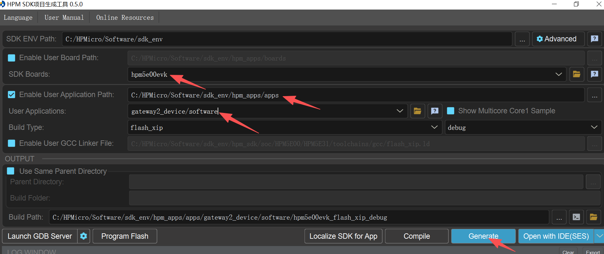
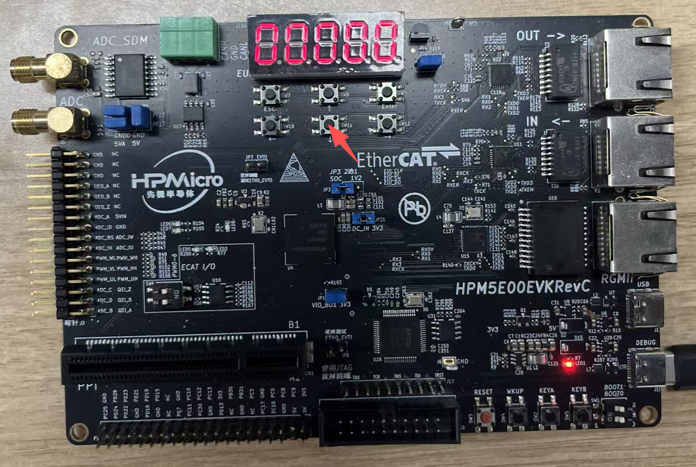

# HPM5E Series: CAN Terminal for EtherCAT-to-CAN Conversion

## Dependent on SDK 1.10.0

## Overview

This sample project leverages the CAN functionality of the HPM5E series chips, serving primarily as the CAN device for the gateway_ecat_master sample project and running on the HPM5E00EVK development board.

Features:
1. Receives CAN messages converted by the EtherCAT gateway and sent from the EtherCAT master
2. Displays the count of received CAN messages on the seven-segment display
3. Sends the CAN message count as a CAN message to the EtherCAT gateway via a key press; the EtherCAT gateway then converts this CAN message to an EtherCAT message and transmits it to the master
4. Supports the USB SH command line, and users can customize and add USB SH command functions as needed

## Project Description

### Environment

#### SDK版本

V1.10.0

#### BOARD

HPM5E00EVK

For detailed information, refer to the HPM5E00EVK board documentation in the SDK.

### Software Configuration

#### A. Project Generation
- Generate a Segger project via the HPM SDK Project Generator

### User Guide

#### Device Introduction

This sample project acts as the dedicated CAN device for the gateway_ecat_master sample project. After power-on, the seven-segment display shows 00000. When a data frame is sent from the gateway_ecat_master, converted to a CAN message via the gateway_ecat2can and transmitted to this device, the number on the seven-segment display increments by 1. Press the key indicated by the arrow in the figure at this time, and the current value on the seven-segment display will be sent as a CAN message to the EtherCAT gateway. The gateway then converts this CAN message to an EtherCAT message and sends it to the master, and the gateway_ecat_master device will display the identical value as the seven-segment display at the corresponding position.
For specific usage, refer to the gateway_ecat_master sample project.
