# HPM EtherCAT to CAN Gateway
## Depend on SDK1.10.0

## Overview
This example program utilizes the EtherCAT and CAN communication functions of the HPM6E series chips, and implements the EtherCAT-to-CAN communication function based on the ETG 5001.5000 EtherCAT-to-CAN protocol.

Features：

1. Based on the ETG 5001.5000 EtherCAT-to-CAN protocol; refer to the 5000 protocol in           ETG5001_3_V0i1i2_S_D_MDP_Gateways for detailed protocol content.
2. Supports CAN parameter configuration.
3. Supports two transmission modes: Trigger mode and Cycle mode.
4. Supports transmitting or receiving messages in full-frame or byte-wise manner.
5. Supports remote frames, standard frames, and extended frames.
6. Supports USB SH command line.
7. Supports the module slot method for dynamically modifying PDO mapping.

## Example Program Description

### Environment

#### SDK Version

V1.10.0

#### BOARD

HPM6E00EVK

### Software Configuration

#### A. SSC Code Generation
- Create a new SSC project and select Gateway2
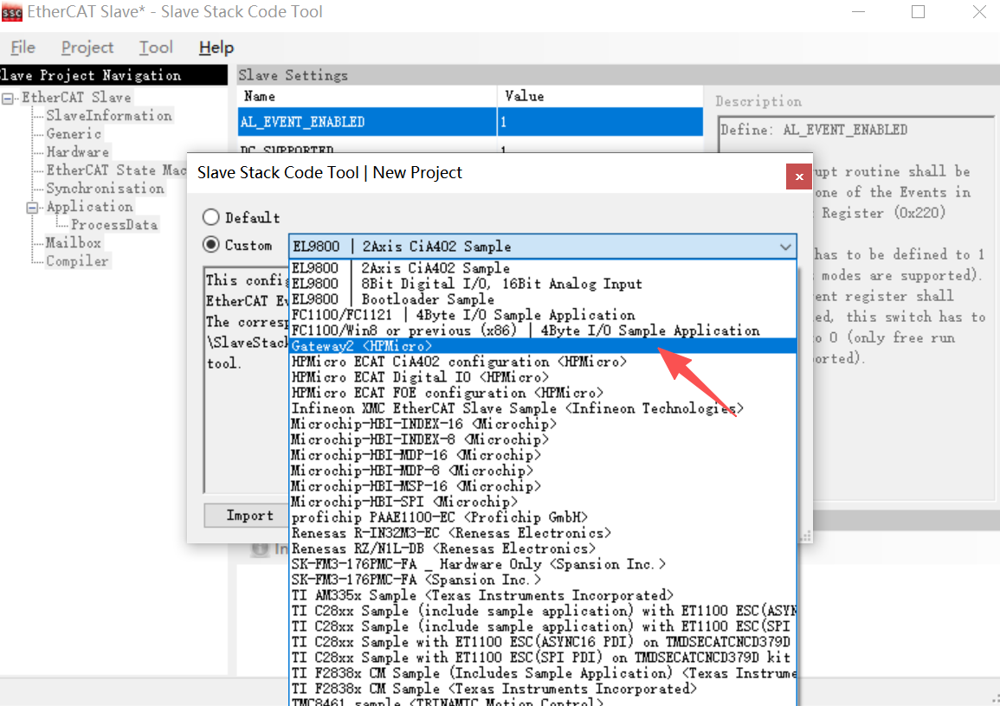
- If the Gateway2 configuration is not available, click Tool->Options->Configurations in sequence and import software/apps/ecat/gateway_apps_config.xml.
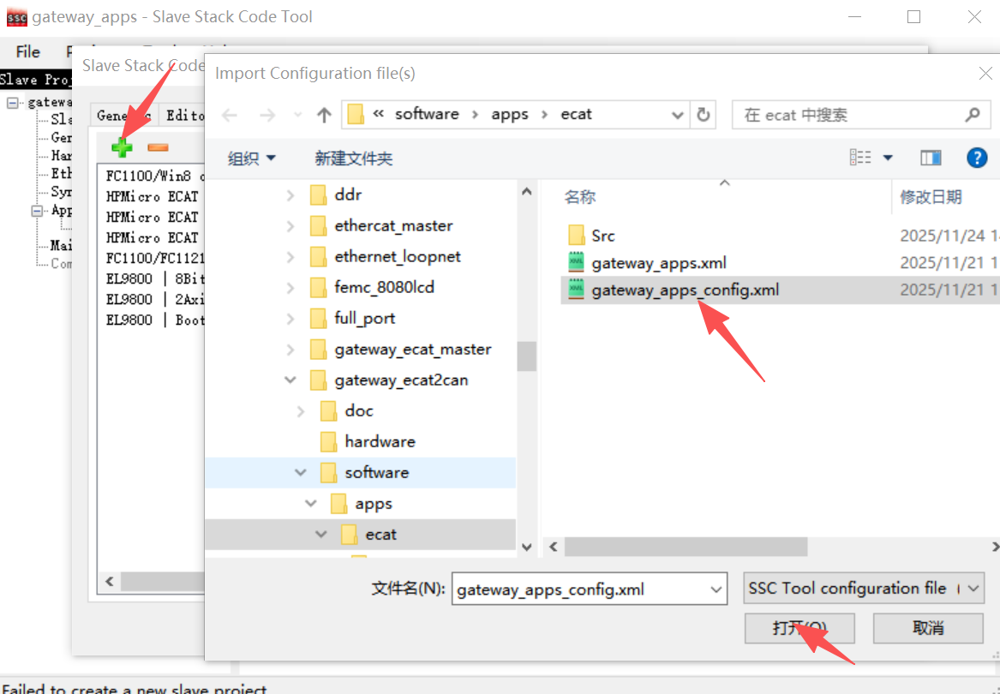
- Click Tool->Application->Import in sequence and import software/apps/ecat/gateway_apps.xlsx
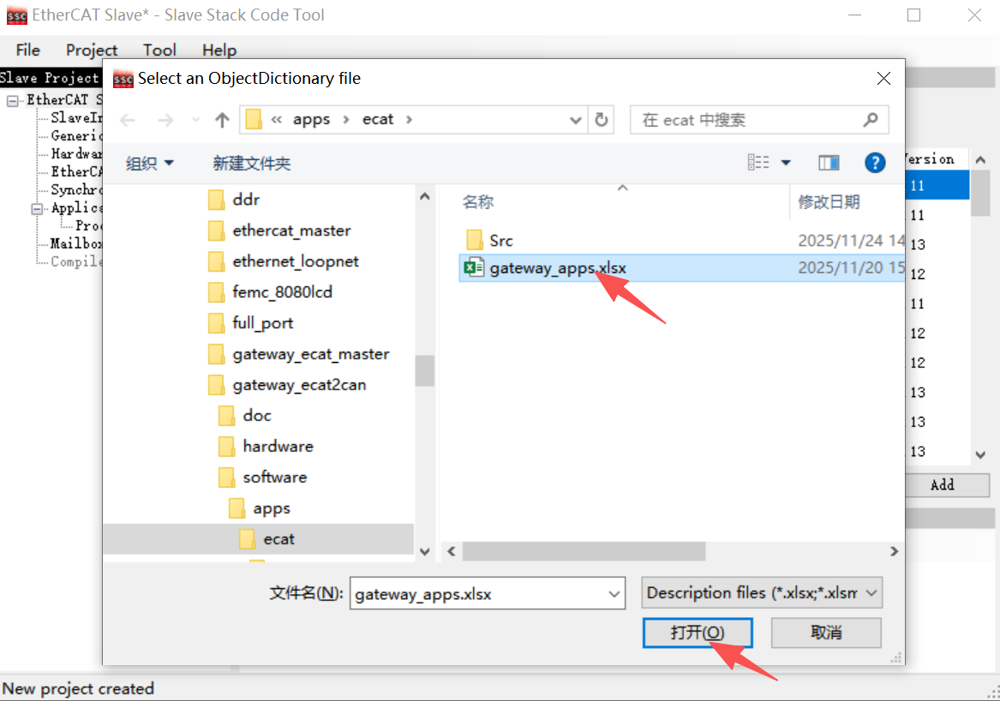
- Generate SSC code: click Project->Create new Slave Files in sequence and generate the gateway_apps.xml file.Source Folder：hpm_apps\apps\gateway_ecat2can\software\apps\ecat\Src\
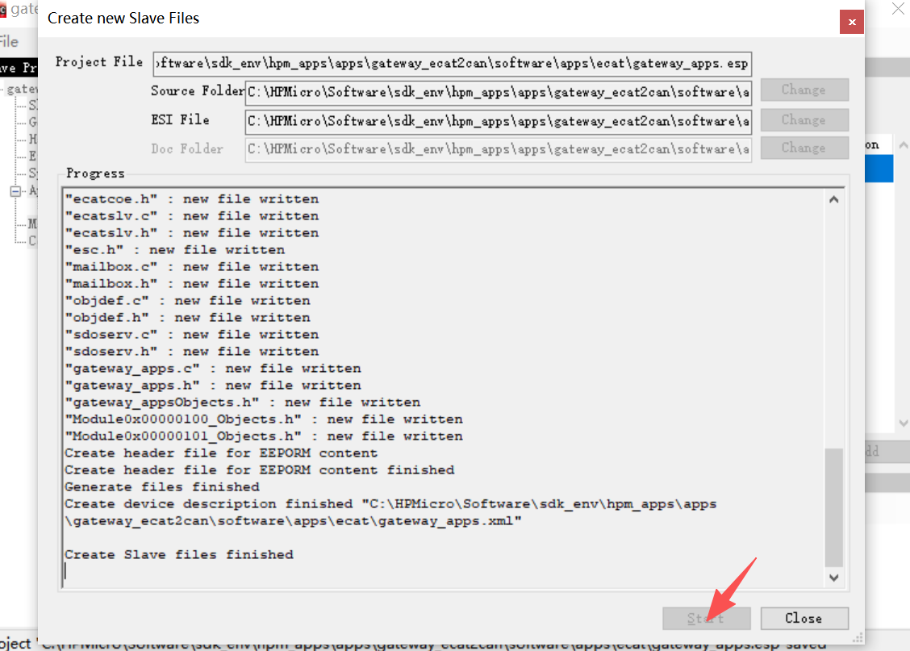

Note: You can directly use gateway_apps.esp, which has been pre-configured with relevant parameters and can generate code directly.

#### B. Project Generation
- Generate a Segger project via HPM SDK Project Generator
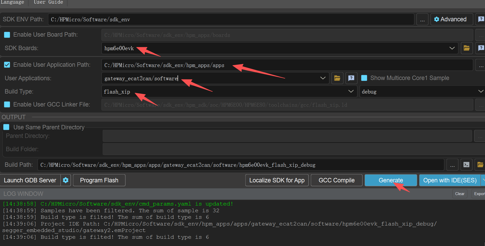

### Instructions for Using TwinCAT as the Master Station
- Set TwinCAT to OP state.
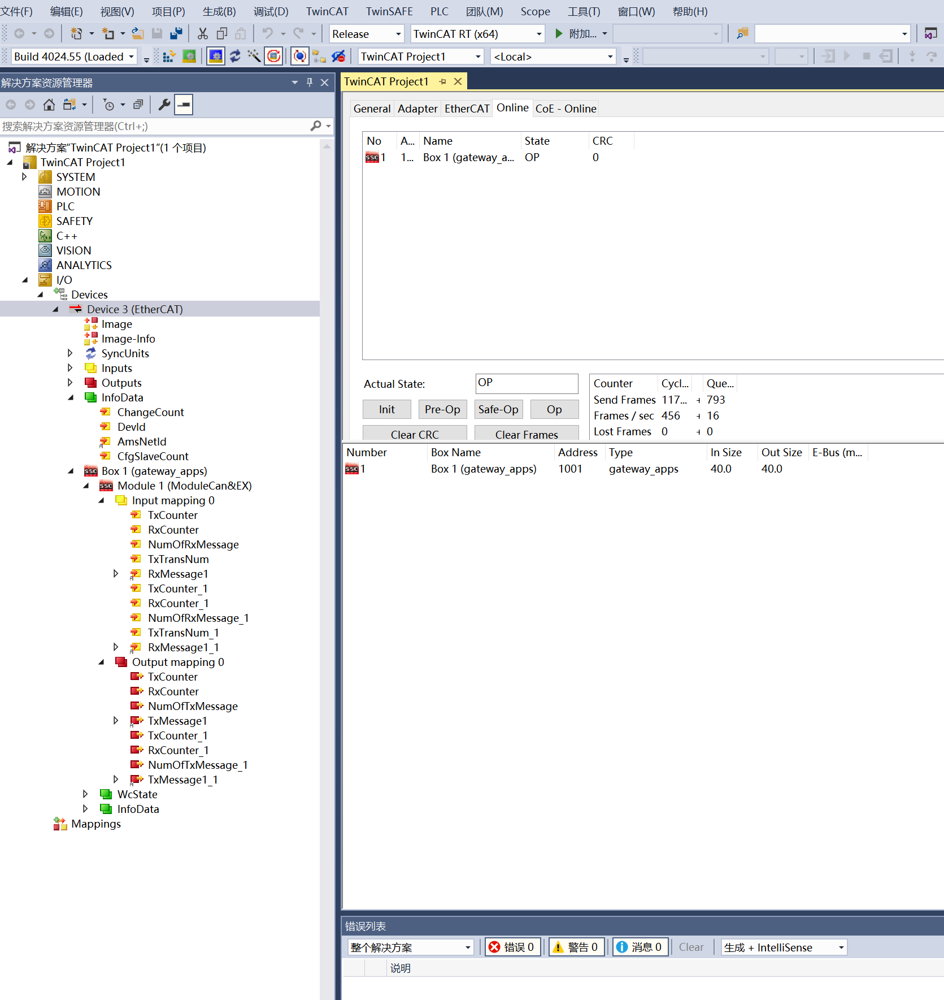
According to the ETG 5001.5000 protocol, RxMessage_1 is used to receive standard CAN frames, TxMessage_1 is used to send standard CAN frames, RxMessage1_1 is used to receive extended CAN frames, and TxMessage1_1 is used to send extended CAN frames.
- Send a standard CAN frame: write to TxMessage_1, e.g., send 1 2 3 4 5 6 7 8 standard CAN frame id=0
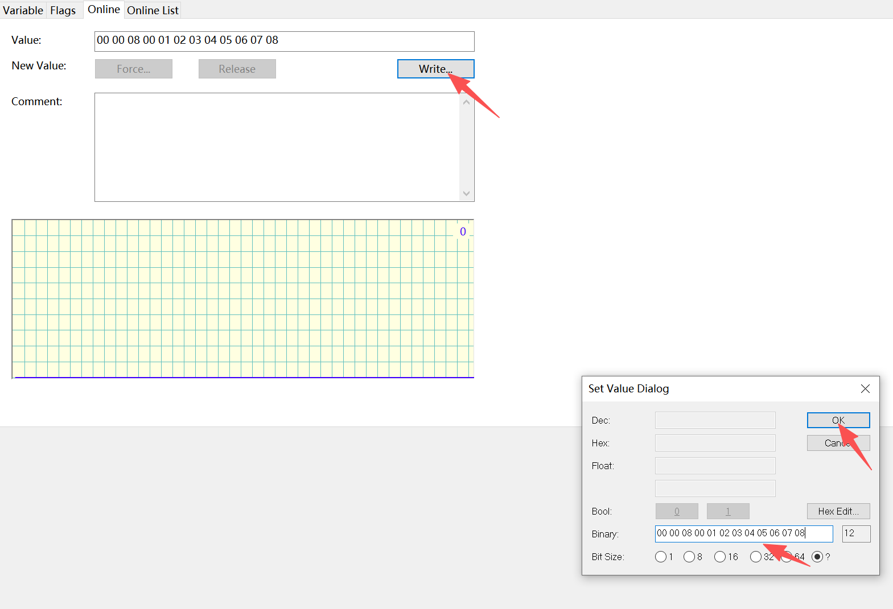
- Receive a standard CAN frame: read RxMessage_1
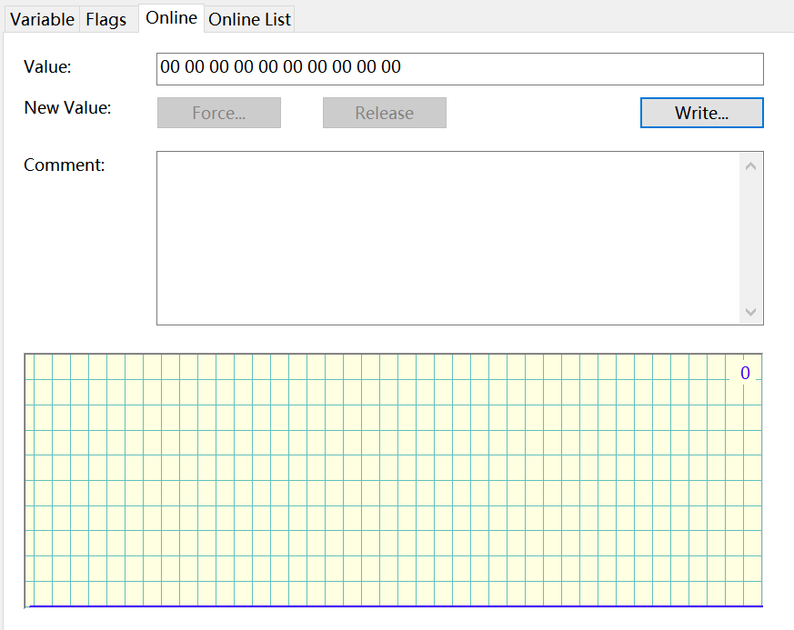
- Transmission via Trigger Mode
When writing to TxMessage_1, set bit4 of sub-index 32 at index 0x8000 to 1 to enable TriggerMode. Each time bit2 is set to 1, a frame is sent.
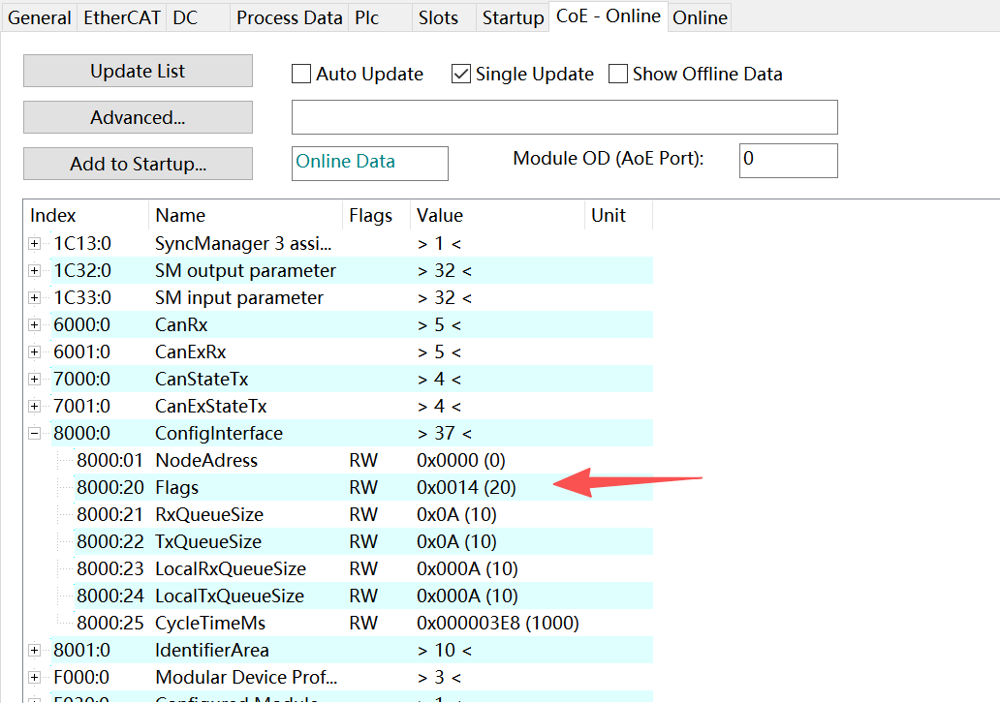
- Transmission via Cycle Mode
After writing to TxMessage_1, set bit4 of sub-index 32 at index 0x8000 to 0 to enable CycleMode. The cycle time is determined by the value of sub-index 37.
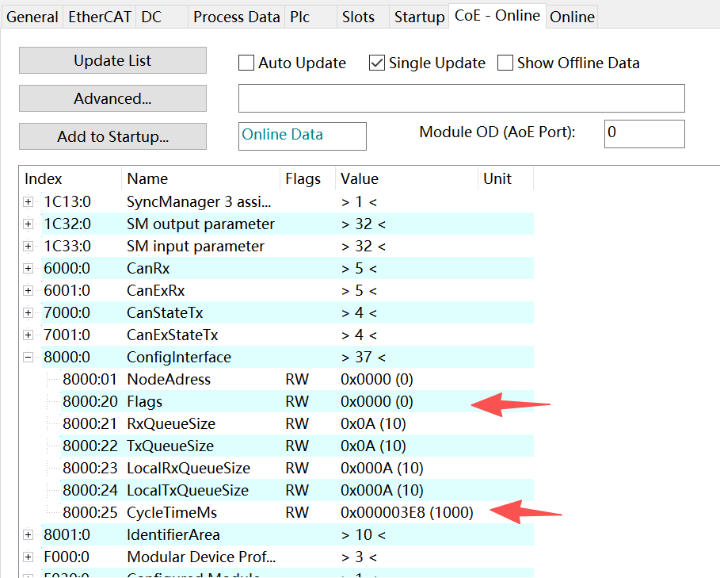
- Configure CAN Parameters
Write to sub-index 2 at index 0xF800 to set the CAN baud rate.
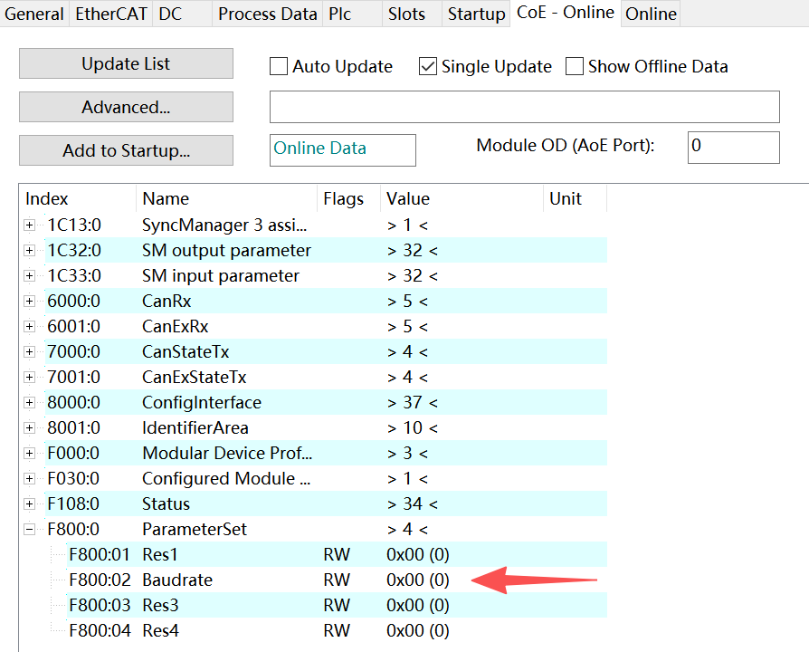
Note: Switch the slave device to PREOP state before configuring COE.
Correspondence between values and baud rates
```
            switch (ParameterSet0xF800.Baudrate)
            {
                case 0: //1M
                mq_msg.param = 1000000;
                break;
                case 1: //800k
                mq_msg.param = 800000;
                break;
                case 2: //500k
                mq_msg.param = 500000;
                break;
                case 3: //250k
                mq_msg.param = 250000;
                break;
                case 4: //125k
                mq_msg.param = 125000;
                break;
                case 5: //100k
                mq_msg.param = 100000;
                break;
                case 6: //50k
                mq_msg.param = 50000;
                break;
                case 7: //20k
                mq_msg.param = 20000;
                break;
                case 8: //10k
                mq_msg.param = 10000;
                break;
                case 255: //defined in bustiming register
                mq_msg.param = 255;
                break;
                default:
                mq_msg.param = 1000000;
                break;
            }
```
