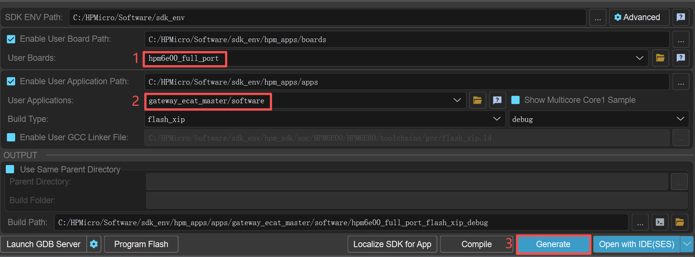
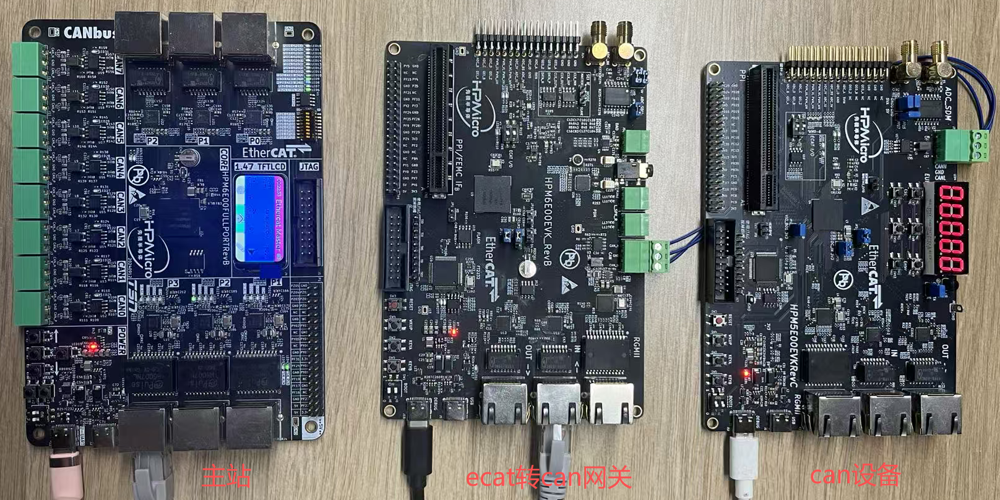
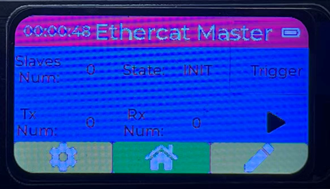
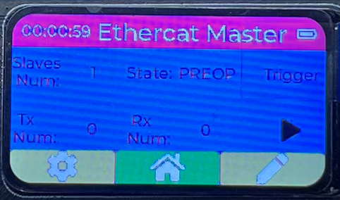
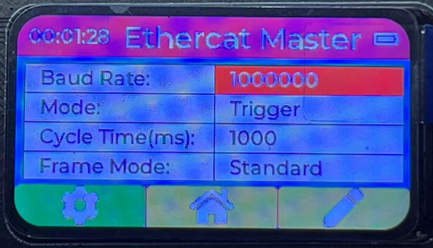
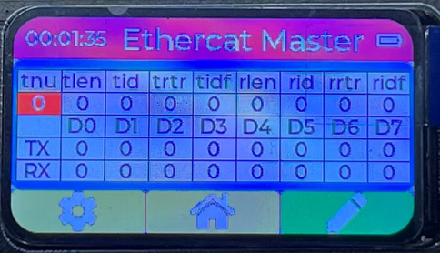
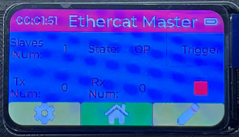
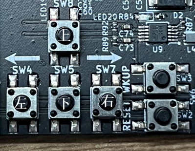

# HPM EtherCAT to CAN Master Station

## Dependent on SDK 1.10.0

## Overview

This example uses the Ethernet function of HPM6E series chips and implements the EtherCAT master station function based on CherryEcat. The HPM6E00 Full Port development board is adopted in this example. This hardware can display communication status and control the communication process.

Features:
1. Based on CherryEcat master station
2. Utilizes HPM6E00 Full Port hardware
3. Supports CAN parameter configuration
4. Supports two transmission modes: trigger mode and cyclic mode
5. Supports sending and receiving data frames in full-frame or byte-wise format, with real-time display
6. Supports remote frames and standard frames
7. Supports USB SH command line

## Example Description

### Environment

#### SDK Version

V1.10.0

#### BOARD

HPM6E00_FULL_PORT 


For detailed information, please refer to the Full Port example. This example mainly uses Port P3 as the 100 Mbps Ethernet port, and also utilizes the screen for display, buttons for control, as well as USB and UART for log output.

### Software Configuration

#### A. Project Generation
- Generate a Segger project via the HPM SDK Project Generator


### EtherCAT Master Station User Guide

#### System Introduction


The system consists of three modules: master station, EtherCAT-to-CAN gateway, and CAN device. The master station is exactly what this example demonstrates. The EtherCAT-to-CAN gateway refers to the gateway_ecat2can example. The CAN device is a simple CAN transceiver implemented with HPM5E00EVK, and can be replaced by any CAN-compliant device.
The master station is connected to the gateway via an Ethernet cable, while the gateway is connected to the CAN device via a CAN bus cable.
#### Master Station Display Introduction
- Initial Main Interface

After the master station is powered on, this interface is displayed, mainly including Slaves Num (number of slave stations), State (slave station status, default: INIT), Trigger (transmission mode, default: Trigger mode), Tx Num (number of transmitted frames), Rx Num (number of received frames), and start/stop status display.
- Slave Station Connected Main Interface

When the master station successfully connects to the slave station, the State is displayed as PREOP, and Slaves Num is displayed as 1.
- Configuration Interface

The configuration interface displays current CAN parameters, which can be configured by users. Main parameters include:
Baud Rate (default: 1 Mbps; configurable range: 10 kbps, 20 kbps, 50 kbps, 100 kbps, 125 kbps, 250 kbps, 500 kbps, 800 kbps, 1 Mbps)
Mode (default: Trigger mode; configurable options: Trigger or Cycle)
Cycle Time (cyclic transmission interval, default: 1000 ms)
Frame Mode (default: Standard frame; configurable options: Standard or Extended)
- Data Interface

The data interface displays current transmitted and received data. Transmit-related parameters can be configured via buttons, while receive-related parameters are for display only and cannot be modified.
Transmit-related parameters:
tnu: Transmit frame index
tlen: Transmit frame length (range: 1–8 bytes)
tid: Transmit data ID (range: 0–0x7FF for standard frames; 0–0x1FFFFFFF for extended frames)
trtr: Transmit data RTR bit (0: data frame; 1: remote frame)
tidf: Transmit data ID type flag (0: standard ID; 1: extended ID)
TX D0–D7: Bytes of the transmit data
Receive-related parameters:
rlen: Receive frame length (range: 1–8 bytes)
rid: Receive data ID (range: 0–0x7FF for standard frames; 0–0x1FFFFFFF for extended frames)
rrtr: Receive data RTR bit (0: data frame; 1: remote frame)
ridf: Receive data ID type flag (0: standard ID; 1: extended ID)
RX D0–D7: Bytes of the receive data
- Start Interface


#### Master Station Button Introduction

1. Main Interface Operation
- Long press the left button for 2 seconds to switch to the configuration interface. It is only possible to switch to the configuration interface when the State is PREOP.
- Long press the right button for 2 seconds to switch to the data interface.
- Short press the right button to start or stop the master station in OP state. This action is only possible after successfully connecting to the slave station.
2. Configuration Interface Operation
- Long press the left button for 2 seconds to switch to the main interface.
- Long press the right button for 2 seconds to switch to the data interface.
- Short press the left or right button to select the item to be modified. The selected item will be highlighted with red background.
- Short press the up or down button to modify the parameter.
Main parameters include: Baud Rate (default: 1 Mbps; configurable range: 10 kbps, 20 kbps, 50 kbps, 100 kbps, 125 kbps, 250 kbps, 500 kbps, 800 kbps, 1 Mbps)
             Mode (default: Trigger mode; configurable options: Trigger or Cycle)
             Cycle Time (cyclic transmission interval, default: 1000 ms)
             Frame Mode (default: Standard frame; configurable options: Standard or Extended)
3. Data Interface Operation
- Long press the left button for 2 seconds to switch to the main interface.
- Long press the right button for 2 seconds to switch to the main interface.
- Short press the left or right button to select the item to be modified. The selected item will be highlighted with red background.
- Short press the up or down button to modify the parameter.
Main parameters include: Baud Rate (default: 1 Mbps; configurable range: 10 kbps, 20 kbps, 50 kbps, 100 kbps, 125 kbps, 250 kbps, 500 kbps, 800 kbps, 1 Mbps)
             Mode (default: Trigger mode; configurable options: Trigger or Cycle)
             Cycle Time (cyclic transmission interval, default: 1000 ms)
             Frame Mode (default: Standard frame; configurable options: Standard or Extended)
4. Start Interface Operation
- Long press the left button for 2 seconds to switch to the main interface.
- Short press the right button to start or stop the master station in OP state. This action is only possible after successfully connecting to the slave station.
#### Master Station Testing
1. Trigger Mode
Each short press of the Up Button triggers the master station to send one data frame (the data content is configured via the data interface). After each transmission, Tx Num increases by 1, and the digital tube of the CAN device increments by 1 accordingly.
EtherCAT-to-CAN gateway log (indicating a transmitted frame with RTR=0, DLC=1, ID=0):
```
[D] std tx rtr dlc id:0, 1, 0
[I] Module100_ConfigInterfaceWrite0x8000 index:0x8000, subindex:0x20, dataSize:0x2, bCompleteAccess:0x0
[I] pData[0]:0x10
[I] pData[1]:0x0,
```
2. Cycle Mode
The master station sends one data frame at each cycle interval (the data content is configured via the data interface). After each transmission, Tx Num increases by 1, and the digital tube of the CAN device increments by 1 accordingly. The default cycle time is 1000 ms, so Tx Num and the digital tube value increase by 1 every 1 second.
EtherCAT-to-CAN gateway log (indicating a transmitted frame with RTR=0, DLC=1, ID=0):
```
[D] std tx rtr dlc id:0, 1, 0
```
3. CAN Device Data Upload
When the CAN device sends data to the EtherCAT-to-CAN gateway, the receive data (including ID, RTR, DLC, and data bytes) is displayed on the master station's data interface in real time.
EtherCAT-to-CAN gateway log (indicating a received frame with RTR=0, DLC=8, ID=0):
```
[D] std rx rtr dlc id:0, 8, 0
```
