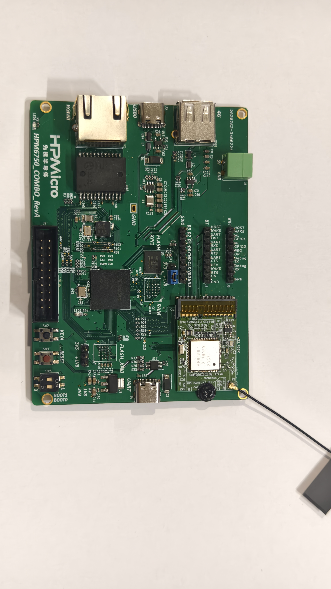
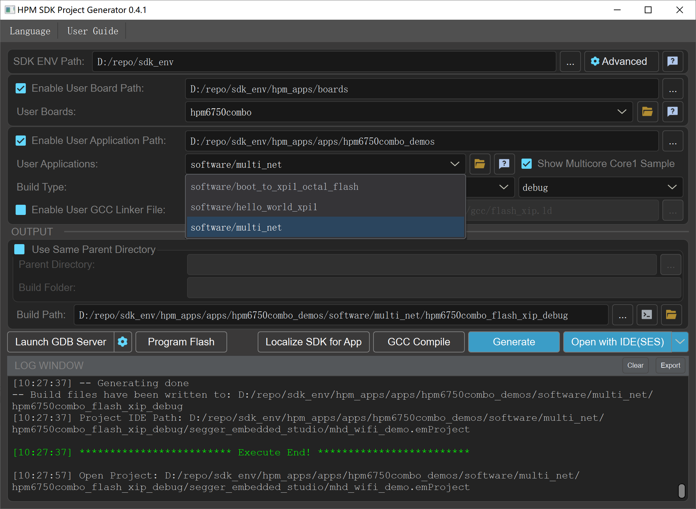
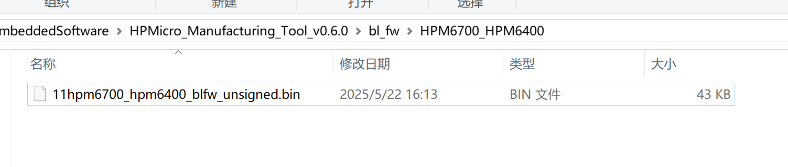
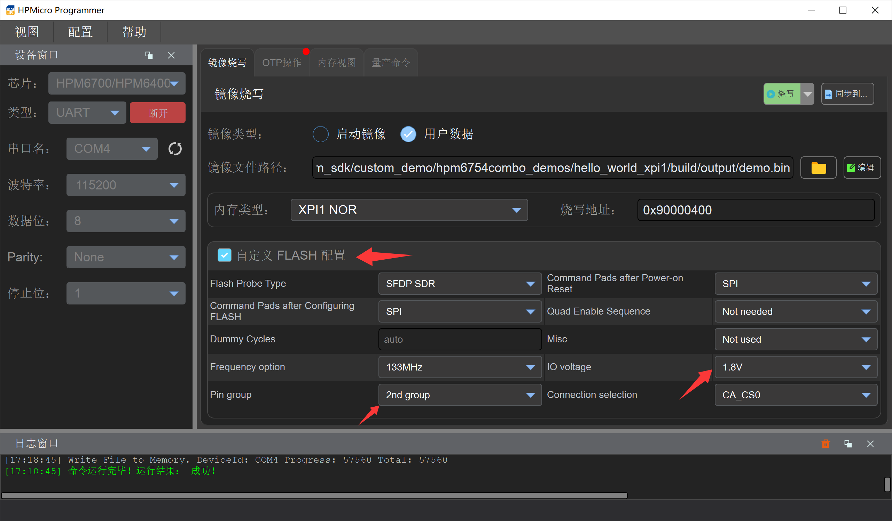
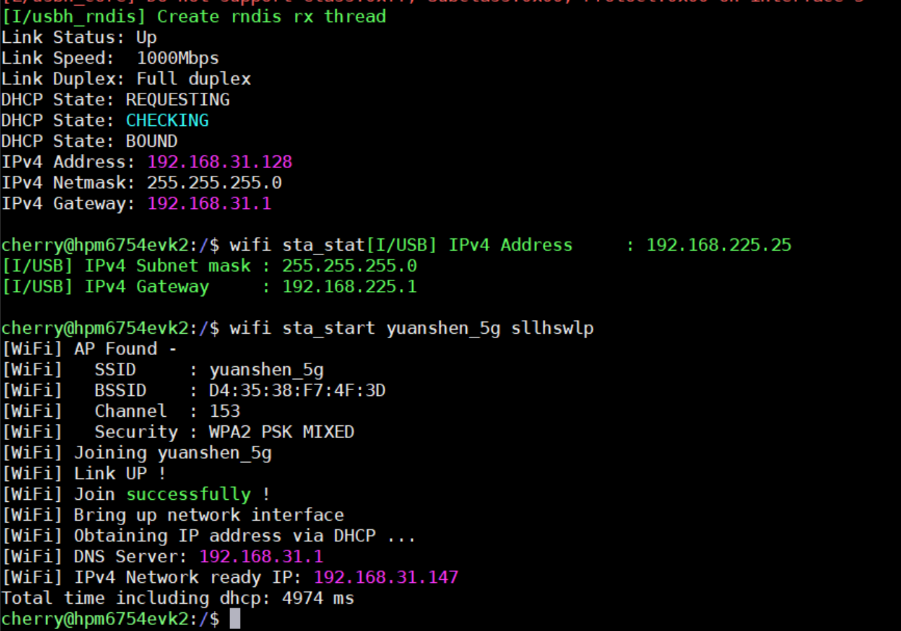
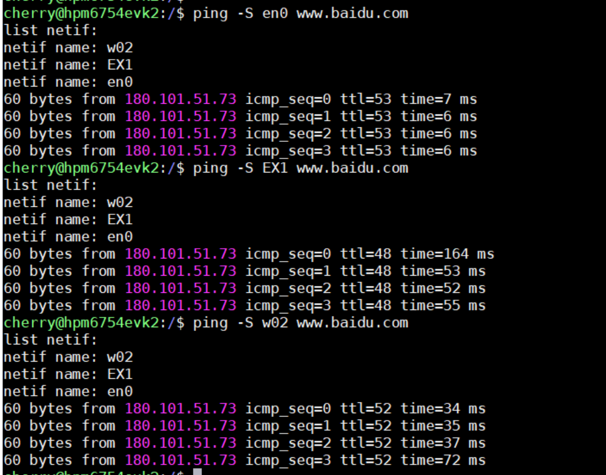
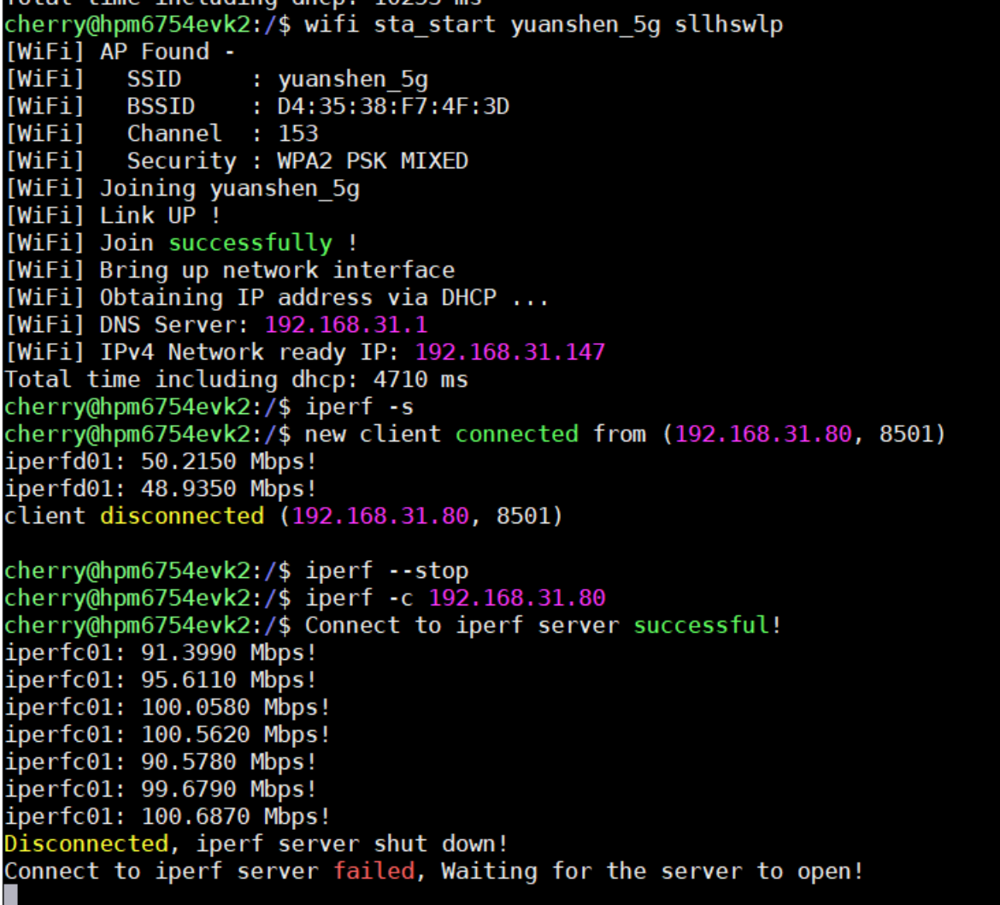
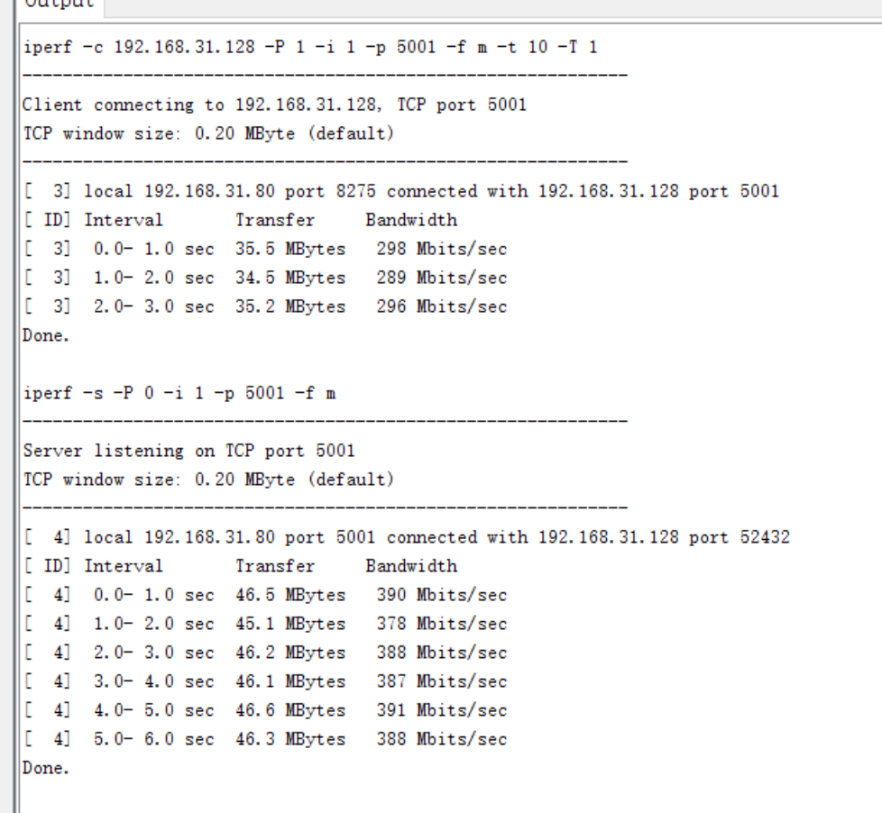

# HPM6750 Combo 开发板功能与性能测试

## 依赖SDK1.11.0

## 概述

本节主要介绍 HPM6750 Combo 开发板的 demo 使用。HPM6750 Combo 开发板基于 HPM6754 MCU 设计的开发平台，内置 4M flash，板载 USB device、USB host、SDIO WIFI、RGMII 、XPI0 8线、XPI1 8线等接口，方便用户测试先楫高性能外设的功能和性能。



**突出亮点**：

- 板载 XPI0/XPI1 8线接口，支持从该 FLASH 启动代码，提供更高的数据传输速率，提升系统性能
- 双 USB 接口，内置高速phy，支持 USB device 和 USB host 功能，满足不同应用需求
- 板载 SDIO WIFI 接口，搭配 AP6256 模块，可实现高速无线通信，最高速率可达 90Mbps
- 基于 RGMII 接口的以太网外设，可实现高速网络通信，最高速率可达 900Mbps

基于 HPM6750 Combo 开发板的 demo 主要如下：

|   工程名                     |  描述                                                                         | 代码默认运行位置 |
|:---------------------------:|:-----------------------------------------------------------------------------:|:---------------:|
| hello_world_xpi0_internal   | 基于内置 FLASH 的 helloworld demo，直接使用 hpm_sdk/examples/helloworld 即可    | 内置 Flash |
| boot_to_xpi1_octal_flash    | 使用 XPI1 运行代码所需的 bootloader                                             | 内置 Flash |
| hello_world_xpi1            | 基于外置 XPI1 的 helloworld demo                                               | 外置 XPI1 Octal Flash |
| cherryusb_device            | 基于 cherryusb 的 device demo，直接使用 hpm_sdk/examples/cherryusb/device 即可  | 内置 Flash |
| cherryusb_host              | 基于 cherryusb 的 host demo，使用 hpm_sdk/examples/cherryusb/host 并需要打 patch（见下文）| 内置 Flash |
| mhd_wifi_demo               | SDIO WIFI demo，使用 hpm_sdk/examples/lwip/mhd_wifi_demo 并需要打 patch （见下文）              | 内置 Flash |
| rgmii_lwip                  | 基于 RGMII 接口的 LWIP demo，使用 hpm_sdk/examples/lwip 并需要打 patch （见下文）          | 内置 Flash |
| multi_net                   | USB 4G + SDIO WIFI + RGMII 三合一 LWIP demo          | 内置 Flash |

**在使用上述例程时，需要在 SDK_ENV 中将 BOARD 选择为 hpm6750combo。**



## hello_world_xpi0_internal

该 demo 主要演示基于内置 FLASH 的 helloworld demo，直接使用 hpm_sdk/examples/helloworld 即可，无需额外修改。

## boot_to_xpi1_octal_flash

该 demo 主要演示 XPI1 运行代码所需的 bootloader。HPM6750 Combo 开发板板载了一个基于 XPI1 8线接口的 FLASH，用户可以将代码烧录到该 FLASH 中，并通过 bootloader 从该 FLASH 启动代码，此时内部 FLASH 仅作为 bootloader 使用。相比于传统的 4线 Flash，8线 Flash 在同样的时钟频率下可以提供更高的数据传输速率，从而提升系统性能。

boot_to_xpi1_octal_flash 可以通过调试器或者 hpm mfg tool 工具烧录，烧录方式同 sdk demo，不再赘述。

XPI1 配置流程如下：

- 开启 XPI1 时钟
- 配置 XPI1 外设，使能 8线模式，频率 133Mhz，IO voltage 设置 1.8V，Pin group 选择 2nd group

```
    config_option.header.U = 0xfcf90002;
#if 1
    config_option.option0.freq_opt = 7;
    config_option.option0.probe_type = xpi_nor_xccela_ddr;
    config_option.option0.cmd_pads_after_init = XPI_8PADS;
    config_option.option0.cmd_pads_after_por = XPI_1PAD;
#else
    config_option.option0.freq_opt = 1;
#endif
    config_option.option1.io_voltage = 1;
    config_option.option1.pin_group_sel = 1;

    hpm_stat_t status = rom_xpi_nor_auto_config(HPM_XPI1, &config_block, &config_option);
    if (status != status_success) {
        config_option.option0.cmd_pads_after_por = XPI_8PADS;
        status = rom_xpi_nor_auto_config(HPM_XPI1, &config_block, &config_option);
        if (status != status_success) {
            printf("FLASH initialization failed, fall back to ISP mode...\n");
            fallback_to_isp();
        }
    }
    HPM_IOC->PAD[IOC_PAD_PC20].PAD_CTL = IOC_PAD_PAD_CTL_DS_SET(7) | IOC_PAD_PAD_CTL_MS_SET(1);
```

- 读取固件 0x1000 开始的 boot header，解析出 boot header 中的 entry point 和 load address 等信息，并跳转到 entry point 运行代码

```
    memcpy(image_buf, (void*)0x90001000, sizeof(image_buf));
    const boot_image_hdr_t *boot_hdr = (boot_image_hdr_t *)image_buf;
    handle_boot_image(boot_hdr);
```

## hello_world_xpi1

该 demo 主要是演示基于外置 XPI1 的 helloworld demo。需要搭配 boot_to_xpi1_octal_flash demo 使用，先将 bootloader 烧录到内置 FLASH 中，再将 helloworld demo 烧录到外置 XPI1 Flash 中，最后通过 bootloader 从外置 XPI1 Flash 启动 helloworld demo。

**需要注意，当前 XPI1 Flash 烧录仅能使用 HPM MFG Tool 工具，不能使用 Jlink 等调试器进行烧录调试。**

使用 HPM MFG Tool 烧录 XPI1 Flash 具体步骤如下：

- 编译 hello_world_xpi1 生成 demo.bin
- 删除或者重命名 HPM MFG Tool 目录下 bl_fw\HPM6700_HPM6400\hpm6700_hpm6400_blfw_unsigned.bin 的文件，比如修改为 11hpm6700_hpm6400_blfw_unsigned.bin，否则无法和 bootrom进行通信



- 拉高板子上 boot0 引脚并上电，**需要注意，每次烧录都要全部断电重启，不能使用  reset 按键重启烧录，因为此时 XPI1 Flash 运行状态不受 reset 控制**
- 导入 demo.bin 文件，勾选自定义 Flash 配置，Pin group 选择 2nd Group，IO Voltage 选择 1.8V



- 点击烧写按钮即可

## cherryusb_device

该 demo 主要演示基于 cherryusb 的 device demo，默认使用 USB0，直接使用 hpm_sdk/examples/cherryusb/device 即可，无需额外修改。

## cherryusb_host

该 demo 主要演示基于 cherryusb 的 host demo，默认使用 USB1，使用 hpm_sdk/examples/cherryusb/host 时需要修改以下内容：

- examples/cherryusb/config/usb_config.h
```
#ifndef CONFIG_HPM_USBH_BASE
#define CONFIG_HPM_USBH_BASE HPM_USB1_BASE
#endif
#ifndef CONFIG_HPM_USBH_IRQn
#define CONFIG_HPM_USBH_IRQn IRQn_USB1
#endif
```

**如果使用 USB0 作为 host，则不需要修改。**

## mhd_wifi_demo

该 demo 主要演示 SDIO WIFI 的使用，使用 hpm_sdk/examples/lwip/mhd_wifi_demo 时需要修改成以下内容：

- samples/lwip/mhd_wifi_demo/CMakeLists.txt

```
if (${BOARD} STREQUAL "hpm6750combo")
    set(CUSTOM_GCC_LINKER_FILE ${CMAKE_CURRENT_SOURCE_DIR}/linker_file/HPM6700/gcc/mhd_wifi_flash_xip.ld)
    set(CUSTOM_SES_LINKER_FILE ${CMAKE_CURRENT_SOURCE_DIR}/linker_file/HPM6700/ses/mhd_wifi_flash_xip.icf)
elseif (${BOARD} STREQUAL "hpm6800evk")
    set(CUSTOM_GCC_LINKER_FILE ${CMAKE_CURRENT_SOURCE_DIR}/linker_file/HPM6800/gcc/mhd_wifi_flash_xip.ld)
    set(CUSTOM_SES_LINKER_FILE ${CMAKE_CURRENT_SOURCE_DIR}/linker_file/HPM6800/ses/mhd_wifi_flash_xip.icf)
else()
    message(FATAL_ERROR "Error: Unsupported board!")
endif ()

# Enable the external RAM initialization logic
#sdk_compile_definitions(-DINIT_EXT_RAM_FOR_DATA=1)

```

## rgmii_lwip

该 demo 主要演示基于 RGMII 接口的 LWIP demo，使用 hpm_sdk/examples/lwip 时需要增加 rtl8211f phy 驱动，参考以下步骤（如果使用 hpm_sdk >= v1.12 则不需要该步骤）:


- samples/lwip/common/single/common.c

使用 multi_net/common/common.c 替换 samples/lwip/common/single/common.c 中的同名文件，并删除 ``   enet_tx_control_config.cic = enet_cic_disable;``，因为 SDK 默认使用硬件 CRC校验。

- 复制 rtl8211f 文件夹到例程目录下，比如复制到 lwip_ping_freertos_socket 目录下
- 修改例程下的 CMakeLists.txt 文件, 比如修改 lwip_ping_freertos_socket/CMakeLists.txt， 增加 ``add_subdirectory(rtl8211f)`` 来编译 rtl8211f 驱动

```
...
project(lwip_tcpclient_freertos_socket_example)
...
add_subdirectory(rtl8211f)
generate_ide_projects()
```

## multi_net

该 demo 演示了在 HPM6750 Combo 开发板上同时使用 **USB 4G + SDIO WIFI + RGMII** 三种网络接口的能力，三路网口均通过 lwIP 协议栈管理，各自独立运行，互不干扰。

### 功能架构

| 网络接口 | 模块 / 外设 | 最高速率 | 说明 |
|:---:|:---:|:---:|:---|
| RGMII 有线以太网 | RTL8211F PHY | ~900 Mbps | 高速有线网络，适用于低延迟、大带宽场景 |
| SDIO WIFI | AP6256 模块 | ~100 Mbps | 无线网络，支持 2.4G/5G 双频 |
| USB 4G | 基于 USB CDC-ECM/RNDIS，推荐移远 EC20 免拨号版本 | 视运营商而定 | 通过 4G 模组提供广域网接入能力，适用于没有有线和 WIFI 的场景 |

### 使用说明

- 确保 BOARD 选择为 `hpm6750combo`
- 使用前需保证 SDIO WIFI 模块（AP6256）和 4G 模块已正确插入对应接口
- RGMII 接口需连接网线至有效网络
- 默认 RGMII 网卡名 **en**，SDIO WIFI 网卡名 **w0**，USB 4G 网卡名 **EX**
- WIFI 使用 ``wifi sta_start <SSID> <PASSWORD>`` 进行联网
- 待全部连接网络后，三路网卡会打印各自获取到的 IP 地址



- 使用 ping 命令指定网络接口进行测试，测试时需要使用 ``-S`` 选项指定网卡，这里需要注意，传入的网卡名称包括 **网卡名 + netif 索引**，比如 RGMII 网卡名为 en，netif 索引为 0，则传入 **en0**，其余同理。



- WIFI iperf TCP 命令测试



- RGMII iperf TCP 命令测试



### 注意事项

- **netif 索引根据 netif_add 调用自动分配，同一个网卡名经过连接和断开以后 netif 索引会发生变化，因此在测试时需要根据实际打印的网卡名称来指定正确的网卡名称。**
- RGMII 使用软件 CRC 计算，会降低 RGMII 的性能，因为 SDIO wifi 和 USB 4G 仅支持软件 CRC。
- RGMII 中 **ENET_TX_BUFF_COUNT** 和 **ENET_RX_BUFF_COUNT** 的值会影响 RGMII 的性能，增加会影响 RAM 的开销，建议根据实际需求调整这两个参数的值来提升 RGMII 的性能。
- **TCP_SND_BUF** 和 **TCP_WND** 的值会影响 TCP 的性能，增加会影响 RAM 的开销，建议根据实际需求调整这两个参数的值来提升 TCP 的性能。如果设置太大而 RGMII 中 **ENET_TX_BUFF_COUNT** 和 **ENET_RX_BUFF_COUNT** 的值较小，则可能会出现 TCP 发送数据过快导致 RGMII 发送缓冲区不足，又或者接收太快 RGMII 接收溢出从而影响性能。

