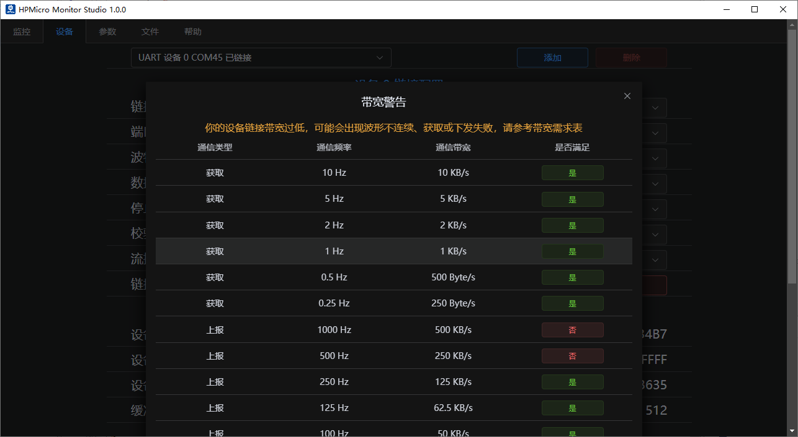
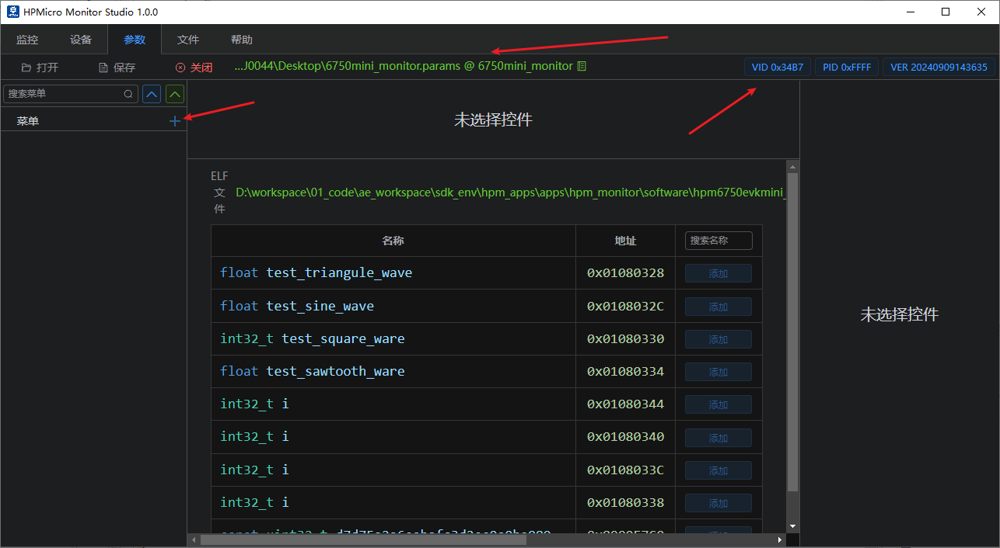
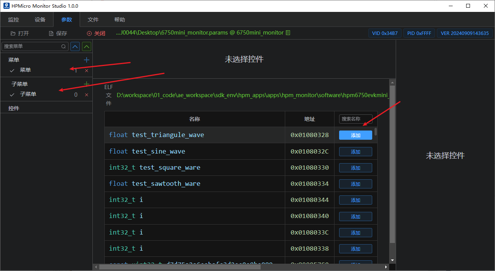
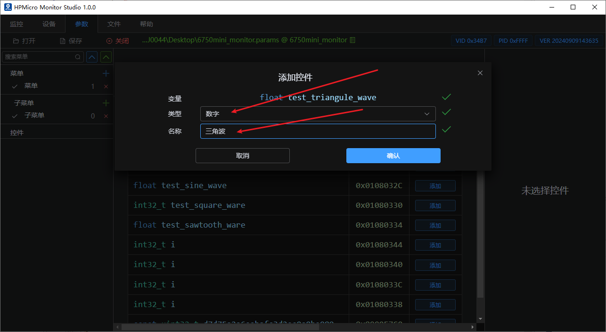
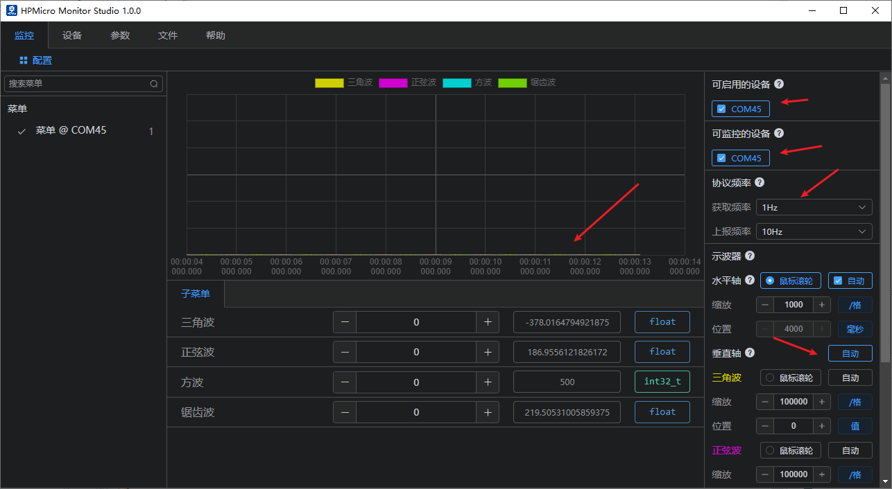
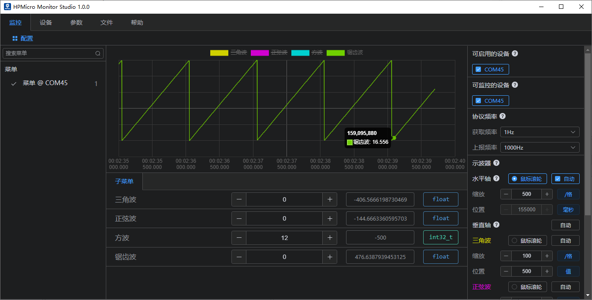

# hpm_monitor service demo

## Depend on SDK1.10.0

## introduction

hpm_monitor is an efficient, easy to use, and highly portable service, which is used to view and set global variables in the current device in real time, or to report global variables at high speed (1Khz-1ms). Often used as a monitoring data oscilloscope; Very friendly to motor, power supply and other debugging;

Note: hpm_monitor service needs to be used with HPMicroMonitorStudio tool on PC;

HPMicroMonitorStudio is available for download from the HPMicor website.

In order to facilitate the user to use, understand the hpm_monitor service, this article for the hpm_monitor service to use the demo.

This demo implements 4 waveforms: triangle waveform, sine waveform, square waveform and sawtooth waveform; the waveform can be viewed in real time by hpm_monitor service with the host computer, and the waveform data can be set up and sent down for modification at the same time.

[hpm_monitor service description](hpm_monitor_instruction_en)

## hpm_monitor service enabled

- cmakelist.txt enable hpm_monitor service
set(CONFIG_A_HPMMONITOR 1) enable hpm_monitor service
set(CONFIG_MONITOR_INTERFACE ‘uart’) Use UART channel.
set(CONFIG_MONITOR_INTERFACE ‘usb’) Use USB channel.

``` c
set(CONFIG_A_HPMMONITOR 1)
set(CONFIG_MONITOR_INTERFACE "uart")
# set(CONFIG_MONITOR_INTERFACE "usb")

if("${CONFIG_MONITOR_INTERFACE}" STREQUAL "uart")

elseif("${CONFIG_MONITOR_INTERFACE}" STREQUAL "usb")
    set(CONFIG_CHERRYUSB 1)
    set(CONFIG_USB_DEVICE 1)
    set(CONFIG_USB_DEVICE_CDC 1)
endif()

find_package(hpm-sdk REQUIRED HINTS $ENV{HPM_SDK_BASE})


if("${CONFIG_MONITOR_INTERFACE}" STREQUAL "uart")
    sdk_compile_definitions("-DCONFIG_UART_CHANNEL=1")
elseif("${CONFIG_MONITOR_INTERFACE}" STREQUAL "usb")
    sdk_compile_definitions("-DCONFIG_USB_CHANNEL=1")
endif()

```

- Service enablement is accomplished by calling initialise monitor_init() and polling monitor_handle();

```c
int main(void)
{
    uint64_t time = 0;
    board_init();
    printf("general debug demo!\r\n");
    printf("__DATE__:%s, __TIME__:%s\r\n", __DATE__, __TIME__);

    monitor_init();

    while (1)
    {
        if(clock_get_now_tick_ms() - time >= 10)
        {
            time = clock_get_now_tick_ms();
            triangule_wave_handle();
            sine_wave_handle();
            square_ware_handle();
            sawtooth_ware_handle();
        }
        monitor_handle();
    }
    return 0;
}
```

- monitor_config.h Configuration
Note:
 1. It is recommended to increase the UART communication baud rate (2M and above). Low-rate communication baud rate in the high-speed rate reporting frequency, will lead to probability of reporting failure or setup failure;
 2. For the motor, power supply high real-time requirements, to avoid other interruptions affecting the motor, power supply current loop and other operations, it is recommended to turn off the monitor communication channel interruptions, such as USB using polling mode (enable #define CONFIG_USB_POLLING_ENABLE);
```c
//PID VID Configuration
#define MONITOR_PID                  (0xFFFF)
#define MONITOR_VID                  (0x34B7) /* HPMicro VID */

//Protocol Maximum Packet Setting
#define MONITOR_PROFILE_MAXSIZE      (512)

//Print Log Level Setting
#define CONFIG_MONITOR_DBG_LEVEL MONITOR_DBG_INFO

#if defined(CONFIG_UART_CHANNEL) && CONFIG_UART_CHANNEL
//UART channel related configuration
...
#endif

#if defined(CONFIG_USB_CHANNEL) && CONFIG_USB_CHANNEL
//USB Channel Configuration
//Enable USB polling mode and disable USB interrupt to avoid affecting the high real-time peripherals of the main program.
#define CONFIG_USB_POLLING_ENABLE
...
#endif
```

## Project Path

- Project path: hpm_monitor/software


## Engineering configuration

- None

## Project Construction

- The current project supports all series of HPM MCUs and boards, users can choose the corresponding board according to their needs. 
- The project build type can be arbitrary.
- For example, windows build project.


## Project Run

Note: For detailed operation of HPMicro_Monitor_Studio, please refer to the HPMicro_Monitor_Studio help file; this article only introduces the basic functions according to the operation steps.
1. Burn and run the project 
2. Depending on the selected communication channel, the device (EVK) is connected to the PC (UART/USB) 
3. PC double-click to run the HPMicro_Monitor_Studio tool 
4. Device Connection (Device Interface)
   

   
5. elf file open (file interface)
   

6. Parameter file creation (file interface)
   

   

7. Parameter setting (parameter screen) 
   Open parameter file
   

   

   

   This lists all global variables in the current firmware;
   
8. Interface settings (parametric interface)
   Create main menus and submenus (menu names can be arbitrary). 
   For example, multi-axis motors can be set as required. 3D printing as below.
  

  

9. Parameter selection additions (parameter screen)
   Select the global variables that need to be monitored or set, and select the appropriate parameter controls as required.
   

   Note: If you need a variable to observe the waveform, you need to add the corresponding variable to the oscilloscope window.
   

10. Data monitoring (monitoring interface)
   Enable available device connection monitor communication.
   

   

   The reporting frequency and the automatic display of the oscilloscope window can be set.
   

11. Data dissemination (monitoring interface)
   Parameters inside the sub-menu can be set to modify the current parameter values as needed, such as the following square wave modification of the waveform display and modify the successful pop-up window reminder;
   

12. Waveform effects (monitoring interface)
   Enable or disable the corresponding waveform display;
   Sine Wave.
   

   TRIANGLE WAVE.
   

   SQUARE WAVE.
   

   Sawtooth Wave.
   


## API

:::{eval-rst}

About software API: `API doc <../../_static/apps/hpm_monitor/html/index.html>`_ 。
:::