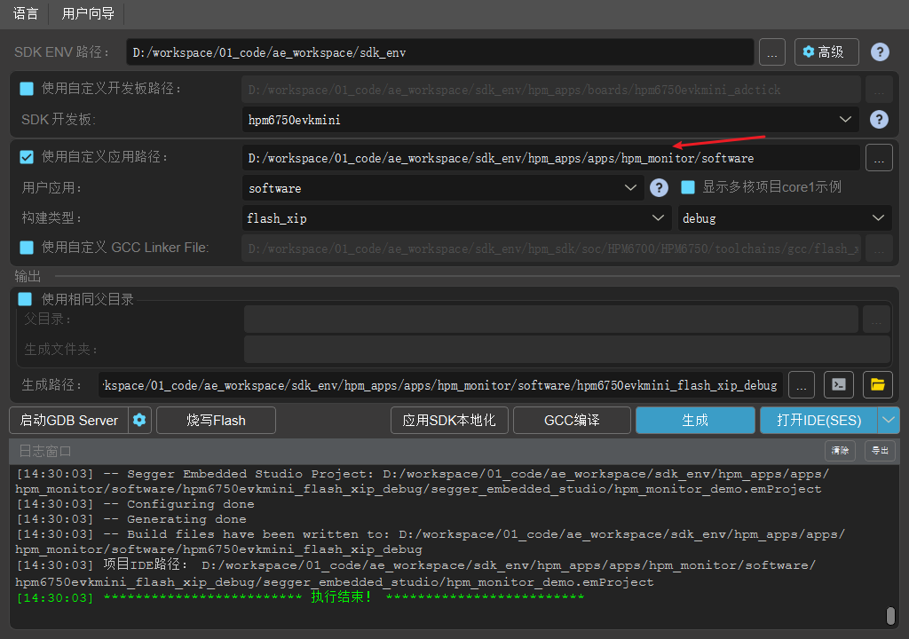
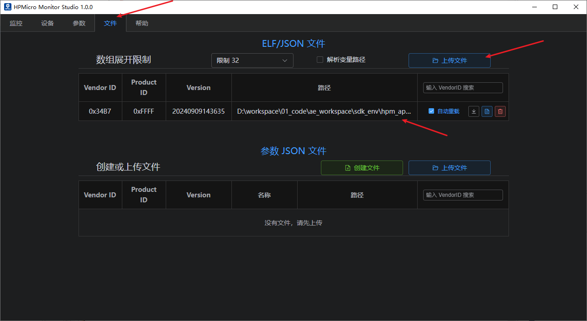
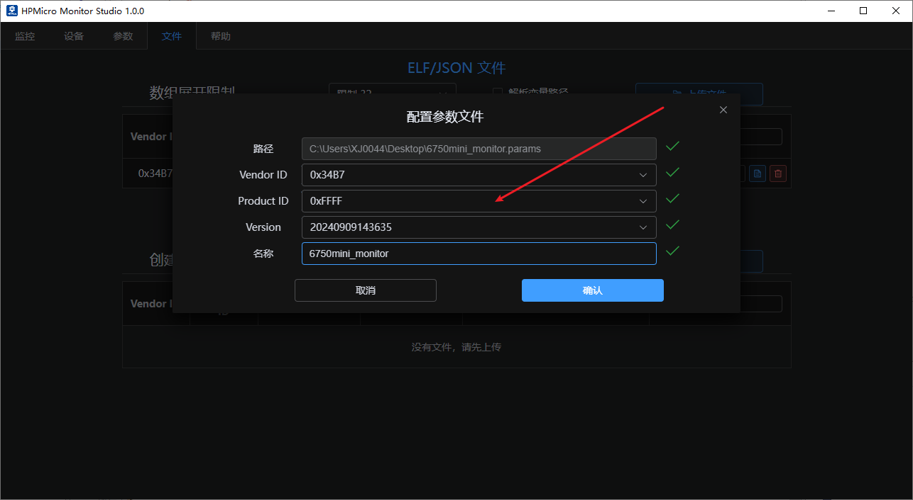
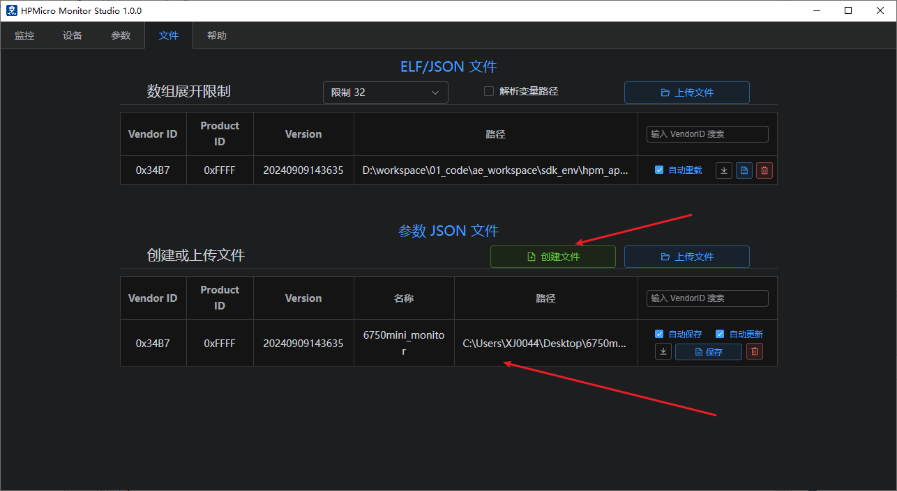
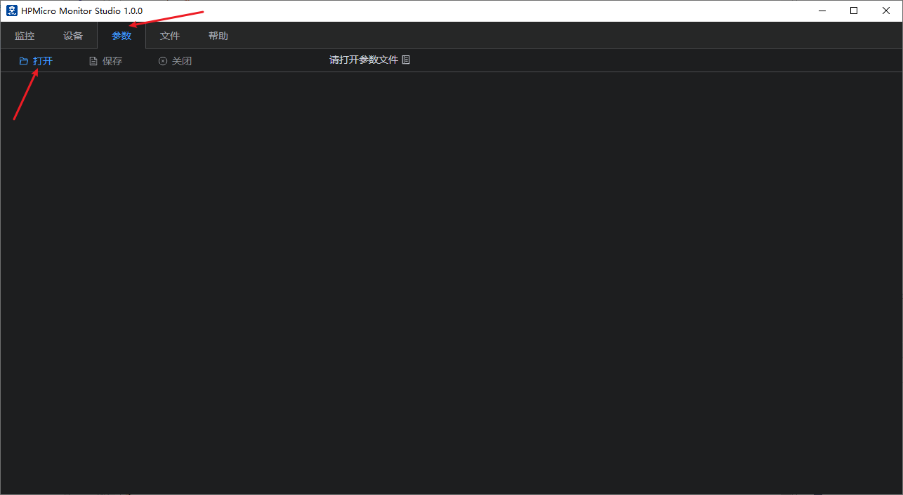
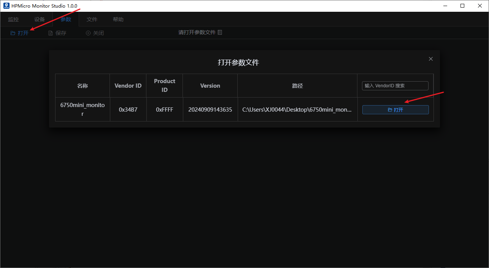
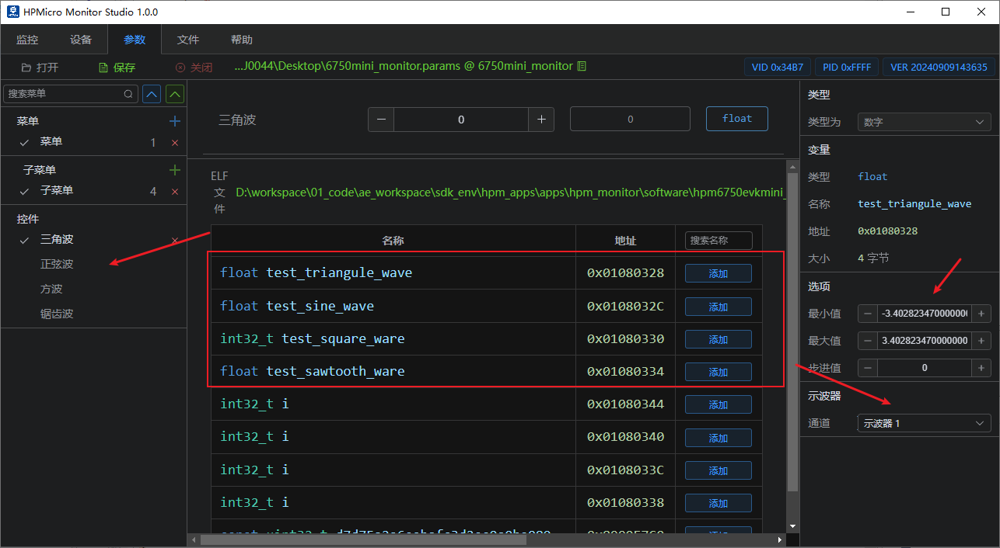
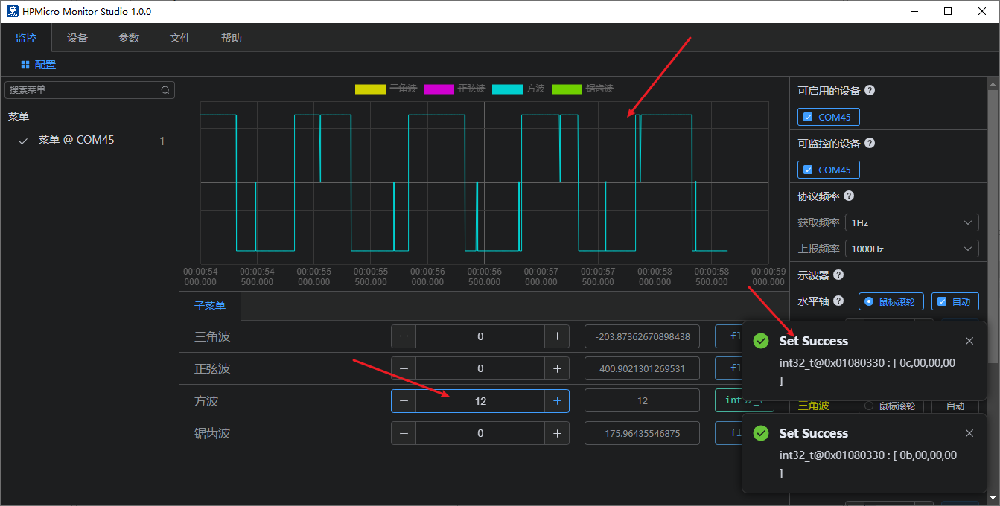
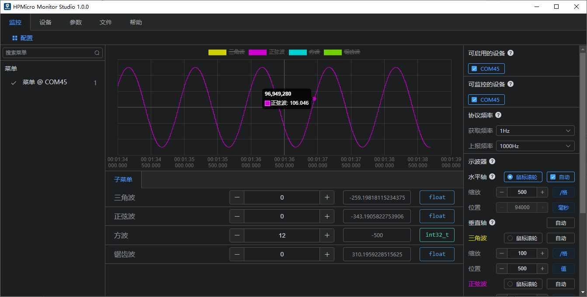

# hpm_monitor service demo

## Depend on SDK1.10.0

## Introduction

hpm_monitor is a highly efficient, user-friendly, and portable service designed for real-time viewing and configuration of global variables within devices, as well as high-speed reporting of global variables. It is commonly used as a monitoring data oscilloscope and is particularly well-suited for debugging motors, power supplies, and similar equipment.

Note: The hpm_monitor service requires the PC-based HPMicroMonitorStudio tool for operation;

HPMicroMonitorStudio can be downloaded from the official website of Xianji Semiconductor.

To facilitate user understanding and utilization of the hpm_monitor service, this document provides a demonstration application.

This example software implements four waveforms: triangle wave, sine wave, square wave, and sawtooth wave. It introduces the capability to report single and array data via user-defined channels. Users can view these waveforms in real-time through the hpm_monitor service paired with the host computer, while also configuring and modifying waveform data remotely.

[hpm_monitor Service Description](hpm_monitor_instruction_en)

## hpm_monitor Service Activation

- cmakelist.txt Enable the hpm_monitor service
set(CONFIG_A_HPMMONITOR 1) Enable the hpm_monitor service
set(CONFIG_MONITOR_INTERFACE "uart") Using the UART channel
set(CONFIG_MONITOR_INTERFACE "usb") Use the USB port
set(CONFIG_MONITOR_INTERFACE "enet") Use the ENET channel

``` c
set(CONFIG_A_HPMMONITOR 1)
# set(CONFIG_MONITOR_INTERFACE "uart")
set(CONFIG_MONITOR_INTERFACE "usb")
# set(CONFIG_MONITOR_INTERFACE "enet")

if("${CONFIG_MONITOR_INTERFACE}" STREQUAL "uart")

elseif("${CONFIG_MONITOR_INTERFACE}" STREQUAL "usb")
    set(CONFIG_CHERRYUSB 1)
    set(CONFIG_USB_DEVICE 1)
    set(CONFIG_USB_DEVICE_CDC 1)
elseif("${CONFIG_MONITOR_INTERFACE}" STREQUAL "enet")
    set(CONFIG_LWIP 1)
    set(CONFIG_ENET_PHY 1)
    set(APP_USE_ENET_PORT_COUNT 1)
    #set(APP_USE_ENET_ITF_RGMII 1)
    #set(APP_USE_ENET_ITF_RMII 1)
    #set(APP_USE_ENET_PHY_DP83867 1)
    #set(APP_USE_ENET_PHY_RTL8211 1)
    #set(APP_USE_ENET_PHY_DP83848 1)
    #set(APP_USE_ENET_PHY_RTL8201 1)
    if(NOT DEFINED APP_USE_ENET_PORT_COUNT)
        message(FATAL_ERROR "APP_USE_ENET_PORT_COUNT is undefined!")
    endif()

    if(NOT APP_USE_ENET_PORT_COUNT EQUAL 1)
        message(FATAL_ERROR "This sample supports only one Ethernet port!")
    endif()

    if (APP_USE_ENET_ITF_RGMII AND APP_USE_ENET_ITF_RMII)
        message(FATAL_ERROR "This sample doesn't support more than one Ethernet phy!")
    endif()
endif()

find_package(hpm-sdk REQUIRED HINTS $ENV{HPM_SDK_BASE})

if("${CONFIG_MONITOR_INTERFACE}" STREQUAL "uart")
    sdk_compile_definitions("-DCONFIG_UART_CHANNEL=1")
    sdk_compile_definitions("-DCONFIG_USE_CONSOLE_UART=1")
    sdk_compile_definitions("-DCONFIG_MONITOR_DBG_LEVEL=0")
elseif("${CONFIG_MONITOR_INTERFACE}" STREQUAL "usb")
    sdk_compile_definitions("-DCONFIG_USB_CHANNEL=1")
elseif("${CONFIG_MONITOR_INTERFACE}" STREQUAL "enet")
    sdk_compile_definitions("-DCONFIG_ENET_CHANNEL=1")
    sdk_inc(inc/enet)
endif()

```
- Calling monitor_init() for initialization and monitor_handle() for polling completes the service activation.
```c
int main(void)
{
    uint64_t time = 0;
    uint32_t index1, index2;
    board_init();
    board_init_led_pins();
    printf("general debug demo!\r\n");
    printf("__DATE__:%s, __TIME__:%s\r\n", __DATE__, __TIME__);

    monitor_init();
    board_timer_create(10, timer_cb);

    index1 = 0;
    index2 = 0;
    while (1)
    {
        if(tick_time_ms_read32() - time >= 10)
        {
            time = tick_time_ms_read32();
            triangule_wave_handle();
            sine_wave_handle();
            square_ware_handle();
            sawtooth_ware_handle();
            test_square_array[index1++] = test_square_ware;
            test_sine_array[index2++] = test_sine_wave;
            if(index1 >= 1024)
            {
                index1 = 0;
                monitor_channel_report_array(2, test_square_array, 1024);
            }
            if(index2 >= 1024)
            {
                index2 = 0;
                monitor_channel_report_array(3, test_sine_array, 1024);
            }
        }
        monitor_handle();
    }
    return 0;
}
```

- User-defined channel

``` c
MONITOR_DEFINE_GLOBAL_VAR(ch_signal_float_triangule, 0, float, 100, 0);
MONITOR_DEFINE_GLOBAL_VAR(ch_signal_float_sawtooth, 1, float, 100, 0);
MONITOR_DEFINE_GLOBAL_VAR(ch_array_int_square, 2, int32_t, 100, 1024);
MONITOR_DEFINE_GLOBAL_VAR(ch_array_float_sine, 3, float, 100, 1024);

void timer_cb(void)
{
    monitor_channel_add_data(0, &test_triangule_wave);
    monitor_channel_add_data(1, &test_sawtooth_ware);
    board_led_toggle();
}

while (1)
{
   if(tick_time_ms_read32() - time >= 10)
   {
      time = tick_time_ms_read32();
      triangule_wave_handle();
      sine_wave_handle();
      square_ware_handle();
      sawtooth_ware_handle();
      test_square_array[index1++] = test_square_ware;
      test_sine_array[index2++] = test_sine_wave;
      if(index1 >= 1024)
      {
            index1 = 0;
            monitor_channel_report_array(2, test_square_array, 1024);
      }
      if(index2 >= 1024)
      {
            index2 = 0;
            monitor_channel_report_array(3, test_sine_array, 1024);
      }
   }
   monitor_handle();
}
```

- monitor_config.h Configuration
Note:
 1. It is recommended to increase the UART communication baud rate (2M or higher). Low baud rates may cause probabilistic reporting failures or configuration failures when operating at high reporting frequencies.
 2. To meet the high real-time requirements of motors and power supplies, and to prevent other interrupts from affecting motor or power supply current loop operations, it is recommended to disable interrupts for the monitor communication channel. For USB, use polling mode (enable #define CONFIG_USB_POLLING_ENABLE).

```c
//PID VID config
#define MONITOR_PID                  (0xFFFF)
#define MONITOR_VID                  (0x34B7) /* HPMicro VID */

//Maximum Protocol Packet Size Setting
#define MONITOR_PROFILE_MAXSIZE      (4096)

//monitor Memory pool size
#define MONITOR_MEM_SIZE             (40*1024)

//Printing Log Level Settings
#define CONFIG_MONITOR_DBG_LEVEL MONITOR_DBG_INFO

#if defined(CONFIG_UART_CHANNEL) && CONFIG_UART_CHANNEL
//UART Channel-related configuration
...
#endif

#if defined(CONFIG_USB_CHANNEL) && CONFIG_USB_CHANNEL
//USB Port Related Settings
//Enable USB polling mode and disable USB interrupts to prevent interference with the high-priority peripherals of the main program.
#define CONFIG_USB_POLLING_ENABLE
...
#endif

#if defined(CONFIG_ENET_CHANNEL) && CONFIG_ENET_CHANNEL
//ENET Channel-Related Configuration
...
#endif


```

## Project Path

- Project Path:hpm_monitor/software

## Engineering Configuration

- None

## Engineering Construction

- The current project supports the full range of HPM MCUs and boards; users can select the corresponding board based on their requirements.
- Any build type is acceptable for the project.
- As shown below for the Windows build project.



## Project Operation

Note: For detailed operational documentation of HP Micro Monitor Studio, please refer to the HP Micro Monitor Studio Help documentation. This article only introduces basic functions according to the operational steps.
1. Burn and run the project
2. Connect the device (EVK) to the computer via the selected communication channel (UART/USB)
3. Double-click to run the HPMicro_Monitor_Studio tool on the PC
4. Device connection (Device interface)
   

   
5. Open elf file (File Interface)
   

6. Parameter File Creation (File Interface)
   

   

7. Parameter Settings (Parameter Interface)
   Open the parameter file
   

   

   

   By default, all non-static global variables are listed; note: global variables related to monitor services are automatically filtered out.
   Display Channels: Click to show user-defined channel parameters;
   Static Variables: Click to display the parameter tree; select the files to enable their display.   

   
8. Interface Settings (Parameter Interface)
   Create main menus and submenus (menu names can be freely designated).
   For example: Multi-axis motors can be configured as needed. As shown below for 3D printing.
  

  

9. Parameter Selection and Addition (Parameter Interface)
   Select the global variables to monitor or configure, and choose the appropriate parameter controls based on your requirements.
   

   Note: To observe variable waveforms, add the corresponding variables to the oscilloscope window. Up to four oscilloscope windows can be displayed simultaneously.
   

10. Data Monitoring (Monitor Interface)
   Enable available devices to connect for monitor communication;
   
   - Supports Notify sampling mode
   - Supports Stream sampling mode
   - Supports Buffer sampling mode
   - Supports automatic downsampling

   
   - Supports multi-oscilloscope display
   - Supports channel display and deactivation
   - Supports automatic X-axis or Y-axis windowing
   Note: When sampling begins, since the maximum and minimum values of each waveform are unknown, you must manually click "Auto" after sampling for a period. This will automatically stretch all channel waveforms to fill the entire oscilloscope window.


   Configurable reporting frequency and automatic display of oscilloscope windows;
   

11. Data Download (Monitoring Interface)
   Parameters within the submenu can be configured to download and modify current parameter values as needed. This includes displaying modified waveforms below and displaying a pop-up notification upon successful modification.
   

12. Waveform Effect (Monitoring Interface)
   Enable or disable the corresponding waveform display;
   Sine Wave:
   

   Triangular wave:
   

   Square Wave:
   

   Sawtooth wave:
   


13. User-defined channel reporting
   Used for custom channel reporting:
   

14. Notify mode
   

15. Stream mode
   

16. Buffer mode
   


## API

:::{eval-rst}

About software API: `API doc <../../_static/apps/hpm_monitor/html/index.html>`_ 。
:::