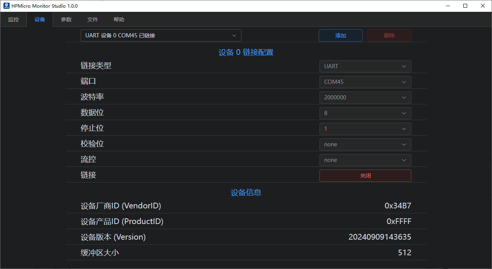
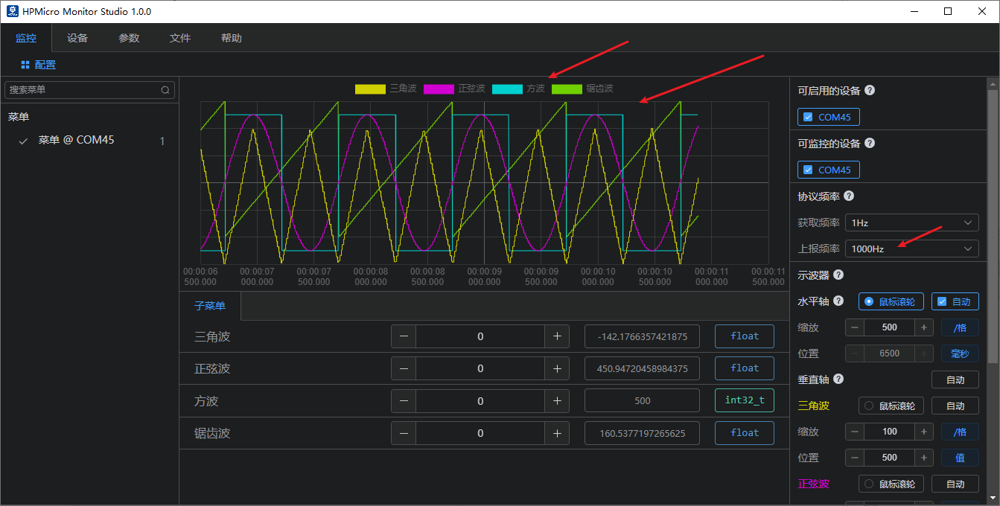

# hpm_monitor服务使用例程

## 依赖SDK1.10.0

## 介绍

hpm_monitor 是一个高效的、易用的、可移植性高的服务，用于实时查看和设置设备中的全局变量，以及高速上报全局变量。常被用作监控数据示波器，对电机、电源等调试非常友好。

注意：hpm_monitor服务 需搭配PC上位机HPMicroMonitorStudio工具使用；

HPMicroMonitorStudio从先楫半导体官网获取下载。

为了方便用户使用、了解hpm_monitor服务，本文为hpm_monitor服务使用的demo。

本例程软件实现了4中波形：三角波、正弦波、方波、锯齿波；新增了通过用户自定义通道上报单个和数组数据；可通过hpm_monitor服务搭配上位机实时查看此波形，同时也可以设置下发修改波形数据。

[hpm_monitor服务说明](hpm_monitor_instruction_zh)

## hpm_monitor服务启用

- cmakelist.txt使能hpm_monitor服务
set(CONFIG_A_HPMMONITOR 1) 使能hpm_monitor服务
set(CONFIG_MONITOR_INTERFACE "uart") 使用UART通道
set(CONFIG_MONITOR_INTERFACE "usb") 使用USB通道
set(CONFIG_MONITOR_INTERFACE "enet") 使用ENET通道

``` c
set(CONFIG_A_HPMMONITOR 1)
# set(CONFIG_MONITOR_INTERFACE "uart")
set(CONFIG_MONITOR_INTERFACE "usb")
# set(CONFIG_MONITOR_INTERFACE "enet")

if("${CONFIG_MONITOR_INTERFACE}" STREQUAL "uart")

elseif("${CONFIG_MONITOR_INTERFACE}" STREQUAL "usb")
    set(CONFIG_CHERRYUSB 1)
    set(CONFIG_USB_DEVICE 1)
    set(CONFIG_USB_DEVICE_CDC 1)
elseif("${CONFIG_MONITOR_INTERFACE}" STREQUAL "enet")
    set(CONFIG_LWIP 1)
    set(CONFIG_ENET_PHY 1)
    set(APP_USE_ENET_PORT_COUNT 1)
    #set(APP_USE_ENET_ITF_RGMII 1)
    #set(APP_USE_ENET_ITF_RMII 1)
    #set(APP_USE_ENET_PHY_DP83867 1)
    #set(APP_USE_ENET_PHY_RTL8211 1)
    #set(APP_USE_ENET_PHY_DP83848 1)
    #set(APP_USE_ENET_PHY_RTL8201 1)
    if(NOT DEFINED APP_USE_ENET_PORT_COUNT)
        message(FATAL_ERROR "APP_USE_ENET_PORT_COUNT is undefined!")
    endif()

    if(NOT APP_USE_ENET_PORT_COUNT EQUAL 1)
        message(FATAL_ERROR "This sample supports only one Ethernet port!")
    endif()

    if (APP_USE_ENET_ITF_RGMII AND APP_USE_ENET_ITF_RMII)
        message(FATAL_ERROR "This sample doesn't support more than one Ethernet phy!")
    endif()
endif()

find_package(hpm-sdk REQUIRED HINTS $ENV{HPM_SDK_BASE})

if("${CONFIG_MONITOR_INTERFACE}" STREQUAL "uart")
    sdk_compile_definitions("-DCONFIG_UART_CHANNEL=1")
    sdk_compile_definitions("-DCONFIG_USE_CONSOLE_UART=1")
    sdk_compile_definitions("-DCONFIG_MONITOR_DBG_LEVEL=0")
elseif("${CONFIG_MONITOR_INTERFACE}" STREQUAL "usb")
    sdk_compile_definitions("-DCONFIG_USB_CHANNEL=1")
elseif("${CONFIG_MONITOR_INTERFACE}" STREQUAL "enet")
    sdk_compile_definitions("-DCONFIG_ENET_CHANNEL=1")
    sdk_inc(inc/enet)
endif()

```
- 调用初始化monitor_init()和轮询monitor_handle()，即可完成服务启用;
```c
int main(void)
{
    uint64_t time = 0;
    uint32_t index1, index2;
    board_init();
    board_init_led_pins();
    printf("general debug demo!\r\n");
    printf("__DATE__:%s, __TIME__:%s\r\n", __DATE__, __TIME__);

    monitor_init();
    board_timer_create(10, timer_cb);

    index1 = 0;
    index2 = 0;
    while (1)
    {
        if(tick_time_ms_read32() - time >= 10)
        {
            time = tick_time_ms_read32();
            triangule_wave_handle();
            sine_wave_handle();
            square_ware_handle();
            sawtooth_ware_handle();
            test_square_array[index1++] = test_square_ware;
            test_sine_array[index2++] = test_sine_wave;
            if(index1 >= 1024)
            {
                index1 = 0;
                monitor_channel_report_array(2, test_square_array, 1024);
            }
            if(index2 >= 1024)
            {
                index2 = 0;
                monitor_channel_report_array(3, test_sine_array, 1024);
            }
        }
        monitor_handle();
    }
    return 0;
}
```

- 用户自定义通道

``` c
MONITOR_DEFINE_GLOBAL_VAR(ch_signal_float_triangule, 0, float, 100, 0);
MONITOR_DEFINE_GLOBAL_VAR(ch_signal_float_sawtooth, 1, float, 100, 0);
MONITOR_DEFINE_GLOBAL_VAR(ch_array_int_square, 2, int32_t, 100, 1024);
MONITOR_DEFINE_GLOBAL_VAR(ch_array_float_sine, 3, float, 100, 1024);

void timer_cb(void)
{
    monitor_channel_add_data(0, &test_triangule_wave);
    monitor_channel_add_data(1, &test_sawtooth_ware);
    board_led_toggle();
}

while (1)
{
   if(tick_time_ms_read32() - time >= 10)
   {
      time = tick_time_ms_read32();
      triangule_wave_handle();
      sine_wave_handle();
      square_ware_handle();
      sawtooth_ware_handle();
      test_square_array[index1++] = test_square_ware;
      test_sine_array[index2++] = test_sine_wave;
      if(index1 >= 1024)
      {
            index1 = 0;
            monitor_channel_report_array(2, test_square_array, 1024);
      }
      if(index2 >= 1024)
      {
            index2 = 0;
            monitor_channel_report_array(3, test_sine_array, 1024);
      }
   }
   monitor_handle();
}
```

- monitor_config.h 配置
注意：
 1.建议增大UART通信波特率(2M及以上)。低速率通信波特率在高速率上报频率下，会导致概率上报失败或设置失败；
 2.针对电机、电源高实时性要求，避免其它中断影响电机、电源电流环等运行，建议关闭monitor通信通道中断，如USB使用轮询方式(使能#define CONFIG_USB_POLLING_ENABLE)；
```c
//PID VID配置
#define MONITOR_PID                  (0xFFFF)
#define MONITOR_VID                  (0x34B7) /* HPMicro VID */

//协议最大数据包设置
#define MONITOR_PROFILE_MAXSIZE      (4096)

//monitor内存池大小
#define MONITOR_MEM_SIZE             (40*1024)

//打印日志等级设置
#define CONFIG_MONITOR_DBG_LEVEL MONITOR_DBG_INFO

#if defined(CONFIG_UART_CHANNEL) && CONFIG_UART_CHANNEL
//UART通道相关配置
...
#endif

#if defined(CONFIG_USB_CHANNEL) && CONFIG_USB_CHANNEL
//USB通道 相关配置
//使能USB 轮询模式，关闭USB中断，避免影响主程序高实时性外设
#define CONFIG_USB_POLLING_ENABLE
...
#endif

#if defined(CONFIG_ENET_CHANNEL) && CONFIG_ENET_CHANNEL
//ENET通道相关配置
...
#endif


```

## 工程路径

- 工程路径：hpm_monitor/software

## 工程配置

- 无

## 工程构建

- 当前工程支持HPM 全系列MCU及board，用户根据需求选择对应的board即可。
- 工程构建类型任意都可以。
- 如下windows构建工程。


## 工程运行

注:HPMicro_Monitor_Studio详细操作文档请查看HPMicro_Monitor_Studio帮助文档；本文只按照运行步骤介绍基础功能;
1. 烧录运行工程
2. 根据选择的通信通道，设备(EVK)连接电脑(UART/USB)
3. PC双击运行HPMicro_Monitor_Studio工具
4. 设备连接 (设备界面)
   

   
5. elf文件打开 (文件界面)
   

6. 参数文件创建 (文件界面)
   

   

7. 参数设置(参数界面)
   打开参数文件
   

   

   

   默认会列出所有的非静态的全局变量；注意：会自动过滤掉monitor服务相关的全局变量。
   显示通道：点击后会显示用户自定义的通道参数；
   静态变量：点击后展示参数树，选择要使能显示的文件即可。   

   
8. 界面设置(参数界面)
  创建主菜单和子菜单(菜单名称可任意命名)。
  例如：多轴电机可根据需求设置。如下3D打印。
  

  

9. 参数选择添加(参数界面)
   选择需要监控或设置的全局变量，并根据需求选择合适的参数控件。
   

   注：如需变量观测波形，需将对应变量添加到示波器窗口。最多支持4示波器窗口显示。
   

10. 数据监控(监控界面)
   使能可用的设备连接monitor通信;
   
   - 支持Notify采样模式
   - 支持Stream采样模式
   - 支持Buffer采样模式
   - 支持自动降采样

   
   - 支持多示波器显示
   - 支持通道显示和关闭
   - 支持自动X轴或Y轴窗口显示
   注意：刚开始采样时，由于不晓得各个波形的最大最小值，需要在采样一段时候后，手动点击自动后，即可将所有通道的波形自动铺满整个示波器窗口显示。


   可设置上报频率和示波器窗口自动显示;
   

11. 数据下发(监控界面)
   子菜单里面的参数根据需要可设置下发修改当前参数值，如下方波修改后的波形显示及修改成功弹窗提醒；
   

12. 波形效果(监控界面)
   使能或禁用对应的波形显示；
   正弦波:
   

   三角波:
   

   方波:
   

   锯齿波:
   


13. 用户自定义通道上报
   用于自定义通道上报：
   

14. Notify模式采样
   

15. Stream模式采样
   

16. Buffer模式采样
   


## API

:::{eval-rst}

关于软件API 请查看 `方案API 文档 <../../_static/apps/hpm_monitor/html/index.html>`_ 。
:::