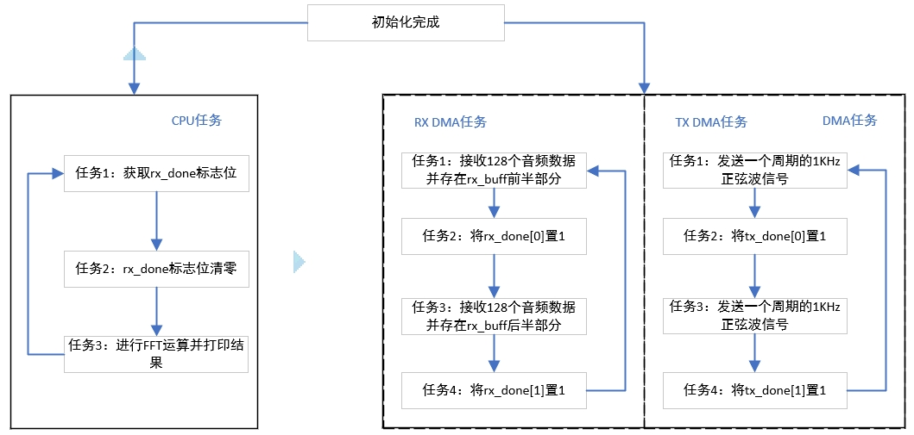
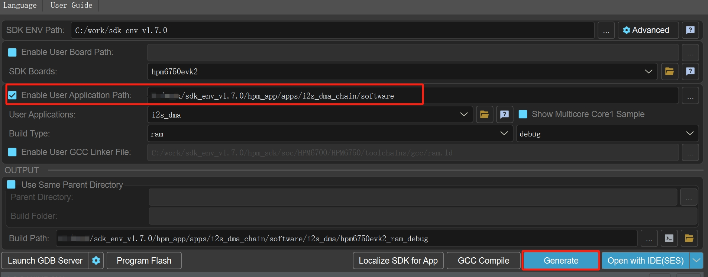
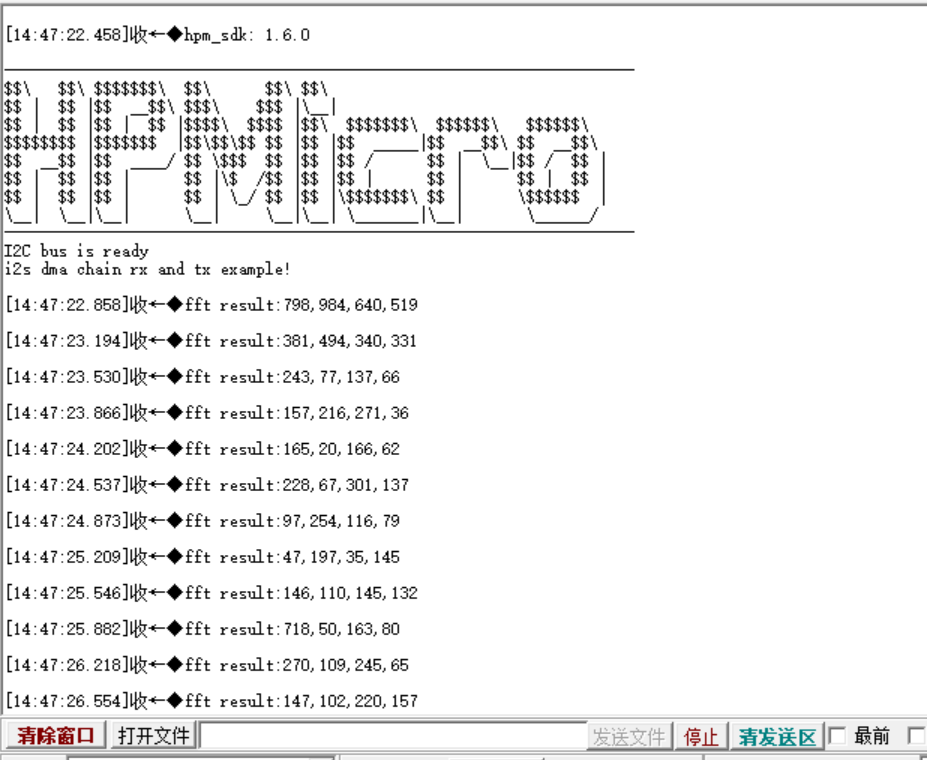
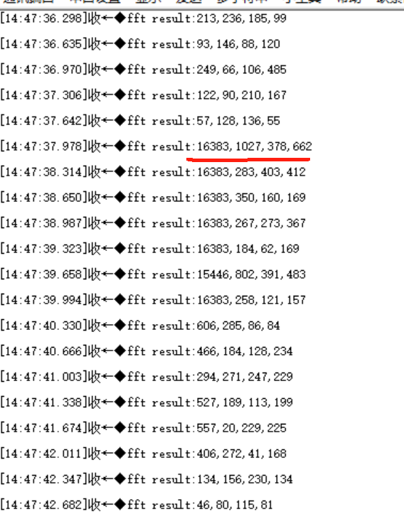

# I2S_DMA_CHAIN solutions

## Depend on SDK1.8.0

## Introduction

- The HPM6700/6400 series MCU comes with audio functionality. Supports four I2S functions, one DAO broadcasting function, one PDM digital microphone, and VAD function. I2S supports time-division multiplexing and can support up to TDM16. The I2S module supports four modes: Philips standard, MSB alignment mode, LSB alignment mode, and DSP mode.

- This plan takes the HPM6750EVK2 development board as an example to introduce the DMA chain data transmission and reception function of I2S. The received data is collected by the microphone and the signal is passed through the codec to the MCU; The data sent by I2S can be played through DAO and the sound can be played through an external speaker.

-This scheme uses DMA chain transfer to automatically complete I2S receiving data to rx_fuff and I2S sending sine wave signals to DAO, without the need for CPU involvement. The CPU is only responsible for processing data.

Application Notes[HPM I2S_DMA_CHAIN开发案例_V1.1](doc/HPM_I2S_DMA_CHAIN开发案例_V1.1.pdf)


## general_solution



## Sample

### DMA configuration used for receive and transmit data in I2S:

```c
#define APP_DMA_RX                BOARD_APP_HDMA
#define I2S_MASTER_RX_LINE        CODEC_I2S_DATA_LINE
#define DMA_RX_CHANNEL            (0U)
#define DMA_MUX_RX_CHANNEL        DMA_SOC_CHN_TO_DMAMUX_CHN(APP_DMA_RX, DMA_RX_CHANNEL)
#define DMA_MUX_RX_SRC            HPM_DMA_SRC_I2S0_RX

#define APP_DMA_TX                BOARD_APP_HDMA
#define DMA_CHANNEL               (1U)
#define DMA_MUX_CHANNEL           DMA_SOC_CHN_TO_DMAMUX_CHN(APP_DMA_TX, DMA_CHANNEL)
#define DMA_MUX_SRC               HPM_DMA_SRC_I2S1_TX
#define TX_DATA_LEN               (32U)
```

### Format configuration for I2S data transmission:
```c
#define I2S_SAMPLE_RATE_HZ        (16000U)
#define I2S_SAMPLE_CHANNEL        (2U)
#define I2S_SAMPLE_BITDEPTH       i2s_audio_depth_32_bits
#define I2S_CHANNEL_LENGTH        i2s_channel_length_32_bits

```

### Process the data received by I2S:
```c
void rx_data_process(void)
{

    if (rx_done[0] == 1)
    {
     /* you can process the rx data here */
      complete_count++;
      rx_done[0] = 0;
      for (int i = 0;i < FFT_POINTS;i++)
      {
        /* left channel data */
        rfft_buf_l[i] = rx_buff[2 * i];
        /* right channel data */
        rfft_buf_r[i] = rx_buff[2 * i + 1];
      }
      fft_cal(&rfft_buf_r[0], &rfft_mag_output[0], FFT_POINTS, FFT_SHIFT);
      result[0] = (uint32_t)rfft_mag_output[FFT_RESULT_INDEX] >> FFT_RESULT_SHIFT;
      result[1] = (uint32_t)rfft_mag_output[FFT_RESULT_INDEX + 2] >> FFT_RESULT_SHIFT;
      result[2] = (uint32_t)rfft_mag_output[FFT_RESULT_INDEX + 4] >> FFT_RESULT_SHIFT;
      result[3] = (uint32_t)rfft_mag_output[FFT_RESULT_INDEX + 6] >> FFT_RESULT_SHIFT;
      /*FFT calculation result printing interval, print the result every 20 calculations, for testing purposes only.*/
      if (complete_count > TEST_DELAY_COUNT)
      {
        complete_count = 0;
        printf("fft result:%d,%d,%d,%d\n",result[0],result[1],result[2],result[3]);         
      }
    }
    if (rx_done[1] == 1)
    {
      /* you can process the rx data here */
      rx_done[1] = 0;
    }
    if (rx_done[0] == 1 && rx_done[0] == 1)
    {
      printf("rx_buff full!");
    }
}
```

### DEMO：
```c
int main(void)
{
    board_init();
    i2s_dma_tx_init();
    i2s_dma_rx_init();
    printf("i2s dma chain rx and tx example!\n");
    while(1){
      rx_data_process();
    };
    return 0;
}
```


## Code Path

- Code Path：i2s_dma_chain\software\i2s_dma


## Code Configuration

- none

## Code Build

- windows GUI create project  



## Hardware
- The hpm6750evk2 development board used in this plan.
- This routine requires connecting the DAO of the development board to the speakers.


## Code Run

- Run Engineering.
- Without connecting the speaker, use the serial assistant to observe the FFT calculation results.




- FFT calculation result after connecting the speaker on DAO.



## API

:::{eval-rst}

About software API: `API doc <../../_static/apps/i2s_dma_chain/html/index.html>`_ 。
:::