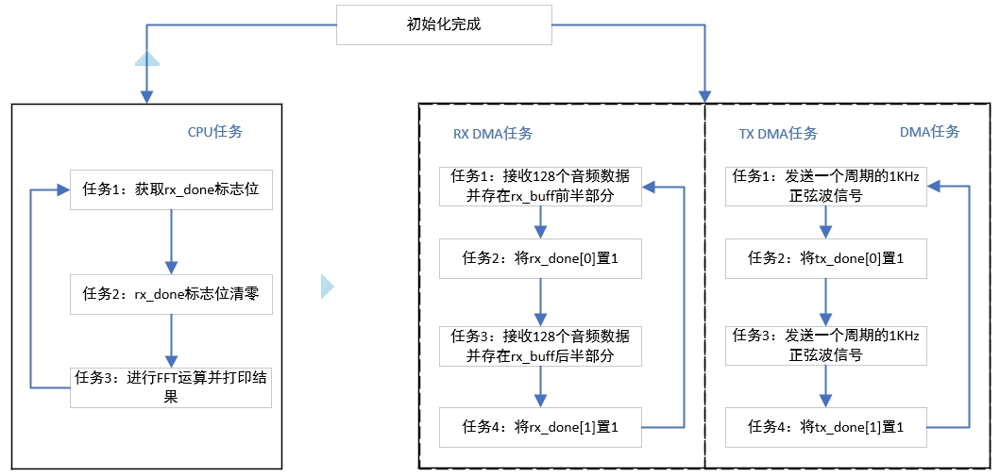

# I2S_DMA_CHAIN案例

## 介绍

-HPM6700/6400系列MCU上带有音频功能。支持四路I2S功能、一路DAO播音功能、一路PDM数字麦克风能和VAD功能。I2S支持时分复用，最多支持TDM16。I2S模块支持四种模式：飞利浦标准、MSB对齐模式、LSB对齐模式和DSP模式。

-本方案以HPM6750EVK2开发板为例介绍I2S的DMA链式收发数据功能。接收到数据为麦克风采集的信号经过CODEC到MCU；I2S发送的数据经过DAO播放，外接喇叭即可播出声音。

-该方案通过使用DMA链式传输，自动完成I2S接收数据到rx_buff以及I2S发送正弦波信号到DAO，不需要CPU参与。CPU只负责处理数据。

应用笔记[HPM I2S_DMA_CHAIN开发案例_V1.1](doc/HPM_I2S_DMA_CHAIN开发案例_V1.1.pdf)

## 框图及调用流程



## 例程


### I2S接收、发送数据使用的DMA配置：
```c
#define APP_DMA_RX                BOARD_APP_HDMA
#define I2S_MASTER_RX_LINE        CODEC_I2S_DATA_LINE
#define DMA_RX_CHANNEL            (0U)
#define DMA_MUX_RX_CHANNEL        DMA_SOC_CHN_TO_DMAMUX_CHN(APP_DMA_RX, DMA_RX_CHANNEL)
#define DMA_MUX_RX_SRC            HPM_DMA_SRC_I2S0_RX

#define APP_DMA_TX                BOARD_APP_HDMA
#define DMA_CHANNEL               (1U)
#define DMA_MUX_CHANNEL           DMA_SOC_CHN_TO_DMAMUX_CHN(APP_DMA_TX, DMA_CHANNEL)
#define DMA_MUX_SRC               HPM_DMA_SRC_I2S1_TX
#define TX_DATA_LEN               (32U)

```
### I2S传输数据的格式配置：
```c
#define I2S_SAMPLE_RATE_HZ        (16000U)
#define I2S_SAMPLE_CHANNEL        (2U)
#define I2S_SAMPLE_BITDEPTH       i2s_audio_depth_32_bits
#define I2S_CHANNEL_LENGTH        i2s_channel_length_32_bits
```

### 对I2S接收到的数据进行处理：
```c
void rx_data_process(void)
{

    if (rx_done[0] == 1)
    {
     /* you can process the rx data here */
      complete_count++;
      rx_done[0] = 0;
      for (int i = 0;i < FFT_POINTS;i++)
      {
        /* left channel data */
        rfft_buf_l[i] = rx_buff[2 * i];
        /* right channel data */
        rfft_buf_r[i] = rx_buff[2 * i + 1];
      }
      fft_cal(&rfft_buf_r[0], &rfft_mag_output[0], FFT_POINTS, FFT_SHIFT);
      result[0] = (uint32_t)rfft_mag_output[FFT_RESULT_INDEX] >> FFT_RESULT_SHIFT;
      result[1] = (uint32_t)rfft_mag_output[FFT_RESULT_INDEX + 2] >> FFT_RESULT_SHIFT;
      result[2] = (uint32_t)rfft_mag_output[FFT_RESULT_INDEX + 4] >> FFT_RESULT_SHIFT;
      result[3] = (uint32_t)rfft_mag_output[FFT_RESULT_INDEX + 6] >> FFT_RESULT_SHIFT;
      /*FFT calculation result printing interval, print the result every 20 calculations, for testing purposes only.*/
      if (complete_count > TEST_DELAY_COUNT)
      {
        complete_count = 0;
        printf("fft result:%d,%d,%d,%d\n",result[0],result[1],result[2],result[3]);         
      }
    }
    if (rx_done[1] == 1)
    {
      /* you can process the rx data here */
      rx_done[1] = 0;
    }
    if (rx_done[0] == 1 && rx_done[0] == 1)
    {
      printf("rx_buff full!");
    }
}
```

### DEMO例程：
```c
int main(void)
{
    board_init();
    i2s_dma_tx_init();
    i2s_dma_rx_init();
    printf("i2s dma chain rx and tx example!\n");
    while(1){
      rx_data_process();
    };
    return 0;
}
```
## 工程路径

- 工程路径：i2s_dma_chain\software\i2s_dma


## 工程配置

- 无

## 工程构建
- windows下工程构建\n


## 硬件设置
- 本方案使用的hpm6750evk2开发板。
- 本例程需要将开发板的DAO与喇叭连接起来。


## 工程运行

- 运行工程
- 不接喇叭使用串口助手观察FFT计算的结果。


- DAO上接喇叭后FFT计算结果。


## API

:::{eval-rst}

关于软件API 请查看 `方案API 文档 <../../_static/apps/i2s_dma_chain/html/index.html>`_ 。
:::
