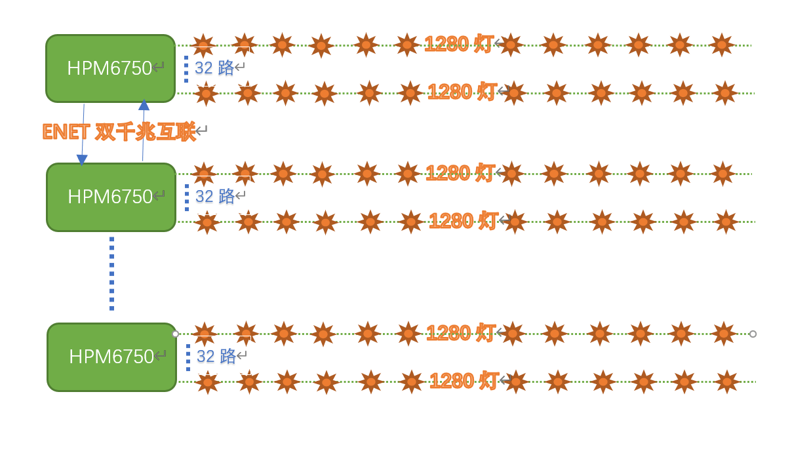
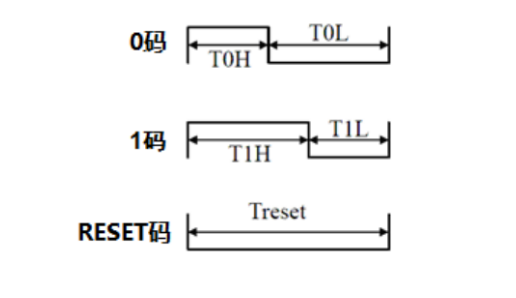
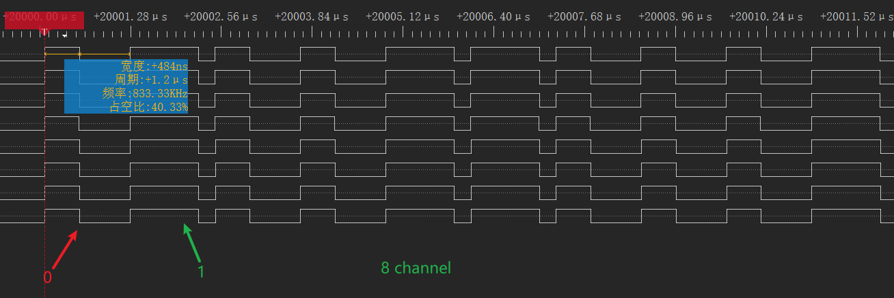

# LED large screen driver scheme

## Overview

LED large screen display system uses the dot matrix module or pixel unit composed of RGB lamp beads to form a large-area display to display characters、 images and other information、with low power consumption、 low cost、high brightness、long life、wide viewing Angle and other advantages、in recent years with the continuous update of LED display technology、widely used in various media occasions.

The LED large screen is composed of countless LED RGB lights, and displays different patterns by controlling the brightness and color of each LED RGB in real time. In the LED large screen display application, the traditional core control chip choice can be described as a variety of MCU, FPGA or PLD can be used as the core control chip to design, and the effect is also good and bad.  

While the application of LED large screen display continues to expand, the large screen display system has also put forward more stringent requirements for refresh frequency and delay:

 - Higher refresh frequency: The higher the refresh frequency, the more stable the image is displayed, and the less likely the eyes will feel tired;

 - Lower latency: Latency across the data link is further reduced, reducing flash screens or stalling.

In order to ensure the high refresh frequency and low delay of the LED large screen, to avoid the situation of flashing screen or stutch, it is necessary to control these LED RGB lights in real time through a high-speed link. In order to achieve a higher refresh frequency and lower delay of the LED large screen system design, the choice of the master chip is very critical. LED large screen display control system with MCU as the core is often criticized for data processing speed can not meet the high real-time requirements of the occasion, in fact, it is not.

HPM6750 is a dual-core high-performance MCU with RISC-V core, high frequency and innovative bus architecture developed by Shanghai HPM Semiconductor Technology. The HPM6750 has two fully independent cpus with a main frequency of up to 816MHz, and the analog peripherals include four sets of 32 PWM channels with a precision of 2.5ns, three 12-bit high-speed ADCs and one 16-bit high-precision ADC, which leads the performance of similar products in the market.

Not only that, for LED large-screen display applications, high-performance HPM6750 can perfectly solve high-speed link design through dual gigabit Ethernet transparent transmission solution. HPM6750 supports 2 Ethernet controller ENET, supports standard Ethernet MAC, supports 10/100/1000Mbps data transfer rate, supports RMII and RGMII mode PHY, ENET Ethernet controller comes with DMA, so the CPU load on data receiving and sending is 0. Through the Ethernet controller, the HPM6750 transmits Ethernet data received by the two PhYs to each other at a transmission rate of 780Mb/s. The LED large-screen display scheme based on high-performance HPM6750 is no less effective than the FPGA scheme in applications requiring extremely high real-time control, which not only has lower cost but also further reduces the development difficulty.

This scheme only introduces the LED large screen driver, double gigabit transparent transmission please see double gigabit transparent transmission scheme.

## Scheme introduction

LED large screen is composed of countless LED RGB lights, for example: 720P 1280x720 resolution LED large screen, then at least 1280x720 LED RGB lights. By real-time control of each LED RGB brightness and color, to display different patterns.

In order to ensure the LED large screen high refresh rate and low latency, to avoid the situation of flashing screen or stutch, it is necessary to control the 1280x720 LED RGB lights in real time through a high-speed link.

The block diagram of the scheme is as follows:



LED RGB lights need to be driven by a specific waveform, and the UCS1903 driver chip is used in this scheme. The UCS1903 sequence waveform diagram is as follows:




The overall application scheme uses the __High precision timer GPTMR+DMA+GPIO__ scheme to drive the LED.

### DMA

The HPM6750 supports two DMA controllers: XDMA and HDMA, which can realize real-time peripheral registers and memory and data transfer between memory.
	
DMA Request Router (DMAMUX) is supported. DMA requests from various peripheral modules are assigned to 16 output signals as DMA transfer request sources for XDMA and HDMA.

The outputs of DMAMUX 0-7 are connected to the peripheral bus DMA controller HDMA, and the outputs of DMAMUX 8-15 are connected to the system bus DMA controller XDMA.

Users can configure DMAMUX registers to connect DMA requests from specific peripherals to various channels of XDMA or HDMA.

The DMA controller supports 8 pairs of request-response handshake signals. The request signal comes from the function module and is routed to the DMA controller through DMAMUX. The DMA controller uses a certain channel according to the configuration to execute the change request, and sends the response signal to DMAMUX after the data transmission with the length of SrcBurstSize is completed.

### GPTMR

The HPM6750 supports 11 general-purpose timers, each of which supports 4 channels, each channel supports 32-bit counters, overloaded registers, and an input capture/output comparison channel, supports general-purpose timing, input capture, output comparison, PWM generation, and generates interrupts and DMA requests.
Among them:
The eight timers located in the system power domain are called universal timers GPTMR0-7
The two timers are located in the CONN subsystem of the system power domain and are called Network timers NTMR0 and NTMR1
One timer is located in the power management domain and is called the Power Management Domain Timer PTMR.

### GPIO

The HPM6750 supports two GPIO controllers and two fast GPIO controllers. Fast GPIO controller IO turnover rate can reach half of the main frequency 400Mhz. The I/O turnover rate of the GPIO controller is about 10Mhz.

The FGPIO Fast GPIO controller is CPU-private and cannot be accessed directly by peripherals.

In this case, the waveform frequency is 800khz, and the rate is perfectly adequate using the GPIO controller.


### GPTMR+HDMA+GPIO

This scheme uses HDMA and GPTMR hardware handshake to drive GPIO to generate the specified waveform. The CPU does not participate in it at all. The CPU only analyzes network packets and triggers DMA, so the CPU has zero load on waveform generation. Because HDMA access is used, it is important to emphasize that the HDMA access address must be continuous, and the pins that need to be used must be the same set of pins, such as PA0 to 31 / PB0 to 31 / PC0 to 31 / PD0 to 31.

LED controller UCS1903 waveform period is 800Khz, that is, a period of 1250ns. A cycle is divided into five segments, that is, the frequency of the GPTMR timer is 4x800Khz=4Mhz, and each segment is 1250/5=250ns (frequency and segment conditions are adjusted according to the actual project). 4 high before 1 yard and 1 low after 1 yard (high level duration: 250x4=1000ns); 0 code first 2 high and then 2 low (high level duration: 250x2=500ns). Each street lamp drive lighting delay (the first lamp bead of each road) is about 4ns, and completely concurrent.


This scheme supports a maximum of 32 channels and occupies RAM based on 32 channels. 4(32 channels, 32bit, 4byte)×5(each cycle is divided into 5 segments)×24(each lamp occupies 24 cycles)×720(each lamp has 720 lights) is 338k. To improve the execution rate, you are advised to store the source data in DLM or SRAM. SDRAM has a relatively slow speed, short SRAM read and write time, lower static power consumption, and high bus utilization, and is more suitable for applications with high performance requirements.


The LED large screen refresh rate (frame rate) is related to the LED large screen resolution and the LED light combination. In this case, the resolution is 1280x720, and it takes 21.6ms to drive 720 lights in series in each way (the time is the physical characteristic of UCS1903, which has nothing to do with MCU performance), and 1280/32=40 MCUS through gigabit series.


## Engineering path

hpm_apps/apps/led_screen/software/led_ucs1903

## Engineering allocation

Because the nocache area in use is large, the official linker file does not match the original linker file. Therefore, use the Linker file under the project (modify it according to the application scenario).

CMakeLists.txt specifies the linker file as follows:

```c

set(CUSTOM_GCC_LINKER_FILE ${CMAKE_CURRENT_SOURCE_DIR}/linkers/segger/ucs1903_ram.icf)

```

## Engineering construction


## Engineering operation

- Operation engineering
- Using a logic analyzer or oscilloscope, connect the driving waveform of the multi-channel RGB light you want to view.
- Actually mount the RGB light strip and observe whether the light strip changes according to the requirements.

Serial port running log:
```c
----------------------------------------------------------------------
$$\   $$\ $$$$$$$\  $$\      $$\ $$\
$$ |  $$ |$$  __$$\ $$$\    $$$ |\__|
$$ |  $$ |$$ |  $$ |$$$$\  $$$$ |$$\  $$$$$$$\  $$$$$$\   $$$$$$\
$$$$$$$$ |$$$$$$$  |$$\$$\$$ $$ |$$ |$$  _____|$$  __$$\ $$  __$$\
$$  __$$ |$$  ____/ $$ \$$$  $$ |$$ |$$ /      $$ |  \__|$$ /  $$ |
$$ |  $$ |$$ |      $$ |\$  /$$ |$$ |$$ |      $$ |      $$ |  $$ |
$$ |  $$ |$$ |      $$ | \_/ $$ |$$ |\$$$$$$$\ $$ |      \$$$$$$  |
\__|  \__|\__|      \__|     \__|\__| \_______|\__|       \______/
----------------------------------------------------------------------
ucs1903 led of timer dma gpio
total times:7257298 tick.

dma transfer down!
total times:7261692 tick.

dma transfer down!
total times:7266365 tick.

dma transfer down!


```

The following operating waveform diagram:



## Software API

:::{eval-rst}

About software API:  `API doc <doc/api/index.html>`_ 。
:::
