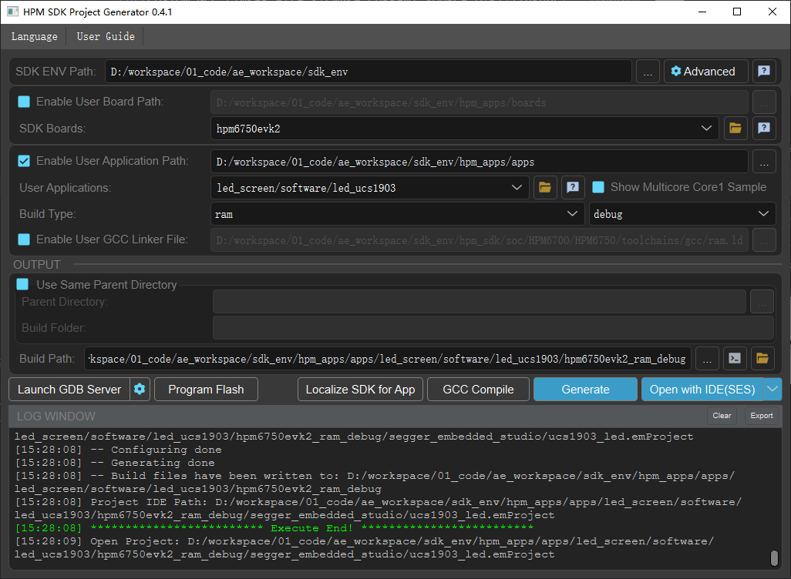

# LED大屏驱动方案

## 简介

LED大屏显示系统利用RGB灯珠构成的点阵模块或像素单元组成大面积显示屏显示字符、图像等信息，具有低功耗、低成本、高亮度、长寿命、宽视角等优点，近年来随着LED显示技术的不断更新，广泛应用在各类媒体场合。

LED大屏由无数个LED RGB灯组成，通过实时控制每个LED RGB的亮度及色彩，来显示不同的图案。在LED大屏显示应用中，传统的核心控制芯片选择可谓多种多样，MCU、FPGA或PLD都可以被作为核心控制芯片来进行设计，实现的效果也是各有优劣。

在LED大屏显示应用不断拓展的同时，大屏显示系统对刷新频率和延迟也提出了更严苛的要求：

 - 更高的刷新频率：刷新频率越高，显示的图像越稳定，眼睛感觉到疲劳可能性就越小；

 - 更低的延迟：整个数据链路的延迟进一步降低，减少闪屏或卡顿。

为确保LED大屏高刷新频率和低延迟，避免闪屏或卡顿的情况，就必须通过高速的链路来实时控制这些LED RGB灯。要实现更高刷新频率、更低延迟的LED大屏系统系统设计，主控芯片的选择非常关键。以MCU为核心的LED大屏显示控制系统常常被诟病数据处理速度无法满足实时性要求很高的场合，其实不然。

HPM6750就是上海先楫半导体公司开发的采用RISC-V 内核、具有高主频及创新总线架构的双核高性能MCU。HPM6750拥有两个完全独立的CPU且主频高达816MHz，模拟外设包括4组共32路精度达2.5ns的PWM、3个12位高速ADC以及1个16位高精度ADC，其性能在市场同类产品中居于领先水平。

不仅如此，对于LED大屏显示应用，高性能HPM6750能通过双千兆以太网透传的方案完美解决高速的链路设计。HPM6750支持2个以太网控制器ENET，支持标准以太网MAC，支持10/100/1000Mbps数据传输速率，支持RMII和RGMII模式的PHY，ENET以太网控制器自带DMA，因此在数据接收和发送上CPU负载为0。HPM6750通过以太网控制器，将两个PHY收到的以太网数据相互透传，透传速率达780Mb/s。基于高性能HPM6750的LED大屏显示方案在对实时控制要求极高的应用中丝毫不逊色于FPGA方案，不仅成本更低而且进一步降低了开发难度。

本方案只介绍LED大屏驱动，双千兆透传请查看双千兆透传方案。

## 方案介绍

LED大屏是由无数个LED RGB灯组成，例如：720P 1280x720分辨率的LED大屏，则至少需要1280x720个LED RGB灯。通过实时控制每个LED RGB的亮度及色彩，来显示不同的图案。

为确保LED大屏高刷新率及低延迟，避免闪屏或卡顿的情况，就必须通过高速的链路来实时控制这1280x720个LED RGB灯。

方案框图如下：


LED RGB灯需要通过特定的波形驱动，本方案使用UCS1903驱动芯片。UCS1903时序波形图如下：


整体的应用方案使用 __高精定时器GPTMR+DMA+GPIO__ 的方案来驱动LED。

### DMA

HPM6750支持2个DMA控制器：XDMA和HDMA，可以实现实时的外设寄存器和内存及内存之间的数据搬移。
	
支持DMA请求路由器(DMAMUX)。将来自各个外设模块的DMA请求分配到16个输出信号，作为XDMA和HDMA的DMA传输请求源。 

DMAMUX 的输出0-7连接到外设总线DMA控制器HDMA，DMAMUX的输出8-15连接到系统总线DMA控制器XDMA。 

用户可以通过配置DMAMUX寄存器，把来自特定外设的DMA请求，连接到XDMA或者HDMA的各个通道。

DMA控制器支持8对请求-响应的握手信号，请求信号来自功能模块并经由DMAMUX路由至DMA控制器，DMA控制器根据配置使用某个通道执行改请求，完成长度为SrcBurstSize的数据传输后发送响应信号给DMAMUX，完成硬件握手。

### GPTMR

HPM6750支持11个通用定时器，每个通用定时器支持4个通道，每个通道支持32位计数器，重载寄存器和一个输入捕获/输出比较通道，支持通用计时，输入捕获，输出比较，PWM 生成，以及产生中断和DMA请求。
其中：
8 个定时器位于系统电源域称为通用定时器 GPTMR0∼7 
2 个定时器位于系统电源域的 CONN 子系统，称为网络定时器 NTMR0, NTMR1 
1 个定时器位于电源管理域，称为电源管理域定时器 PTMR。 

### GPIO

HPM6750支持2个GPIO控制器和2个快速GPIO控制器。快速GPIO控制器IO翻转速率可达到主频的一半400Mhz。GPIO控制器IO翻转速率在10Mhz左右。

快速GPIO控制器FGPIO是CPU私有，外设无法直接访问。

本案例中波形频率是800khz，使用GPIO控制器速率完全足够。

### GPTMR+HDMA+GPIO

本方案使用HDMA和GPTMR硬件握手来驱动GPIO高低生成指定的波形，CPU完全不参与，CPU的工作仅仅是解析网络数据包和触发DMA，故CPU在波形产生上，负载为0。因为使用了HDMA访问，因此要强调的是HDMA访问地址必须连续，需要使用的PIN管脚必须是同一组管脚，如：PA0~31 / PB0~31 / PC0~31 / PD0~31等。

LED控制器UCS1903波形周期为800Khz，即一个周期1250ns。一个周期分为5段，即GPTMR定时器的频率为4x800Khz=4Mhz，每段1250/5=250ns（频率及分段情况，根据实际项目调整）。1码前4高后1低（高电平时长：250x4=1000ns）； 0码前2高后2低（高电平时长：250x2=500ns）。每路灯驱动点亮延时（每路第一个灯珠）在4ns左右，且完全的并发。


本方案最大支持32路，以32路计算占用RAM，4(32路32bit，4byte)×5(每个周期分为5段)×24(每个灯占用24个周期)×720(每路720个灯) 为338k，。为提升执行速率，源数据建议放到DLM或SRAM中，SDRAM速率相对较慢，SRAM读写时间短，静态功耗更低，总线利用率高，更适合性能要求较高的应用。


LED大屏幕刷新频率（帧率）则和LED大屏分辨率以及LED灯组合方式相关。本案例为1280x720的分辨率，每路串联720个灯驱动需耗时21.6ms(该耗时为UCS1903物理特性，和MCU性能无关)，需要1280/32=40个MCU通过千兆串联。


## 工程路径

hpm_apps/apps/led_screen/software/led_ucs1903

## 工程配置

由于使用的nocache区域大，官方原始的linker文件不匹配，故需使用工程下的linker文件(根据应用场景修改即可)。

CMakeLists.txt中指定linker文件如下：

```c

set(CUSTOM_GCC_LINKER_FILE ${CMAKE_CURRENT_SOURCE_DIR}/linkers/segger/ucs1903_ram.icf)

```

## 工程构建



## 工程运行

- 运行工程
- 使用逻辑分析仪或示波器，连接要查看的多路RGB灯的驱动波形。
- 实际挂载RGB灯带，观察灯带是否按照需求变化。

串口运行日志:
```c
----------------------------------------------------------------------
$$\   $$\ $$$$$$$\  $$\      $$\ $$\
$$ |  $$ |$$  __$$\ $$$\    $$$ |\__|
$$ |  $$ |$$ |  $$ |$$$$\  $$$$ |$$\  $$$$$$$\  $$$$$$\   $$$$$$\
$$$$$$$$ |$$$$$$$  |$$\$$\$$ $$ |$$ |$$  _____|$$  __$$\ $$  __$$\
$$  __$$ |$$  ____/ $$ \$$$  $$ |$$ |$$ /      $$ |  \__|$$ /  $$ |
$$ |  $$ |$$ |      $$ |\$  /$$ |$$ |$$ |      $$ |      $$ |  $$ |
$$ |  $$ |$$ |      $$ | \_/ $$ |$$ |\$$$$$$$\ $$ |      \$$$$$$  |
\__|  \__|\__|      \__|     \__|\__| \_______|\__|       \______/
----------------------------------------------------------------------
ucs1903 led of timer dma gpio
total times:7257298 tick.

dma transfer down!
total times:7261692 tick.

dma transfer down!
total times:7266365 tick.

dma transfer down!


```

如下运行波形图:


## 软件API

:::{eval-rst}

关于软件API 请查看 `方案API 文档 <doc/api/index_zh.html>`_ 。
:::
