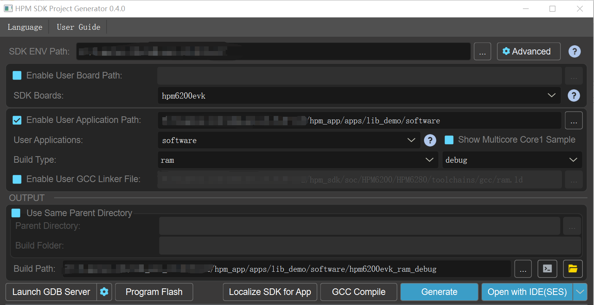
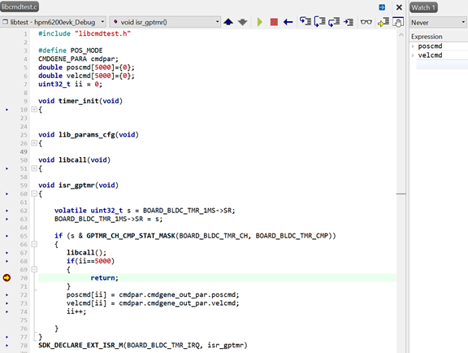
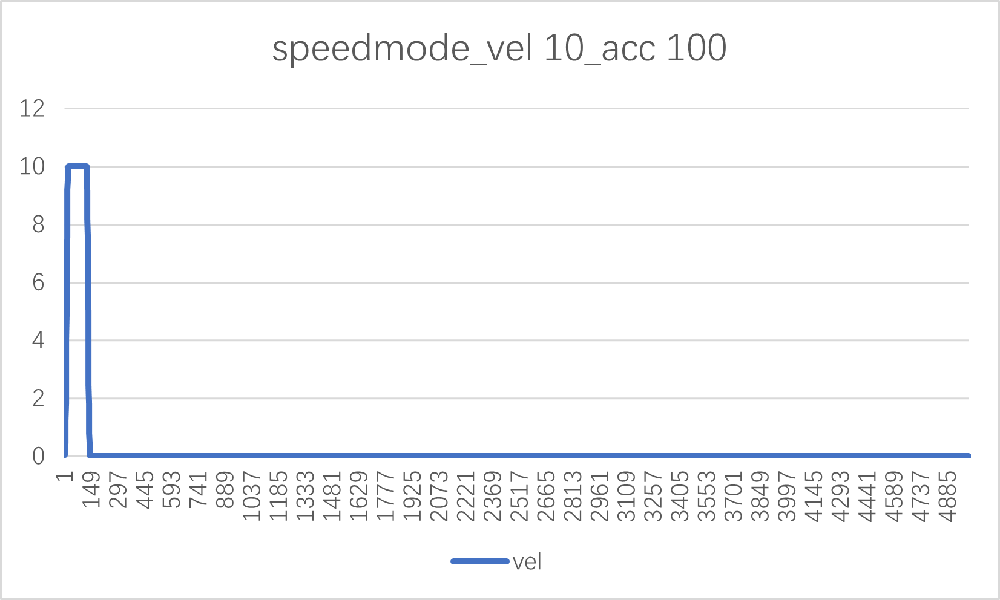
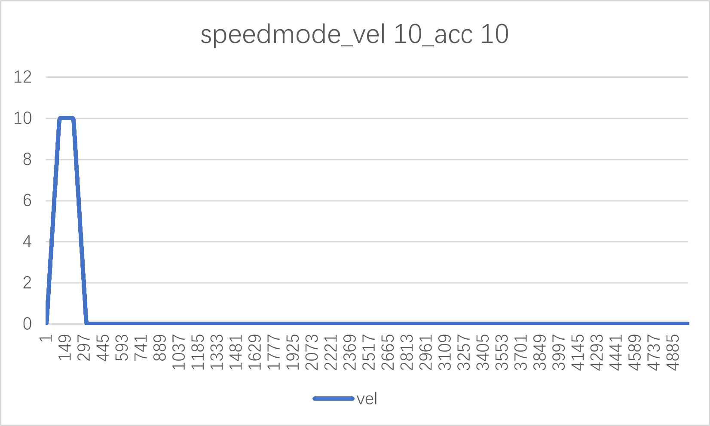
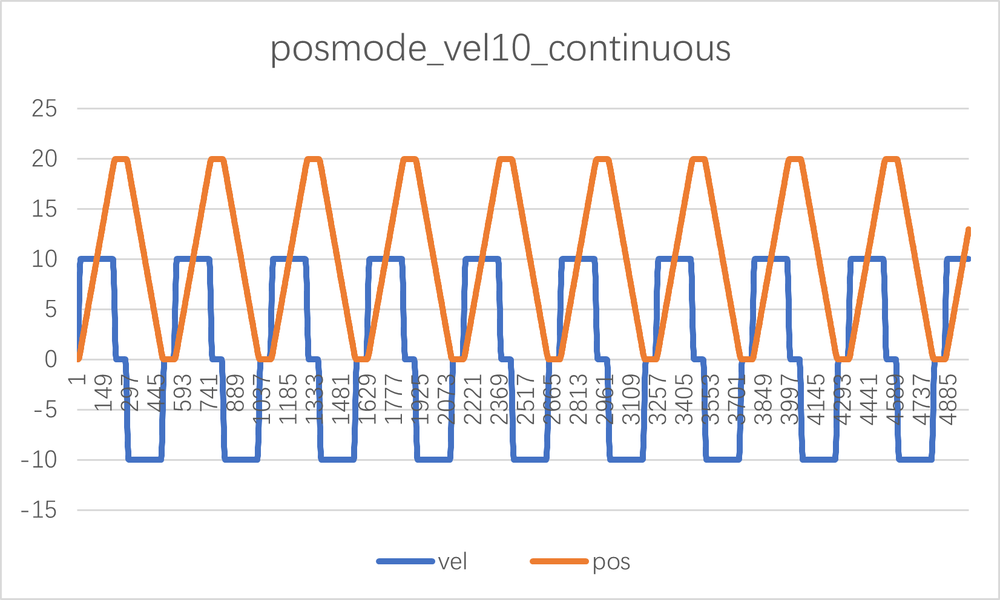
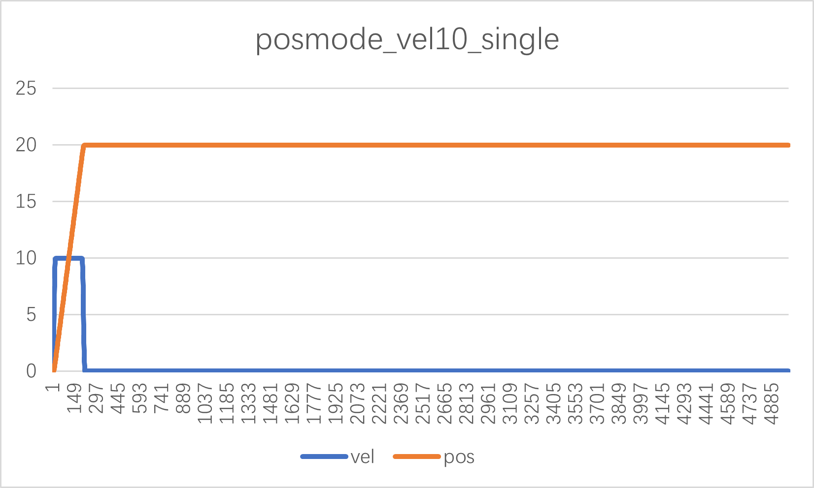
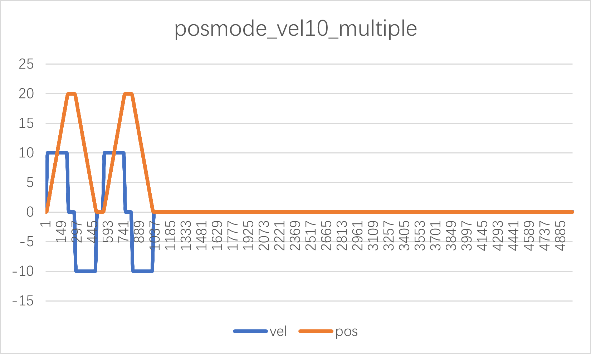

# hpm_motor library test demo

## introduction

In order to facilitate users to use and understand the functions of the motor library, a test demo is set up for the motor library.

Version 1.0 of the library contains only trajectory planning algorithms.

[hpm_motor library instruction](hpm_motor_instruction_zh)

## Sample

### Define trajectory planning structure variables
```c
CMDGENE_PARA cmdpar;
```
### Define the position mode/speed mode
```c
#define POS_MODE 1
```
### Define an array of shift instructions and speed instructions
```c
double poscmd[5000]={0};
double velcmd[5000]={0};
```

### Define a 10ms timer
```c
void timer_init(void)
{
    gptmr_channel_config_t config;

    gptmr_channel_get_default_config(BOARD_BLDC_TMR_MS, &config);
    config.cmp[0] = BOARD_BLDC_TMR_RELOAD;
    config.debug_mode = 0;
    config.reload = BOARD_BLDC_TMR_RELOAD+1;

    gptmr_enable_irq(BOARD_BLDC_TMR_MS, GPTMR_CH_CMP_IRQ_MASK(BOARD_BLDC_TMR_CH, BOARD_BLDC_TMR_CMP));
    gptmr_channel_config(BOARD_BLDC_TMR_MS, BOARD_BLDC_TMR_CH, &config, true);
    intc_m_enable_irq_with_priority(BOARD_BLDC_TMR_IRQ, 2);

}
```
### Configure trajectory planning entry parameters
```c
    cmdpar.cmdgene_in_par.poscfgpar.q0 = 0;
    cmdpar.cmdgene_in_par.poscfgpar.q1 = MOVE_BASOLUTE_POS_R;
    cmdpar.cmdgene_in_par.poscfgpar.v0 = 0;
    cmdpar.cmdgene_in_par.poscfgpar.v1 = 0;
    cmdpar.cmdgene_in_par.poscfgpar.vmax = MOVE_SPEED;
    cmdpar.cmdgene_in_par.poscfgpar.amax = MOVE_ACC;
    cmdpar.cmdgene_in_par.poscfgpar.jmax = MOVE_JERK;
    cmdpar.cmdgene_in_par.poscfgpar.cyclecnt = CYCLE_CNT;
    cmdpar.cmdgene_in_par.poscfgpar.cycletype = MULTIPLE_MOVE_TYPE;
    cmdpar.cmdgene_in_par.poscfgpar.dwelltime = DWELLTIME_MS;
    cmdpar.cmdgene_in_par.poscfgpar.isr_time_s = ISR_TIME_S;

    cmdpar.cmdgene_in_par.velcfgpar.q0 = 0;
    cmdpar.cmdgene_in_par.velcfgpar.Tv = CONSTANT_SPEED_TIME_S;
    cmdpar.cmdgene_in_par.velcfgpar.v0 = 0;
    cmdpar.cmdgene_in_par.velcfgpar.v1 = 0;
    cmdpar.cmdgene_in_par.velcfgpar.vmax =MOVE_SPEED;
    cmdpar.cmdgene_in_par.velcfgpar.amax = MOVE_ACC;
    cmdpar.cmdgene_in_par.velcfgpar.jmax = MOVE_JERK;
    cmdpar.cmdgene_in_par.velcfgpar.isr_time_s = ISR_TIME_S;
```

### Trajectory planning call function
```c
void libcall(void)
{
#ifdef POS_MODE
   pos_cmd_gene(&cmdpar);
#else
   vel_cmd_gene(&cmdpar);
#endif
}
```
### ISR
```c
void isr_gptmr(void)
{

    volatile uint32_t s = BOARD_BLDC_TMR_MS->SR;
    BOARD_BLDC_TMR_MS->SR = s;

    if (s & GPTMR_CH_CMP_STAT_MASK(BOARD_BLDC_TMR_CH, BOARD_BLDC_TMR_CMP))
    {
       libcall();
       if(ii==5000)
       {
             return;
       }
       poscmd[ii] = cmdpar.cmdgene_out_par.poscmd;
       velcmd[ii] = cmdpar.cmdgene_out_par.velcmd;
       ii++;

    }
}
SDK_DECLARE_EXT_ISR_M(BOARD_BLDC_TMR_IRQ, isr_gptmr)
```
### DEMO
```c
int main (void)
{

   board_init();
   lib_params_cfg();
   timer_init();

}
```
## Code Path

- Code Path：lib_demo/software

## Code Configuration

- 无

## Code Build

- Build for windows



## Hardware
- The hpm_6200_FourMotor_MB_RevA used in this routine
- Users can use the others EVK board

## Code Run

- run the project
- Save location instructions and speed instructions to local txt
- excel graphics process



## test content

### speed mode，vel 10r/s，acc 100r/s/s，jerk 1000r/s/s/s

#### Code configuration

- Comment out the macro definition POS_MODE in the libcmdtest.c file;

- Change MOVE_SPEED to 10, MOVE_ACC to 100, and MOVE_JERK to 1000 in the libcmdtest.h file.

- Observe the value of the velcmd array with the following test results:



### speed mode，vel 10r/s，acc 10r/s/s，jerk 100r/s/s/s

#### Code configuration

- Comment out the macro definition POS_MODE in the libcmdtest.c file;

- Change MOVE_SPEED to 10, MOVE_ACC to 10, and MOVE_JERK to 100 in the libcmdtest.h file.

- Observe the value of the velcmd array with the following test results:



### position mode，vel 10r/s，acc 100r/s/s，jerk 1000r/s/s/s，absolute position 20，move mode：continuous round mode

#### Code configuration

- Open macro definition POS_MODE in libcmdtest.c file;

- Change MOVE_RABSOLUTE_POS_r in the libcmdtest.h file to 20, MOVE_SPEED to 10, MOVE_ACC to 100, and MOVE_JERK to 1000.

- Change the value of cmdpar.cmdgene_in_par.poscfgpar.cycle in the lib_params_cfg function in the libcmdtest.c file to CONTINOUS_RONUD_MOVE_TYPE;

- Observe the values of the velcmd and poscmd arrays with the following test results:



### position mode，vel 10r/s，acc 100r/s/s，jerk 1000r/s/s/s，absolute position 20，move mode：single

#### Code configuration

- Open macro definition POS_MODE in libcmdtest.c file;

- Change MOVE_ABSOLUTE_POS_r in the libcmdtest.h file to 20, MOVE_SPEED to 10, MOVE_ACC to 100, and MOVE_JERK to 1000.

- Change the value of cmdpar.cmdgene_in_par.poscfgpar.cycle in the libcmdtest.c file lib_params_cfg to SIGNLE_MOVE_TYPE;

- Observe the values of the velcmd and poscmd arrays with the following test results:



### position mode，vel 10r/s，acc 100r/s/s，jerk 1000r/s/s/s，absolute position 20，move mode：multiple ,move cycle :2

#### Code configuration

- Open macro definition POS_MODE in libcmdtest.c file;

- Change MOVE_ABSOLUTE_POS_r in the libcmdtest.h file to 20, MOVE_SPEED to 10, MOVE_ACC to 100, MOVE_JERK to 1000, and CYCLE_CNT to 2.

- Change the value of cmdpar.cmdgene_in_par.poscfgpar.cycle in the libcmdtest.c file lib_params_cfg to MULTIPLE_MOVE_TYPE;

- Observe the values of the velcmd and poscmd arrays with the following test results:



## API

:::{eval-rst}

About software API: `API doc <../../_static/apps/lib_demo/html/index.html>`_ .
:::