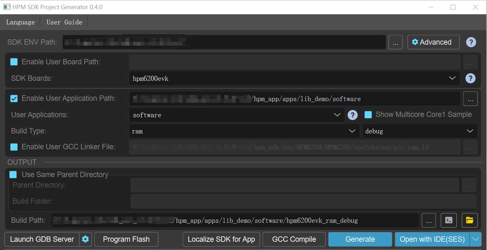
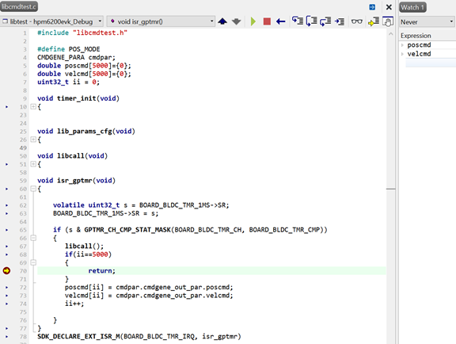

# hpm_motor库测试demo

## 介绍

为了方便用户使用、了解电机库功能，针对电机库搭建测试demo。

1.0版本电机库仅包含轨迹规划算法。

[hpm_motor 库说明](hpm_motor_instruction_zh)

## 例程

### 定义轨迹规划结构体变量
```c
CMDGENE_PARA cmdpar;
```
### 定义位置模式/速度模式
```c
#define POS_MODE 1
```
### 定义位移指令，速度指令数组
```c
double poscmd[5000]={0};
double velcmd[5000]={0};
```

### 定义10ms定时器
```c
void timer_init(void)
{
    gptmr_channel_config_t config;

    gptmr_channel_get_default_config(BOARD_BLDC_TMR_MS, &config);
    config.cmp[0] = BOARD_BLDC_TMR_RELOAD;
    config.debug_mode = 0;
    config.reload = BOARD_BLDC_TMR_RELOAD+1;

    gptmr_enable_irq(BOARD_BLDC_TMR_MS, GPTMR_CH_CMP_IRQ_MASK(BOARD_BLDC_TMR_CH, BOARD_BLDC_TMR_CMP));
    gptmr_channel_config(BOARD_BLDC_TMR_MS, BOARD_BLDC_TMR_CH, &config, true);
    intc_m_enable_irq_with_priority(BOARD_BLDC_TMR_IRQ, 2);

}
```
### 轨迹规划入口参数配置
```c
    cmdpar.cmdgene_in_par.poscfgpar.q0 = 0;
    cmdpar.cmdgene_in_par.poscfgpar.q1 = MOVE_BASOLUTE_POS_R;
    cmdpar.cmdgene_in_par.poscfgpar.v0 = 0;
    cmdpar.cmdgene_in_par.poscfgpar.v1 = 0;
    cmdpar.cmdgene_in_par.poscfgpar.vmax = MOVE_SPEED;
    cmdpar.cmdgene_in_par.poscfgpar.amax = MOVE_ACC;
    cmdpar.cmdgene_in_par.poscfgpar.jmax = MOVE_JERK;
    cmdpar.cmdgene_in_par.poscfgpar.cyclecnt = CYCLE_CNT;
    cmdpar.cmdgene_in_par.poscfgpar.cycletype = MULTIPLE_MOVE_TYPE;
    cmdpar.cmdgene_in_par.poscfgpar.dwelltime = DWELLTIME_MS;
    cmdpar.cmdgene_in_par.poscfgpar.isr_time_s = ISR_TIME_S;

    cmdpar.cmdgene_in_par.velcfgpar.q0 = 0;
    cmdpar.cmdgene_in_par.velcfgpar.Tv = CONSTANT_SPEED_TIME_S;
    cmdpar.cmdgene_in_par.velcfgpar.v0 = 0;
    cmdpar.cmdgene_in_par.velcfgpar.v1 = 0;
    cmdpar.cmdgene_in_par.velcfgpar.vmax =MOVE_SPEED;
    cmdpar.cmdgene_in_par.velcfgpar.amax = MOVE_ACC;
    cmdpar.cmdgene_in_par.velcfgpar.jmax = MOVE_JERK;
    cmdpar.cmdgene_in_par.velcfgpar.isr_time_s = ISR_TIME_S;
```

### 轨迹规划调用函数
```c
void libcall(void)
{
#ifdef POS_MODE
//位置模式下，轨迹规划函数生成位置/速度指令
   pos_cmd_gene(&cmdpar);
#else 
//速度模式下，轨迹规划函数生成速度指令
   vel_cmd_gene(&cmdpar);
#endif
}
```
### 中断执行函数
```c
void isr_gptmr(void)
{
  
    volatile uint32_t s = BOARD_BLDC_TMR_MS->SR;
    BOARD_BLDC_TMR_MS->SR = s;

    if (s & GPTMR_CH_CMP_STAT_MASK(BOARD_BLDC_TMR_CH, BOARD_BLDC_TMR_CMP)) 
    {
       libcall();
       if(ii==5000)
       {
             return;
       }     
       poscmd[ii] = cmdpar.cmdgene_out_par.poscmd;
       velcmd[ii] = cmdpar.cmdgene_out_par.velcmd;
       ii++;
    
    }
}
SDK_DECLARE_EXT_ISR_M(BOARD_BLDC_TMR_IRQ, isr_gptmr)
```
### DEMO例程
```c
int main (void)
{

   board_init();
   lib_params_cfg();
   timer_init();
   
}
```
## 工程路径

- 工程路径：lib_demo/software

## 工程配置

- 无

## 工程构建

- windows下工程构建



## 硬件设置
- 本方案使用的hpm_6200_FourMotor_MB_RevA板。
- 用户可以使用其他evk板

## 工程运行

- 运行工程
- 将位置指令、速度指令保存至本地txt
- excel绘图处理



## 测试内容

### 速度模式下，速度10r/s，加速度100r/s/s，加加速度1000r/s/s/s

#### 代码配置

- 将libcmdtest.c文件中将宏定义POS_MODE注释掉；
- 修改libcmdtest.h文件中的MOVE_SPEED为10、MOVE_ACC为100、MOVE_JERK为1000。
- 观测velcmd数组的值，测试结果如下：


### 速度模式下，速度10r/s，加速度10r/s/s，加加速度100r/s/s/s

#### 代码配置

- 将libcmdtest.c文件中将宏定义POS_MODE注释掉；
- 修改libcmdtest.h文件中的MOVE_SPEED为10、MOVE_ACC为10、MOVE_JERK为100。
- 观测velcmd数组的值，测试结果如下：


### 位置模式下，速度10r/s，加速度100r/s/s，加加速度1000r/s/s/s，绝对位置20，运动模式：连续

#### 代码配置

- 将libcmdtest.c文件中将宏定义POS_MODE打开；
- 修改libcmdtest.h文件中的MOVE_RABSOLUTE_POS_r为20，MOVE_SPEED为10、MOVE_ACC为100、MOVE_JERK为1000。
- 修改libcmdtest.c文件lib_params_cfg函数中cmdpar.cmdgene_in_par.poscfgpar.cycle的值为CONTINOUS_RONUD_MOVE_TYPE；
- 观测velcmd和poscmd数组的值，测试结果如下：


### 位置模式下，速度10r/s，加速度100r/s/s，加加速度1000r/s/s/s，绝对位置20，运动模式：单次。

#### 代码配置

- 将libcmdtest.c文件中将宏定义POS_MODE打开；
- 修改libcmdtest.h文件中的MOVE_ABSOLUTE_POS_r为20，MOVE_SPEED为10、MOVE_ACC为100、MOVE_JERK为1000。
- 修改libcmdtest.c文件lib_params_cfg函数中cmdpar.cmdgene_in_par.poscfgpar.cycle的值为SIGNLE_MOVE_TYPE；
- 观测velcmd和poscmd数组的值，测试结果如下：


### 位置模式下，速度10r/s，加速度100r/s/s，加加速度1000r/s/s/s，相对位置20，运动模式：多次，运动次数：2。

#### 代码配置

- 将libcmdtest.c文件中将宏定义POS_MODE打开；
- 修改libcmdtest.h文件中的MOVE_ABSOLUTE_POS_r为20，MOVE_SPEED为10、MOVE_ACC为100、MOVE_JERK为1000，CYCLE_CNT为2。
- 修改libcmdtest.c文件lib_params_cfg函数中cmdpar.cmdgene_in_par.poscfgpar.cycle的值为MULTIPLE_MOVE_TYPE；
- 观测velcmd和poscmd数组的值，测试结果如下：


## 软件API

:::{eval-rst}

关于软件API 请查看 `方案API 文档 <doc/api/index_zh.html>`_ 。
:::