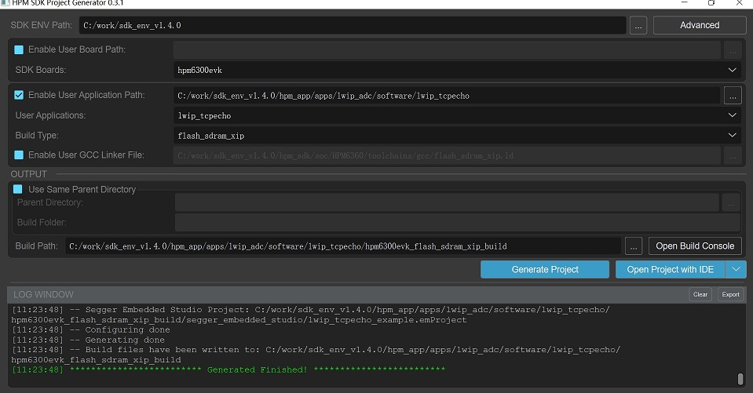
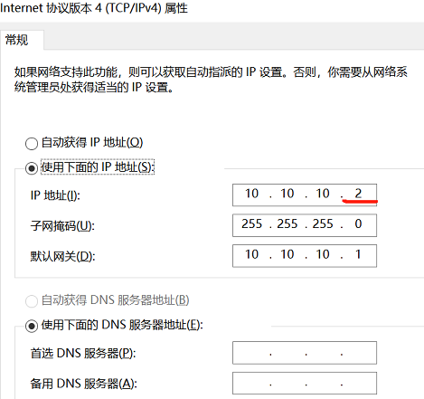
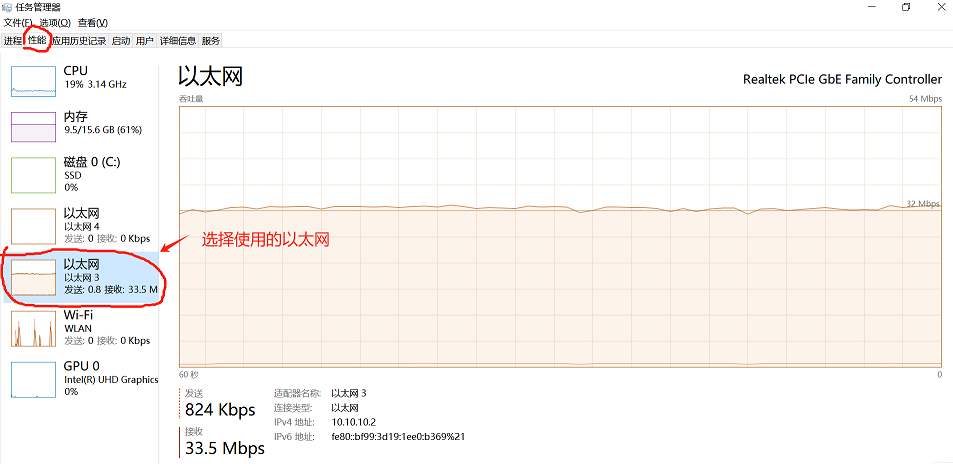

# LWIP+ADC High performance solutions


## Introduction

- Supports 16 bit ADC sampling and 100 Gigabit Ethernet peripherals on HPM6700/6400 and 6300 series microcontrollers. The HPM6300 series supports three 16 bit ADC converters, which can convert analog signals from external pins and internal chips. When the conversion accuracy of ADC is set to 16 bits, the maximum sampling rate is 2MSPS. When the conversion accuracy of ADC is set to 12 bits, the maximum sampling rate is 4MSPS. ADC supports read conversion mode, cycle conversion mode, sequence conversion mode, and preemptive conversion mode.

- This plan takes the HPM6300 development board as an example to introduce the application of using 2MSPS sampling rate for 16 bit ADC sampling and sending the sampling data to the upper computer through ENET LWIP TCP. ADC sampling uses preemptive conversion mode and PWM triggering, and ENET LWIP TCP sends 1024 16 bit sampling data each time.

-This scheme triggers ADC sampling and HDMA conversion of ADC data at a specific time through PWM, and relies on HDMA chain mode to create a looped linked list. Considering that interrupt response occupies CPU resources, a status identifier is added to the chain task, so that interrupts are not enabled. This achieves full automatic completion of ADC sampling and data conversion without the need for CPU participation, and the converted data is placed in ILM/DLM, with zero CPU waiting access. Ultimately achieving optimal performance.

Application Notes[HPM ADC+ENET开发案列](doc/HPM_ADC+ENET开发案例_V1.1.pdf)
Test Method [HPM ADC+ENET测试方法](doc/HPM_ADC_LWIP测试方法.pdf)

## general_solution


## Sample

### Define the trigger source PWM for ADC and the interconnect manager used:

```c
#define BOARD_APP_ADC16_PMT_PWM         HPM_PWM0
#define BOARD_APP_ADC16_PMT_TRGM        HPM_TRGM0
#define BOARD_APP_ADC16_PMT_TRGM_IN     HPM_TRGM0_INPUT_SRC_PWM0_CH8REF
#define BOARD_APP_ADC16_PMT_TRGM_OUT    TRGM_TRGOCFG_ADCX_PTRGI0A
```

### Define the sampling rate of ADC and the length of data transmitted each time:
```c
#define APP_ADC_TRIG_FREQ                 (2000000U)
#define APP_ADC16_DMA_BUFF_LEN_IN_BYTES   (1024U)
#define APP_ADC16_TCP_SEND_SIZE           (APP_ADC16_DMA_BUFF_LEN_IN_BYTES*sizeof(uint16_t))

```

### Define LWIP to send ADC sampling results:
```c
void tcp_poll_handle(void)
{
 int ret;
 uint8_t *addr = NULL;
 uint32_t len = 0;
 if (adc_get_done(0) && adc_get_done(1))
 {
   printf("adc dual buff full up!\r\n");
 }
 if (send_newpcb != NULL)
 {
   if (adc_get_done(0))
   {
     adc_clear_done(0);
     tcp_block_write(adc_get_buf_addr_point(0), APP_ADC16_TCP_SEND_SIZE);
   }
   else if (adc_get_done(1))
   {
     adc_clear_done(1);
     tcp_block_write(adc_get_buf_addr_point(1), APP_ADC16_TCP_SEND_SIZE);
   }
 }
 else
 {
   adc_clear_done(0);
   adc_clear_done(1);
 }
}
```

### DEMO：
```c
int main(void)
{
    /* Initialize BSP */
    board_init();

    /* Initialize GPIOs */
    board_init_enet_pins(ENET);

    /* Reset an enet PHY */
    board_reset_enet_phy(ENET);

    #if __ENABLE_ENET_RECEIVE_INTERRUPT
    printf("This is an ethernet demo: TCP Echo (Interrupt Usage)\n");
    #else
    printf("This is an ethernet demo: TCP Echo (Polling Usage)\n");
    #endif

    printf("LwIP Version: %s\n", LWIP_VERSION_STRING);

    /* Set RGMII clock delay */
    #if RGMII
    board_init_enet_rgmii_clock_delay(ENET);
    #else
    /* Set RMII reference clock */
    board_init_enet_rmii_reference_clock(ENET, BOARD_ENET_RMII_INT_REF_CLK);
    printf("Reference Clock: %s\n", BOARD_ENET_RMII_INT_REF_CLK ? "Internal Clock" : "External Clock");
    #endif

    /* Start a board timer */
    board_timer_create(LWIP_APP_TIMER_INTERVAL, sys_timer_callback);

    /* Initialize MAC and DMA */
    if (enet_init(ENET) == 0) {
        /* Initialize the Lwip stack */
        lwip_init();
        netif_config();
        user_notification(&gnetif);

        /* Start services */
        enet_services(&gnetif);

        /* Initialize TCP echo */
        tcp_echo_init();

        //adc_pmt config, use hdma chain auto process
        //adc_pmt_auto_config();

        while (1) {
            enet_common_handler(&gnetif);
            tcp_poll_handle();
        }
    } else {
        printf("Enet initialization fails !!!\n");
        while (1) {

        }
    }

    return 0;
}
```


## Code Path

- Code Path：lwip_adc/software/lwip_tcpecho


## Code Configuration

- none

## Code Build
- Build for windows



- Build for linux
```c
    //Switch to the sample application directory
    cd hpm_apps\apps\lwip_adc/software/lwip_tcpecho
    //create build directory
    mkdir build
    //Switch directory to "build"
    cd build
    //Ninja-build
    cmake -GNinja  -DBOARD=hpm6300evk -DCMAKE_BUILD_TYPE=flash_xip ..
    //Build
    ninja
  ```

## Hardware
- The hpm6300evk board used in this routine.
- Users can use the others EVK board , but users need to pay attention to modifying the corresponding pin.
- This routine connects the PC and development board using an Ethernet cable.

## Runtime Environment
- PC IP address and port settings:\n

- If the crystal oscillator on the development board used is 50MHz, there may be packet loss issues when using 100Mbps Ethernet. The solution is as follows:
Methods to solve packet loss problems[HPM6300EVKSolution to 100Mbps packet loss problem](doc/HPM6300EVK百兆丢包问题解决办法.pdf)

## Code Run

- Use a serial port assistant to observe if there are any error logs.
- Use a network assistant to observe whether the ADC data transmitted over Ethernet is correct.
- Use the performance observer of Task Manager to check the speed and stability of Ethernet transmission.

The following are the ADC test results:
- The ADC pins were connected to GND and 3.3V for testing, and the results are as follows:


- Ethernet transmission rate and stability test results



## API

:::{eval-rst}

About software API: `API doc <../../_static/apps/lwip_adc/html/index.html>`_ 。
:::