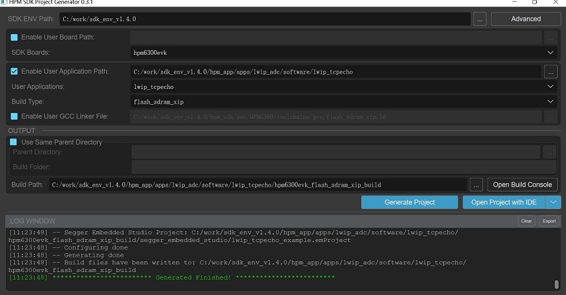
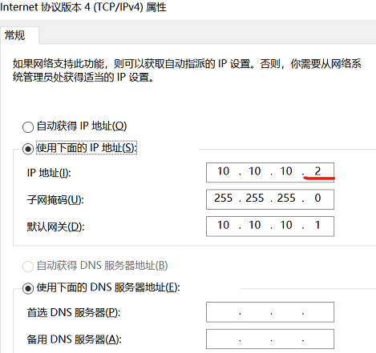
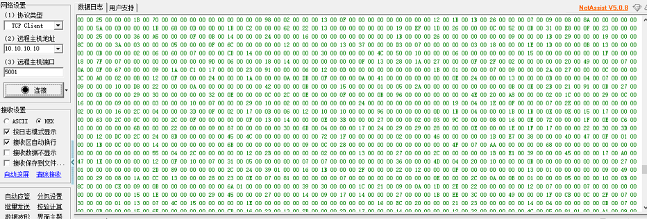
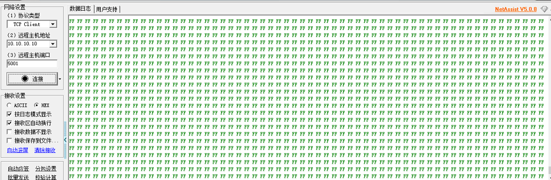
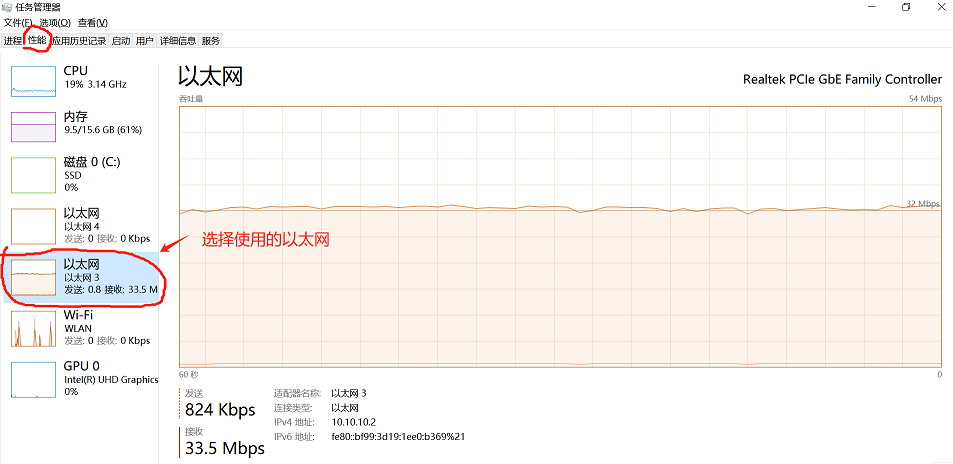

# LWIP+ADC高性能解决方案

## 介绍

-在HPM6700/6400、6300系列微控制器上均支持16位ADC采样和百兆以太网外设。HPM6300系列支持3个16位的ADC转换器，可以转换来自外部引脚以及芯片内部的模拟信号。ADC的转换精度设置为16位时，最大采样率2MSPS，ADC的转换精度设置为12位时，最大采样率4MSPS。ADC支持读取转换模式、周期转换模式、序列转换模式和抢占转换模式。

-本方案以HPM6300开发板为例介绍以2MSPS采样率进行16位ADC采样并将采样数据通过ENET LWIP TCP的方式发送到上位机的应用，ADC采样使用抢占转换模式、PWM触发的方式，ENET LWIP TCP每次发送1024个16位采样数据。

-该方案通过PWM特定时刻触发ADC采样和触发HDMA转换ADC数据，并依靠HDMA链式模式，做成循环链表，考虑到中断响应占用CPU资源，在链式任务中增加状态标识，从而不启用中断，以此达到ADC采样及数据转换全自动完成，无需CPU参与，且将转换后的数据放到ILM/DLM，CPU零等待访问。最终达到性能最优。

应用笔记[HPM ADC+ENET开发案列](./doc/HPM%20ADC+ENET开发案例_V1.1.pdf)
测试方法[HPM ADC+ENET测试方法](./doc/HPM%20ADC_LWIP测试方法.pdf)

## 框图及调用流程


## 例程


### 定义ADC的触发源PWM和使用的互联管理器：
```c
#define BOARD_APP_ADC16_PMT_PWM         HPM_PWM0
#define BOARD_APP_ADC16_PMT_TRGM        HPM_TRGM0
#define BOARD_APP_ADC16_PMT_TRGM_IN     HPM_TRGM0_INPUT_SRC_PWM0_CH8REF
#define BOARD_APP_ADC16_PMT_TRGM_OUT    TRGM_TRGOCFG_ADCX_PTRGI0A

```
### 定义ADC的采样率和每次传输的数据长度：
```c
#define APP_ADC_TRIG_FREQ                 (2000000U)
#define APP_ADC16_DMA_BUFF_LEN_IN_BYTES   (1024U)
#define APP_ADC16_TCP_SEND_SIZE           (APP_ADC16_DMA_BUFF_LEN_IN_BYTES*sizeof(uint16_t))

```

### 定义LWIP对ADC采样结果进行发送：
```c
void tcp_poll_handle(void)
{
 int ret;
 uint8_t *addr = NULL;
 uint32_t len = 0;
 if (adc_get_done(0) && adc_get_done(1))
 {
   printf("adc dual buff full up!\r\n");
 }
 if (send_newpcb != NULL)
 {
   if (adc_get_done(0))
   {
     adc_clear_done(0);
     tcp_block_write(adc_get_buf_addr_point(0), APP_ADC16_TCP_SEND_SIZE);
   }
   else if (adc_get_done(1))
   {
     adc_clear_done(1);
     tcp_block_write(adc_get_buf_addr_point(1), APP_ADC16_TCP_SEND_SIZE);
   }
 }
 else
 {
   adc_clear_done(0);
   adc_clear_done(1);
 }
}
```

### DEMO例程：
```c
int main(void)
{
    /* Initialize BSP */
    board_init();

    /* Initialize GPIOs */
    board_init_enet_pins(ENET);

    /* Reset an enet PHY */
    board_reset_enet_phy(ENET);

    #if __ENABLE_ENET_RECEIVE_INTERRUPT
    printf("This is an ethernet demo: TCP Echo (Interrupt Usage)\n");
    #else
    printf("This is an ethernet demo: TCP Echo (Polling Usage)\n");
    #endif

    printf("LwIP Version: %s\n", LWIP_VERSION_STRING);

    /* Set RGMII clock delay */
    #if RGMII
    board_init_enet_rgmii_clock_delay(ENET);
    #else
    /* Set RMII reference clock */
    board_init_enet_rmii_reference_clock(ENET, BOARD_ENET_RMII_INT_REF_CLK);
    printf("Reference Clock: %s\n", BOARD_ENET_RMII_INT_REF_CLK ? "Internal Clock" : "External Clock");
    #endif

    /* Start a board timer */
    board_timer_create(LWIP_APP_TIMER_INTERVAL, sys_timer_callback);

    /* Initialize MAC and DMA */
    if (enet_init(ENET) == 0) {
        /* Initialize the Lwip stack */
        lwip_init();
        netif_config();
        user_notification(&gnetif);

        /* Start services */
        enet_services(&gnetif);

        /* Initialize TCP echo */
        tcp_echo_init();

        //adc_pmt config, use hdma chain auto process
        //adc_pmt_auto_config();

        while (1) {
            enet_common_handler(&gnetif);
            tcp_poll_handle();
        }
    } else {
        printf("Enet initialization fails !!!\n");
        while (1) {

        }
    }

    return 0;
}
```
## 工程路径

- 工程路径：lwip_adc/software/lwip_tcpecho


## 工程配置

- 无

## 工程构建
- windows下工程构建\n


- linux工程构建编译
```shell
    //切换到示例应用目录
    cd hpm_apps\apps\lwip_adc\software\lwip_tcpecho
    //创建build目录
    mkdir build
    //切换目录到"build"
    cd build
    //Ninja-build产生构建文件
    cmake -GNinja  -DBOARD=hpm6300evk -DCMAKE_BUILD_TYPE=flash_xip ..
    //编译
    ninja
  ```

## 硬件设置
- 本方案使用的hpm6300evk板。
- 用户可以使用其他evk板，注意修改对应的pin脚。
- 本例程使用网线将PC和开发板连接起来。

## 运行环境
- PC端的IP地址和端口设置：\n

- 如果使用的开发板上晶振为50MHz，使用百兆以太网会有丢包问题，解决办法参考如下：
解决丢包问题方法[HPM6300EVK百兆丢包问题解决办法](./doc/HPM6300EVK百兆丢包问题解决办法.pdf)

## 工程运行

- 运行工程
- 使用串口助手观察是否有报错的日志。
- 使用网络助手观察以太网传输的ADC数据是否正确。
- 使用任务管理器的性能观测器查看以太网传输的速率和稳定性。

如下为ADC测试结果:
- ADC引脚分别接到GND和3.3V上进行测试，运行结果如下：




- 以太网传输速率和稳定性测试结果




## 软件API

:::{eval-rst}

关于软件API 请查看 `方案API 文档 <doc/api/index_zh.html>`_ 。
:::
