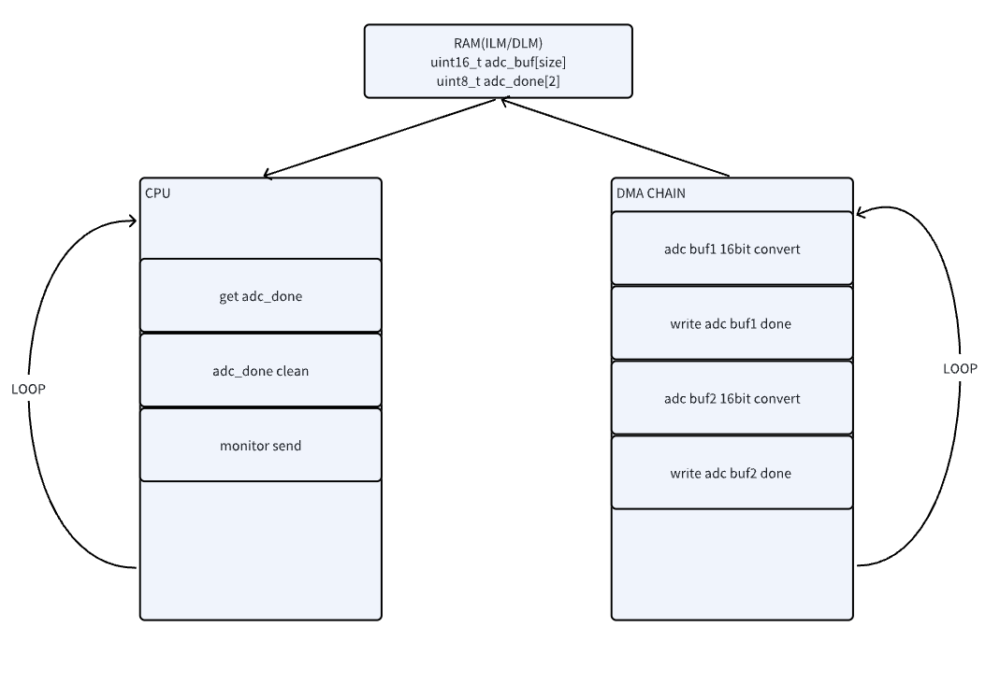
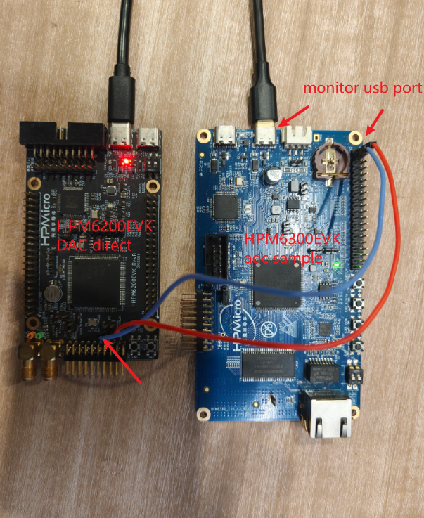
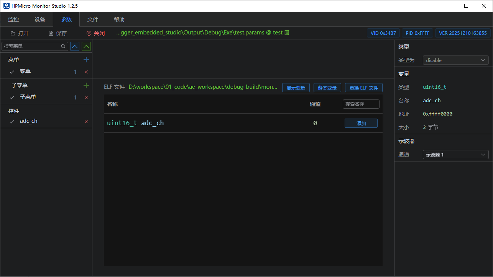
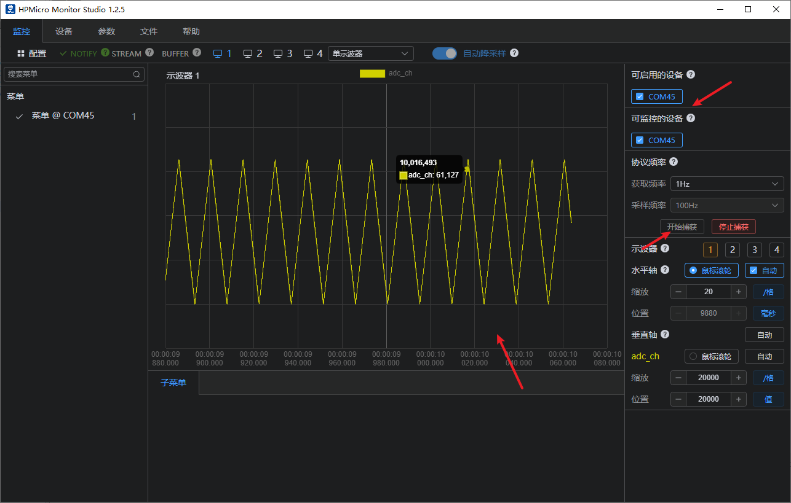

# HPM_MONITOR + ADC High-Performance Data Monitoring Solution

## Depend on SDK1.10.0

## Introduction

-This solution demonstrates how to achieve high-performance ADC sampling on Xianji Semiconductor MCU microcontrollers, transmitting data in real-time to a PC host via the hpm_monitor service for waveform display and analysis.

-The HPM6300 series supports three 16-bit ADC converters capable of converting analog signals from external pins and internal chip sources. When set to 16-bit resolution, the ADC achieves a maximum sampling rate of 2 MSPS; at 12-bit resolution, the maximum sampling rate reaches 4 MSPS. The ADC supports read conversion mode, cyclic conversion mode, sequential conversion mode, and interrupt conversion mode.

-This solution uses the HPM6300 development board as an example to demonstrate how to implement high-speed ADC sampling. It transmits the sampled data in real-time to the HPMicroMonitorStudio tool on a PC via the hpm_monitor service for waveform display. The solution employs interrupt-triggered conversion mode with PWM triggering and utilizes DMA for automatic data transfer, achieving efficient data acquisition and transmission.

## Features of the Solution

1. **High-Performance Data Acquisition:**
    - Supports 16-bit ADC sampling up to 2MSPS
    - Utilizes PWM triggering for precise, controllable sampling timing
    - DMA-automated data transfer with zero CPU intervention

2. **Real-Time Data Monitoring:**
    - Transmits ADC data in real-time via hpm_monitor service
    - Supports both USB and UART communication interfaces
    - Low-latency, high-bandwidth data transmission

3. **Flexible Data Processing:**
    - Supports multiple sampling modes (Notify/Stream/Buffer)
    - Customizable data reporting frequency and format
    - Supports multi-channel monitoring

4. **User-Friendly:**
    - Real-time waveform display via PC graphical interface
    - Parameters adjustable in real time


## Block Diagram and Call Flow



## Hardware Configuration

1. **Development Board Support**
   Supports the full range of HPM EVK development boards.
   Currently validated with HPM6300EVK; other EVKs require manual program or pin adjustments.

2. **Communication Interface Selection**
    - USB CDC: Recommended for high bandwidth and convenient connectivity
    - UART: Optional, supports up to 10Mbps baud rate

## Software Configuration

1. **Engineering Configuration (CMakeLists.txt)**

``` cmake
# Copyright (c) 2021 HPMicro
# SPDX-License-Identifier: BSD-3-Clause

cmake_minimum_required(VERSION 3.13)

set(APP_VERSION_STRING "\"1.10.0\"")

set(RV_ARCH "rv32imafc")
set(RV_ABI "ilp32f")

# set(SES_TOOLCHAIN_VARIANT "Andes")
# set(CONFIG_HPM_MATH 1)
# set(CONFIG_HPM_MATH_DSP 1)
# set(HPM_MATH_DSP_SES_LIB "libdspf")


set(CONFIG_A_HPMMONITOR 1)
# set(CONFIG_MONITOR_INTERFACE "uart")
set(CONFIG_MONITOR_INTERFACE "usb")
# set(CONFIG_MONITOR_INTERFACE "enet")

if("${CONFIG_MONITOR_INTERFACE}" STREQUAL "uart")

elseif("${CONFIG_MONITOR_INTERFACE}" STREQUAL "usb")
    set(CONFIG_CHERRYUSB 1)
    set(CONFIG_USB_DEVICE 1)
    set(CONFIG_USB_DEVICE_CDC 1)
elseif("${CONFIG_MONITOR_INTERFACE}" STREQUAL "enet")
    set(CONFIG_LWIP 1)
    set(CONFIG_ENET_PHY 1)
    set(APP_USE_ENET_PORT_COUNT 1)
    #set(APP_USE_ENET_ITF_RGMII 1)
    #set(APP_USE_ENET_ITF_RMII 1)
    #set(APP_USE_ENET_PHY_DP83867 1)
    #set(APP_USE_ENET_PHY_RTL8211 1)
    #set(APP_USE_ENET_PHY_DP83848 1)
    set(APP_USE_ENET_PHY_RTL8201 1)
    if(NOT DEFINED APP_USE_ENET_PORT_COUNT)
        message(FATAL_ERROR "APP_USE_ENET_PORT_COUNT is undefined!")
    endif()

    if(NOT APP_USE_ENET_PORT_COUNT EQUAL 1)
        message(FATAL_ERROR "This sample supports only one Ethernet port!")
    endif()

    if (APP_USE_ENET_ITF_RGMII AND APP_USE_ENET_ITF_RMII)
        message(FATAL_ERROR "This sample doesn't support more than one Ethernet phy!")
    endif()
endif()

find_package(hpm-sdk REQUIRED HINTS $ENV{HPM_SDK_BASE})

sdk_ld_options("-lm")
# sdk_compile_options("-O2")

if("${CONFIG_MONITOR_INTERFACE}" STREQUAL "uart")
    sdk_compile_definitions("-DCONFIG_UART_CHANNEL=1")
    sdk_compile_definitions("-DCONFIG_USE_CONSOLE_UART=1")
    sdk_compile_definitions("-DCONFIG_MONITOR_DBG_LEVEL=0")
elseif("${CONFIG_MONITOR_INTERFACE}" STREQUAL "usb")
    sdk_compile_definitions("-DCONFIG_USB_CHANNEL=1")
elseif("${CONFIG_MONITOR_INTERFACE}" STREQUAL "enet")
    sdk_compile_definitions("-DCONFIG_ENET_CHANNEL=1")
    sdk_inc(inc/enet)
endif()

sdk_compile_definitions("-DHPM_MONITOR_ENABLE=1")

project(hpm_monitor_adc)

sdk_inc(../common/adc)
sdk_inc(inc)
sdk_inc(inc/config)

sdk_app_src(src/main.c)
sdk_app_src(../common/adc/adc_16_pmt.c)

add_subdirectory(../../../../ hpm_apps/build_tmp)

generate_ses_project()

```

2. **MONITOR Config (monitor_config.h)**

```c
#define MONITOR_PID                  (0xFFFF)
#define MONITOR_VID                  (0x34B7) /* HPMicro VID */

#define MONITOR_PROFILE_MAXSIZE      (4096)

#define MONITOR_MEM_SIZE             (10*1024)

/*--------monitor log--------*/
#define CONFIG_MONITOR_PRINTF(...) printf(__VA_ARGS__)

#ifndef CONFIG_MONITOR_DBG_LEVEL
#define CONFIG_MONITOR_DBG_LEVEL MONITOR_DBG_INFO
#endif

#if defined(CONFIG_UART_CHANNEL) && CONFIG_UART_CHANNEL

#define MONITOR_UART_DMA_ENABLE

#ifndef CONFIG_USE_CONSOLE_UART
#define MONITOR_UART_BASE            HPM_UART2
#define MONITOR_UART_CLK_NAME        clock_uart2
#define MONITOR_UART_IRQ             IRQn_UART2
#define MONITOR_UART_BAUDRATE        (2000000UL)//(115200UL)

#ifdef MONITOR_UART_DMA_ENABLE
#define MONITOR_UART_TX_DMA_REQ        HPM_DMA_SRC_UART2_TX
#define MONITOR_UART_RX_DMA_REQ        HPM_DMA_SRC_UART2_RX
#endif

#else
#define MONITOR_UART_BASE            BOARD_CONSOLE_UART_BASE
#define MONITOR_UART_CLK_NAME        BOARD_CONSOLE_UART_CLK_NAME
#define MONITOR_UART_IRQ             BOARD_CONSOLE_UART_IRQ
#define MONITOR_UART_BAUDRATE        BOARD_CONSOLE_UART_BAUDRATE

#ifdef MONITOR_UART_DMA_ENABLE
#define MONITOR_UART_TX_DMA_REQ      BOARD_CONSOLE_UART_TX_DMA_REQ
#define MONITOR_UART_RX_DMA_REQ      BOARD_CONSOLE_UART_RX_DMA_REQ
#endif
#endif

#ifdef MONITOR_UART_DMA_ENABLE
#define MONITOR_UART_DMA_CONTROLLER    HPM_HDMA
#define MONITOR_UART_DMAMUX_CONTROLLER HPM_DMAMUX
#define MONITOR_UART_TX_DMA_CHN        (0U)
#define MONITOR_UART_RX_DMA_CHN        (1U)
#define MONITOR_UART_TX_DMAMUX_CHN     DMA_SOC_CHN_TO_DMAMUX_CHN(MONITOR_UART_DMA_CONTROLLER, MONITOR_UART_TX_DMA_CHN)
#define MONITOR_UART_RX_DMAMUX_CHN     DMA_SOC_CHN_TO_DMAMUX_CHN(MONITOR_UART_DMA_CONTROLLER, MONITOR_UART_RX_DMA_CHN)
#define MONITOR_UART_DMA_IRQ           IRQn_HDMA
#endif

#endif

#if defined(CONFIG_USB_CHANNEL) && CONFIG_USB_CHANNEL

#define CONFIG_USB_POLLING_ENABLE

#include "usb_config.h"
#define MONITOR_USB_BASE             CONFIG_HPM_USBD_BASE
#define MONITOR_USB_BUSID            0
#define MONITOR_USB_IRQ              CONFIG_HPM_USBD_IRQn
#define MONITOR_USB_PRIORITY         2

#endif

```

## Core Code Implementation

 - **Define the trigger source PWM for the ADC and the interconnect manager used.**
```c
#define BOARD_APP_ADC16_PMT_PWM         HPM_PWM0
#define BOARD_APP_ADC16_PMT_TRGM        HPM_TRGM0
#define BOARD_APP_ADC16_PMT_TRGM_IN     HPM_TRGM0_INPUT_SRC_PWM0_CH8REF
#define BOARD_APP_ADC16_PMT_TRGM_OUT    TRGM_TRGOCFG_ADCX_PTRGI0A

```
  - **Define the ADC sampling rate and the data length per transmission.**
```c
#define APP_ADC16_DMA_BUFF_LEN_IN_BYTES   (1024U)
#define APP_ADC16_TCP_SEND_SIZE           (APP_ADC16_DMA_BUFF_LEN_IN_BYTES*sizeof(uint16_t))

```

  - **User-Defined Channel Definition**

```c
MONITOR_DEFINE_GLOBAL_VAR(adc_ch, 0, uint16_t, ADC_SAMPLE_FREQ, APP_ADC16_DMA_BUFF_LEN_IN_BYTES);
```

  - **MONITOR sends ADC samples**
```c
static void monitor_adc_handle(void)
{
    if (adc_get_done(0) && adc_get_done(1))
    {
        printf("adc dual buff full up!\r\n");
    }
    if (adc_get_done(0) && monitor_report_ch_is_released(0))
    {
        adc_clear_done(0);
        monitor_channel_report_array(0, adc_get_buf_addr_point(0), APP_ADC16_DMA_BUFF_LEN_IN_BYTES);
    }
    else if (adc_get_done(1) && monitor_report_ch_is_released(0))
    {
        adc_clear_done(1);
        monitor_channel_report_array(0, adc_get_buf_addr_point(1), APP_ADC16_DMA_BUFF_LEN_IN_BYTES);
    }
}
```

  - **DEMO Example**
```c
int main(void)
{
    board_init();
    printf("monitor adc demo!\r\n");
    printf("__DATE__:%s, __TIME__:%s\r\n", __DATE__, __TIME__);

    monitor_init();

    adc_pmt_auto_config(ADC_SAMPLE_FREQ);
    while (1)
    {
        monitor_adc_handle();
        monitor_handle();
    }
    return 0;
}
```

## Project Path

- Project Path：monitor_adc/software/hpm_monitor

## Engineering Construction
- Building projects on Windows


- Linux Project Build and Compilation
```shell
    //Switch to the sample application directory
    cd hpm_apps\apps\monitor_adc\software\hpm_monitor
    //Create the build directory
    mkdir build
    //Switch directory to"build"
    cd build
    //Ninja-build
    cmake -GNinja  -DBOARD=hpm6300evk -DCMAKE_BUILD_TYPE=flash_xip ..
    //build
    ninja
  ```

## Hardware Configuration
- This solution uses the hpm6300evk board.
- Users may employ other EVK boards, but must modify corresponding pins accordingly.
- Connect the hpm6300evk to a PC via USB/UART.
- Connect the hpm6300evk ADC pin to the hpm6200evk DAC pin (digital-to-analog conversion).
- The HPM6200EVK runs the DAC example program, directly generating a triangle wave, while the HPM6300EVK's ADC performs data acquisition.
  

## Project Operation

- Run the project.
- Use Serial Port Assistant to check for error logs.
- Run the HP MicroMonitor Studio tool on the PC.
- Configure HP MicroMonitor Studio to sample adc_ch data and monitor the ADC waveform with an oscilloscope.

## Host Computer Configuration

 For detailed configuration, please refer to [hpm_monitor Service Description](hpm_monitor_instruction_zh)

1. HPMicroMonitorStudio Config
    - Open the HPMicroMonitorStudio tool
    - Select the correct communication port (USB or COM port)
    - Set the baud rate (if using UART)
    - Connect the device

2. Waveform Display Configuration
    - Add waveform display
    - Select adc_ch
    - Start real-time display
  
  

## Operational Effect

  

## Important Notes
   - Waveform frame loss indicates packet loss or other transmission issues. The performance of the HPMicroMonitorStudio tool is still undergoing continuous optimization; it is advisable to reduce the ADC sampling frequency appropriately.

## API

:::{eval-rst}

About software API: `API doc <../../_static/apps/monitor_adc/html/index.html>`_ 。
:::