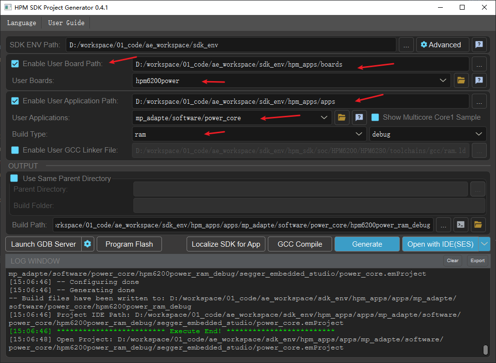

# 电源通用软件架构方案

## 依赖SDK1.10.0

## 概述

- HPM Power方案是汇总电源MCU的需求，整合成一个通用的软件结构方案，并提供各类API接口。

- HPM Power Driver API 是基于HPM Software Development Kit (HPM SDK) 封装的针对电源类的驱动API接口。

- Power API将硬件上PWM对、PWM、ADC通道抽象成自定义ID序号，上层应用只需关注抽象的ID序号即可。

- Power API支持生成各种成对的PWM波形，例如互补、中心对齐相位、边沿对齐，支持死区插入、故障保护、强制输出等功能。

- Power API同样支持单路的PWM波形，单路的PWM波形也支持故障保护、强制输出等功能。

- Power API支持将PWM对或单路PWM 和多路ADC绑定，支持配置PWM任意占空比时刻触发ADC采样，ADC采样结束后自动触发回调。

- Power API支持PWM对或单路PWM 配置在PWM任意占空比时刻触发DMA请求，可借助DMA搬运采样一组(数量可配)连续的ADC值。

- Power API DMA支持链式模式，支持双缓冲模式，可自动周期性PING/PONG模式下的采样一组(数量可配)ADC值而无需CPU干预，且在每组采样结束后自动触发回调，同时自动触发下一组采样。

- Power API支持设置PWM对/PWM 频率、占空比、触发时刻等。

- Power API支持创建高精定时器(单位:微妙)。

注意：
- 本方案不包括电源环路算法内容。
- 同一个PWM控制器，修改任意通道PWM频率会影响当前控制器所有通道频率。

## 框图及调用流程


## 例程

### PWM对 MAP表创建：

```c
//power core ,warning: num1/num3 cmp all use 2
static const mp_pwm_pair_map_t pwm_pair_map[] =
{
    //CON0
    {MP_PWM_PAIR_NUM_0, {{IOC_PAD_PB12, IOC_PB12_FUNC_CTL_PWM0_P_0}, {IOC_PAD_PB13, IOC_PB13_FUNC_CTL_PWM0_P_1}}, HPM_PWM0, 0, 0,
                        {{MP_PWM_TRIGGER_MODE_OUTPUT, 10, 10, HPM_TRGM0, HPM_TRGM0_INPUT_SRC_PWM0_CH10REF, TRGM_TRGOCFG_ADCX_PTRGI0A}}, {0}},
    {MP_PWM_PAIR_NUM_1, {{IOC_PAD_PB14, IOC_PB14_FUNC_CTL_PWM0_P_2}, {IOC_PAD_PB15, IOC_PB15_FUNC_CTL_PWM0_P_3}}, HPM_PWM0, 2, 2,
                        {{MP_PWM_TRIGGER_MODE_OUTPUT, 11, 11, HPM_TRGM0, HPM_TRGM0_INPUT_SRC_PWM0_CH11REF, TRGM_TRGOCFG_ADCX_PTRGI0B}}, {0}},
    {MP_PWM_PAIR_NUM_2, {{IOC_PAD_PB28, IOC_PB28_FUNC_CTL_PWM2_P_04}, {IOC_PAD_PB29, IOC_PB29_FUNC_CTL_PWM2_P_05}}, HPM_PWM2, 4, 4,
                        {{MP_PWM_TRIGGER_MODE_OUTPUT, 12, 12, HPM_TRGM2, HPM_TRGM2_INPUT_SRC_PWM2_CH12REF, TRGM_TRGOCFG_ADCX_PTRGI0A}}, {0}},
    {MP_PWM_PAIR_NUM_3, {{IOC_PAD_PB30, IOC_PB30_FUNC_CTL_PWM2_P_06}, {IOC_PAD_PB31, IOC_PB31_FUNC_CTL_PWM2_P_07}}, HPM_PWM2, 6, 6,
                        {{MP_PWM_TRIGGER_MODE_OUTPUT, 13, 13, HPM_TRGM2, HPM_TRGM2_INPUT_SRC_PWM2_CH13REF, TRGM_TRGOCFG_ADCX_PTRGI0B}}, {0}},
    //CON1
    {MP_PWM_PAIR_NUM_4, {{IOC_PAD_PB00, IOC_PB00_FUNC_CTL_PWM1_P_0}, {IOC_PAD_PB01, IOC_PB01_FUNC_CTL_PWM1_P_1}}, HPM_PWM1, 0, 0,
                       {{MP_PWM_TRIGGER_MODE_OUTPUT, 10, 10, HPM_TRGM1, HPM_TRGM1_INPUT_SRC_PWM1_CH10REF, TRGM_TRGOCFG_ADCX_PTRGI0A}}, {0}},
    {MP_PWM_PAIR_NUM_5, {{IOC_PAD_PB02, IOC_PB02_FUNC_CTL_PWM1_P_2}, {IOC_PAD_PB03, IOC_PB03_FUNC_CTL_PWM1_P_3}}, HPM_PWM1, 2, 2,
                       {{MP_PWM_TRIGGER_MODE_OUTPUT, 11, 11, HPM_TRGM1, HPM_TRGM1_INPUT_SRC_PWM1_CH11REF, TRGM_TRGOCFG_ADCX_PTRGI0B}}, {0}},
    {MP_PWM_PAIR_NUM_6, {{IOC_PAD_PA24, IOC_PA24_FUNC_CTL_PWM3_P_04}, {IOC_PAD_PA25, IOC_PA25_FUNC_CTL_PWM3_P_05}}, HPM_PWM3, 4, 4,
                       {{MP_PWM_TRIGGER_MODE_OUTPUT, 12, 12, HPM_TRGM3, HPM_TRGM3_INPUT_SRC_PWM3_CH12REF, TRGM_TRGOCFG_ADCX_PTRGI0A}}, {0}},
    {MP_PWM_PAIR_NUM_7, {{IOC_PAD_PA26, IOC_PA26_FUNC_CTL_PWM3_P_06}, {IOC_PAD_PA27, IOC_PA27_FUNC_CTL_PWM3_P_07}}, HPM_PWM3, 6, 6,
                       {{MP_PWM_TRIGGER_MODE_OUTPUT, 13, 13, HPM_TRGM3, HPM_TRGM3_INPUT_SRC_PWM3_CH13REF, TRGM_TRGOCFG_ADCX_PTRGI0B}}, {0}},
    //CON2
    {MP_PWM_PAIR_NUM_8, {{IOC_PAD_PB24, IOC_PB24_FUNC_CTL_PWM2_P_00}, {IOC_PAD_PB25, IOC_PB25_FUNC_CTL_PWM2_P_01}}, HPM_PWM2, 0, 0,
                       {{MP_PWM_TRIGGER_MODE_OUTPUT, 10, 10, HPM_TRGM2, HPM_TRGM2_INPUT_SRC_PWM2_CH10REF, TRGM_TRGOCFG_ADCX_PTRGI0A}}, {0}},
    {MP_PWM_PAIR_NUM_9, {{IOC_PAD_PB26, IOC_PB26_FUNC_CTL_PWM2_P_02}, {IOC_PAD_PB27, IOC_PB27_FUNC_CTL_PWM2_P_03}}, HPM_PWM2, 2, 2,
                       {{MP_PWM_TRIGGER_MODE_OUTPUT, 11, 11, HPM_TRGM2, HPM_TRGM2_INPUT_SRC_PWM2_CH11REF, TRGM_TRGOCFG_ADCX_PTRGI0B}}, {0}},
    {MP_PWM_PAIR_NUM_10, {{IOC_PAD_PB16, IOC_PB16_FUNC_CTL_PWM0_P_4}, {IOC_PAD_PB17, IOC_PB17_FUNC_CTL_PWM0_P_5}}, HPM_PWM0, 4, 4,
                       {{MP_PWM_TRIGGER_MODE_OUTPUT, 12, 12, HPM_TRGM0, HPM_TRGM0_INPUT_SRC_PWM0_CH12REF, TRGM_TRGOCFG_ADCX_PTRGI0A}}, {0}},
    {MP_PWM_PAIR_NUM_11, {{IOC_PAD_PB18, IOC_PB18_FUNC_CTL_PWM0_P_6}, {IOC_PAD_PB19, IOC_PB19_FUNC_CTL_PWM0_P_7}}, HPM_PWM0, 6, 6,
                       {{MP_PWM_TRIGGER_MODE_OUTPUT, 13, 13, HPM_TRGM0, HPM_TRGM0_INPUT_SRC_PWM0_CH13REF, TRGM_TRGOCFG_ADCX_PTRGI0B}}, {0}},
    //CON3
    {MP_PWM_PAIR_NUM_12, {{IOC_PAD_PA20, IOC_PA20_FUNC_CTL_PWM3_P_00}, {IOC_PAD_PA21, IOC_PA21_FUNC_CTL_PWM3_P_01}}, HPM_PWM3, 0, 0,
                       {{MP_PWM_TRIGGER_MODE_OUTPUT, 10, 10, HPM_TRGM3, HPM_TRGM3_INPUT_SRC_PWM3_CH10REF, TRGM_TRGOCFG_ADCX_PTRGI0A}}, {0}},
    {MP_PWM_PAIR_NUM_13, {{IOC_PAD_PA22, IOC_PA22_FUNC_CTL_PWM3_P_02}, {IOC_PAD_PA23, IOC_PA23_FUNC_CTL_PWM3_P_03}}, HPM_PWM3, 2, 2,
                       {{MP_PWM_TRIGGER_MODE_OUTPUT, 11, 11, HPM_TRGM3, HPM_TRGM3_INPUT_SRC_PWM3_CH11REF, TRGM_TRGOCFG_ADCX_PTRGI0B}}, {0}},
    {MP_PWM_PAIR_NUM_14, {{IOC_PAD_PB04, IOC_PB04_FUNC_CTL_PWM1_P_4}, {IOC_PAD_PB05, IOC_PB05_FUNC_CTL_PWM1_P_5}}, HPM_PWM1, 4, 4,
                       {{MP_PWM_TRIGGER_MODE_OUTPUT, 12, 12, HPM_TRGM1, HPM_TRGM1_INPUT_SRC_PWM1_CH12REF, TRGM_TRGOCFG_ADCX_PTRGI0A}}, {0}},
    {MP_PWM_PAIR_NUM_15, {{IOC_PAD_PB06, IOC_PB06_FUNC_CTL_PWM1_P_6}, {IOC_PAD_PB07, IOC_PB07_FUNC_CTL_PWM1_P_7}}, HPM_PWM1, 6, 6,
                       {{MP_PWM_TRIGGER_MODE_OUTPUT, 13, 13, HPM_TRGM1, HPM_TRGM1_INPUT_SRC_PWM1_CH13REF, TRGM_TRGOCFG_ADCX_PTRGI0B}}, {0}},
};
```

### ADC MAP表创建：
```c
static const mp_adc_map_t adc_map[] =
{
    //CON0
    {MP_ADC_NUM_0,  IOC_PAD_PC04, HPM_ADC0, 0},
    {MP_ADC_NUM_1,  IOC_PAD_PC05, HPM_ADC0, 1},
    {MP_ADC_NUM_2,  IOC_PAD_PC08, HPM_ADC1, 0},
    {MP_ADC_NUM_3,  IOC_PAD_PC09, HPM_ADC1, 1},
    {MP_ADC_NUM_4,  IOC_PAD_PC12, HPM_ADC2, 0},
    {MP_ADC_NUM_5,  IOC_PAD_PC13, HPM_ADC2, 1},
    //CON1
    {MP_ADC_NUM_6,  IOC_PAD_PC16, HPM_ADC0, 12},
    {MP_ADC_NUM_7,  IOC_PAD_PC17, HPM_ADC0, 13},
    {MP_ADC_NUM_8,  IOC_PAD_PC20, HPM_ADC1, 12},
    {MP_ADC_NUM_9,  IOC_PAD_PC21, HPM_ADC1, 13},
    {MP_ADC_NUM_10, IOC_PAD_PC24, HPM_ADC2, 12},
    {MP_ADC_NUM_11, IOC_PAD_PC25, HPM_ADC2, 13},
    //CON2
    {MP_ADC_NUM_12, IOC_PAD_PC06, HPM_ADC0, 2},
    {MP_ADC_NUM_13, IOC_PAD_PC07, HPM_ADC0, 3},
    {MP_ADC_NUM_14, IOC_PAD_PC10, HPM_ADC1, 2},
    {MP_ADC_NUM_15, IOC_PAD_PC11, HPM_ADC1, 3},
    {MP_ADC_NUM_16, IOC_PAD_PC14, HPM_ADC2, 2},
    {MP_ADC_NUM_17, IOC_PAD_PC15, HPM_ADC2, 3},
    //CON3
    {MP_ADC_NUM_18, IOC_PAD_PC18, HPM_ADC0, 14},
    {MP_ADC_NUM_19, IOC_PAD_PC19, HPM_ADC0, 15},
    {MP_ADC_NUM_20, IOC_PAD_PC22, HPM_ADC1, 14},
    {MP_ADC_NUM_21, IOC_PAD_PC23, HPM_ADC1, 15},
    {MP_ADC_NUM_22, IOC_PAD_PC26, HPM_ADC2, 14},
    {MP_ADC_NUM_23, IOC_PAD_PC27, HPM_ADC2, 15},
};
```

### 定义MP Power数据对象：
```c
#define MP_PAIR_COUNT    2
#define MP_PAIR_ADC_MAX   6

static hpm_mp_t hpm_power;
static hpm_pwm_pair_t hpm_pwm_pair[MP_PAIR_COUNT];
static hpm_adc_t hpm_adc[MP_PAIR_COUNT][MP_PAIR_ADC_MAX];
```

### 定义MP PWM对ADC采样结束回调：
```c
static void hpm_mp_pair1_adc_cb(void* handle)
{
     hpm_pwm_pair_t* pwm_pair_t = (hpm_pwm_pair_t*)handle;
     //注意:当开启打印调试时，必须要把PWM频率降低(降低中断频率)，否则中断会溢出导致异常
     for (int i = 0; i < pwm_pair_t->adc_count; i++)
     {
        printf("adc1[%d]:%d\n", pwm_pair_t->adc_pack[i].adc_index, pwm_pair_t->adc_pack[i].adc_data);
     }
     printf("---\n");
}
```

### 定义MP 高精定时器回调：
```c
static void hpm_timer_cb(void)
{
    printf("timer in!\n");
}
```

### DEMO例程：
```c

int main(void)
{
    int ret;
    board_init();

    demo_leds_init();

    demo_keys_init(hpm_keys_cb);

    demo_gpios_init(DEMO_CONN0);

    hpm_mp_api_pwm_pair_set_map(pwm_pair_map, sizeof(pwm_pair_map) / sizeof(mp_pwm_pair_map_t));
    hpm_mp_api_adc_set_map(adc_map, sizeof(adc_map) / sizeof(mp_adc_map_t));

    printf("hpm power initing...\n");

    hpm_mp_api_pair_pwm_io_init(MP_PWM_PAIR_NUM_0);
    hpm_mp_api_pair_pwm_io_init(MP_PWM_PAIR_NUM_2);

    hpm_mp_api_adc_io_init(MP_ADC_NUM_0);
    hpm_mp_api_adc_io_init(MP_ADC_NUM_1);
    hpm_mp_api_adc_io_init(MP_ADC_NUM_2);
    hpm_mp_api_adc_io_init(MP_ADC_NUM_3);
    hpm_mp_api_adc_io_init(MP_ADC_NUM_4);
    hpm_mp_api_adc_io_init(MP_ADC_NUM_5);

    hpm_mp_pwm_pair_get_default(MP_PWM_PAIR_NUM_0, 200000U, &hpm_pwm_pair[0]);

    hpm_mp_adc_get_default(MP_ADC_NUM_0, &hpm_adc[0][0]);
    hpm_mp_adc_get_default(MP_ADC_NUM_1, &hpm_adc[0][1]);
    hpm_mp_adc_get_default(MP_ADC_NUM_2, &hpm_adc[0][2]);
    hpm_mp_adc_get_default(MP_ADC_NUM_3, &hpm_adc[0][3]);
    hpm_mp_adc_get_default(MP_ADC_NUM_4, &hpm_adc[0][4]);
    hpm_mp_adc_get_default(MP_ADC_NUM_5, &hpm_adc[0][5]);

    hpm_mp_pwm_pair_get_default(MP_PWM_PAIR_NUM_2, 200000U, &hpm_pwm_pair[1]);

    hpm_mp_api_get_default(&hpm_power);

    hpm_pwm_pair[0].adc_intr_index = MP_ADC_NUM_5; //ADC触发中断的ID号
    hpm_pwm_pair[0].adc_count = 6;  // 绑定6个ADC触发采样
    hpm_pwm_pair[0].adc_pack = &hpm_adc[0][0]; //绑定的ADC PACK指针
    hpm_pwm_pair[0].pwm_pair_mode = MP_PWM_PAIR_MODE_REVERSE; //互补模式
    hpm_pwm_pair[0].phase_angle = MP_PWM_PAIR_PHASE_ANGLE_0; //只有在相位模式下支持相位度数调节
    hpm_pwm_pair[0].deadzone_start_halfcycle = 50;  //死区插入前半部半周期时长
    hpm_pwm_pair[0].deadzone_end_halfcycle = 50;    //死区插入后半部半周期时长
    hpm_pwm_pair[0].duty_count = hpm_pwm_pair[0].reload_count >> 1; //初始占空比
    hpm_pwm_pair[0].shadow_dutycount = 1;  //影子寄存器生效时刻
    hpm_pwm_pair[0].trigger_count = 1;  //硬件触发总数
    hpm_pwm_pair[0].trigger_enable = (1 << MP_PWM_TRIGGER_ADC_BIT); //PWM触发ADC使能
    hpm_pwm_pair[0].trigger_dutycount[MP_PWM_TRIGGER_ADC_BIT] = 1; //PWM触发ADC时刻
    hpm_pwm_pair[0].adc_over_callback = hpm_mp_pair1_adc_cb; //ADC采样完中断回调

    hpm_pwm_pair[1].adc_intr_index = 0;
    hpm_pwm_pair[1].adc_count = 0;
    hpm_pwm_pair[1].adc_pack = NULL;
    hpm_pwm_pair[1].pwm_pair_mode = MP_PWM_PAIR_MODE_REVERSE;
    hpm_pwm_pair[1].phase_angle = MP_PWM_PAIR_PHASE_ANGLE_0;
    //hpm_pwm_pair[1].pwm_pair_mode = MP_PWM_PAIR_MODE_CENTRAL; //中心对齐相位模式
    //hpm_pwm_pair[1].phase_angle = MP_PWM_PAIR_PHASE_ANGLE_90; //相位90度
    hpm_pwm_pair[1].deadzone_start_halfcycle = 50;
    hpm_pwm_pair[1].deadzone_end_halfcycle = 50;
    hpm_pwm_pair[1].duty_count = hpm_pwm_pair[1].reload_count >> 1;
    hpm_pwm_pair[1].shadow_dutycount = 1;
    hpm_pwm_pair[1].trigger_count = 0;
    hpm_pwm_pair[1].trigger_enable = 0;
    hpm_pwm_pair[1].trigger_dutycount[MP_PWM_TRIGGER_ADC_BIT] = 1;
    hpm_pwm_pair[1].adc_over_callback = NULL;

    hpm_power.pwm_pair_count = 2; //PWM对数总和
    hpm_power.pwm_sync_time_us = 0; //PWM对同步时长
    hpm_power.pwm_pair = hpm_pwm_pair;

    ret = hpm_mp_api_init(&hpm_power);

    printf("hpm power init done, ret:%d\n", ret);

    ret = hpm_mp_timer_create(1000*1000, hpm_timer_cb); //定时器创建

    //修改占空比
    hpm_mp_api_pwmpair_duty(&hpm_pwm_pair[0], hpm_pwm_pair[0].reload_count >> 1);
    hpm_mp_api_pwmpair_duty(&hpm_pwm_pair[1], hpm_pwm_pair[1].reload_count >> 1);

    while (1)
    {

    }

    return 0;
}
```

## 工程路径

- 工程路径：apps/mp_adapte/software/power_core


## 工程配置

无

## 工程构建
- windows下工程构建


- linux工程构建编译
```shell
    //切换到示例应用目录
    cd hpm_apps\apps\mp_adapte\software\power_core
    //创建build目录
    mkdir build
    //切换目录到"build"
    cd build
    //Ninja-build产生构建文件
    cmake -GNinja -DBOARD_SEARCH_PATH=/home/work/workspace/hpm_apps/boards -DBOARD=hpm6200power -DCMAKE_BUILD_TYPE=debug ..
    //编译
    ninja
  ```

## 硬件设置
- 本方案使用的hpm6200power板。
- 用户可以使用evk板，注意修改对应的pin脚。


## 工程运行

- 运行工程
- 使用逻辑分析仪或示波器，连接要查看的多路PWM对及死区时间或PWM的波形。
- 模拟输入ADC采集电压，通过增加打印查看采样ADC值。
- 模拟外部故障输入，通过逻辑分析仪或示波器查看故障保护是否响应。

如下运行波形图:
- PWM对互补波形/PWM对中心相位波形


- PWM对同时修改频率和占空比


- PWM对触发采样多路ADC


## API

:::{eval-rst}

关于软件API 请查看 `方案API 文档 <../../_static/apps/mp_adapte/html/index.html>`_ 。
:::
