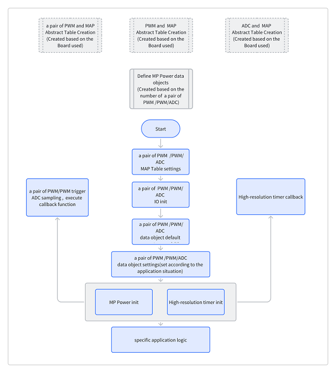
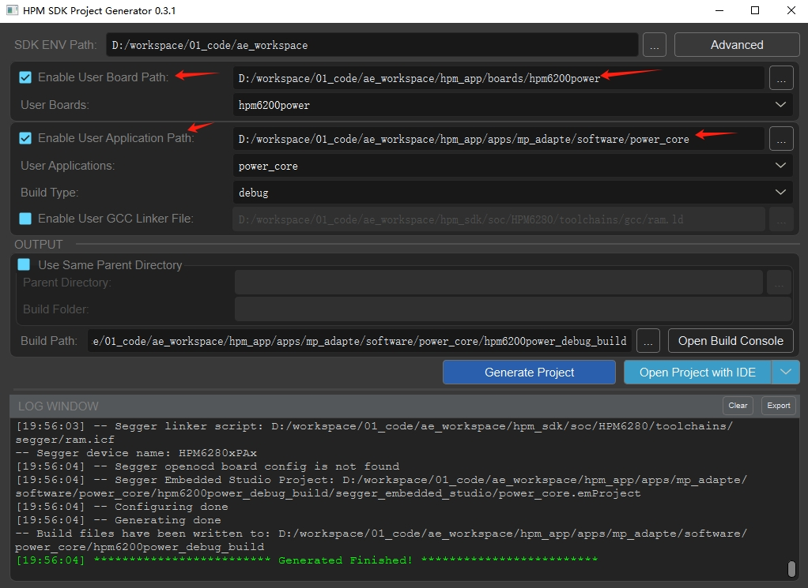
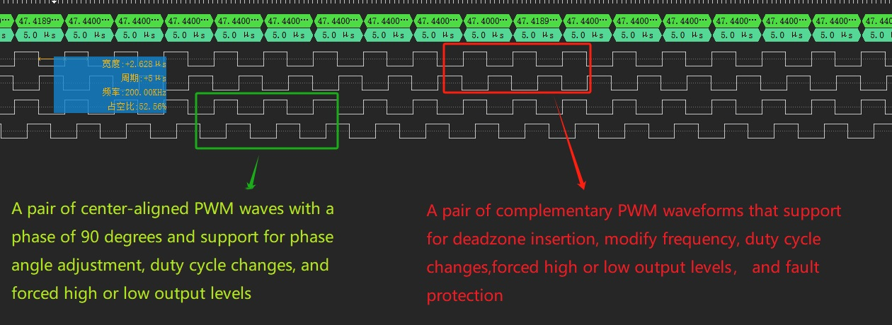
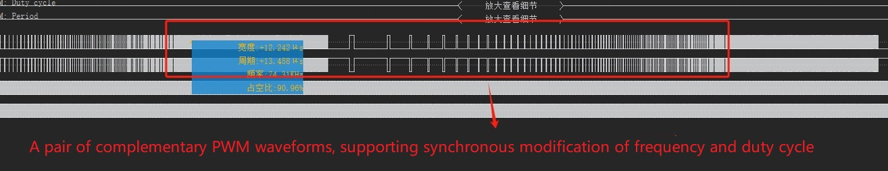
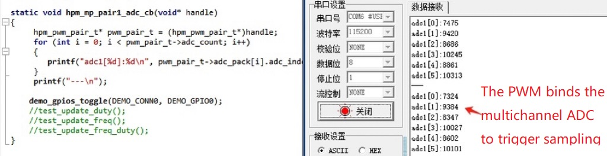

# General software architecture solution for Power


## Introduction

- The HPM Power solution summarizes the requirements of the power MCU, integrates them into a universal software solution, and provides various Application Programming Interface.

- HPM Power Driver API is a power driver API interface based on the HPM Software Development Kit (HPM SDK).

- The Power API abstracts a pair of PWM, PWM, and ADC channels on the hardware into custom ID numbers, allowing upper-layer applications to focus solely on the abstracted ID numbers.

- The Power API supports generating various paired PWM waveforms, such as complementary, center aligned waveforms, and edge aligned waveforms. It also includes features like deadzone insertion, fault protection, and forced outputs.

- The Power API also supports a single PWM waveform, and a single PWM waveform also supports functions such as fault protection and forced output.

- The Power API supports binding a pair of PWM or single PWM to a multi-channel ADC. It supports configuring the PWM to trigger ADC sampling at any duty cycle, and automatically trigger a callback function after the ADC sampling.

- The Power API supports the configuration of a pair of PWM or single PWM to trigger a DMA request at any PWM duty cycle, allowing sequential ADC values (adjustable) to be sampled by DMA transport.

- The Power API DMA supports chain mode and dual-buffer mode, enabling the automatic periodic sampling of ADC values (adjustable) in PING/PONG modes without CPU intervention. After each group of samples is acquired, it automatically triggers a callback funciton and initiates the sampling of the next group.

- The Power API supports configuring PWM frequency, duty cycle, trigger time, etc.

- The Power API supports the creation of high-precision timers (unit: microseconds). 

Notes：
- This solution does not include power loop algorithm content.
- For the same PWM controller, modifying the PWM frequency of any channel will influence the frequency of all channels on the current controller.

## general_solution



## Sample

### A pair of PWM MAP table creation：

```c
//power core ,warning: num1/num3 cmp all use 2
static const mp_pwm_pair_map_t pwm_pair_map[] =
{
    //CON0
    {MP_PWM_PAIR_NUM_0, {{IOC_PAD_PB12, IOC_PB12_FUNC_CTL_PWM0_P_0}, {IOC_PAD_PB13, IOC_PB13_FUNC_CTL_PWM0_P_1}}, HPM_PWM0, 0, 0,
                        {{MP_PWM_TRIGGER_MODE_OUTPUT, 10, 10, HPM_TRGM0, HPM_TRGM0_INPUT_SRC_PWM0_CH10REF, TRGM_TRGOCFG_ADCX_PTRGI0A}}, {0}},
    {MP_PWM_PAIR_NUM_1, {{IOC_PAD_PB14, IOC_PB14_FUNC_CTL_PWM0_P_2}, {IOC_PAD_PB15, IOC_PB15_FUNC_CTL_PWM0_P_3}}, HPM_PWM0, 2, 2,
                        {{MP_PWM_TRIGGER_MODE_OUTPUT, 11, 11, HPM_TRGM0, HPM_TRGM0_INPUT_SRC_PWM0_CH11REF, TRGM_TRGOCFG_ADCX_PTRGI0B}}, {0}},
    {MP_PWM_PAIR_NUM_2, {{IOC_PAD_PB28, IOC_PB28_FUNC_CTL_PWM2_P_04}, {IOC_PAD_PB29, IOC_PB29_FUNC_CTL_PWM2_P_05}}, HPM_PWM2, 4, 4,
                        {{MP_PWM_TRIGGER_MODE_OUTPUT, 12, 12, HPM_TRGM2, HPM_TRGM2_INPUT_SRC_PWM2_CH12REF, TRGM_TRGOCFG_ADCX_PTRGI0A}}, {0}},
    {MP_PWM_PAIR_NUM_3, {{IOC_PAD_PB30, IOC_PB30_FUNC_CTL_PWM2_P_06}, {IOC_PAD_PB31, IOC_PB31_FUNC_CTL_PWM2_P_07}}, HPM_PWM2, 6, 6,
                        {{MP_PWM_TRIGGER_MODE_OUTPUT, 13, 13, HPM_TRGM2, HPM_TRGM2_INPUT_SRC_PWM2_CH13REF, TRGM_TRGOCFG_ADCX_PTRGI0B}}, {0}},
    //CON1
    {MP_PWM_PAIR_NUM_4, {{IOC_PAD_PB00, IOC_PB00_FUNC_CTL_PWM1_P_0}, {IOC_PAD_PB01, IOC_PB01_FUNC_CTL_PWM1_P_1}}, HPM_PWM1, 0, 0,
                       {{MP_PWM_TRIGGER_MODE_OUTPUT, 10, 10, HPM_TRGM1, HPM_TRGM1_INPUT_SRC_PWM1_CH10REF, TRGM_TRGOCFG_ADCX_PTRGI0A}}, {0}},
    {MP_PWM_PAIR_NUM_5, {{IOC_PAD_PB02, IOC_PB02_FUNC_CTL_PWM1_P_2}, {IOC_PAD_PB03, IOC_PB03_FUNC_CTL_PWM1_P_3}}, HPM_PWM1, 2, 2,
                       {{MP_PWM_TRIGGER_MODE_OUTPUT, 11, 11, HPM_TRGM1, HPM_TRGM1_INPUT_SRC_PWM1_CH11REF, TRGM_TRGOCFG_ADCX_PTRGI0B}}, {0}},
    {MP_PWM_PAIR_NUM_6, {{IOC_PAD_PA24, IOC_PA24_FUNC_CTL_PWM3_P_04}, {IOC_PAD_PA25, IOC_PA25_FUNC_CTL_PWM3_P_05}}, HPM_PWM3, 4, 4,
                       {{MP_PWM_TRIGGER_MODE_OUTPUT, 12, 12, HPM_TRGM3, HPM_TRGM3_INPUT_SRC_PWM3_CH12REF, TRGM_TRGOCFG_ADCX_PTRGI0A}}, {0}},
    {MP_PWM_PAIR_NUM_7, {{IOC_PAD_PA26, IOC_PA26_FUNC_CTL_PWM3_P_06}, {IOC_PAD_PA27, IOC_PA27_FUNC_CTL_PWM3_P_07}}, HPM_PWM3, 6, 6,
                       {{MP_PWM_TRIGGER_MODE_OUTPUT, 13, 13, HPM_TRGM3, HPM_TRGM3_INPUT_SRC_PWM3_CH13REF, TRGM_TRGOCFG_ADCX_PTRGI0B}}, {0}},
    //CON2
    {MP_PWM_PAIR_NUM_8, {{IOC_PAD_PB24, IOC_PB24_FUNC_CTL_PWM2_P_00}, {IOC_PAD_PB25, IOC_PB25_FUNC_CTL_PWM2_P_01}}, HPM_PWM2, 0, 0,
                       {{MP_PWM_TRIGGER_MODE_OUTPUT, 10, 10, HPM_TRGM2, HPM_TRGM2_INPUT_SRC_PWM2_CH10REF, TRGM_TRGOCFG_ADCX_PTRGI0A}}, {0}},
    {MP_PWM_PAIR_NUM_9, {{IOC_PAD_PB26, IOC_PB26_FUNC_CTL_PWM2_P_02}, {IOC_PAD_PB27, IOC_PB27_FUNC_CTL_PWM2_P_03}}, HPM_PWM2, 2, 2,
                       {{MP_PWM_TRIGGER_MODE_OUTPUT, 11, 11, HPM_TRGM2, HPM_TRGM2_INPUT_SRC_PWM2_CH11REF, TRGM_TRGOCFG_ADCX_PTRGI0B}}, {0}},
    {MP_PWM_PAIR_NUM_10, {{IOC_PAD_PB16, IOC_PB16_FUNC_CTL_PWM0_P_4}, {IOC_PAD_PB17, IOC_PB17_FUNC_CTL_PWM0_P_5}}, HPM_PWM0, 4, 4,
                       {{MP_PWM_TRIGGER_MODE_OUTPUT, 12, 12, HPM_TRGM0, HPM_TRGM0_INPUT_SRC_PWM0_CH12REF, TRGM_TRGOCFG_ADCX_PTRGI0A}}, {0}},
    {MP_PWM_PAIR_NUM_11, {{IOC_PAD_PB18, IOC_PB18_FUNC_CTL_PWM0_P_6}, {IOC_PAD_PB19, IOC_PB19_FUNC_CTL_PWM0_P_7}}, HPM_PWM0, 6, 6,
                       {{MP_PWM_TRIGGER_MODE_OUTPUT, 13, 13, HPM_TRGM0, HPM_TRGM0_INPUT_SRC_PWM0_CH13REF, TRGM_TRGOCFG_ADCX_PTRGI0B}}, {0}},
    //CON3
    {MP_PWM_PAIR_NUM_12, {{IOC_PAD_PA20, IOC_PA20_FUNC_CTL_PWM3_P_00}, {IOC_PAD_PA21, IOC_PA21_FUNC_CTL_PWM3_P_01}}, HPM_PWM3, 0, 0,
                       {{MP_PWM_TRIGGER_MODE_OUTPUT, 10, 10, HPM_TRGM3, HPM_TRGM3_INPUT_SRC_PWM3_CH10REF, TRGM_TRGOCFG_ADCX_PTRGI0A}}, {0}},
    {MP_PWM_PAIR_NUM_13, {{IOC_PAD_PA22, IOC_PA22_FUNC_CTL_PWM3_P_02}, {IOC_PAD_PA23, IOC_PA23_FUNC_CTL_PWM3_P_03}}, HPM_PWM3, 2, 2,
                       {{MP_PWM_TRIGGER_MODE_OUTPUT, 11, 11, HPM_TRGM3, HPM_TRGM3_INPUT_SRC_PWM3_CH11REF, TRGM_TRGOCFG_ADCX_PTRGI0B}}, {0}},
    {MP_PWM_PAIR_NUM_14, {{IOC_PAD_PB04, IOC_PB04_FUNC_CTL_PWM1_P_4}, {IOC_PAD_PB05, IOC_PB05_FUNC_CTL_PWM1_P_5}}, HPM_PWM1, 4, 4,
                       {{MP_PWM_TRIGGER_MODE_OUTPUT, 12, 12, HPM_TRGM1, HPM_TRGM1_INPUT_SRC_PWM1_CH12REF, TRGM_TRGOCFG_ADCX_PTRGI0A}}, {0}},
    {MP_PWM_PAIR_NUM_15, {{IOC_PAD_PB06, IOC_PB06_FUNC_CTL_PWM1_P_6}, {IOC_PAD_PB07, IOC_PB07_FUNC_CTL_PWM1_P_7}}, HPM_PWM1, 6, 6,
                       {{MP_PWM_TRIGGER_MODE_OUTPUT, 13, 13, HPM_TRGM1, HPM_TRGM1_INPUT_SRC_PWM1_CH13REF, TRGM_TRGOCFG_ADCX_PTRGI0B}}, {0}},
};
```

### ADC MAP table creation：
```c
static const mp_adc_map_t adc_map[] =
{
    //CON0
    {MP_ADC_NUM_0,  IOC_PAD_PC04, HPM_ADC0, 0},
    {MP_ADC_NUM_1,  IOC_PAD_PC05, HPM_ADC0, 1},
    {MP_ADC_NUM_2,  IOC_PAD_PC08, HPM_ADC1, 0},
    {MP_ADC_NUM_3,  IOC_PAD_PC09, HPM_ADC1, 1},
    {MP_ADC_NUM_4,  IOC_PAD_PC12, HPM_ADC2, 0},
    {MP_ADC_NUM_5,  IOC_PAD_PC13, HPM_ADC2, 1},
    //CON1
    {MP_ADC_NUM_6,  IOC_PAD_PC16, HPM_ADC0, 12},
    {MP_ADC_NUM_7,  IOC_PAD_PC17, HPM_ADC0, 13},
    {MP_ADC_NUM_8,  IOC_PAD_PC20, HPM_ADC1, 12},
    {MP_ADC_NUM_9,  IOC_PAD_PC21, HPM_ADC1, 13},
    {MP_ADC_NUM_10, IOC_PAD_PC24, HPM_ADC2, 12},
    {MP_ADC_NUM_11, IOC_PAD_PC25, HPM_ADC2, 13},
    //CON2
    {MP_ADC_NUM_12, IOC_PAD_PC06, HPM_ADC0, 2},
    {MP_ADC_NUM_13, IOC_PAD_PC07, HPM_ADC0, 3},
    {MP_ADC_NUM_14, IOC_PAD_PC10, HPM_ADC1, 2},
    {MP_ADC_NUM_15, IOC_PAD_PC11, HPM_ADC1, 3},
    {MP_ADC_NUM_16, IOC_PAD_PC14, HPM_ADC2, 2},
    {MP_ADC_NUM_17, IOC_PAD_PC15, HPM_ADC2, 3},
    //CON3
    {MP_ADC_NUM_18, IOC_PAD_PC18, HPM_ADC0, 14},
    {MP_ADC_NUM_19, IOC_PAD_PC19, HPM_ADC0, 15},
    {MP_ADC_NUM_20, IOC_PAD_PC22, HPM_ADC1, 14},
    {MP_ADC_NUM_21, IOC_PAD_PC23, HPM_ADC1, 15},
    {MP_ADC_NUM_22, IOC_PAD_PC26, HPM_ADC2, 14},
    {MP_ADC_NUM_23, IOC_PAD_PC27, HPM_ADC2, 15},
};
```

### Define MP Power data objects ：
```c
#define MP_PAIR_COUNT    2
#define MP_PAIR_ADC_MAX   6

static hpm_mp_t hpm_power;
static hpm_pwm_pair_t hpm_pwm_pair[MP_PAIR_COUNT];
static hpm_adc_t hpm_adc[MP_PAIR_COUNT][MP_PAIR_ADC_MAX];
```

### Define MP and a pair of PWM trigger ADC sampling , execute callback function：
```c
static void hpm_mp_pair1_adc_cb(void* handle)
{
     hpm_pwm_pair_t* pwm_pair_t = (hpm_pwm_pair_t*)handle;
     //Note: When enabling debug printing, it is essential to reduce the PWM frequency (lower interrupt frequency) to prevent anomalies.

     for (int i = 0; i < pwm_pair_t->adc_count; i++)
     {
        printf("adc1[%d]:%d\n", pwm_pair_t->adc_pack[i].adc_index, pwm_pair_t->adc_pack[i].adc_data);    
     }
     printf("---\n");
}
```

### Define MP High-resolution timer callback:
```c
static void hpm_timer_cb(void)
{
    printf("timer in!\n");
}
```

### DEMO：
```c

int main(void)
{
    int ret;
    board_init();

    demo_leds_init();

    demo_keys_init(hpm_keys_cb);

    demo_gpios_init(DEMO_CONN0);

    hpm_mp_api_pwm_pair_set_map(pwm_pair_map, sizeof(pwm_pair_map) / sizeof(mp_pwm_pair_map_t));
    hpm_mp_api_adc_set_map(adc_map, sizeof(adc_map) / sizeof(mp_adc_map_t));

    printf("hpm power initing...\n");

    hpm_mp_api_pair_pwm_io_init(MP_PWM_PAIR_NUM_0);
    hpm_mp_api_pair_pwm_io_init(MP_PWM_PAIR_NUM_2);

    hpm_mp_api_adc_io_init(MP_ADC_NUM_0);
    hpm_mp_api_adc_io_init(MP_ADC_NUM_1);
    hpm_mp_api_adc_io_init(MP_ADC_NUM_2);
    hpm_mp_api_adc_io_init(MP_ADC_NUM_3);
    hpm_mp_api_adc_io_init(MP_ADC_NUM_4);
    hpm_mp_api_adc_io_init(MP_ADC_NUM_5);

    hpm_mp_pwm_pair_get_default(MP_PWM_PAIR_NUM_0, 200000U, &hpm_pwm_pair[0]);

    hpm_mp_adc_get_default(MP_ADC_NUM_0, &hpm_adc[0][0]);
    hpm_mp_adc_get_default(MP_ADC_NUM_1, &hpm_adc[0][1]);
    hpm_mp_adc_get_default(MP_ADC_NUM_2, &hpm_adc[0][2]);
    hpm_mp_adc_get_default(MP_ADC_NUM_3, &hpm_adc[0][3]);
    hpm_mp_adc_get_default(MP_ADC_NUM_4, &hpm_adc[0][4]);
    hpm_mp_adc_get_default(MP_ADC_NUM_5, &hpm_adc[0][5]);

    hpm_mp_pwm_pair_get_default(MP_PWM_PAIR_NUM_2, 200000U, &hpm_pwm_pair[1]);

    hpm_mp_api_get_default(&hpm_power);

    hpm_pwm_pair[0].adc_intr_index = MP_ADC_NUM_5; //The ID number of the ADC triggered interrupt
    hpm_pwm_pair[0].adc_count = 6;  // Bind 6 ADC to trigger sampling
    hpm_pwm_pair[0].adc_pack = &hpm_adc[0][0]; //The binding ADC PACK pointer
    hpm_pwm_pair[0].pwm_pair_mode = MP_PWM_PAIR_MODE_REVERSE; //Complementary model
    hpm_pwm_pair[0].phase_angle = MP_PWM_PAIR_PHASE_ANGLE_0; //Phase degree adjustment is supported only in phase mode
    hpm_pwm_pair[0].deadzone_start_halfcycle = 50;  //The deadzone of the first halfcycle
    hpm_pwm_pair[0].deadzone_end_halfcycle = 50;    //The deadzone of the end halfcycle
    hpm_pwm_pair[0].duty_count = hpm_pwm_pair[0].reload_count >> 1; //Initial duty cycle
    hpm_pwm_pair[0].shadow_dutycount = 1;  //Shadow dutycount
    hpm_pwm_pair[0].trigger_count = 1;  //Hardware trigger count
    hpm_pwm_pair[0].trigger_enable = (1 << MP_PWM_TRIGGER_ADC_BIT); //PWM trigger ADC enable
    hpm_pwm_pair[0].trigger_dutycount[MP_PWM_TRIGGER_ADC_BIT] = 1; //The time that PWM triggers ADC
    hpm_pwm_pair[0].adc_over_callback = hpm_mp_pair1_adc_cb; //ADC callback

    hpm_pwm_pair[1].adc_intr_index = 0;
    hpm_pwm_pair[1].adc_count = 0;
    hpm_pwm_pair[1].adc_pack = NULL;
    hpm_pwm_pair[1].pwm_pair_mode = MP_PWM_PAIR_MODE_REVERSE;
    hpm_pwm_pair[1].phase_angle = MP_PWM_PAIR_PHASE_ANGLE_0;
    //hpm_pwm_pair[1].pwm_pair_mode = MP_PWM_PAIR_MODE_CENTRAL; //central aligned
    //hpm_pwm_pair[1].phase_angle = MP_PWM_PAIR_PHASE_ANGLE_90; //phase angle 90
    hpm_pwm_pair[1].deadzone_start_halfcycle = 50;
    hpm_pwm_pair[1].deadzone_end_halfcycle = 50;
    hpm_pwm_pair[1].duty_count = hpm_pwm_pair[1].reload_count >> 1;
    hpm_pwm_pair[1].shadow_dutycount = 1;
    hpm_pwm_pair[1].trigger_count = 0;
    hpm_pwm_pair[1].trigger_enable = 0;
    hpm_pwm_pair[1].trigger_dutycount[MP_PWM_TRIGGER_ADC_BIT] = 1;
    hpm_pwm_pair[1].adc_over_callback = NULL;

    hpm_power.pwm_pair_count = 2; //PWM pair count
    hpm_power.pwm_sync_time_us = 0; //PWM pair Synchronization time
    hpm_power.pwm_pair = hpm_pwm_pair;

    ret = hpm_mp_api_init(&hpm_power);

    printf("hpm power init done, ret:%d\n", ret);

    ret = hpm_mp_timer_create(1000*1000, hpm_timer_cb); //create timer

    //Change the duty cycle
    hpm_mp_api_pwmpair_duty(&hpm_pwm_pair[0], hpm_pwm_pair[0].reload_count >> 1);
    hpm_mp_api_pwmpair_duty(&hpm_pwm_pair[1], hpm_pwm_pair[1].reload_count >> 1);

    while (1)
    {
        
    }

    return 0;
}
```


## Code Path

- Code Path：mp_adapte/software/power_core


## Code Configuration

none

## Code Build
- Build for windows



- Build for linux
```shell
    //Switch to the sample application directory
    cd hpm_apps\apps\mp_adapte\software\power_core
    //create build directory
    mkdir build
    //Switch directory to "build"
    cd build
    //Ninja-build 
    cmake -GNinja -DBOARD_SEARCH_PATH=/home/work/workspace/hpm_apps/boards -DBOARD=hpm6200power -DCMAKE_BUILD_TYPE=flash_xip ..
    //Build
    ninja
  ```

## Hardware
- The HPM6200power board used in this solution.
- Users can use the EVK board , but users need to pay attention to modifying the corresponding pin.


## Code Run

- Code Run
- Using a logic analyzer or an oscilloscope，Connect pins to view multichannel PWM, deadzone time, or PWM waveform.
- Analog input ADC captures voltage，and by increasing the printf, observe the sampled ADC values.
- Simulate external fault input and use a logic analyzer or oscilloscope to check if the fault protection responds.

The following is the waveform diagram:
- A pair of complementary PWM waveforms /a pair of PWM waveforms with center-aligned phases.


- A pair of PWM complementary waveforms, simultaneously adjusting frequency and duty cycle.


- A pair of PWM can trigger multiple ADC sampling



## Licensing

HPM APP is permissively licensed using the BSD 3-clause license.