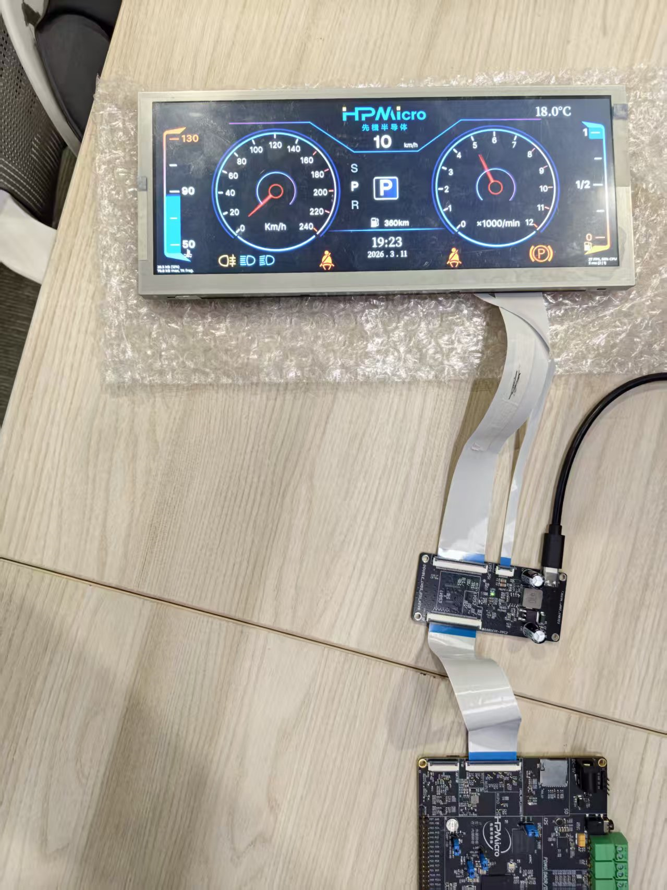
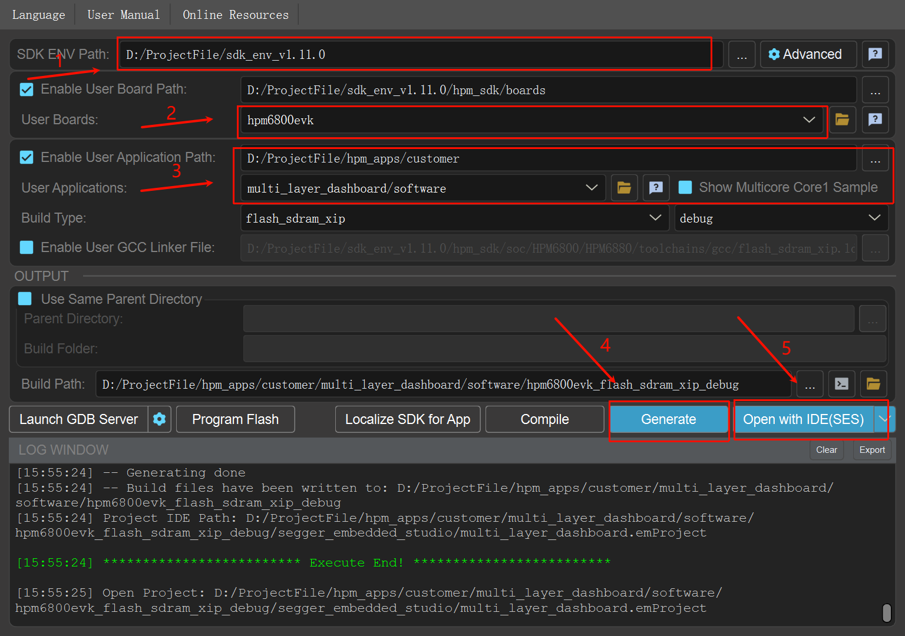
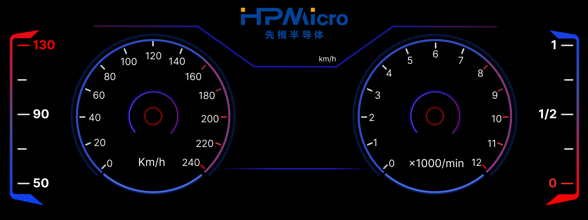
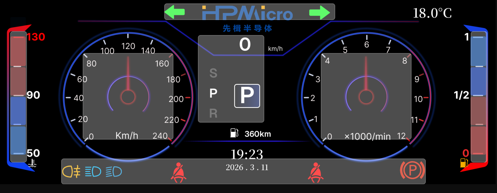
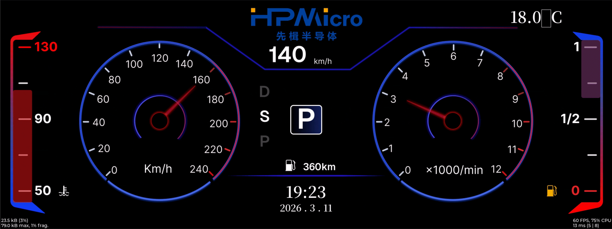

# HPM68 Series: Multi-Layer Dashboard Solution

## Requires SDK 1.11.0

## Overview

This solution is based on the HPMicro `HPM6800EVK` platform and combines `LVGL`, `FreeRTOS`, `LCDC`, and `PDMA` to implement a multi-layer dashboard demo project for digital instrument cluster scenarios.

Unlike traditional UI solutions based on full-screen redraw, this project splits the dashboard into **1 full-screen base layer + 7 local hardware overlay layers**, for a total of **eight layers**. Large static backgrounds and low-frequency elements remain on the main layer, while high-frequency changing elements such as the dual pointers, left and right energy bars, top turn indicators, bottom warning bar, and central gear area are placed on separate layers. This reduces unnecessary refresh area, lowers memory bandwidth pressure, and improves animation smoothness.

This solution mainly demonstrates the following:
- **Eight-layer dashboard architecture**: splitting UI regions based on the LCDC's 8-layer capability
- **Layered rendering strategy**: drawing static content separately from high-frequency dynamic content
- **Optimized buffer design**: using different buffer strategies for the main layer and sub-layers
- **PDMA flush pipeline**: using PDMA to transfer dirty regions and reduce CPU involvement

## Key Features

### Multi-layer Display Features
- **Parallel composition of eight hardware layers**: one main background layer plus 7 transparent `ARGB8888` overlay layers
- **Independent layer refresh**: different regions are output to the LCDC independently at their own update rates
- **Transparent blended display**: each layer is composited into the final image using `src_over` blending mode
- **Dedicated local layers for local regions**: high-frequency animated widgets are constrained to smaller rectangular regions

### Dynamic UI Features
- **Dual gauge pointer animation**: the speedometer and tachometer pointers are refreshed independently
- **Left/right energy bar animation**: the vertical bar regions on both sides are updated independently
- **Alert/indicator animation**: turn signals, fog lights, high/low beam, seatbelt, handbrake, and similar icons are controlled independently
- **Gear roller and value display**: the center area is split into its own layer to avoid affecting the whole screen
- **Time/temperature/range information display**: shown on the main layer as static or low-frequency widgets

### Rendering and Performance Features
- **Main layer direct render**: the full-screen main display uses `LV_DISPLAY_RENDER_MODE_DIRECT`
- **Sub-layer full render**: local layers use `LV_DISPLAY_RENDER_MODE_FULL`
- **Double buffering**: the main layer and all 7 sub-layers use double buffering
- **PDMA dirty-region transfer**: during main-layer flush, only dirty regions are copied into the LCDC scan buffer
- **D-Cache coordination**: writeback / invalidate is performed before and after CPU/DMA access to shared memory

## Hardware Requirements

### Main Control Board Requirements
- **MCU**: `HPM6800EVK`
- **Display Output**: `1920 x 720` dashboard interface
- **Display Controller**: on-chip `LCDC`
- **DMA Acceleration**: on-chip `PDMA`
- **Runtime Memory**: large `SDRAM` is required to hold multiple groups of `ARGB8888` frame buffers

## Device Connection

### Hardware Connection Diagram


## Create the Project


### Software Components
- `LVGL`
- `FreeRTOS`
- `hpm_panel`
- `LCDC` driver
- `PDMA` driver

## Software Architecture

### System Framework
```
┌──────────────────────────────────────────────┐
│              Dashboard UI Layer              │
│   (background, pointers, gear, alerts, energy bars, etc.) │
└────────────────┬─────────────────────────────┘
                 │
┌────────────────┴─────────────────────────────┐
│           LVGL Multi-Display Layer           │
│   (main layer Direct Render + sub-layer Full Render)      │
└────────────────┬─────────────────────────────┘
                 │
┌────────────────┴─────────────────────────────┐
│         PDMA + D-Cache Coherency             │
│   (dirty-region transfer + cache writeback/invalidate)    │
└────────────────┬─────────────────────────────┘
                 │
┌────────────────┴─────────────────────────────┐
│            LCDC Hardware Compose             │
│   (8 hardware layers + alpha blend output)   │
└──────────────────────────────────────────────┘
```

### Task Structure
- **LVGL refresh task**: repeatedly calls `lv_timer_handler()` to drive the UI and animations
- **Display output pipeline**: LCDC is responsible for final compositing of the main layer and the 7 local layers
- **VSYNC synchronization pipeline**: LCDC interrupts are used for refresh synchronization and display switch confirmation

## Eight-layer Design


### Layer Design Illustration

**Background layer illustration:**


**Layer split illustration:**


**Effect GIF:**


### Layer Allocation Description

This project uses a total of 8 hardware display layers, including 1 full-screen main layer and 7 local overlay layers. In the code, the main layer is initialized in `user_lvgl_port.c`, and the local layers are initialized individually in `ui/screens/home_gen.c`.

| Hardware Layer | Software Object | Region Size | Main Content | Design Purpose |
|--------|----------|----------|----------|----------|
| Layer 0 | Main display `disp` | `1920 x 720` | Background image, engine icon, fuel/water temperature icons, date, time, temperature, range, etc. | Carries the full-screen background and low-frequency refresh elements |
| Layer 1 | `home_layer2` | `352 x 350` | Left speedometer pointer | Offloads the high-frequency rotating pointer from the main layer |
| Layer 2 | `home_layer3` | `352 x 350` | Right tachometer pointer | Refreshes the other high-frequency pointer independently |
| Layer 3 | `home_layer4` | `64 x 512` | Left vertical energy bar | Refreshes only the left bar region |
| Layer 4 | `home_layer5` | `64 x 512` | Right vertical energy bar | Refreshes only the right bar region |
| Layer 5 | `home_layer6` | `1408 x 100` | Bottom warning/light icon strip | Centrally manages bottom status icons |
| Layer 6 | `home_layer7` | `640 x 64` | Top left/right turn indicator icons | Separately implements blinking animation |
| Layer 7 | `home_layer8` | `256 x 345` | Center speed value, gear roller, gear labels | Independently refreshes the center interaction area |

### Layer Splitting Principles
- **High-frequency animations are placed on separate layers**: the speed pointer, tachometer pointer, and left/right energy bars are all high-frequency update objects
- **Objects with the same semantics are grouped into the same layer**: bottom status lights are grouped into one horizontal layer, and top turn indicators are grouped into another dedicated layer
- **Keep the main layer stable**: background, time, temperature, and other low-frequency elements stay on the main layer to reduce full-screen redraws
- **Minimize the region size**: each sub-layer uses a bounding-box-sized region as much as possible to reduce double-buffer cost per layer

## Rendering Strategy

### 1. The Main Layer Uses Direct Render

The following are enabled in `software/inc/lv_app_conf.h`:

- `LV_USE_HPM_MODE_DIRECT = 1`
- `LV_USE_HPM_PDMA_FLUSH = 1`

The main layer is configured in `software/src/user_lvgl_port.c` through:

- `lv_display_set_buffers(disp, user_lvgl_fb0, user_lvgl_fb1, USER_LVGL_FB_SIZE, LV_DISPLAY_RENDER_MODE_DIRECT)`

This configures it as a **Direct Render double-buffer mode**.

The meaning of this design is:
- LVGL directly organizes the final main-layer image in the full-screen draw buffer
- When multiple dirty regions exist, there is no need to maintain a complex local buffer layout for each small region
- In a dashboard scenario with a large background and a small amount of dynamic updates, this works well with PDMA dirty-region transfer

### 2. Main-layer Flush Uses PDMA to Transfer Dirty Regions

The strategy of the main-layer flush callback `user_lvgl_display_flush_cb()` is:

- First accumulate the dirty regions reported by LVGL
- Perform D-Cache writeback on draw-buffer data corresponding to the dirty regions
- Use `PDMA` to copy the dirty regions from `px_map` to `user_lvgl_lcdc_fb`
- Call `lv_display_flush_ready()` after the transfer is completed

The benefits of this approach are:
- **Reduced CPU per-pixel copy overhead**
- **Reduced risk of display jitter caused by directly switching full-screen buffers**
- **Balances the development convenience of Direct Render with the stability of the LCDC scan buffer**

### 3. Sub-layers Use Full Render

All 7 local layers are created as follows:

- `lv_display_create(width, height)`
- `lv_display_set_color_format(..., LV_COLOR_FORMAT_ARGB8888)`
- `lv_display_set_buffers(..., buf0, buf1, sizeof(buf0), LV_DISPLAY_RENDER_MODE_FULL)`

The reasons for choosing `FULL` mode are:
- The sub-layers are much smaller than the full screen, so full-layer redraw cost is controllable
- The logic is simpler, because during flush it only needs to switch the next frame buffer for that layer
- Local layers usually correspond to a single functional area and naturally fit a full-layer update model

### 4. LCDC Handles the Final Multi-layer Composition

Each sub-layer is configured as follows:
- Pixel format: `ARGB8888`
- Transparent background: `lv_obj_set_style_bg_opa(..., LV_OPA_TRANSP, 0)`
- Blend mode: `display_alphablend_mode_src_over`

Therefore, LCDC finally blends the main layer and each local layer in real time according to the hardware layer hierarchy, avoiding repeated software full-screen composition.

## Buffer Selection and Design

### Main-layer Buffers

The main layer uses 3 groups of full-screen buffers:

- `user_lvgl_fb0`: LVGL drawing buffer 0
- `user_lvgl_fb1`: LVGL drawing buffer 1
- `user_lvgl_lcdc_fb`: the actual LCDC scan-out buffer

Among them:
- `user_lvgl_fb0 / user_lvgl_fb1` form the **double-buffered drawing surfaces**
- `user_lvgl_lcdc_fb` acts as the **stable foreground display surface**
- PDMA copies dirty regions from the current drawing buffer to the scan buffer, balancing performance and display stability

### Sub-layer Buffers

Each sub-layer allocates two independent buffers, for example:

- `layer2_buf0` / `layer2_buf1`
- `layer3_buf0` / `layer3_buf1`
- ...
- `layer8_buf0` / `layer8_buf1`

These buffers share the following characteristics:
- Placed in the `.framebuffer` section
- Aligned to `HPM_L1C_CACHELINE_SIZE`
- Unified pixel format: `ARGB8888`
- During flush, `lcdc_layer_set_next_buffer()` is used to switch to the next frame

### Why This Buffer Selection

- **The main layer is large**: it is better suited to Direct Render + PDMA dirty-region copy
- **The sub-layers are small**: they are better suited to Full Render + independent double-buffer flipping
- **Each layer is independent**: one local animation does not force other layers to redraw
- **Bandwidth is more controllable**: high-frequency animations consume bandwidth only on the corresponding sub-layer
- **The structure is clearer**: display issues are easier to locate and debug layer by layer

## Run-time Behavior

### After System Startup

After startup, you can see a typical digital dashboard interface including:
- Center speed numeric display
- Left and right circular gauge pointer animations
- Dynamic changes of the left and right vertical energy bars
- Blinking left and right turn indicators at the top
- Status display for bottom light / seatbelt / handbrake and other icons
- Center gear roller and gear label switching

### Animation Behavior

- The speed and tachometer pointers can rotate smoothly
- The top turn indicators blink according to a timer rhythm
- The bottom warning icons can be shown or hidden by group
- The left and right energy bars animate their height and color independently

## Solution Value

### Applicable Scenarios
- Automotive instrument clusters
- Smart cockpit HMIs
- Display systems that require optimization through hardware overlay composition

### Design Benefits
- **Reduced full-screen refresh pressure**
- **Improved animation smoothness**
- **Reduced unnecessary pixel transfer**
- **Better suited to high-resolution `ARGB8888` display scenarios**
- **More convenient for later extension with additional local dynamic widgets**

