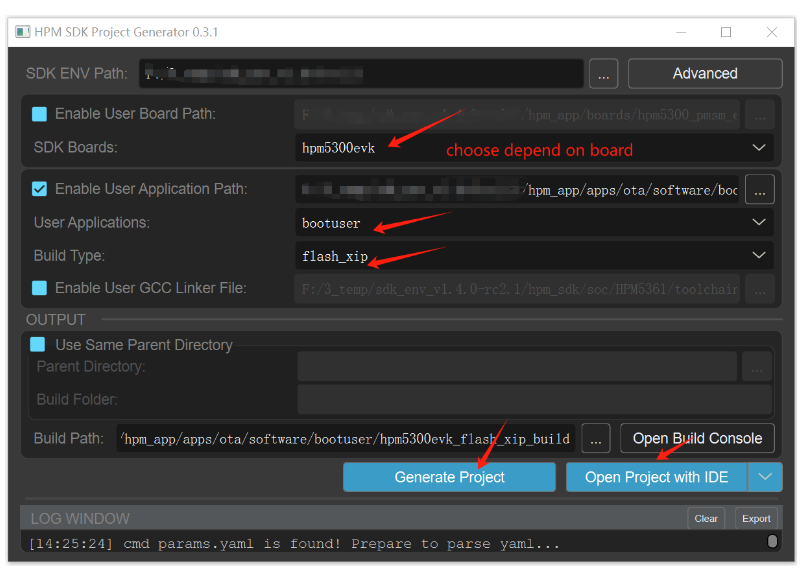
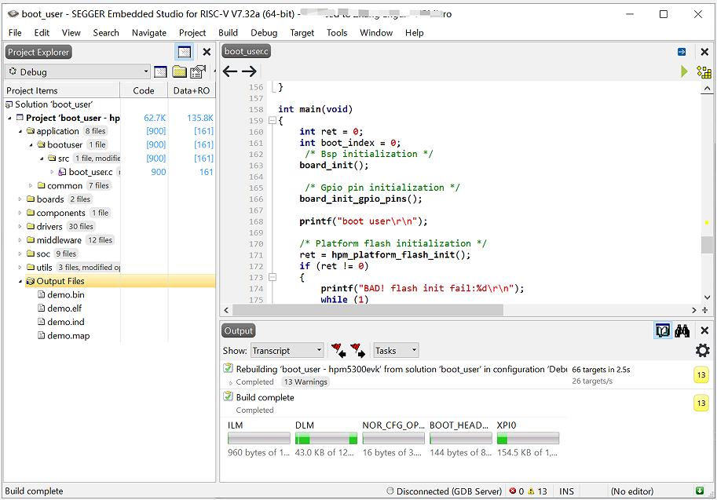

# HPM secondary Boot firmware upgrade solution

## Introduction

- IPA(in application programming).

- OTA(Over-the-Air Technology) .

These are collectively referred to as firmware upgrades/updates."Firmware upgrade" refers to the process of erasing and updating the current code stored on the medium (such as Flash/eMMC).

There are two firmware upgrade solutions: the HPM private BOOTROM upgrade solution and the customized secondary bootloader upgrade solution.

This firmware upgrade solution supports HPM MCU series comprehensively. Here, we only introduce the upgrade plan for secondary boot.

## Firmware Upgrade Process

### 1.Create an upgrade package

Q: Why make a firmware upgrade package? Without using the original firmware pack?

A: Firmware may be lost, corrupted, or illegally modified during transmission (over BLE, Wi-Fi, UART, ENET, etc.) due to communication channel noise, anomalies, or other factors. If no verification is performed on the firmware, it will result in an upgrade error and cause the device to become bricked.

An upgrade package is a file that has been digitally signed using a signature tool and signature algorithm, which includes the firmware (firmware), header information, and the signature value (the value of the signature after signing the firmware and header information). Digital signatures ensure the integrity and legitimacy of the upgrade package.


### 2.Download the upgrade package

According to the communication protocol agreed between the upper software and the MCU device, the upper software sends the upgrade package to the MCU device through OTA. After receiving the data, the MCU device analyzes the upgrade package data according to the communication protocol, and saves the upgrade package data on the medium (such as Flash/eMMC).


### 3.Check the upgrade package

After receiving all upgrade packages, the MCU verifies the legality and integrity of the received firmware to ensure the validity. Verification is typically conducted by calculating the digest of the new firmware based on agreed-upon characteristics and signature algorithms specified in the upgrade package. Subsequently, comparison and validation are performed based on the header information within the upgrade package.

If the comparison and validation pass, the verification is successful; if not, the verification fails. In the event of a failed verification, the upgrade process is aborted, and the current operation is maintained.


### 4.Update the firmware

After successful verification, which ensures the integrity and legality of the firmware, the MCU can directly switch to running the new firmware or restart and have the secondary Boot verify and switch to running the new firmware. At this point, the firmware update is complete.


## The key to downloading the upgrade package

### 1.Select the firmware transmission channel

General firmware download methods can be divided into wireless communication (network/Bluetooth, etc) and wired communication (UART/CAN/USB, etc).

This solution supports three wired communication: UART/USB/ENET, in which USB supports the ust host msc mode and usb device msc mode.

Modify the communication channel corresponding to CMakelists.txt.

bootuser path:ota/software/bootuser/CMakeLists.txt

user_app path:ota/software/user_app/CMakeLists.txt


### 2.Select the mode for downloading the upgrade package

There are two ways to download the upgrade package:

- Background download (APP user mode) :

During the upgrade process, the new firmware quietly downloads in the background, which is considered a part of the application functionality. While the new firmware is being downloaded, the application can continue to function normally.
Once the download is complete and verification is successful, the MCU can directly switch to executing the new firmware or restart and have the secondary Boot complete the switch to running the new firmware.

Note: The HPM53 series does not support background downloads.

Project user_app path: ota/software/user_app


- Non-background download (The secondary boot mode) :

During the upgrade process, the system first needs to reboot from the application program into the secondary Boot program. The secondary Boot is responsible for downloading the new firmware. Once the download is complete and verification is successful, the system can either directly switch to running the new firmware or reboot and have the secondary Boot complete the transition to running the new firmware.

Project bootuser path ：ota/software/bootuser


### 3.Select the old and new firmware coverage modes

There are two coverage modes for old and new firmware:

- Single bank mode:

In single bank mode with non-background downloading, there's only one bank (bank0) available, which serves as the runtime area. Both the old and new firmware share this single bank. During the upgrade process, the system enters the secondary Boot program, erases the old firmware, and then directly downloads the new firmware into the same bank. Once the download is complete, the validity of the new firmware is verified. If the new firmware is valid, the upgrade is completed successfully. This approach significantly saves flash space. However, if the upgrade fails, the system will remain in the secondary Boot program, and the application program won't be able to run properly.


- Dual bank mode:

In dual bank mode, the old firmware and the new firmware each occupy a separate bank area in the flash memory, allowing them to reside in independent regions. During the upgrade process, the new firmware is downloaded into the current non-running bank. After downloading and verifying the new firmware, the system switches or transfers to run the new firmware.

Typically, dual bank mode is categorized into the following types:

 - Equal Ping-Pong Mode: Both regions are identical in size, and either can run firmware.

 - Differential Mode: One is the primary region, the other is a smaller differential region. The primary region is larger, and the differential region is smaller.

 - Compression Mode: One is the primary region, the other is a smaller compressed region. The primary region is larger, and the compressed region is smaller.

 - Secure Mode: One is the primary region, the other is an encrypted region. The primary region is smaller, and the encrypted region is larger.

This solution uses the Equal Ping-Pong Mode.


### 4.Flash partition

It should be noted that due to the smaller flash capacity of the 53 series, a single bank mode is used in the firmware upgrade solution. The 62, 67, and 63 series, employ a dual bank mode with equal primary and secondary regions.

The flash partition table can be found at: ota/software/common/include/hpm_flashmap.h

Please note: The flash partition table in the project is a general partition and can be adjusted as needed.


## Firmware upgrade flowchart of the solution

### Non-background download mode (secondary Boot)


### Background download and upgrade mode (User app)


## Sample introduce

### Non-background download mode(The secondary Boot)

#### Project path

ota/software/bootuser

#### Project configuration

- Download channel selection

The HPM universal firmware upgrade solution supports four firmware download methods: serial port, Ethernet, USB host MSC, and USB device MSC (note: some HPM MCU series do not support Ethernet). Before building the project, select the download channel. For example, if upgrading via serial port, open the serial port macro definition in the CMakeLists.txt file and close other channel macro definitions.

Note: After modifying the CMakeLists.txt, the project must be rebuilt and compiled.

For example: Open the UART serial port channel.

```
set(CONFIG_UART_CHANNEL 1)
# set(CONFIG_ENET_CHANNEL 1)
# set(CONFIG_USB_DEVICE_CHANNEL 1)
# set(CONFIG_USB_HOST_CHANNEL 1)
```

- Project build



- Once the project is compiled, it can be programmed and run.



Due to the secondary boot upgrade, it is necessary to generate the application firmware first. Therefore, generate the application firmware according to the **Background download mode(User_app)**

### Background download mode

The application implemented is a helloworld, with added functionality for background firmware updates.

#### Project path

ota/software/user_app

#### Project configuration

- Download channel selection

Similarly, in the corresponding CMakeLists.txt file for user_app, enable the corresponding macro definition.

Note: After modifying the CMakeLists.txt, the project must be rebuilt and compiled.

For example: Open the USB device MSC channel.

```
# set(CONFIG_UART_CHANNEL 1)
# set(CONFIG_ENET_CHANNEL 1)
set(CONFIG_USB_DEVICE_CHANNEL 1)
# set(CONFIG_USB_HOST_CHANNEL 1)
```

- Project build

Note: user_app is a private linker file (specified in CMakeLists.txt), and the build type should be selected as debug.


- Once the project is compiled, it can be programmed and run.


Generate user application firmware.


### Test procedure

The firmware upgrade procedure for both non-background download mode (secondary Boot) and background download mode (user_app) is the same.

Note: There are two methods to enter non-background download mode (secondary Boot):

- Pressing the PBUT button and then resetting or powering on the device will force it into secondary Boot mode.

- If there is no valid firmware in the ping/pang region, the device will remain in secondary Boot mode.

#### Make upgrade packages

- Copy the firmware demo.bin generated by user_app to the tool directory (ota/tool/ota_pack_tool).


- Run the script to generate the upgrade package.

Currently, five signature types are supported:


Command：python pack_ota.py 4 demo.bin update_sign.bin

Note：need python3


The generated update_sign.bin is the upgrade package.

Note: Due to the discontinuous transmission in USB virtual disk transfer, the USB device MSC requires the use of usb_device_update.upd as the firmware upgrade package.


#### Channel upgrade by UART

Communication via the serial port channel is based on the xmodem protocol.

Select UART channel in CMakeLists.txt -> Build -> Compile -> Program.

- Device Connection

（1）Connect PC USB to USB_DEBUG interface

（2）Connect the debugger to the JTAG interface

- Port Settings

Serial port baud rate is set to ``115200bps``, with ``one stop bit`` and ``no parity bit``

- The PC host selects the upgrade package and sends the upgrade.

Tool path：ota/tool/ECOM串口助手 V2.80.exe.


- Verification and upgrade complete


#### Channel upgrade by ENET

Ethernet channel communication for upgrading is based on the TCP/IP protocol, with the PC acting as the TCP client and the MCU as the TCP server.

Select the ENET channel in CMakeLists.txt -> Build -> Compile -> Program.

Note: In CMakeLists.txt, also ensure to select the PHY chip currently used by the board to prevent communication failures.


- Device Connection

（1）Connect PC USB to USB_DEBUG interface

（2）Connect the debugger to the JTAG interface

（3）Network cable Connects the EVK network port to the PC network port

- Port Settings

Serial port baud rate is set to ``115200bps``, with ``one stop bit`` and ``no parity bit``

- Network Environment Setup

Ensure that the MCU and PC are on the same network subnet to avoid communication failures.


- Use network tools on the PC to establish a connection, select the upgrade package, and initiate the upgrade process.

Tool path：ota/tool/NetAssistv4325.exe


-  Verify the completion of the upgrade


#### Channel upgrade by USB DEVICE MSC

USB Device MSC is when a USB is configured as a device, simulating a U-disk. When the EVK board USB0 port is connected to a PC, a U-disk is enumerated on the PC. Copying the upgrade package (usb_device_update.upd) to this U-disk completes the firmware update process.

Select the USB device MSC channel in CMakeLists.txt -> Build -> Compile -> Program.

Due to the discontinuous transmission nature of USB device MSC, directly transmitting the upgrade package (update_sign.bin) can result in receiving an incorrect firmware.  To address this issue, the following solution is employed:

 1. usb dev msc sector size 512 byte.

 2. The upgrade package is sliced into segments according to each packet (512-profile struct) and then reassembled (with added magic/num/size/end).

 3. There's no need to add the FATFS file system, ensuring high efficiency and saving Flash space.

As follows:

usb device msc transfer discontinuous:


Group packet protocol:


Slice and regroup package:


- Device Connection

（1）Connect PC USB to USB_DEBUG interface

（2）Connect the debugger to the JTAG interface

（3）Connect PC USB to USB0 interface

- Port Settings

Serial port baud rate is set to ``115200bps``, with ``one stop bit`` and ``no parity bit``

- Enumerate the U-disk on the PC, copy the upgrade package to the U-disk.


- Verify the completion of the upgrade


#### Channel upgrade by USB HOST MSC

USB Host MSC involves the MCU acting as a USB host connected to a physical U-disk. Initially, the upgrade package, update_sign.bin, is copied to the U-disk formatted as FAT32. The U-disk is then inserted into the USB0 port of the EVK board. The MCU firmware automatically enumerates the U-disk and copies the upgrade package from the U-disk to the Flash memory to complete the firmware upgrade process.

Select the USB Host MSC channel in CMakeLists.txt -> Build -> Compile -> Program.

- Device Connection

（1）Connect PC USB to USB_DEBUG interface

（2）Connect the debugger to the JTAG interface

（3） Copy the upgrade package update_sign.bin to the U-disk

（4） U-disk connect with EVK board USB0


- Port Settings

Serial port baud rate is set to ``115200bps``, with ``one stop bit`` and ``no parity bit``

- Copy the upgrade package update_sign.bin to the U-disk


- The U-disk is inserted into the USB0 port of the EVK board, and the MCU copies the upgrade package from the U-disk to the Flash memory.


- Verify the completion of the upgrade


## API

:::{eval-rst}

About software API: `API doc <../../_static/apps/ota/html/index.html>`_ .
:::