# HPM二级Boot固件升级方案

(hpm_ota_v1_instruction_zh)=

## 依赖SDK1.10.0

## 简介

- IPA(in application programming) 应用编程。

- OTA(Over-the-Air Technology) 空中升级技术。

以上统称为固件升级/更新。

固件升级是指将当前代码存储的介质（Flash/emmc等）进行擦除和更新。

当前固件升级方案有两种：一种是基于HPM BOOTROM的升级方案，另一种是定制化的二级boot的升级方案。

本固件升级方案支持HPM全系列MCU,这里我们只介绍二级boot的升级方案。

## 固件升级流程

### 1.制作升级包
为什么要制作固件升级包？而不使用原始的固件包？

答：固件在传输(ble、wifi、uart、enet等通道)的过程中，可能因为通信通道噪音、异常等出现丢包、误包，或者因为被非法篡改，最终收到一个错误的固件。如果不对固件进行验签，必将升级错误而导致运行异常变砖。

升级包是通过签名工具使用签名算法对固件进行数字签名后的文件，包含固件（firmware），头部信息（header），签名值（signature value）（对固件和头部信息签名后的值），数字签名确保升级包的完整及合法性。


### 2.下载升级包

根据上位机和MCU设备约定的通信协议，上位机将升级包通过通信通道发送给MCU设备，MCU设备收到数据后，根据通信协议解析出升级包数据，并将升级包的数据保存在存储介质(Flash/emmc等)中。

### 3.验签升级包

MCU接收完所有的升级包后，为确保接收到的固件合法性和完整性，需要对存储的新的固件验签。验签通常是根据制作升级包约定的特征值及签名算法来计算存储新固件的摘要，然后根据升级包中的头部信息对比和校验，对比校验通过，则验签成功，对比校验失败，则验签失败。若验签失败，则升级失败，保持当前运行。

### 4.更新固件
验签成功保证了固件的完成性和合法性后，MCU即可直接跳转到新的固件运行或重启由二级Boot校验跳转运行新的固件。此时固件更新完成。

## 固件升级关键

### 1.选择固件传输通道

一般固件下载方式可分为无线通信方式（网络/蓝牙等）和有线通信方式（UART/CAN/USB/ENET等）。

本方案支持三种有线通信方案：UART/USB/ENET，其中USB支持ust host msc 模式和usb device msc模式。

修改对应CMakelists.txt选择通信通道。

bootuser路径:ota/software/bootuser/CMakeLists.txt

user_app路径:ota/software/user_app/CMakeLists.txt


### 2.选择下载升级包方式

下载升级包的方式有两种：

- 后台下载（APP user mode）：

在升级的时候，新固件在后台悄悄下载，即新固件下载属于应用程序功能的一部分，在新固件下载过程中，应用程序可以正常使用，下载完成且校验通过后直接跳转新固件执行或重启由二级Boot完成跳转新固件运行。

注意：HPM53系列不支持后台下载。

工程user_app路径: ota/software/user_app


- 非后台下载（二级Boot mode）：

在升级的时候，系统需要先从应用程序重启进入到二级Boot程序，由二级Boot进行新固件下载，下载完成且校验通过后直接跳转新固件运行或重启由二级Boot完成跳转新固件运行。

工程bootuser路径：ota/software/bootuser


### 3.选择新旧固件覆盖模式

新旧固件的覆盖模式有两种：

- 单区模式：

单区模式的非后台下载只有一个bank0（运行区），老固件和新固件共享这一个bank0，升级的时候，进入二级Boot程序先擦除老固件，然后直接把新固件下载到同一个bank中，下载完成后校验新固件的有效性，新固件有效升级完成，这样大大节省flash空间，但如果升级失败，将停留在二级Boot程序，应用程序将无法正常运行。


- 双区模式：

双区模式中老固件和新固件在flash中各占一块bank区，新老固件分别在独立的区域中，升级的时候，将新固件下载到当前非运行区，下载校验完成后，切换或搬移到新固件运行。

通常双区模式分为以下几种类型：

 - 主次相等模式(pingpang)：两个大小完全相等的区域且两个区域都可运行固件。

 - 主次差分模式：一个主运行区，另一个差分区域。主分区大，差分区小。

 - 主次压缩模式：一个主运行区，另一个压缩区域。主分区大，压缩区小。

 - 主次安全模式：一个主运行区，另一个加密区域。主分区小，加密区大。

本方案使用主次相等模式(pingpang)。


### 4.Flash分区

这里需要说明的是53系列由于flash容量较小，在固件升级方案中采用单区模式。62,67,63系列均采用双区模式的主次相等模式。

Flash分区表路径：ota/software/common/include/hpm_flashmap.h

注意：工程中的Flash分区表是一个通用的分区，可任意调整。


## 本方案固件升级流程图

### 非后台下载模式(二级Boot)


### 后台下载升级模式(User_app)


## 例程说明

### 非后台下载模式(二级Boot)

#### 工程路径

ota/software/bootuser

#### 工程配置

- 下载通道选择

HPM通用固件升级方案支持四种固件下载方式，分别是串口，以太网，USB host msc, USB device msc（注意：部分HPM MCU系列不支持以太网）。在工程构建之前，选择好下载通道，如选择通过串口升级，则在cmakelists.txt文件中打开串口宏定义，关闭其他通道宏定义。

注：修改了CMakeLists.txt后，必须重新构建工程、编译工程。

如下：打开UART串口通道。

```
set(CONFIG_UART_CHANNEL 1)
# set(CONFIG_ENET_CHANNEL 1)
# set(CONFIG_USB_DEVICE_CHANNEL 1)
# set(CONFIG_USB_HOST_CHANNEL 1)
```

- 工程构建


- 工程编译后烧录运行即可


由于二级Boot升级，需要先生成应用固件。故，先根据 **后台下载模式(User_app)** 生成应用固件。

### 后台下载模式(User_app)

应用程序实现的是一个helloworld，增加了后台下载固件更新的功能。

#### 工程路径

ota/software/user_app

#### 工程配置

- 下载通道选择

user_app同样也在对应的cmakelists.txt文件中选择使能对应的宏定义。

注：修改了CMakeLists.txt后，必须重新构建工程、编译工程。

如下：打开USB device msc通道。

```
# set(CONFIG_UART_CHANNEL 1)
# set(CONFIG_ENET_CHANNEL 1)
set(CONFIG_USB_DEVICE_CHANNEL 1)
# set(CONFIG_USB_HOST_CHANNEL 1)
```

- 工程构建

注意：user_app是私有的linker文件(在cmakelists.txt中指定)，构建类型需选择：debug


- 工程编译后烧录运行即可


生成用户应用固件。

### 测试步骤

非后台下载模式(二级Boot)和后台下载模式(user_app) 固件升级的操作流程相同.

注意：非后台下载模式(二级Boot)进入有以下两种方法：

- 按下PBUT按键后复位或上电，即可强制进入二级Boot。

- 用户ping/pang区没有有效固件，则会停留在二级Boot。

#### 制作升级包

本方案制作升级的工具是python脚本。路径：ota/tool/ota_pack_tool/pack_ota.py

 - 拷贝user_app生成的固件demo.bin到工具目录下(ota/tool/ota_pack_tool)。

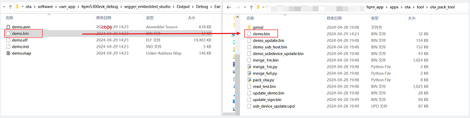

 - 运行脚本生成升级包。

当前支持五种签名类型，如下：

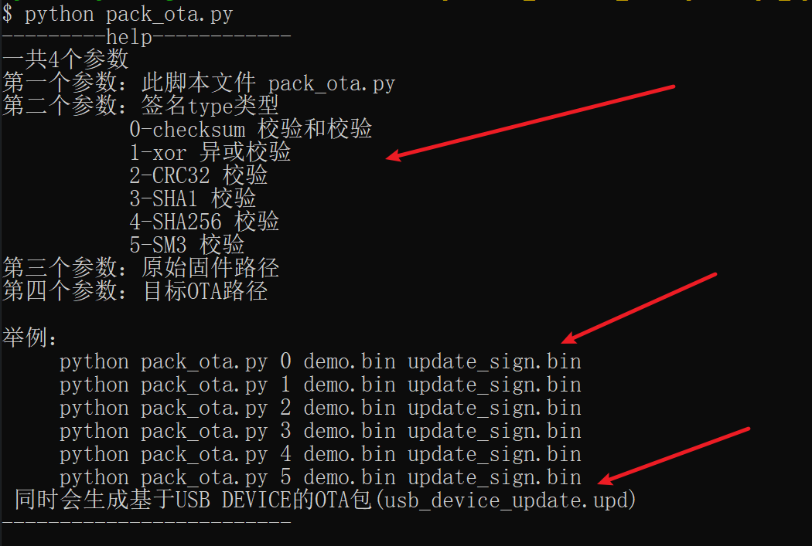

运行命令：python pack_ota.py 4 demo.bin update_sign.bin

注意：需用python3

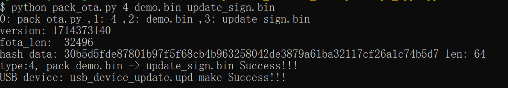

生成的update_sign.bin 为制作后的升级包。

注意：usb device msc 由于usb虚拟U盘传输存在不连续传输，需要用usb_device_update.upd为升级包。

#### 基于UART 通道升级

串口通道通信基于xmodem协议。

cmakelists.txt选择UART通道->构建->编译->烧录。

- 硬件连接

（1）连接PC USB到USB_DEBUG接口

（2）连接调试器到JTAG接口

- 端口设置

串口波特率设置为``115200bps``，``1个停止位``，``无奇偶校验位``

- PC上位机选择升级包，发送升级

工具路径：ota/tool/ECOM串口助手 V2.80.exe

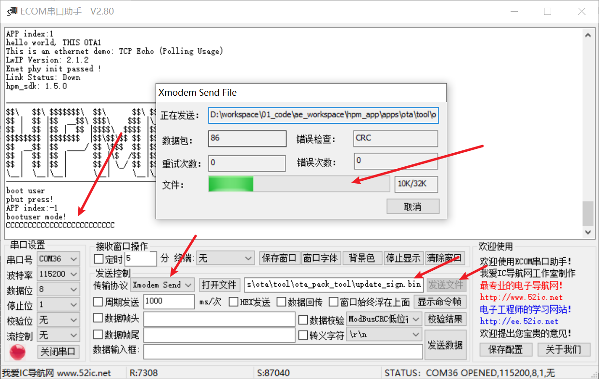

- 校验升级完成


#### 基于ENET通道升级

以太网通道通信升级基于网络TCP IP协议，PC上位机做tcp client, MCU做tcp server。

CMakeLists.txt选择ENET通道->构建-编译->烧录。

注意：CMakeLists.txt中同时要注意选择当前board使用的phy芯片，否则通信失败。


- 硬件连接

（1）连接PC USB到USB_DEBUG接口

（2）连接调试器到JTAG接口

（3）网线连接EVK的网口与PC网口

- 端口设置

串口波特率设置为``115200bps``，``1个停止位``，``无奇偶校验位``

- 网络环境设置

MCU和PC网络必须在同一个网段下，否则通信失败。

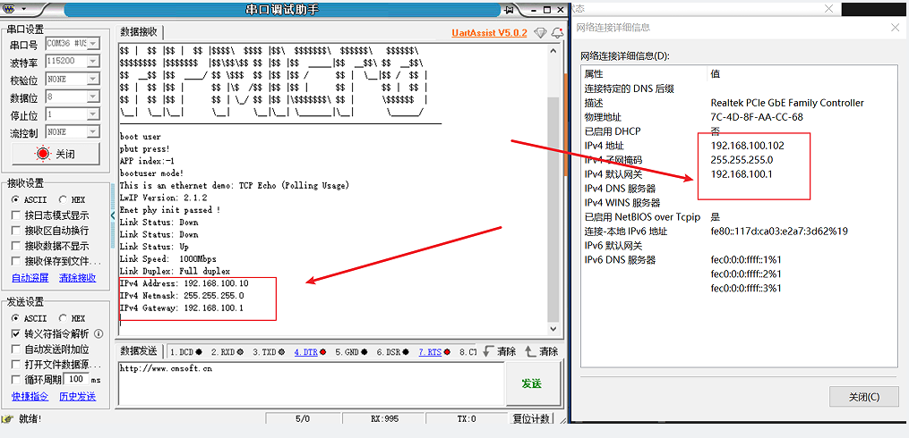

- PC网络工具建立连接，选择升级包，发送升级

工具路径：ota/tool/NetAssistv4325.exe

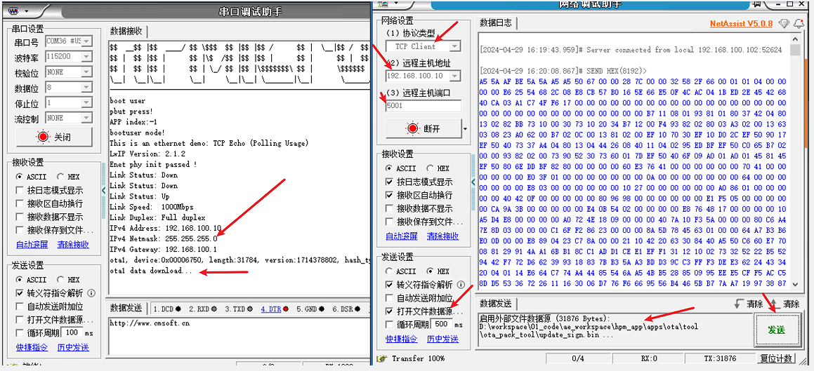

- 校验升级完成

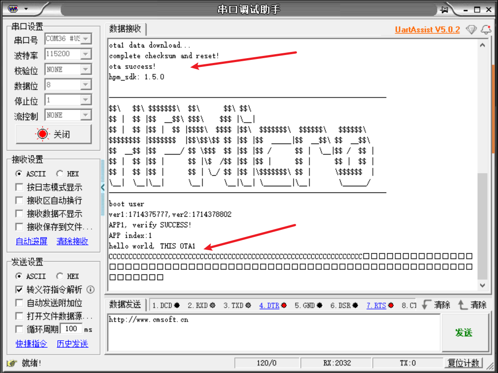


#### 基于USB DEVICE MSC通道升级

USB device msc 是USB作为DEVICE虚拟成一个U盘。EVK board USB0口插上PC，PC上会枚举出一个U盘。拷贝升级包(usb_device_update.upd)到U盘中即可完成固件更新。

CMakeLists.txt选择USB device msc通道->构建->编译->烧录。

由于usb device msc传输时存在不连续传输，如果直接使用升级包update_sign.bin传输，会导致接收存储的是一个错误的固件。为解决此问题，使用如下方案：

 1. usb dev msc sector size 512 byte。

 2. 对升级包按照每包(512-profile struct)切片后再组包(增加magic/num/size/end)。

 3. 无需增加文件系统fatfs，效率高且节省Flash空间。

如下：

usb device msc传输不连续：


组包协议：


切片组包：


- 硬件连接

（1）连接PC USB到USB_DEBUG接口

（2）连接调试器到JTAG接口

（3）连接PC USB到USB0 接口

- 端口设置

串口波特率设置为``115200bps``，``1个停止位``，``无奇偶校验位``

- PC上枚举U盘，拷贝升级包到U盘。

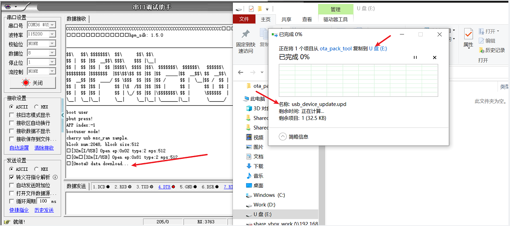

- 校验升级完成


#### 基于USB HOST MSC通道升级

USB host msc是MCU 作为USB host外接一个物理U盘。先拷贝升级包update_sign.bin到U盘(格式FAT32), U盘插入EVK board USB0口，MCU固件会自动枚举U盘，并从U盘拷贝升级包到Flash完成固件升级。

CMakeLists.txt选择USB host msc通道->构建->编译->烧录。


- 硬件连接

（1）连接PC USB到USB_DEBUG接口

（2）连接调试器到JTAG接口

（3）拷贝升级包update_sign.bin到U盘

（4）U盘插入EVK board USB0口

- 端口设置

串口波特率设置为``115200bps``，``1个停止位``，``无奇偶校验位``

- 拷贝升级包update_sign.bin到U盘


- U盘插入EVK board USB0口，MCU从U盘拷贝升级包到Flash。


- 校验升级完成

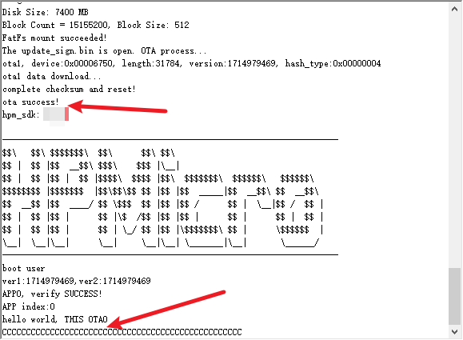

#### 基于ECAT通道升级

ECAT通道基于FOE协议。
ECAT_FOE示例用于演示基于HPM6E80的ECAT外设和从站协议栈代码(SSC)实现ECAT FOE读写从站文件的功能。

##### 1.准备

请参照HPM_SDK samples/ethercat/ecat_io的README

##### 2.工程设置

请参照HPM_SDK samples/ethercat/ecat_io的README

##### 3.生成ECAT通道从站协议栈代码

由于许可问题, HPM_APPS不提供EtherCAT从站协议栈代码(SSC), 用户须从倍福官网下载SSC Tool并生成从站协议栈代码
该功能需要需要使用SSC tool生成协议站代码，之后才能正确够构建编译。
请参照HPM_SDK samples/ethercat/ecat_io的README

##### 4.SSC Tool中导入配置文件

配置文件路径为: ota/software/common/channel/ecat/SSC/Config/HPM_ECAT_FOE_Config.xml

##### 5.SSC Tool中创建新的工程
  应用文件路径为：ota/software/common/channel/ecat/SSC/foe.xlsx

##### 6.生成协议栈代码
  协议栈代码输出路径为: ota/software/common/channel/ecat/SSC/Src

##### 7.TwinCAT工程设置
  请参照ECAT_IO的README

##### 8.添加ESI文件
  ESI文件名称: ECAT_FOE.xml

##### 9.工程设置

在文件`CMakeLists.txt`中
选择ECAT_FOE通道(设置"set(CONFIG_ECAT_FOE_CHANNEL 1)")， 然后构建->编译->烧录。
使用实际eeprom时, 设置"set(CONFIG_EEPROM_EMULATION 0)"

##### 10.工程编译运行

构建工程，并编译运行。
设备ECAT网口连接PC网口。

##### 11.软件配置

  请参照ECAT_IO的README

##### 12.扫描设备

  请参照ECAT_IO的README

##### 13.更新EEPROM

  请选择**foe**设备描述文件
  


##### 14.FOE操作

  1. 设置MailBox timeout时间(当文件比较大时， 需要调整timeout时间)
  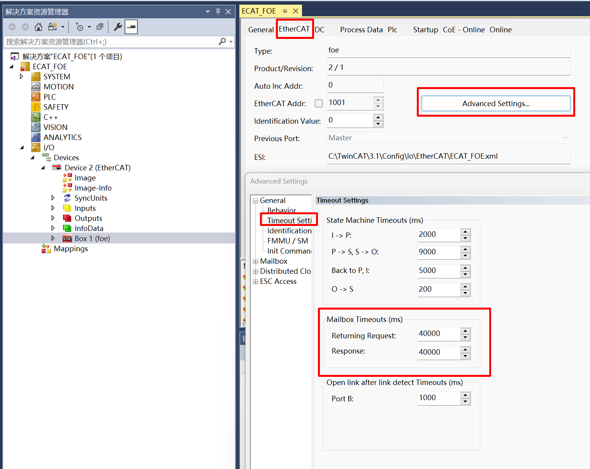
  2. 选择从站， 进入Bootstrap模式
  
  3. 进入Bootstrap模式后， 下载文件到从站
    点击Download
    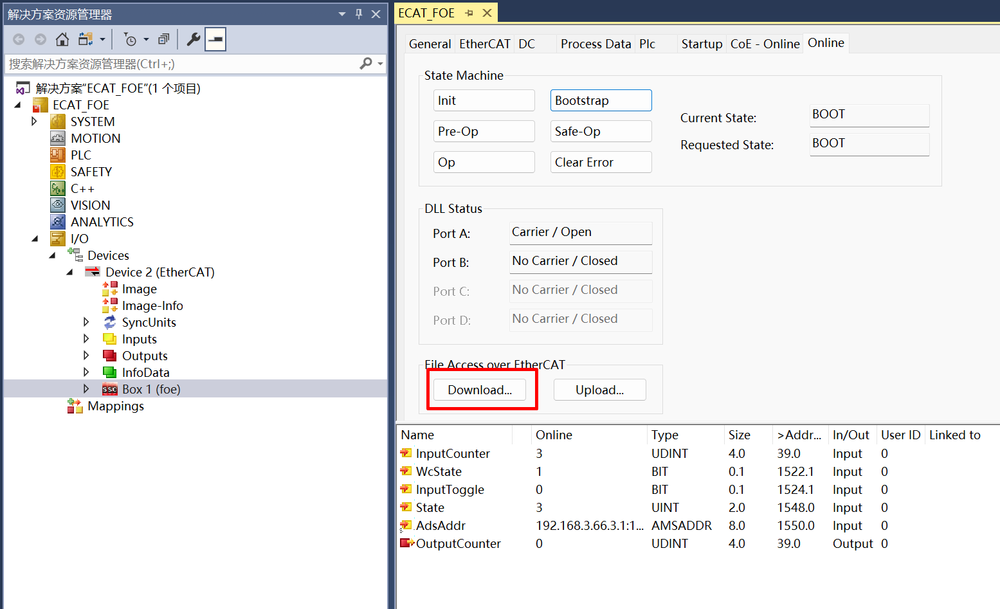
    选择要下载的文件，注意：此文件为脚本签名之后的文件(update_sign.bin)
    
    编辑文件名称和密码， 文件名称是：**app**; 密码是：**87654321**.
    
    等待写进度条完成
    (注意: 下载完成后，并不会立即重启，需退出Bootstrap模式才可以会重启跳转到新的固件中。)
  4. 进入Bootstrap模式后，从从站读取文件
    点击Uplaod
    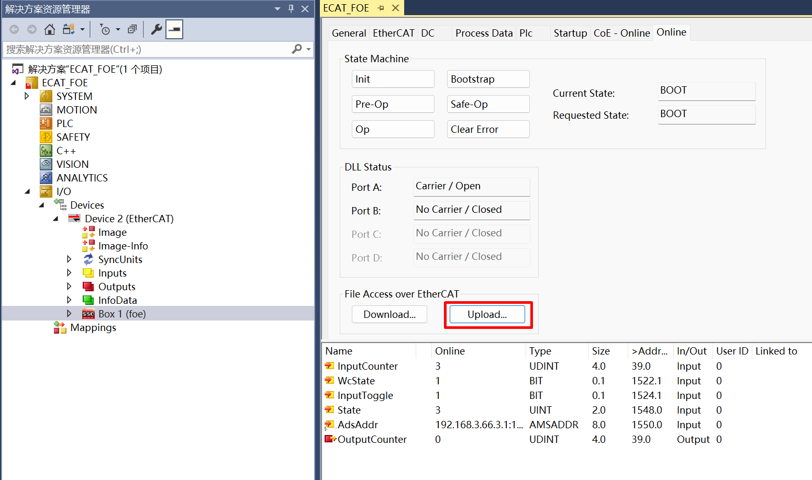
    选择文件保存文件和名称
    
    编辑文件名称和密码， 文件名称是：**app**; 密码是：**87654321**. (注意:文件名称和密码是固定的)
    
    等待读进度条完成
  5. 退出Bootstrap模式
    点击Init.
    退出Bootstrap，重启跳转新固件运行。

##### 15. 运行现象

当工程正确运行后, 串口终端会输出如下信息：
当EEPROM未被初始化时，输出如下信息提示需要初始化EEPROM内容。

```console
EtherCAT FOE sample
Write or Read file from flash by FOE
EEPROM loading with checksum error.
EtherCAT communication is possible even if the EEPROM is blank(checksum error),
but PDI not operational, please update eeprom  context.
```

当EEPROM被正确初始化后， 输出如下信息， 在Twincat中可以进行文件写读操作，对比写下去与读回来的文件保持一致。

```console
EtherCAT IO sample
Write or Read file from flash by FOE
EEPROM loading successful, no checksum error.
```

固件下载中

```console
EEPROM loading successful, no checksum error.
Write file start
ota0, device:0x0048504D, length:85416, version:1728558561, hash_type:0x00000004
ota0 data download...
complete checksum and reset!

ota success!

Write file finish
```

退出Bootstrap模式，重启跳转新固件运行

```console
system reset...

----------------------------------------------------------------------
$$\   $$\ $$$$$$$\  $$\      $$\ $$\
$$ |  $$ |$$  __$$\ $$$\    $$$ |\__|
$$ |  $$ |$$ |  $$ |$$$$\  $$$$ |$$\  $$$$$$$\  $$$$$$\   $$$$$$\
$$$$$$$$ |$$$$$$$  |$$\$$\$$ $$ |$$ |$$  _____|$$  __$$\ $$  __$$\
$$  __$$ |$$  ____/ $$ \$$$  $$ |$$ |$$ /      $$ |  \__|$$ /  $$ |
$$ |  $$ |$$ |      $$ |\$  /$$ |$$ |$$ |      $$ |      $$ |  $$ |
$$ |  $$ |$$ |      $$ | \_/ $$ |$$ |\$$$$$$$\ $$ |      \$$$$$$  |
\__|  \__|\__|      \__|     \__|\__| \_______|\__|       \______/
----------------------------------------------------------------------
boot user

ver1:1728558561,ver2:1726018801

APP0, verify SUCCESS!

APP index:0
hello world, THIS OTA0
ECAT FOE Funcation
EEPROM loading successful, no checksum error.

```


## API

:::{eval-rst}

关于软件API 请查看 `方案API 文档 <../../_static/apps/ota/html/index.html>`_ 。
:::