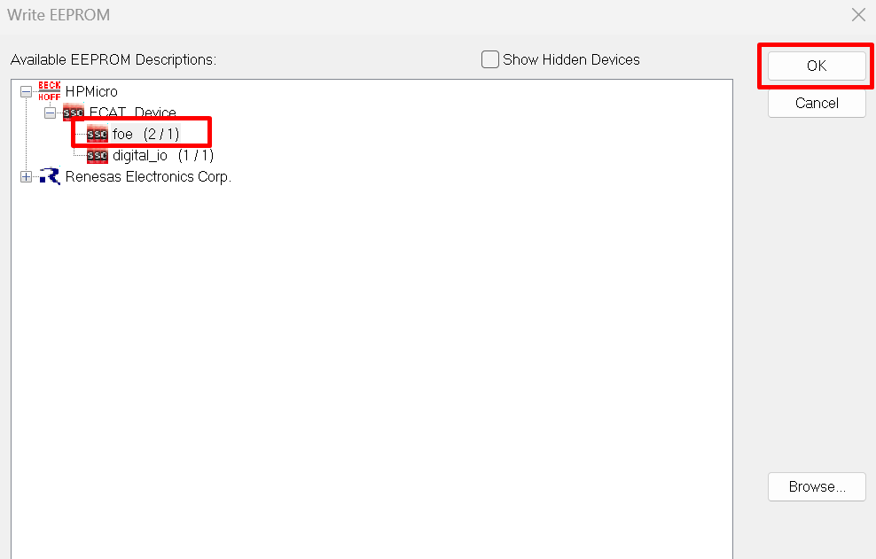
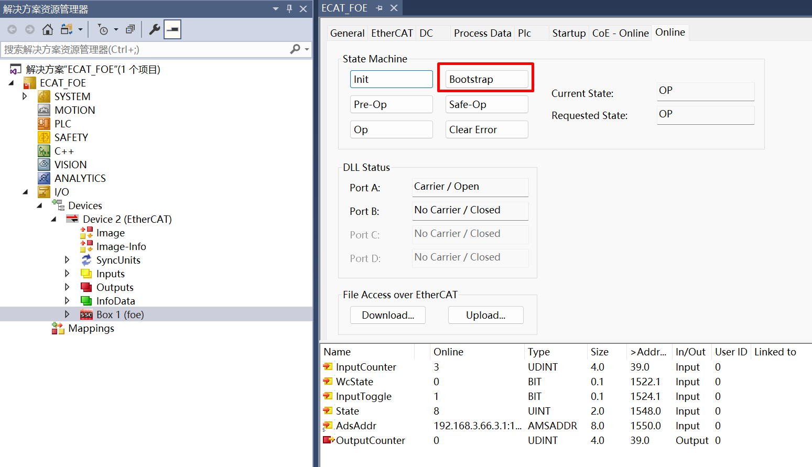
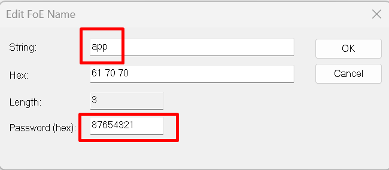

# ECAT_FOE

## 1. 概述

ECAT_FOE示例用于演示基于HPM6E80的ECAT外设和从站协议栈代码(SSC)实现ECAT FOE读写从站文件的功能。

关于使用ECAT FOE更新firmware的功能演示， 请参考hpm_apps中OTA相关例程。

hpm_apps仓库：
  github: https://github.com/hpmicro/hpm_apps
  gitee: https://gitee.com/hpmicro/hpm_apps

## 2. 准备

  请参照ECAT_IO的README

## 3. 工程设置

  请参照ECAT_IO的README

## 4. 生成从站协议栈代码

由于许可问题, HPM_SDK不提供EtherCAT从站协议栈代码(SSC), 用户须从倍福官网下载SSC Tool并生成从站协议栈代码

### 4.1. 下载SSC Tool

  请参照ECAT_IO的README

### 4.2 SSC Tool中导入配置文件
  配置文件路径为: SSC/Config/HPM_ECAT_FOE_Config.xml

### 4.3 SSC Tool中创建新的工程
  应用文件路径为：SSC/foe.xlsx

### 4.4 生成协议栈代码
  协议栈代码输出路径为: SSC/Src

## 5. TwinCAT工程设置
  请参照ECAT_IO的README

### 5.1. 添加ESI文件
  ESI文件名称: ECAT_FOE.xml

### 5.2 创建工程
  请参照ECAT_IO的README

### 5.3 软件配置
  请参照ECAT_IO的README

### 5.4 扫描设备
  请参照ECAT_IO的README

### 5.5 更新EEPROM
  请选择**foe**设备描述文件
  


### 5.6 FOE操作
  1. 设置MailBox timeout时间(当文件比较大时， 需要调整timeout时间)
  
  2. 选择从站， 进入Bootstrap模式
  
  3. 进入Bootstrap模式后， 下载文件到从站
    点击Download
    
    选择要下载的文件，注意：此文件为脚本签名之后的文件(update_sign.bin)
    
    编辑文件名称和密码， 文件名称是：**app**; 密码是：**87654321**.
    
    等待写进度条完成
  4. 进入Bootstrap模式后，从从站读取文件
    点击Uplaod
    
    选择文件保存文件和名称
    
    编辑文件名称和密码， 文件名称是：**app**; 密码是：**87654321**. (注意:文件名称和密码是固定的)
    
    等待读进度条完成
    (注意: 下载完成后，并不会立即重启，需退出Bootstrap模式才可以会重启跳转到新的固件中。)
  4. 退出Bootstrap模式

## 6. 运行现象

当工程正确运行后, 串口终端会输出如下信息：
当EEPROM未被初始化时，输出如下信息提示需要初始化EEPROM内容。
```console
EtherCAT FOE sample
Write or Read file from flash by FOE
EEPROM loading with checksum error.
EtherCAT communication is possible even if the EEPROM is blank(checksum error),
but PDI not operational, please update eeprom  context.
```
当EEPROM被正确初始化后， 输出如下信息， 在Twincat中可以进行文件写读操作，对比写下去与读回来的文件保持一致。
```console
EtherCAT IO sample
Write or Read file from flash by FOE
EEPROM loading successful, no checksum error.
```

固件下载中
```console
EEPROM loading successful, no checksum error.
Write file start
ota0, device:0x0048504D, length:85416, version:1728558561, hash_type:0x00000004
ota0 data download...
complete checksum and reset!

ota success!

Write file finish
```

退出Bootstrap模式，重启跳转新固件运行
```console
system reset...

----------------------------------------------------------------------
$$\   $$\ $$$$$$$\  $$\      $$\ $$\
$$ |  $$ |$$  __$$\ $$$\    $$$ |\__|
$$ |  $$ |$$ |  $$ |$$$$\  $$$$ |$$\  $$$$$$$\  $$$$$$\   $$$$$$\
$$$$$$$$ |$$$$$$$  |$$\$$\$$ $$ |$$ |$$  _____|$$  __$$\ $$  __$$\
$$  __$$ |$$  ____/ $$ \$$$  $$ |$$ |$$ /      $$ |  \__|$$ /  $$ |
$$ |  $$ |$$ |      $$ |\$  /$$ |$$ |$$ |      $$ |      $$ |  $$ |
$$ |  $$ |$$ |      $$ | \_/ $$ |$$ |\$$$$$$$\ $$ |      \$$$$$$  |
\__|  \__|\__|      \__|     \__|\__| \_______|\__|       \______/
----------------------------------------------------------------------
boot user

ver1:1728558561,ver2:1726018801

APP0, verify SUCCESS!

APP index:0
hello world, THIS OTA0
ECAT FOE Funcation
EEPROM loading successful, no checksum error.

```
