# HPM Secondary BOOT Firmware V2 Upgrade Solution

## Depend on SDK1.10.0

## Introduction
- IPA (In Application Programming) application programming.
- OTA (Over-the-Air Technology) technology for remote upgrades.
The above are collectively referred to as firmware upgrades/updates.
Firmware upgrade refers to the process of erasing and updating the current code stored in the medium (such as Flash/eMMC).
This firmware upgrade plan is an iterative upgrade of the [HPM secondary Boot firmware upgrade solution](hpm_ota_v1_instruction_en). The principles and processes of firmware upgrades are basically the same, and this document will not elaborate further. It supports the entire HPM MCU series and essentially covers all functional requirements for firmware upgrades.

## Features
- Supports the entire series of HPM MCUs.
- Supports channel upgrades via network, serial port, USB, ECAT, etc.
- Supports secondary BOOT download to upgrade APP firmware (non-background download upgrade).
- Supports APP download to upgrade APP firmware (background download upgrade).
- Supports full upgrades, differential upgrades, and compressed upgrades.
- Supports firmware encryption, with exip decryption execution.
- Firmware encryption supports both differential and compressed upgrades simultaneously.
- Supports mixed upgrades of differential and full upgrades.
- Utilizes XPI REMAP technology, allowing users to maintain a single firmware for all scenarios of the APP.
- Secondary BOOT supports construction and operation in RAM, FLASH_XPI, and FLASH_SDRAM_XPI.
- User APP supports construction and operation in RAM, FLASH_XPI, and FLASH_SDRAM_XPI.
- Supports RAM and XPI mixed upgrades.
- Supports arbitrary adjustment of FLASH partitions.
- Supports upper computer tools to create and generate full, differential, and compressed signed upgrade packages.

Note:
1. To avoid memory collision issues caused by unreasonable RAM allocation when both the secondary bootloader and user APP are executed as RAM types, the current solution restricts the simultaneous execution of both as RAM types. If the user can prevent the above situation, the restriction can be lifted.
2. Differential upgrades require version management; the currently running firmware and the firmware being upgraded must have differences for the upgrade to proceed normally.
3. For differential upgrades, when creating the differential package, it is essential to ensure that the signature algorithm type matches that of the currently running firmware; otherwise, differential upgrades will not be supported.
4. When encrypting the user APP, to ensure the security of the encryption key, the area of the encryption key must be encrypted. For example, using the official KEK BLOB encryption.

## Introduction

### General Flash Partition
This solution provides a general Flash partition table, with default configurations for 4M and 1M general Flash partition tables. Users can adjust them according to their application scenarios.

Where:
- BOOTHEADER: HPM boot image header information, which includes: EXIP BLOB/XPI FLASH configuration items/FW BLOB/firmware container header information. This part is fixed at 12K and cannot be modified.
- BOOTUSER: Secondary BOOT firmware area, default size is 256K, position is fixed, but size can be adjusted freely.
- USERKEY: User APP encryption key area, default size is 4K, position and size can be adjusted freely.
- APP1IMG: User APP1 firmware area, default size is 1M, position and size can be adjusted freely.
- APP2IMG/LZMA: User APP2 firmware area or compressed firmware area, default size is 1M, position and size can be adjusted freely. If using compressed firmware, the area size can be reduced according to the minimum compression ratio of LZMA.
- DIFFFILE: Differential firmware area, default size is 512K, position and size can be adjusted freely.
- USER: User-defined area, allocated by the user.

Note:
Users can freely adjust the partition sizes, but they cannot delete partitions. If a partition is not needed, its size can be adjusted to 0. 
For example: If the user does not use differential upgrades, they can set FLASH_DIFF_APP_SIZE to 0.

### RAM or FLASH XIP Operation
This solution supports secondary BOOT and user APP running based on RAM, FLASH_XIP, and FLASH_SDRAM_XIP.
As shown in the figure below, you can choose during the build:
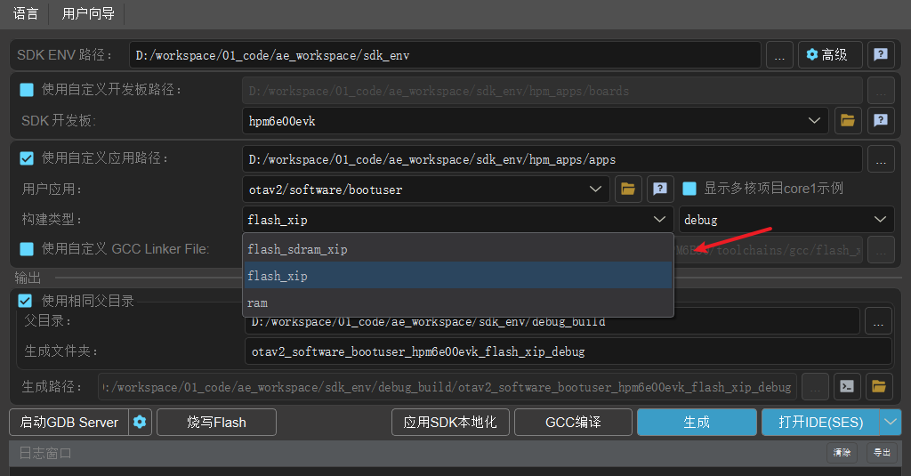

Note:
1. When building based on RAM, the official RAM linker file is used by default. To avoid memory overlap between BOOT and APP (using the same linker file), the current solution has restricted both the secondary BOOT and user APP from being built as RAM types simultaneously. This restriction can be lifted if you can ensure that memory overlap is avoided.
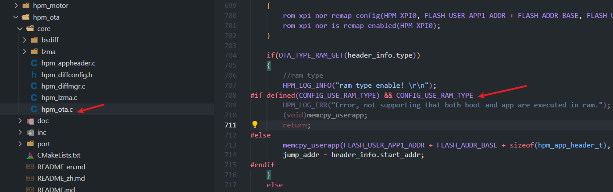
2. When creating the OTA signed firmware, it is essential to strictly select the corresponding build type: RAM/FLASH_XIP. Among them, FLASH_XIP and FLASH_SDRAM_XIP are both classified as FLASH_XIP types.


### Firmware Encryption
This solution supports user APP firmware encryption and online encryption execution with HPM MCU exip. The encryption key for the user APP firmware is managed by the user themselves. It can be stored at any location in Flash or in the secondary BOOTUSER.

By default, this solution places the key in the BOOTUSER, as shown below:
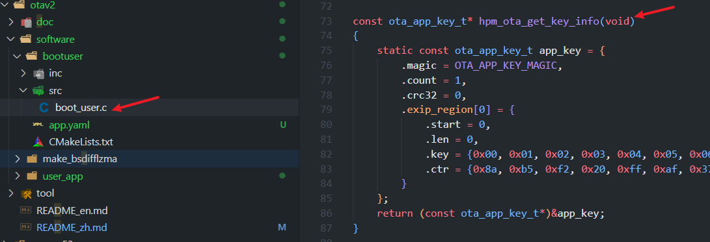

If you want to place it in other locations in Flash, please adjust the flash_map file to change the KEY location accordingly. As shown below:
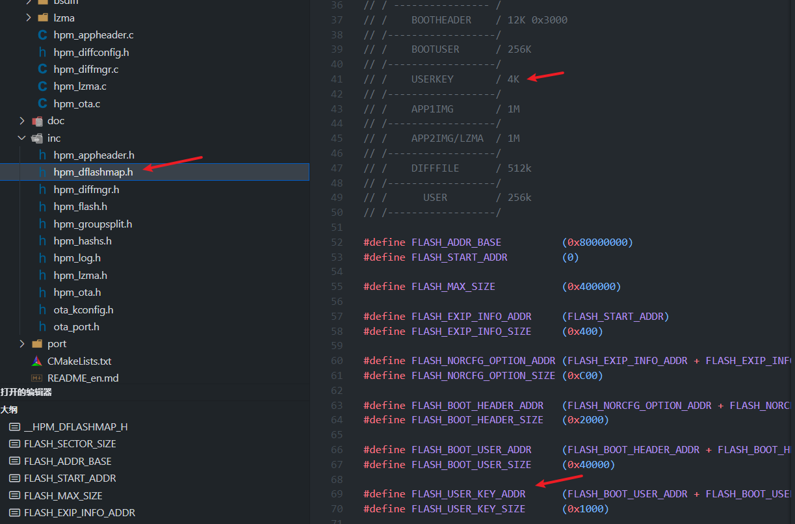

Note: Due to the security of the encryption key, the area where the key is stored must be encrypted. For example, you can use the original HPM exip KEK blob scheme for encryption (refer to the MFT tool for encryption methods) for the BOOTUSER or KEY area where the key is stored. As shown below:

Since EXIP supports a maximum of 4 segments for decryption execution, the current solution uses 3 segments for the user APP by default, so the 3rd segment cannot be enabled here.
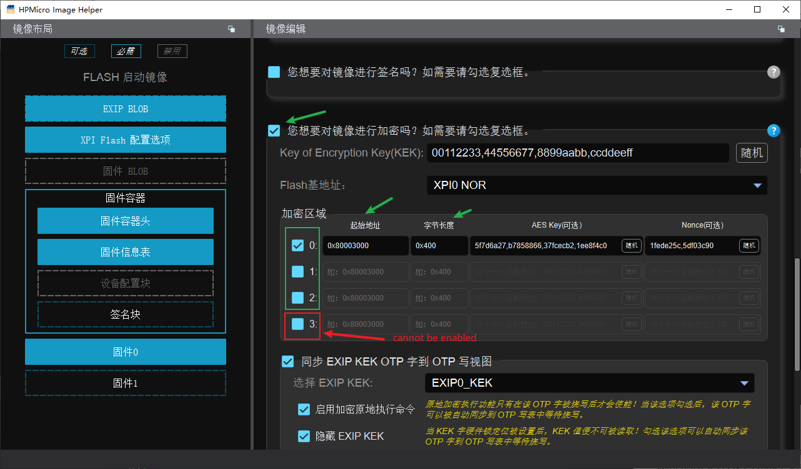

The encryption and creation of the user APP firmware OTA package is completed using the pack_ota.exe tool. Follow the prompts from the pack_ota.exe tool strictly to create the OTA package. 

Note: The encryption key is by default located in the exip_key.json file under the tool's path. 

Double-click to run pack_ota.exe and follow the prompts to complete the encryption of the user_app and the creation of the OTA package. 

Note: The encryption of the user APP firmware does not differentiate between firmware running types and generation types. For example, both FLASH_XIP and RAM-based firmware support APP firmware encryption, and APP encrypted firmware can generate normal firmware, differential firmware, and compressed firmware.

### Full Upgrade
This solution supports full upgrades of the user APP and allows for APP ping/pang upgrade operations. 
Definition: Download a complete upgrade package that overwrites all files, regardless of whether there are changes in the old version.
Advantages:
- High reliability: Completely replaces the old version, avoiding residual files or dependency issues.
- Simple operation: No need to calculate differences or merge files, making the upgrade process stable.
- Broad compatibility: Suitable for first-time installations or major version updates.
Disadvantages:
- High resource consumption: Requires downloading the complete package, which takes a long time and uses a lot of data.
- Storage pressure: The device must reserve enough space to store the complete package.
Applicable scenarios:
- First-time installation or major version updates;
- Environments with good communication conditions and sufficient device storage.
Full upgrade process:
Note: For full upgrades when creating OTA firmware using pack_ota.exe, simply select ***normal firmware*** as shown below:
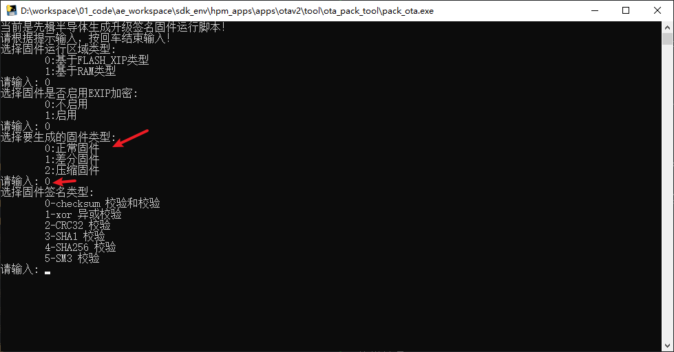

### Differential Upgrade (Incremental Upgrade)
This solution supports differential upgrades for user apps. Considering failures caused by unexpected power outages, it is designed to use a three-zone upgrade operation: PING/PANG/diff. Additionally, this solution further compresses the differential firmware, significantly reducing the size of the upgrade package. 
This solution uses the bsdiff differential algorithm: https://github.com/mendsley/bsdiff
Definition: Only download the differences between the old and new versions, merging them into the old version to generate the new version.
Advantages:
- Efficient and data-saving: Only transmits the differential data, saving bandwidth and time.
Disadvantages:
- Dependency on the old version: The differential package must be generated based on a specific old version, and version fragmentation may lead to compatibility issues.
- High complexity: Requires maintenance of the differential algorithm, and the merging process may encounter errors (e.g., power outages leading to upgrade failures).
- Computational overhead: The device needs to handle the differential merging, which has certain hardware performance requirements.
Applicable scenarios:
- Frequent minor version iterations.
- Scenarios with poor network conditions or sensitivity to data usage.

Note:
1. To enable differential upgrades, you need to enable the differential macro definition in cmakelist.txt (both bootuser and user_app must be enabled): set(CONFIG_DIFF_IMAGE_ENABLE 1)
As shown below:
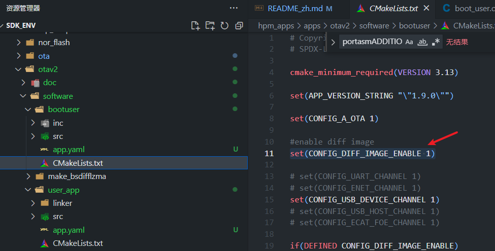
2. When creating OTA firmware using pack_ota.exe, simply select ***differential firmware***.
3. When creating OTA firmware using pack_ota.exe, the signature type ***must be consistent each time***; otherwise, differential upgrades are not supported. For example, if you select 4 (SHA256) the first time, you must also select 4 when creating the differential OTA package afterward.
4. When creating OTA firmware using pack_ota.exe, the old firmware selected must be ***the existing firmware currently stored on the MCU device***; otherwise, differential upgrades are not supported.
As shown below:
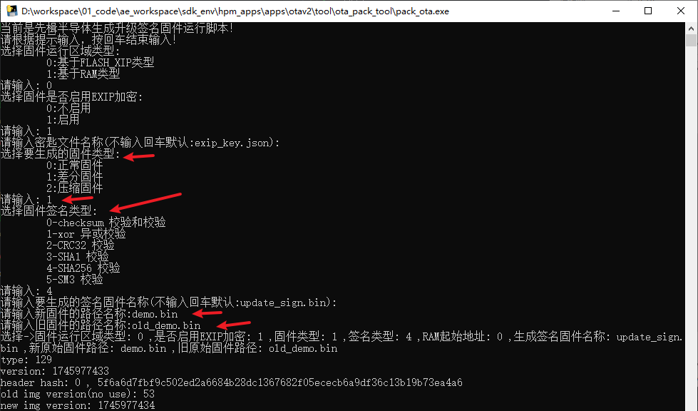

### Compressed Upgrade
This solution supports user APP compressed upgrades, including both full and differential compressed upgrades. 
The solution uses the LZMA compression algorithm: https://www.7-zip.org/sdk.html
Definition: The upgrade package (full or differential) is compressed and transmitted, and the receiving end decompresses it before executing the upgrade.
Advantages:
- Reduced transmission volume: The size is significantly reduced after compression (e.g., LZMA compression).
- High flexibility: Can be used with either full or differential upgrades, making it highly versatile.
Disadvantages:
- Additional processing steps: Requires decompression, which increases upgrade time and computational load.
- Compatibility dependency: Devices must support the corresponding decompression algorithm.
Applicable scenarios:
- Environments with limited bandwidth (e.g., remote upgrades for IoT devices).
- Situations where transmission efficiency needs to be optimized but the device has decompression capabilities.
Note:
1. Compressed upgrades must enable the differential macro definition in cmakelist.txt (both bootuser and user_app need to be enabled): set(CONFIG_DIFF_IMAGE_ENABLE 1)
As shown below:

2. When creating OTA firmware using pack_ota.exe, simply select ***Compress Firmware***.
As shown below:


## Operations
### Project Build
#### BOOTUSER Project Build:
1. Modify cmakelist.txt to choose whether to enable differential or compression mode. If enabled, set: `set(CONFIG_DIFF_IMAGE_ENABLE 1)`
2. Modify cmakelist.txt to select the upgrade channel, supporting: Serial, Ethernet, USB DEVICE, USB HOST, ECAT, as follows:
```
# set(CONFIG_UART_CHANNEL 1)
# set(CONFIG_ENET_CHANNEL 1)
set(CONFIG_USB_DEVICE_CHANNEL 1)
# set(CONFIG_USB_HOST_CHANNEL 1)
# set(CONFIG_ECAT_FOE_CHANNEL 1)
```

3. Use the GUI tool to build the project, making sure to select the required build type: supports RAM/FLASH_XIP/FLASH_SDRAM_XIP. As follows:
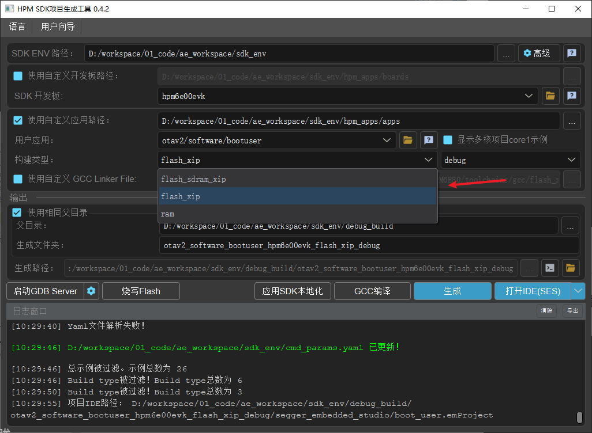

#### User APP project build:
1.Modify cmakelist.txt, choose whether to enable differential or compression mode, such as enable: set(CONFIG_DIFF_IMAGE_ENABLE 1)
2. Modify cmakelist.txt, select upgrade channel, support: Serial, Ethernet, USB DEVICE, USB HOST, ECAT, as follows: 
```
# set(CONFIG_UART_CHANNEL 1)
# set(CONFIG_ENET_CHANNEL 1) 
set(CONFIG_USB_DEVICE_CHANNEL 1)
# set(CONFIG_USB_HOST_CHANNEL 1)
# set(CONFIG_ECAT_FOE_CHANNEL 1) 
``` 
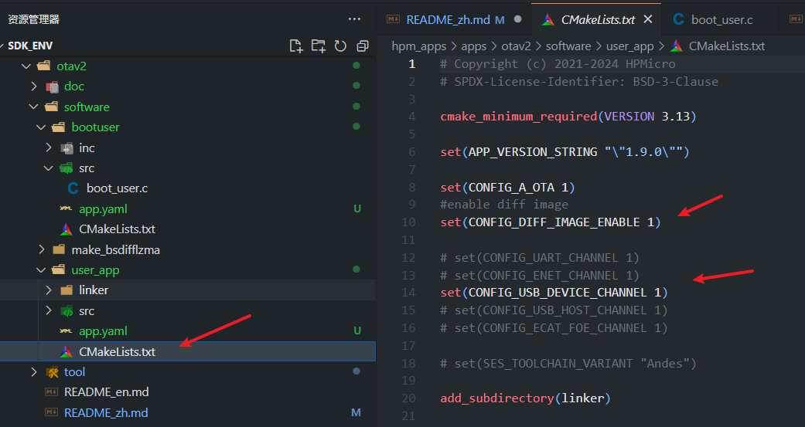

3. GUI tool to build the project, pay attention to select the desired build type: support RAM/FLASH_XIP/FLASH_SDRAM_XIP. as follows: 
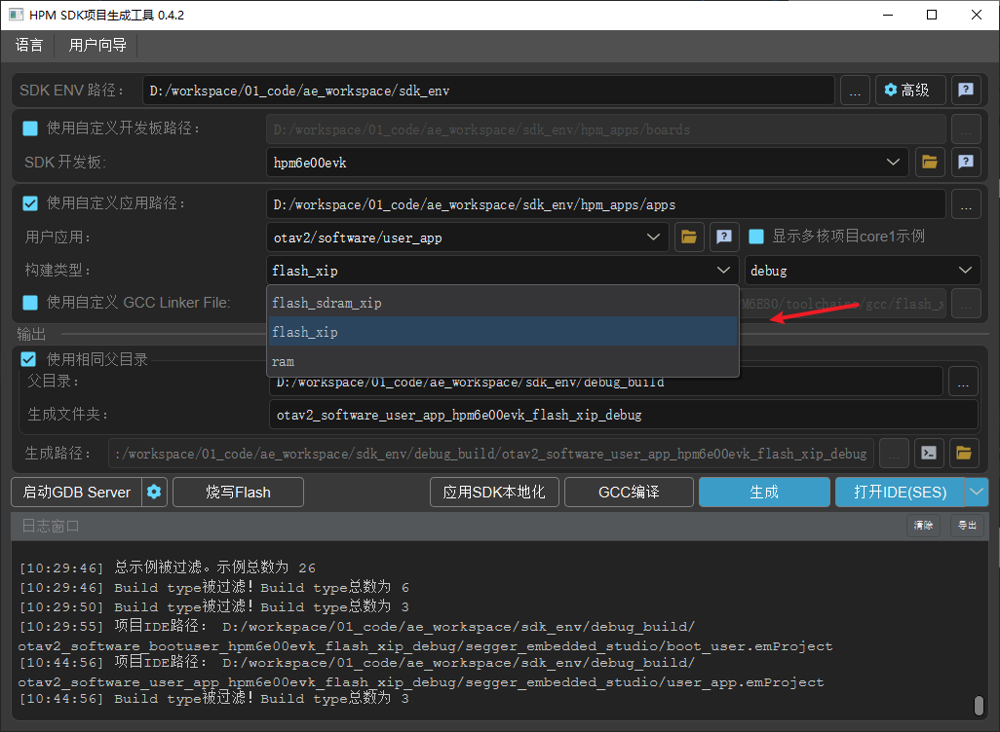


### Project compilation

#### BOOTUSER project compile and burn 
1. Use GCC or IDE to compile the project: 
 
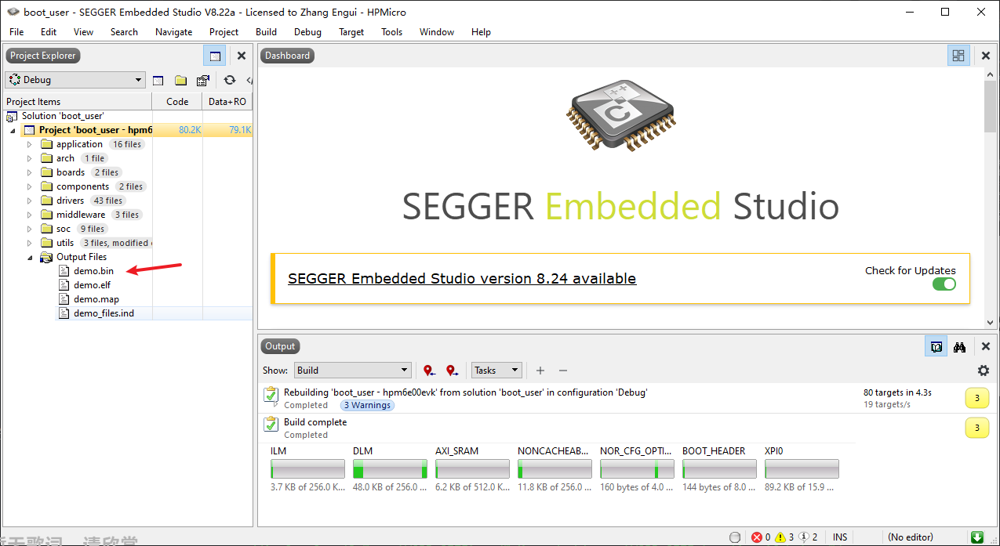 
2. If it is a RAM build type or you need to encrypt the BOOTUSER, please use the hpm mft tool to make the burn.
Note: You must burn the BOOTUSER firmware first, otherwise USERAPP can not be executed correctly.

#### USERAPP project compilation 
Use GCC or IDE to compile the project: 
 
 
Note: When debugging, you can directly use the debugger to burn debugging, at this time, the burned firmware is unsigned firmware. If it is ram type firmware, it will be lost when power down; if it is flash_xip type firmware, the default version (HEADER_INIT_VERSION) is 0. Since bootuser will jump to the higher version number, you can modify the initial version number to force jump to the debugging firmware when debugging. For example: 
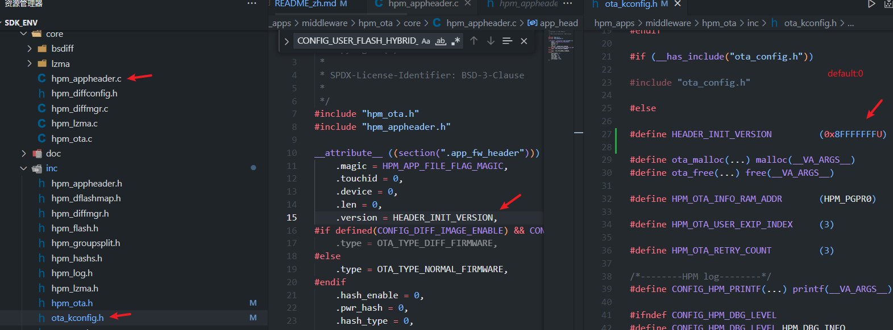


### Make upgrade package 
Use the uploader tool pack_ota.exe to make the upgrade package.
1. Copy the firmware compiled successfully by USERAPP to the tool directory.
2. Double click pack_ota.exe to run the tool.
3. According to the requirements, follow the prompts to select the correct: firmware region type, whether to enable encryption, secret key, firmware generation type, signature type, old and new firmware, etc., so as to complete the creation of the upgrade package.
Note: Make sure that the last prompt is "SUCCESS".
As follows: 
 
Note: usb device msc As there is a discontinuous transmission in the usb virtual flash disk transfer, it is necessary to use usb_device_update.upd for the upgrade package.


### Download upgrade package

#### UART channel based upgrade

Serial channel communication is based on xmodem protocol.

cmakelists.txt Select UART channel -> Build -> Compile -> Burn.

- Hardware Connection

(1) Connect PC USB to USB_DEBUG interface

(2) Connect debugger to JTAG interface

- Port Settings

Serial port baud rate set to ``115200bps``, ``1 stop bit``, ``no parity bit``

- PC host selects ***upgrade package***, sends upgrade

Tool path: ota/tool/ECOM Serial Assistant V2.80.exe


#### ENET channel based upgrade

EtherChannel communication upgrade is based on network TCP IP protocol, PC upper computer as tcp client, MCU as tcp server.

CMakeLists.txt select ENET channel->build-compile->burn.

Note: CMakeLists.txt should also note that the phy chip used by the current board should be selected, otherwise the communication will fail.

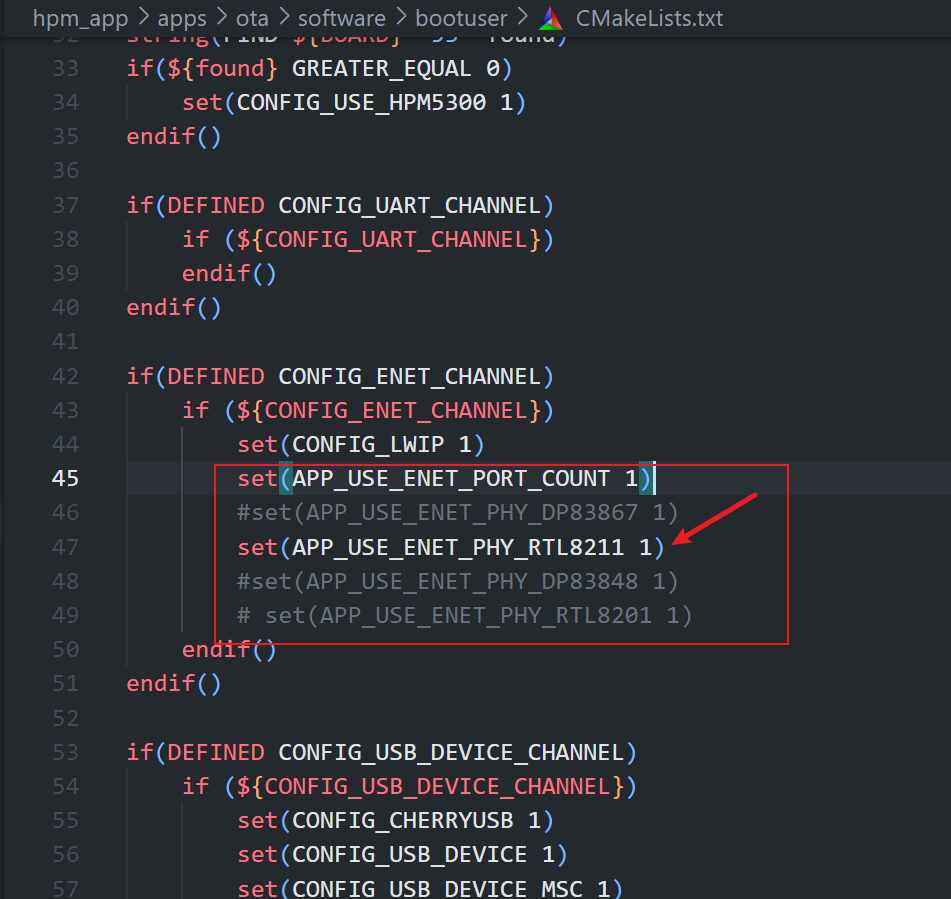

- Hardware Connection

(1) Connect PC USB to USB_DEBUG port

(2) Connect the debugger to the JTAG interface.

(3) Connect the network cable between the EVK's network port and the PC's network port.

- Port Settings

Set serial port baud rate to ``115200bps``, ``1 stop bit``, ``no parity bit``.

- Network environment setting

MCU and PC network must be under the same network segment, otherwise communication fails.


- PC network tool to establish connection, select ***upgrade package*** , send upgrade

Tool path: ota/tool/NetAssistv4325.exe


#### Upgrade based on USB DEVICE MSC channel

USB device msc is USB as DEVICE virtualized into a USB flash drive. EVK board USB0 port is plugged into PC, a USB flash drive will be enumerated on PC. Copy the ***update package (usb_device_update.upd)*** to the USB disk to complete the firmware update.

CMakeLists.txt select USB device msc channel -> build -> compile -> burn.

Due to the discontinuous transmission during usb device msc transfer, if you directly use the upgrade package update_sign.bin to transfer, it will result in receiving and storing a wrong firmware. To solve this problem, the following scheme is used:

 1. usb dev msc sector size 512 byte.

 2. Upgrade packages are sliced per package (512-profile struct) and then grouped into packages (add magic/num/size/end).

 3. No need to add file system fatfs, high efficiency and save flash space.

As follows:

usb device msc transfer discontinuity:

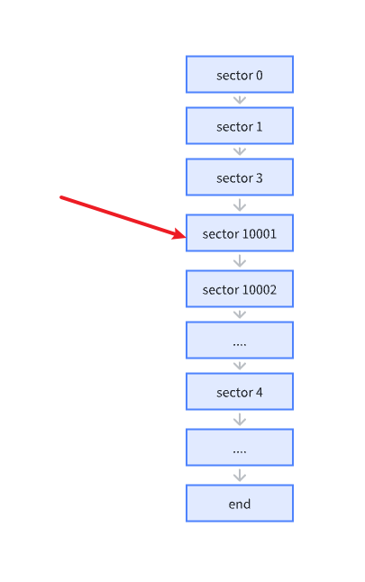

Group packet protocol:

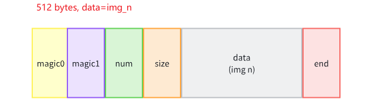

Slice the group packet:

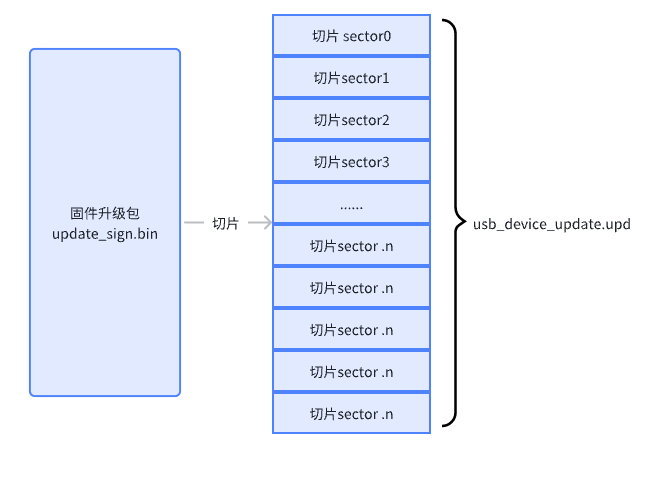

- Hardware Connection

(1) Connect the PC USB to the USB_DEBUG port.

(2) Connect the debugger to the JTAG interface.

(3) Connect the PC USB to the USB0 interface.

- Port Settings

Serial port baud rate set to ``115200bps``, ``1 stop bit``, ``no parity bit``.

- Enumerate USB disk on PC, copy ***upgrade package (usb_device_update.upd)*** to USB disk.


#### USB HOST MSC channel based upgrade

The USB host msc is the MCU acting as a USB host external to a physical USB flash drive. First copy the ***upgrade package*** update_sign.bin to the USB flash disk (FAT32 format), insert the USB flash disk into the USB0 port of the EVK board, the MCU firmware will automatically enumerate the USB flash disk and copy the upgrade package from the USB flash disk to the flash to complete the firmware upgrade.

CMakeLists.txt select USB host msc channel->build->compile->burn.

- Hardware Connection

(1) Connect PC USB to USB_DEBUG interface

(2) Connect the debugger to the JTAG port

(3) Copy the upgrade package update_sign.bin to the USB flash disk

(4) Insert the USB flash disk into the USB0 port of the EVK board.

- Port Settings

Set serial port baud rate to ``115200bps``, ``1 stop bit``, ``no parity bit``.

- Copy the ***upgrade package*** update_sign.bin to USB flash disk


- USB flash disk inserted into EVK board USB0 port, MCU copy upgrade package from USB flash disk to Flash.

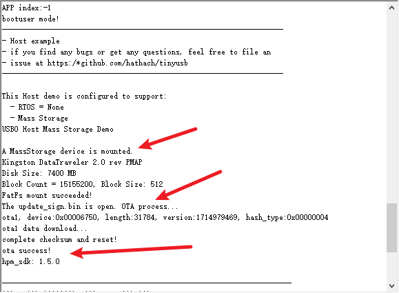


#### ECAT channel based upgrade

The ECAT channel is based on the FOE protocol.

##### Note

This feature requires the use of SSC tool to generate the protocol station code before it can be built and compiled correctly.
Please refer to the README in middlware/hpm_ota/port/ecat to do so.

##### Project setup 
In the file `CMakeLists.txt` 
select ECAT_FOE channel (set "set(CONFIG_ECAT_FOE_CHANNEL 1)"), then build->compile->burn.
When using actual eeprom, set "set(CONFIG_EEPROM_EMULATION 0)".

### Firmware processing 
Firmware processing means after downloading the upgrade package to the storage area, BOOTUSER performs signature verification, differential reduction, decompression, firmware checking and other operations on the upgrade package.
As follows: 
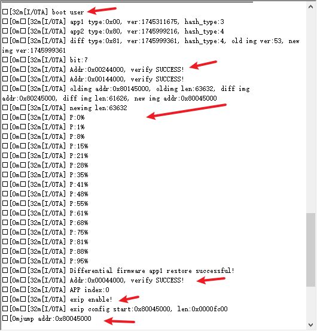

### Upgrade completed 
BOOTUSER has finished processing the firmware, and after the successful signature check, it jumps to the new APP to run, and the firmware upgrade is completed.
As follows: 
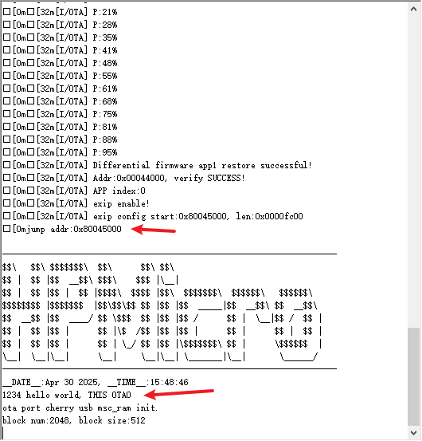

## API

:::{eval-rst}

About software API: `API doc <../../_static/apps/otav2/html/index.html>`_ .
:::