# HPM二级BOOT固件V2升级方案

## 依赖SDK1.9.0

## 简介

- IPA(in application programming) 应用编程。

- OTA(Over-the-Air Technology) 空中升级技术。

以上统称为固件升级/更新。

固件升级是指将当前代码存储的介质（Flash/emmc等）进行擦除和更新。

本固件升级方案是在[HPM二级Boot固件升级方案](hpm_ota_v1_instruction_zh) 上的迭代升级，固件升级原理和流程基本一致，本文不在赘述。支持HPM全系列MCU，基本涵盖了固件升级的全部功能需求。

## 特性

- 支持HPM全系列MCU。

- 支持网络、串口、USB、ECAT等通道升级。

- 支持二级BOOT下载升级APP固件(非后台下载升级)。

- 支持APP下载升级APP固件(后台下载升级)。

- 支持全量升级、差分升级、压缩升级。

- 支持固件加密，exip解密执行。

- 固件加密和差分、压缩同时支持。

- 支持差分、全量混合升级。

- 应用XPI REMAP技术，用户APP全场景只需维护单一固件即可。

- 二级BOOT支持RAM、FLASH_XPI、FLASH_SDRAM_XPI构建运行。

- 用户APP支持RAM、FLASH_XPI、FLASH_SDRAM_XPI构建运行。

- 支持RAM、XPI混合升级。

- 支持FLASH分区任意调整。

- 支持上位机工具制作生成全量、差分、压缩签名升级包。

注意：
1.为避免二级BOOT和用户APP均为RAM类型执行时RAM分配不合理导致内存踩踏异常，当前方案限制了二级BOOT和用户APP同时为RAM类型执行。若用户可避免以上发生，取消限制即可。
2.差分升级需要版本管理，必须当前运行的固件和升级的固件差分才能正常升级。
3.差分升级，差分包制作时，必须确保签名算法类型和当前运行的固件签名算法类型一致，否则不支持差分升级。
4.用户APP加密时，为确保加密密匙的安全性，必须对加密密匙的区域进行加密。如使用官方KEK BLOB加密。

## 介绍

### 通用Flash分区
本方案提供了通用的Flash分区表，默认提供了4M和1M的通用Falsh分区表，用户可根据自己的应用场景随意调整。
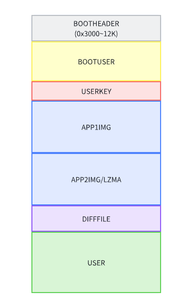
其中：
- BOOTHEADER:HPM启动镜像头部信息，包含:EXIP BLOB/XPI FLASH配置项/FW BLOB/固件容器头部信息。这部分默认12K，不可修改调整。
- BOOTUSER:二级BOOT固件区，默认256K，位置不可调节，大小可以随意调整。
- USERKEY: 用户APP加密密匙区，默认4K，位置大小可以随意调整。
- APP1IMG: 用户APP1固件区，默认1M，位置大小可随意调整。
- APP2IMG/LZMA: 用户APP2固件区或压缩固件区，默认1M，位置大小可随意调整。如使用压缩固件，可根据LZMA最小压缩比减小区域大小。
- DIFFFILE: 差分固件区，默认512K，位置大小可随意调整。
- USER: 用户使用区域，用户自行分配。

注意：
用户可随意调整分区大小，但不可删除分区，如其中分区不需要使用，可调整大小size为0即可。
例如：用户不使用差分升级，调整：FLASH_DIFF_APP_SIZE设置为0即可。

### RAM或FLASH XIP运行

本方案支持二级BOOT和用户APP基于RAM、FLASH_XIP、FLASH_SDRAM_XIP构建运行。
如下图，在构建时候可选择:
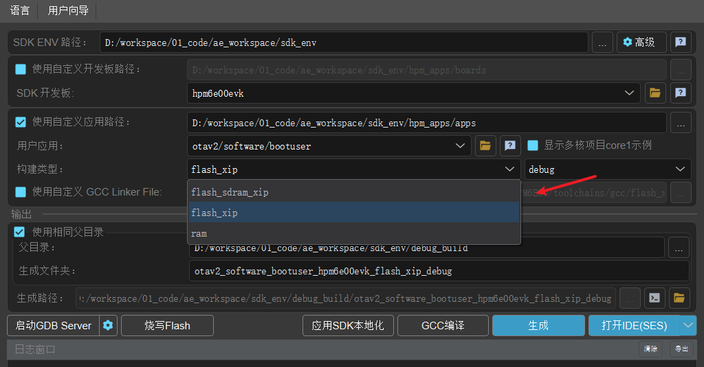
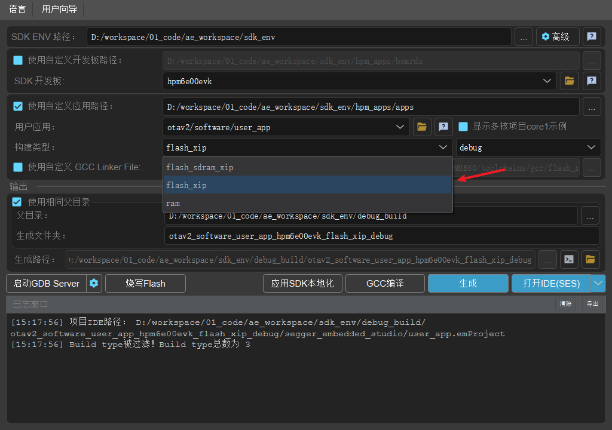

注意：
1.当基于RAM构建时，由于默认使用官方的RAM linker文件，为避免BOOT和APP内存踩踏(同一个linker文件)，当前方案已限制二级BOOT和用户APP同时为RAM构建类型。如能确保避免内存踩踏，可取消限制。
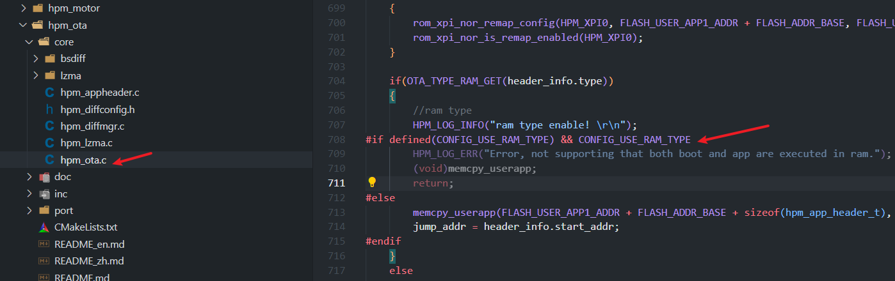

2.在制作生成OTA签名固件时，必须严格选择对应构建的类型：RAM/FLASH_XIP。其中:FLASH_XIP和FLASH_SDRAM_XIP都为FLASH_XIP类型。
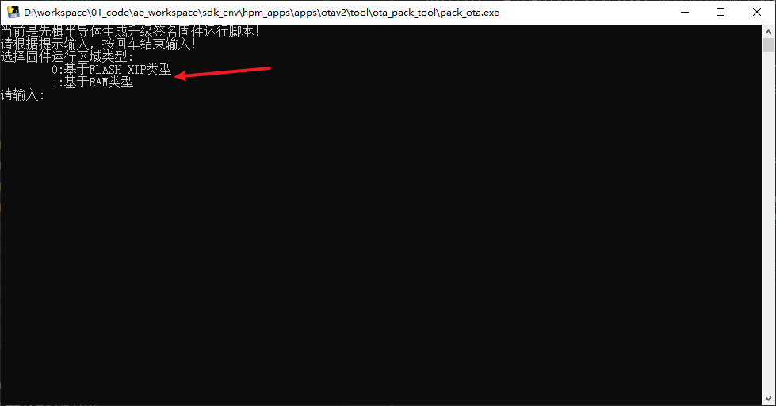


### 固件加密

本方案支持用户APP固件加密，并支持HPM MCU exip在线加密执行。
用户APP固件加密密匙由用户自己管理。可存在Flash的任意位置或存放在二级BOOTUSER中。
本方案默认将密匙放在BOOTUSER中，如下:
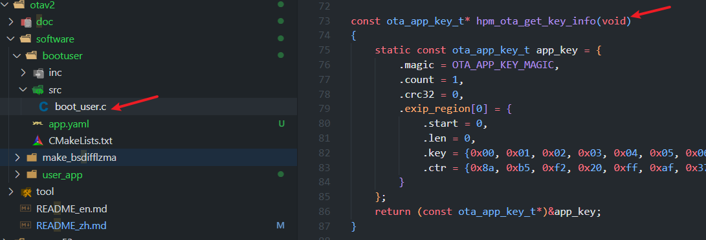
若放到flash其余位置，请调整flash_map文件调整KEY位置即可。如下:
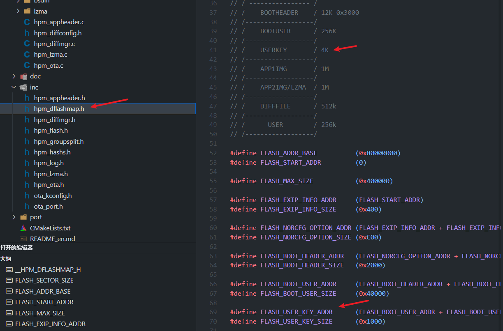

注意：由于加密密匙的安全性，必须对存放密匙的区域进行加密处理，如使用原始hpm exip kek blob方案加密(加密方式参考mft工具即可)存放密匙的BOOTUSER或KEY区域。如下：
由于EXIP最大支持4个区段的解密执行，当前方案中用户APP默认使用3区段，故此处不可启用3区段。
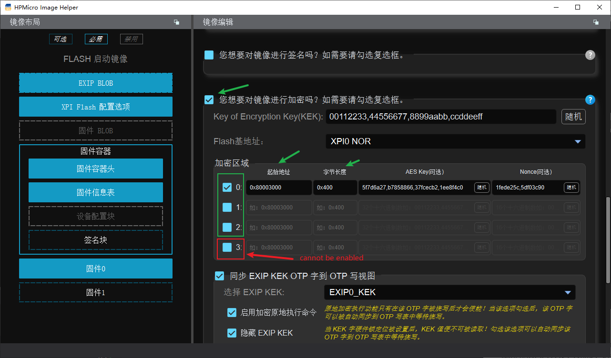

用户APP固件OTA包的加密和制作由pack_ota.exe工具完成。严格按照pack_ota.exe工具提示完成ota包的制作。
注意：加密密匙默认存在当工具路径下的exip_key.json中。
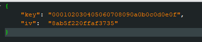

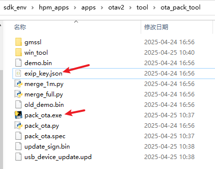

双击运行pack_ota.exe，根据提示完成user_app的加密和ota包的制作。
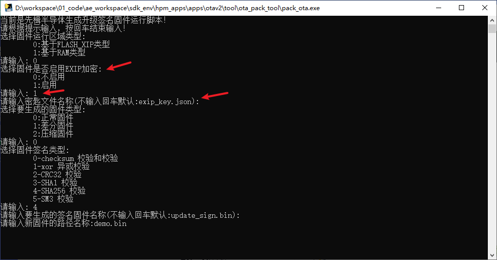

注意：用户APP固件加密不区分固件运行类型和生成类型。如：基于FLASH_XIP/RAM均支持APP固件加密，APP加密固件均可生成正常固件、差分固件、压缩固件。

### 全量升级

本方案支持用户APP全量升级，支持APP ping/pang升级运行。

定义：下载完整的升级包，覆盖所有文件，无论旧版本是否存在变化。
优点：
- 高可靠性：完全替换旧版本，避免残留文件或依赖问题。
- 操作简单：无需计算差异或合并文件，升级流程稳定。
- 兼容性广：适合首次安装或跨大版本更新。

缺点：
- 资源消耗大：需下载完整包，耗时长、流量大。
- 存储压力：设备需预留足够空间存储完整包。

适用场景：
- 首次安装或大版本更新；
- 通信条件良好、设备存储充足的环境。

全量升级流程：


注意：全量升级在通过pack_ota.exe制作OTA固件时，选择***正常固件***即可，如下：
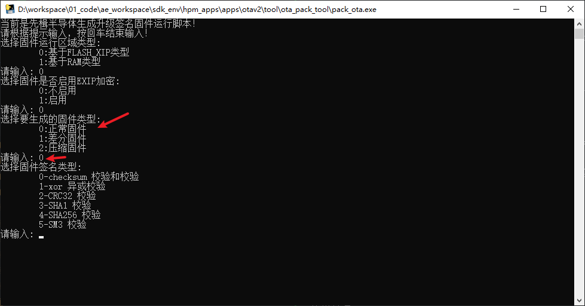


### 差分升级(增量升级)

本方案支持用户APP差分升级，考虑到异常断电等造成失败，设计使用PING/PANG/diff三区升级运行，同时本方案对差分的固件再次压缩处理，极大的降低升级包大小。
本方案使用bsdiff差分算法:https://github.com/mendsley/bsdiff

定义：仅下载新旧版本之间的差异部分，合并到旧版本中生成新版本。
优点：
- 高效省流：仅传输差异数据，节省流量和时间。

缺点：
- 依赖旧版本：必须基于特定旧版本生成差异包，版本碎片化可能引发兼容问题。
- 复杂度高：需维护差异算法，合并过程可能出错（如断电导致升级失败）。
- 计算开销：设备需处理差异合并，对硬件性能有一定要求。

适用场景：
- 频繁小版本迭代。
- 网络条件较差或流量敏感的场景。

注意：
1.差分升级需在cmakelist.txt(bootuser和user_app均需启用)中启用差分宏定义：set(CONFIG_DIFF_IMAGE_ENABLE 1)
如下：
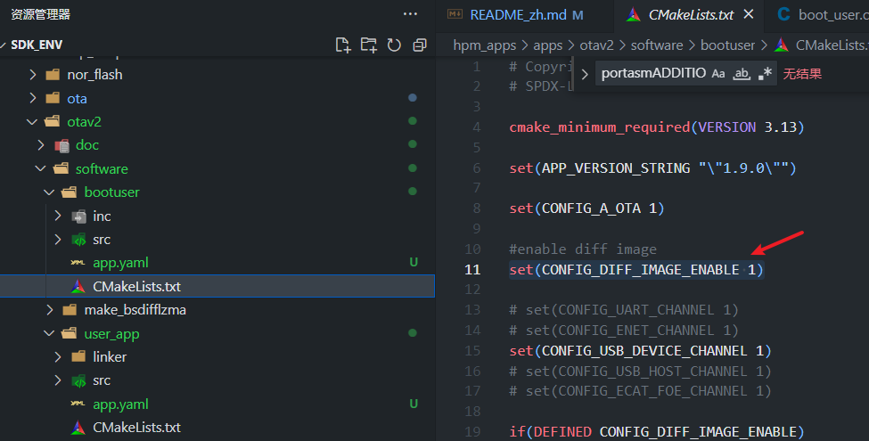
2.在通过pack_ota.exe制作OTA固件时，选择***差分固件***即可。
3.在通过pack_ota.exe制作OTA固件时，签名类型***每次选择的必须一致***，否则不支持差分升级。如：第一次选择4(SHA256),之后制作差分OTA包时也必须选择4；
4.在通过pack_ota.exe制作OTA固件时，选择的老固件必须是***当前MCU设备存储的已有固件***，否则不支持差分升级。
如下：
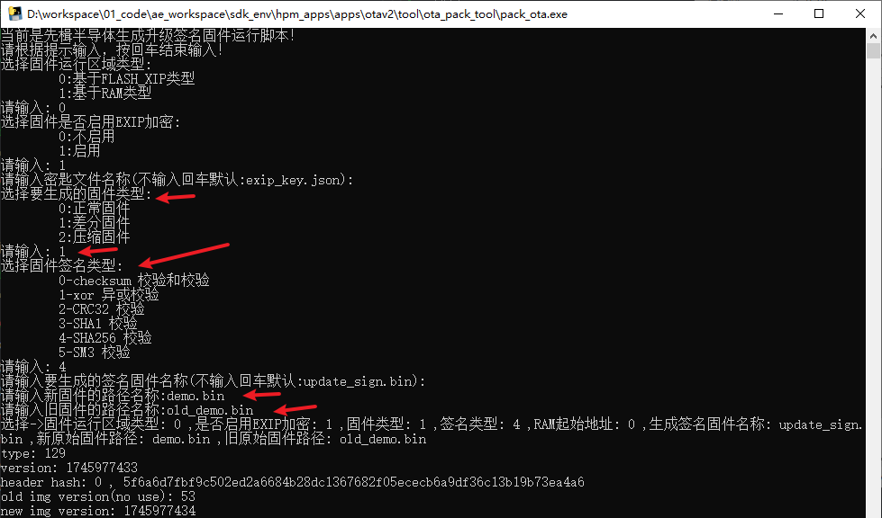

### 压缩升级

本方案支持用户APP压缩升级，支持全量压缩升级，也支持差分压缩升级。
本方案使用lzma压缩算法:https://www.7-zip.org/sdk.html

定义：将升级包（全量或差分）压缩后传输，接收端解压再执行升级。
优点：
- 减少传输量：压缩后体积显著降低（如 LZMA压缩）。
- 灵活性高：可配合全量或差分升级使用，通用性强。

缺点：
- 额外处理步骤：需解压操作，增加升级耗时和计算负担。
- 兼容性依赖：设备需支持对应的解压算法。

适用场景：
- 带宽有限的环境（如 IoT 设备远程升级）。
- 需优化传输效率但设备具备解压能力的情况。

注意：
1.压缩升级需在cmakelist.txt(bootuser和user_app均需启用)中启用差分宏定义：set(CONFIG_DIFF_IMAGE_ENABLE 1)
如下：

2.在通过pack_ota.exe制作OTA固件时，选择***压缩固件***即可。
如下：
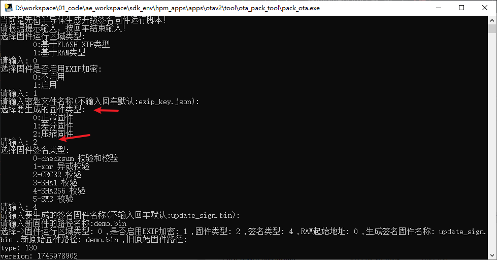

## 操作

### 构建工程
#### BOOTUSER工程构建：
1.修改cmakelist.txt，选择是否启用差分或压缩模式，如启用：set(CONFIG_DIFF_IMAGE_ENABLE 1)
2.修改cmakelist.txt，选择升级通道，支持：串口、以太网、USB DEVICE, USB HOST、ECAT，如下：
```
# set(CONFIG_UART_CHANNEL 1)
# set(CONFIG_ENET_CHANNEL 1)
set(CONFIG_USB_DEVICE_CHANNEL 1)
# set(CONFIG_USB_HOST_CHANNEL 1)
# set(CONFIG_ECAT_FOE_CHANNEL 1)
```
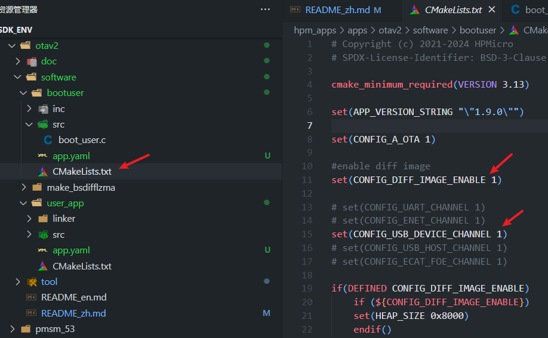

3.GUI工具构建工程，注意选择需要的构建类型：支持RAM/FLASH_XIP/FLASH_SDRAM_XIP。如下：
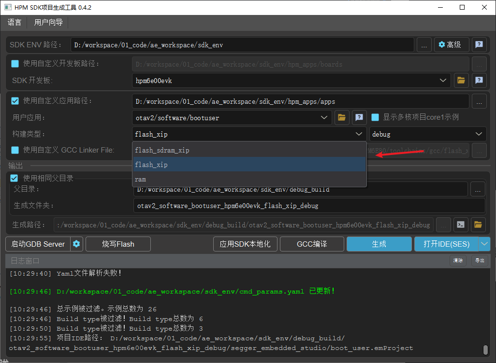

#### 用户APP工程构建：
1.修改cmakelist.txt，选择是否启用差分或压缩模式，如启用：set(CONFIG_DIFF_IMAGE_ENABLE 1)
2.修改cmakelist.txt，选择升级通道，支持：串口、以太网、USB DEVICE, USB HOST、ECAT，如下：
```
# set(CONFIG_UART_CHANNEL 1)
# set(CONFIG_ENET_CHANNEL 1)
set(CONFIG_USB_DEVICE_CHANNEL 1)
# set(CONFIG_USB_HOST_CHANNEL 1)
# set(CONFIG_ECAT_FOE_CHANNEL 1)
```
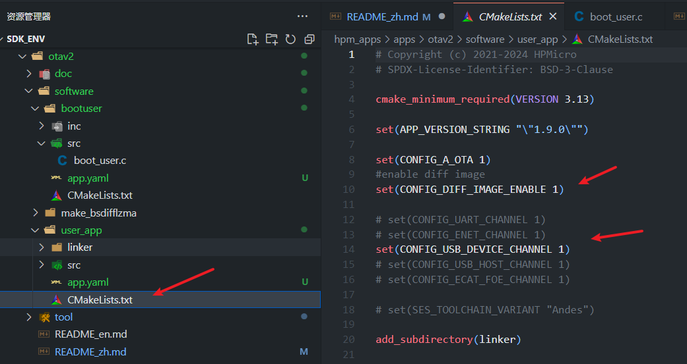

3.GUI工具构建工程，注意选择需要的构建类型：支持RAM/FLASH_XIP/FLASH_SDRAM_XIP。如下：
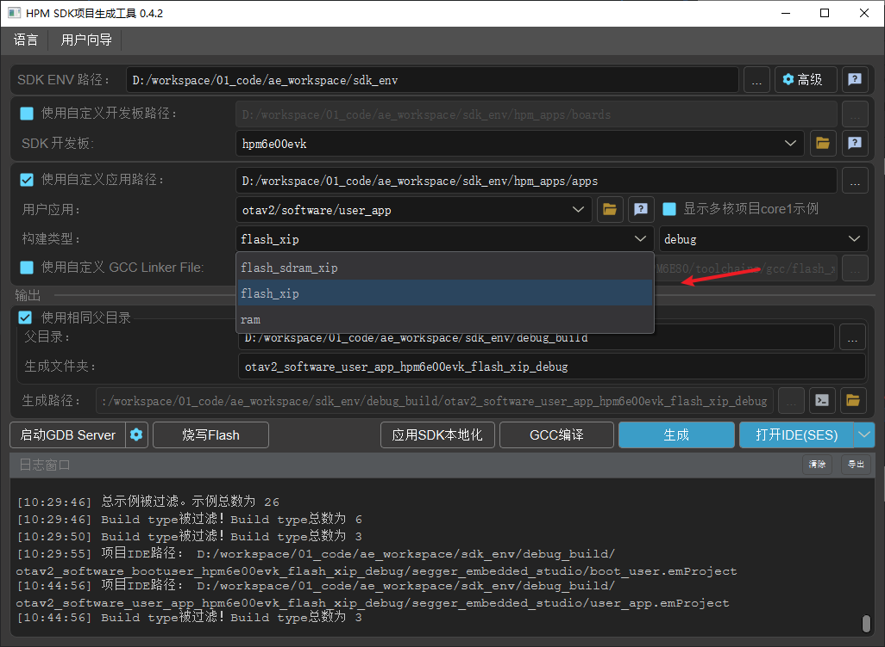

### 工程编译
#### BOOTUSER工程编译烧录
1.使用GCC或IDE编译工程：
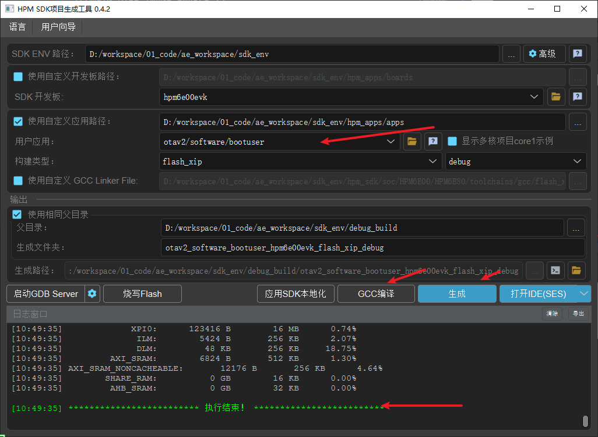
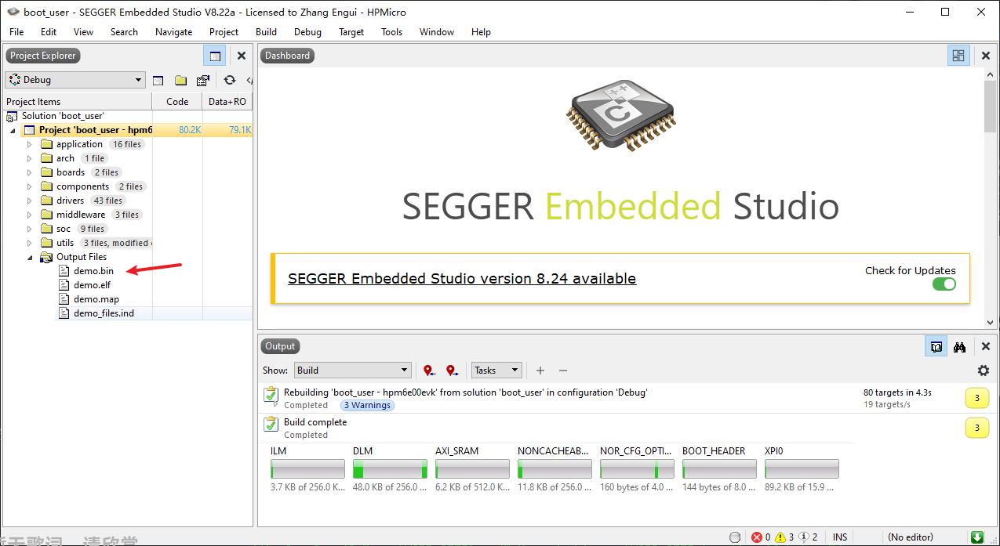
2.若为RAM构建类型或需加密BOOTUSER，请使用hpm mft工具制作烧录即可。
注意：必须先烧录BOOTUSER固件，否则USERAPP不能正确跳转执行。

#### USERAPP工程编译
使用GCC或IDE编译工程：
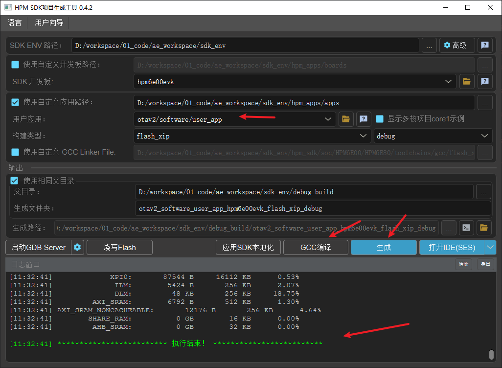
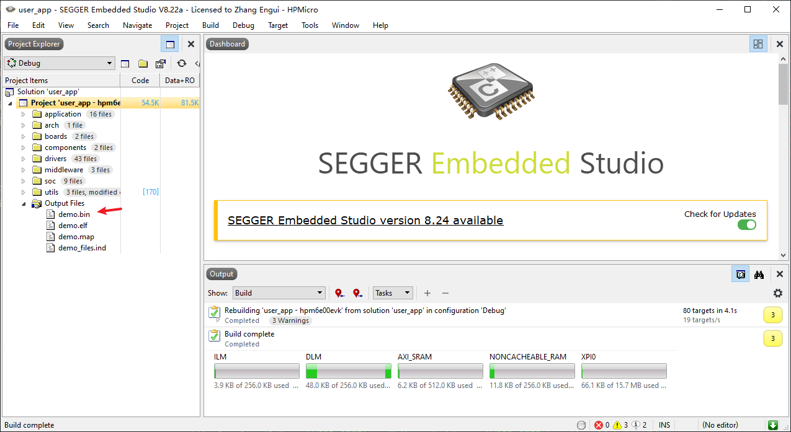
注意：在调试时，可以直接用调试器烧录调试，此时烧录的固件为未签名固件。若为ram类型固件，掉电会丢失；若为flash_xip类型固件，默认version(HEADER_INIT_VERSION)为0，由于bootuser会按照高版本号跳转，在调试时可修改初始version版本号强制让跳转到调试固件中。如：
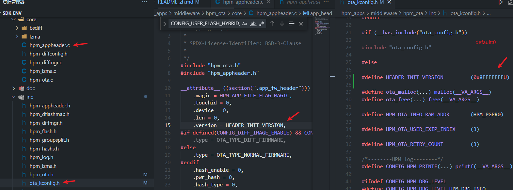


### 制作升级包
使用上位机工具pack_ota.exe制作升级包。
1.拷贝USERAPP编译成功的固件到工具目录下。
2.双击pack_ota.exe运行工具。
3.根据需求，按照提示选择正确的：固件区域类型，是否启用加密、密匙、固件生成类型、签名类型、新老固件等，至此完成升级包制作。
注意：确保最后提示制作成功"SUCCESS"。
如下：
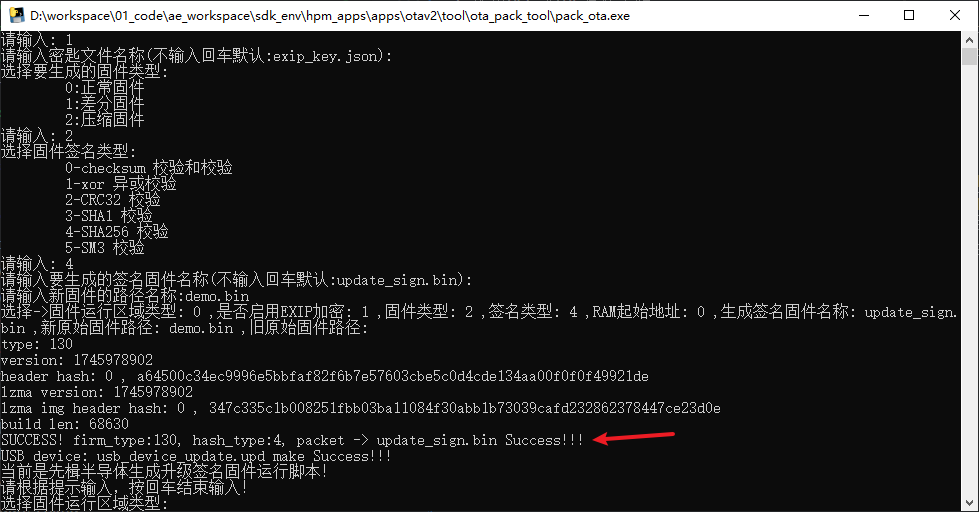
注意：usb device msc 由于usb虚拟U盘传输存在不连续传输，需要用usb_device_update.upd为升级包。

### 下载升级包

#### 基于UART 通道升级

串口通道通信基于xmodem协议。

cmakelists.txt选择UART通道->构建->编译->烧录。

- 硬件连接

（1）连接PC USB到USB_DEBUG接口

（2）连接调试器到JTAG接口

- 端口设置

串口波特率设置为``115200bps``，``1个停止位``，``无奇偶校验位``

- PC上位机选择***升级包***，发送升级

工具路径：ota/tool/ECOM串口助手 V2.80.exe


#### 基于ENET通道升级

以太网通道通信升级基于网络TCP IP协议，PC上位机做tcp client, MCU做tcp server。

CMakeLists.txt选择ENET通道->构建-编译->烧录。

注意：CMakeLists.txt中同时要注意选择当前board使用的phy芯片，否则通信失败。

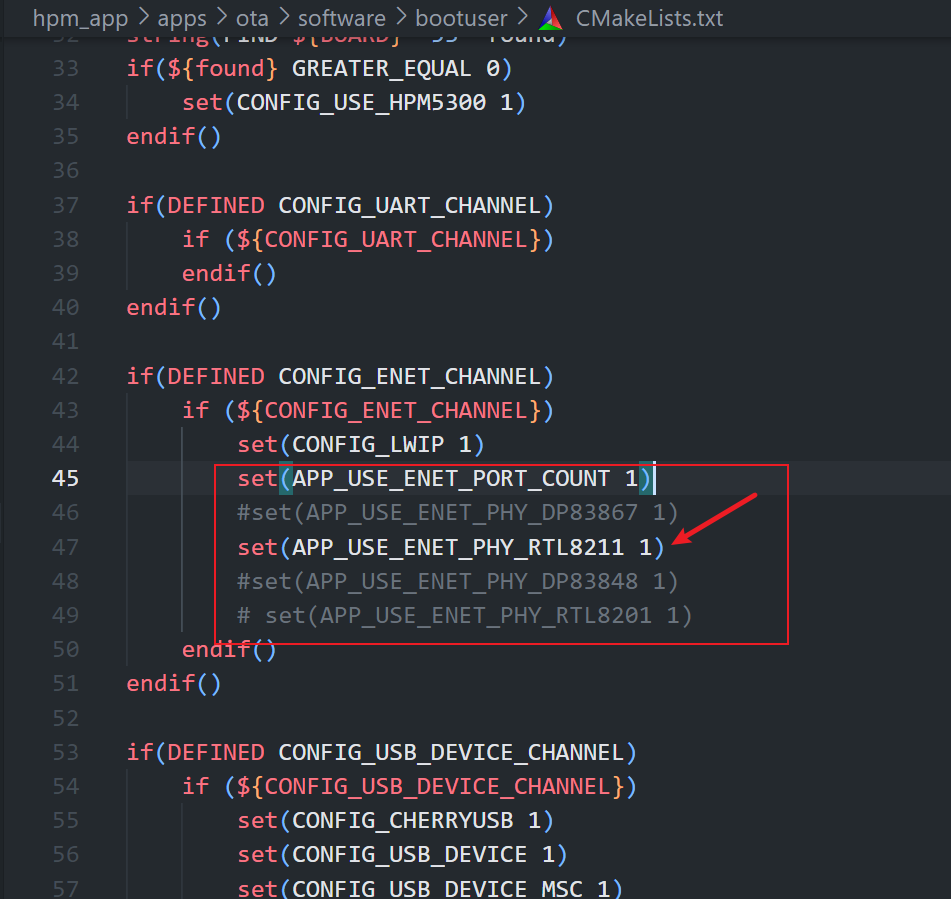

- 硬件连接

（1）连接PC USB到USB_DEBUG接口

（2）连接调试器到JTAG接口

（3）网线连接EVK的网口与PC网口

- 端口设置

串口波特率设置为``115200bps``，``1个停止位``，``无奇偶校验位``

- 网络环境设置

MCU和PC网络必须在同一个网段下，否则通信失败。

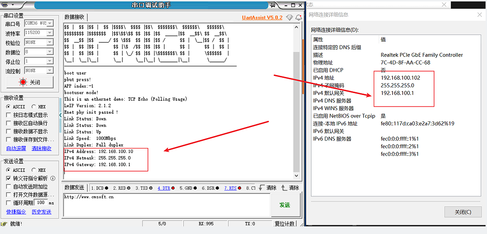

- PC网络工具建立连接，选择 ***升级包*** ，发送升级

工具路径：ota/tool/NetAssistv4325.exe

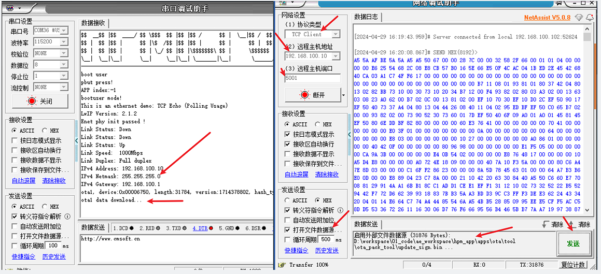


#### 基于USB DEVICE MSC通道升级

USB device msc 是USB作为DEVICE虚拟成一个U盘。EVK board USB0口插上PC，PC上会枚举出一个U盘。拷贝 ***升级包(usb_device_update.upd)*** 到U盘中即可完成固件更新。

CMakeLists.txt选择USB device msc通道->构建->编译->烧录。

由于usb device msc传输时存在不连续传输，如果直接使用升级包update_sign.bin传输，会导致接收存储的是一个错误的固件。为解决此问题，使用如下方案：

 1. usb dev msc sector size 512 byte。

 2. 对升级包按照每包(512-profile struct)切片后再组包(增加magic/num/size/end)。

 3. 无需增加文件系统fatfs，效率高且节省Flash空间。

如下：

usb device msc传输不连续：

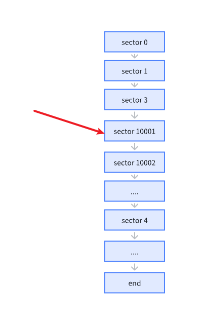

组包协议：

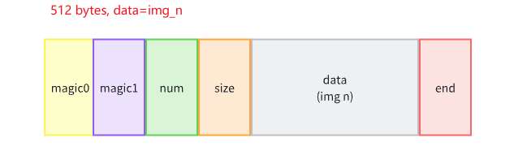

切片组包：

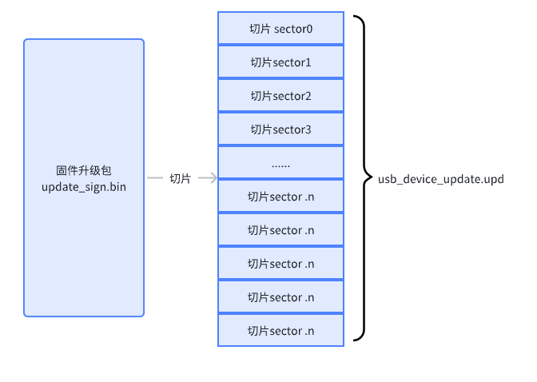

- 硬件连接

（1）连接PC USB到USB_DEBUG接口

（2）连接调试器到JTAG接口

（3）连接PC USB到USB0 接口

- 端口设置

串口波特率设置为``115200bps``，``1个停止位``，``无奇偶校验位``

- PC上枚举U盘，拷贝 ***升级包(usb_device_update.upd)*** 到U盘。

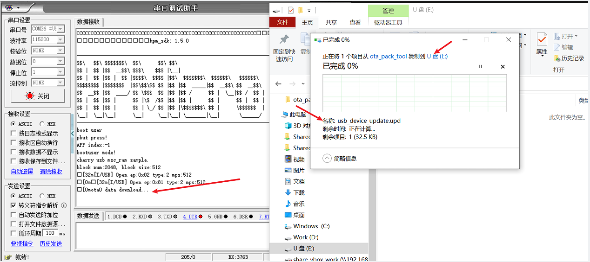


#### 基于USB HOST MSC通道升级

USB host msc是MCU 作为USB host外接一个物理U盘。先拷贝 ***升级包*** update_sign.bin到U盘(格式FAT32), U盘插入EVK board USB0口，MCU固件会自动枚举U盘，并从U盘拷贝升级包到Flash完成固件升级。

CMakeLists.txt选择USB host msc通道->构建->编译->烧录。

- 硬件连接

（1）连接PC USB到USB_DEBUG接口

（2）连接调试器到JTAG接口

（3）拷贝升级包update_sign.bin到U盘

（4）U盘插入EVK board USB0口

- 端口设置

串口波特率设置为``115200bps``，``1个停止位``，``无奇偶校验位``

- 拷贝 ***升级包*** update_sign.bin到U盘

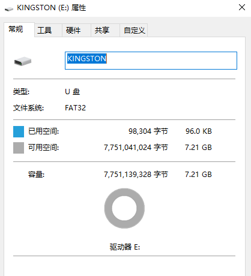

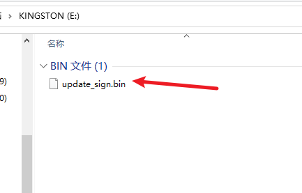

- U盘插入EVK board USB0口，MCU从U盘拷贝升级包到Flash。

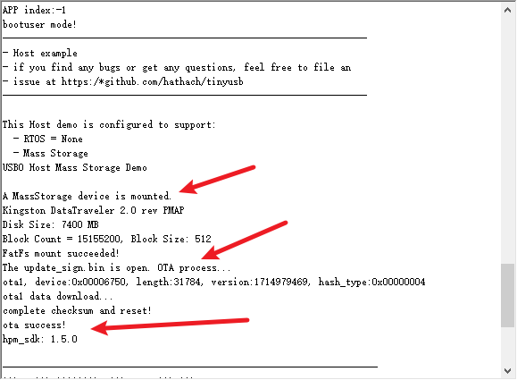


#### 基于ECAT通道升级

ECAT通道基于FOE协议。

##### 注意

该功能需要需要使用SSC tool生成协议站代码，之后才能正确够构建编译。
请参考middlware/hpm_ota/port/ecat中的README， 进行操作。

##### 工程设置
在文件`CMakeLists.txt`中
选择ECAT_FOE通道(设置"set(CONFIG_ECAT_FOE_CHANNEL 1)")， 然后构建->编译->烧录。
使用实际eeprom时, 设置"set(CONFIG_EEPROM_EMULATION 0)"

### 固件处理
固件处理是指将升级包下载到存储区域后，BOOTUSER对升级包进行签名校验、差分还原、解压缩、固件验签等操作。
如下：
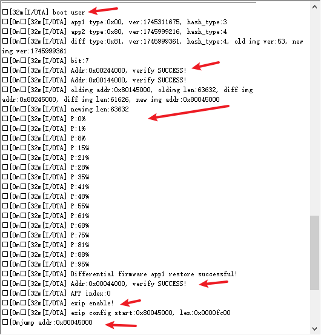

### 升级完成
BOOTUSER对固件处理完，验签成功后跳转新的APP运行，固件升级完成。
如下：
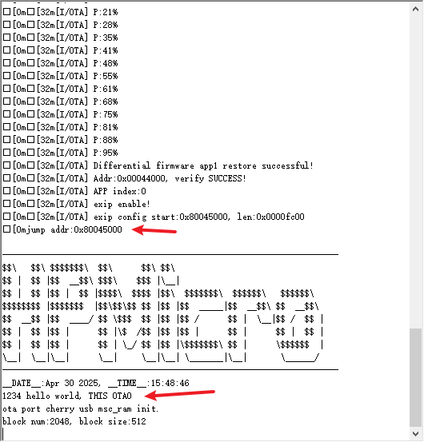

## 软件API

:::{eval-rst}

关于软件API 请查看 `方案API 文档 <../../_static/apps/otav2/html/index.html>`_ 。
:::