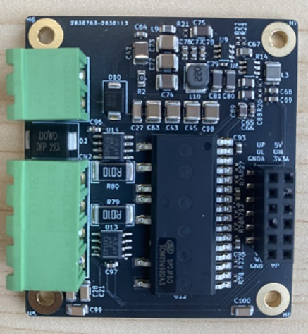
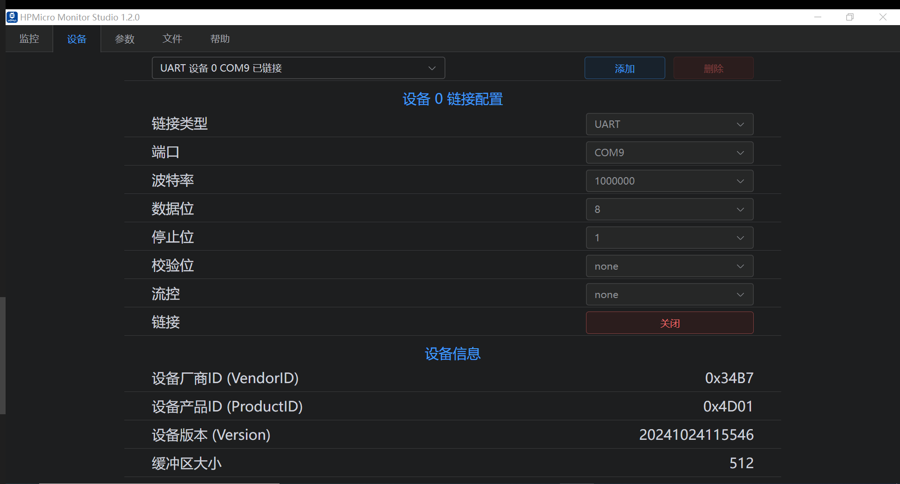
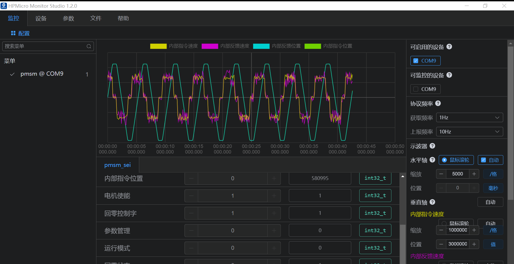

# HPM5300 Micro-servo&driver Solution

## Depend on SDK1.8.0

## Overview

HPM series MCU is a high-performance real-time RISC-V microcontroller from Shanghai HPM Semiconductor Technology Co., Ltd., which provides great computing power and efficient control capability for industrial automation and edge computing applications. Shanghai HPM Semiconductor has currently released multiple series of high-performance microcontroller products, such as HPM6700/6400, HPM6300, HPM6200, HPM5300, etc.As a high-performance motion control MCU, the HPM5300 series microcontroller has the advantages of strong performance, rich interface, smaller package and excellent quality.

For HPM5300 series MCUS, HPM Semiconductor introduces this product-grade servo driver solution for evaluating motion control performance, which includes most of the functions of HPM5300 series chips; Built-in position, speed control mode, can support a variety of open loop, semi-closed loop and closed loop systems to meet the requirements of most industries.

Electrical parameters are as follows：

| Category | Content |
| ---- | ---- |
| Rated input voltage | 24V |
| Input voltage range | 12~36V |
| Rated output power | 0~100W |
| Rated output current RMS | 5A |
| Control mode | Position closed loop/Speed closed loop |
| Control type | CAN/DI |
| Digital signals | GPIOx4（An external driver is required） |
| Quadrature encoder output | QEOx2|
| Encoder type | ABZ、SEI |
| Motor type | PMSM/BLDC/BDC |
| Size| 50x55x25 mm |

Note: SEI (Serial Encoder Interface) can be programmed to implement a variety of communication protocols, such as Tamagawa encoder protocol, HIPERFACE, Nikon Encoder protocol, SSI, BiSS-C and EnDat2.1/2.2 protocol, etc. Users can also support more protocols through custom programming.

## Test Introduction

In this test sample, the servo drive control system controls the motion of a motor with encoder types ABZ and ABS respectively.

### Hardware Option

- The HPM5300 drive control hardware consists of two boards, control board is used to communicate with the upper tool, receive the encoder feedback, send PWM drive signal to the DRV board and receive the current sampling signal.Please read CTL board schematic: [《HPM5300_DCServo_CTL_REVB》](hardware/HPM5300_DCServo_CTL_REVB.pdf)

- The drive board is composed of a power drive module and a current sampling module, and contains a motor and a power interface. Please read DRV board schematic:  [《HPM5300_DCServo_DRV_REVB》](hardware/HPM5300_DCServo_DRV_REVB.pdf)

- Please refer to the user guide for detailed technical parameters: [《HPM5300_DCServo User Guide》](doc/HPM5300_DCServo_UG.pdf)

### Software Option

The software scheme is mainly composed of the following parts: three-closed loop control, vector control, PWM triggered ADC sampling, PWM current loop interrupt generation and upper and lower computer communication. The overall block diagram is as follows. See software scheme for more details: [《HPM53Servo Closed-loop scheme》](doc/HPM53伺服闭环软件方案.pdf)

### Test method

The upper debugging tool is used to drive the motor of ABZ and SEI encoders respectively. After the motor is successfully moved, the motion parameter waveform data can be observed in the oscilloscope window of the upper computer.

#### Motor Type

The test motor model information of this scheme is shown in the following table. If other motor models are selected, the control parameters need to be readjust.

| Project | Device | Motor | EncoderType | Resolution1r |
| ---- | ---- | ---- | ---- | ---- |
| Pmsm_abz | 53DCServo | Leadshine BLM57050-1000 | ABZ | 4000count |
| Pmsm_sei | 53DCServo | Leadshine LVM0400C | tamawaga| 131072count |

#### Device Connection

- Connect PC USB to UART Type-C interface
- Connect the debugger to the JTAG interface
- Connect the motor and encoder

Note: You need to select the corresponding resistance welding or not according to the selected code type, where the R105 resistance value is 10K, and the rest are 0R resistors. If the encoder is QEI, the resistance in the white screen frame named QEI is welded. The resistance in the white screen frame 422 and 485 is not welded. If the encoder is SEI, the resistance in the white screen frame named 485 is welded, and the resistance in the white screen frame 422 and QEI is not welded.

#### Motion Param

| absolute position r   | Speed r/s | Acceleration r/s/s | Acceleration/s r/s/s/s | CommandType |
| ---- | ---- | ---- | ---- | ---- |
| 20 | 10| 100 | 1000 | S |

### Generate Project

- Project Path: hpm_apps/apps/pmsm_53/software/pmsm_abz

- windows GUI create project

- windows cmd create project
  Please read [HPM5300_DCServo User Guide](doc/HPM5300_DCServo_UG.pdf)

### test process

- Double-click HPMicroMonitorStudio to open universal host software

- Load the elf file and create a json file

- Click the device and connect the communication

- add params

（1）Motor and encoder parameters

（2）Oscilloscope monitors parameters

（3）Motor operation control word and parameter management

#### SEI

- Modify motor and encoder parameters

(1) Modify the motor pole logarithm as 5, encoder type as 1, encoder pulse number of one turn as 131072

- auto phase find

(1) Write 1 to the zero_controlword

(2) if success, and the status is 1

- Motor enables operation

(1) Write 1 as the control word

- Test results

#### ABZ

- Modify motor and encoder parameters

(1) Modify the logarithm of the motor pole to 2, the encoder type to 0, and the pulse number of one turn of the encoder to 4000

- auto phase find

(1) Write 1 to the zero_controlword

(2) if success, and the status is 1

- Motor enables operation

(1) Write 1 as the control word

- Test results

#### EEPROM

- save parameters to eeprom

(1)set param_save 2

(2)if success, parameter status displays 1, as shown in the figure below.

- restore factory setting

(1)set param_save 1

(2)if success, parameter status displays 0

## API

:::{eval-rst}

About software API: `API doc <../../_static/apps/pmsm_53/html/index.html>`_ .
:::