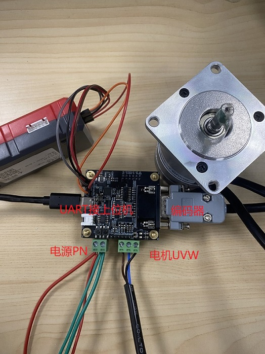
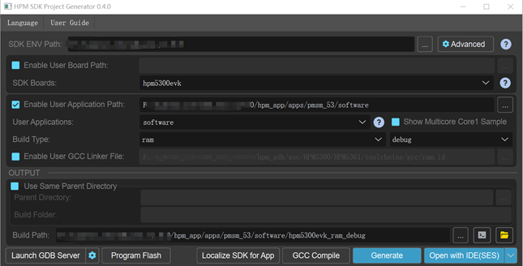
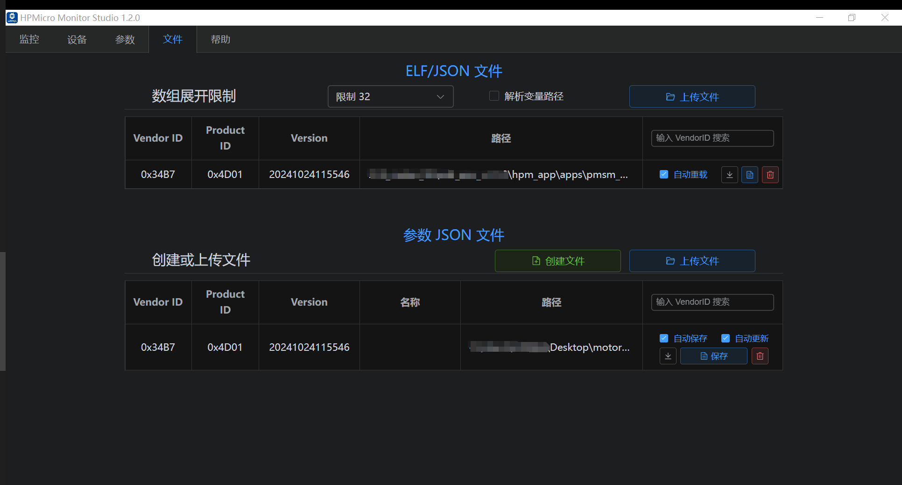
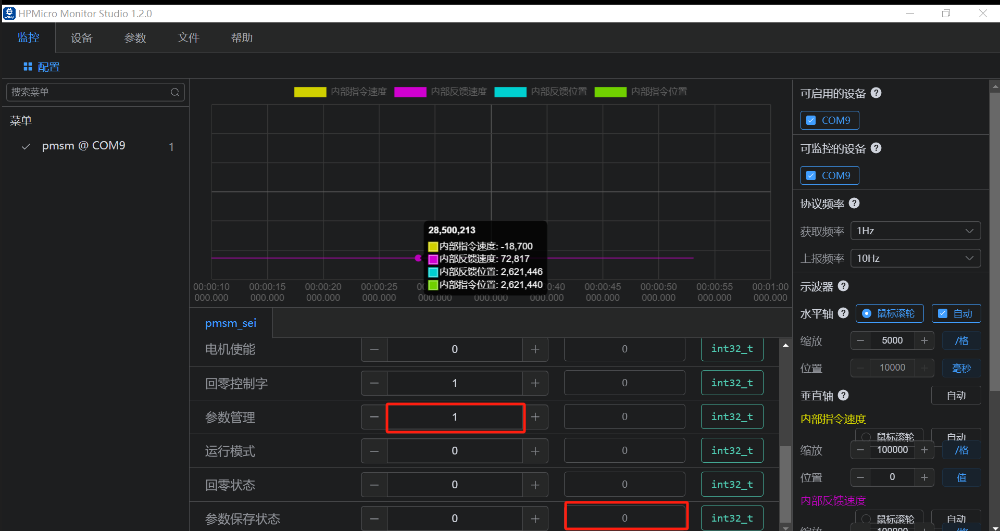

# HPM5300微型伺服驱控一体方案

## 概述

HPM系列MCU是来自上海先楫半导体科技有限公司的高性能实时RISC-V微控制器，为工业自动化及边缘计算应用提供了极大的算力、高效的控制能力。上海先楫半导体目前已经发布了如 HPM6700/6400、HPM6300、HPM6200、HPM5300等多个系列的高性能微控制器产品。

HPM5300系列微控制器作为高性能运动控制MCU，具备强劲性能、丰富接口、更小封装、更低成本、卓越品质等优势。

针对HPM5300系列MCU，先楫半导体推出本款产品级伺服驱控方案用于评估运动控制性能，本方案囊括了HPM5300系列芯片的大部分使用功能；内置位置、速度控制模式，可以配套各种开环、半闭环和闭环系统满足绝大部分行业的使用要求。

电气参数如下:

| 类别 | 内容 |
| ---- | ---- |
| 额定输入电压 | 24V |
| 输入电压范围 | 12~36V |
| 额定输出功率 | 0~100W |
| 额定输出电流RMS | 5A |
| 控制方式 | 位置闭环/速度闭环 |
| 控制类型 | CAN/DI |
| DI/DO | GPIOx4（需外接驱动使用） |
| 位置信息输出 | QEOx2|
| 编码器类型 | 增量式、SEI |
| 支持电机类型 | PMSM/BLDC/BDC |
| 尺寸 | 50x55x25 mm |

注：SEI（串行编码器接口）可以通过编程实现多种通信协议，如Tamagawa编码器协议、HIPERFACE、Nikon编码器协议、SSI、BiSS-C 及EnDat2.1/2.2协议等，用户还可以通过自定义编程支持更多协议。

## 测试简介

在本测试示例中，伺服驱控系统对编码器类型为增量式和绝对值式的电机分别进行运动控制。

### 硬件方案

- HPM5300驱控硬件由两块子板组成，其中控制板用于与上位工具通信、接收编码器反馈、向驱动板发送PWM驱动信号并接收电流采样信号。请查看控制板原理图: [《HPM5300_DCServo_CTL_REVB》](hardware/HPM5300_DCServo_CTL_REVB.pdf)

- 驱动板构成为功率驱动模块和电流采样模块，并载有电机和电源接口。请查看驱动板原理图:[《HPM5300_DCServo_DRV_REVB》](hardware/HPM5300_DCServo_DRV_REVB.pdf)

- 详细技术参数请查看用户指南: [《HPM5300_DCServo用户指南》](doc/HPM5300_DCServo_UG.pdf)

### 软件方案

软件方案主要由以下几部分组成：三闭环控制、矢量控制、PWM触发ADC采样、PWM电流环中断产生以及通用上位机，整体框图如下，更多详情请查看软件方案: [《HPM53伺服闭环软件方案》](doc/HPM53伺服闭环软件方案.pdf)

### 测试方法

使用上位调试工具分别驱动ABZ和SEI两种类型编码器的电机，电机成功运动后可以在上位机的示波器窗口观察运动参数波形数据。

### 示例电机类型

本方案测试电机型号信息如下表，如选用其他型号电机，需要重新调整控制参数。

| 工程 | 硬件 | 电机 | 编码器类型 | 分辨率1r |
| ---- | ---- | ---- | ---- | ---- |
| Pmsm_abz | 53伺服驱控系统 | 雷赛智能BLM57050-1000 | 增量式 | 4000count |
| Pmsm_sei | 53伺服驱控系统 | 雷赛智能LVM0400C | 多摩川 | 131072count |

### 设备连接

- 连接PC USB到UART Type-C接口
- 连接调试器到JTAG接口
- 连接电机与编码器

注意:需要根据选用编码类型选择对应电阻焊接与否，其中R105阻值为10K，其余均为0R电阻。如编码器为QEI，则在名称为QEI的白色丝印框的电阻焊接，422、485白色丝印框内的电阻不焊接；如编码器为SEI，则在名称为485的白色丝印框的电阻焊接，422、QEI白色丝印框内的电阻不焊接。=-

### 电机运动参数

| 绝对位置 r | 速度r/s | 加速度r/s/s | 加加速度r/s/s/s | 指令规划方式 |
| ---- | ---- | ---- | ---- | ---- |
| 20 | 10 | 100 | 1000 | S |

### 创建工程

- 工程路径: hpm_apps/apps/pmsm_53/software

- windows下GUI工程构建

- windows下命令行工程构建
  请参考 [HPM5300_DCServo用户指南](doc/HPM5300_DCServo_UG.pdf)

### 测试流程

- 双击HPMicroMonitorStudio，打开通用上位机软件

- 加载elf文件，并创建json文件

- 点击设备，通信连接

- 添加参数

（1）电机、编码器参数

（2）示波器监测参数

（3）电机运行控制字及参数管理

#### 绝对式编码器

- 根据电机/编码器型号修改电机及编码器参数

(1) 修改电机极对数为5，编码器类型为1，编码器一圈脉冲数为131072

- 预定位

(1)预定位控制字（回零控制字）写1

(2)预定位成功，回零状态为1

- 电机使能运行

(1)控制字写1

- 测试结果

#### 增量式编码器

- 修改电机及编码器参数

（1）修改电机极对数为2，编码器类型为0，编码器一圈脉冲数为4000

- 预定位

(1)预定位控制字（回零控制字）写1

(2)预定位成功，预定位状态为1

- 电机使能运行

(1)控制字写1

- 测试结果

#### EEPROM

- 参数保存至eeprom

(1)参数管理写入2

(2)保存至eeprom成功，参数状态显示1，如下图所示。

- 恢复默认值

(1)参数管理写1

(2)保存至eeprom成功，参数状态显示0，如下图所示。

## API

:::{eval-rst}

关于软件API 请查看 `方案API 文档 <../../_static/apps/mpsm_53/html/index.html>`_ 。
:::
