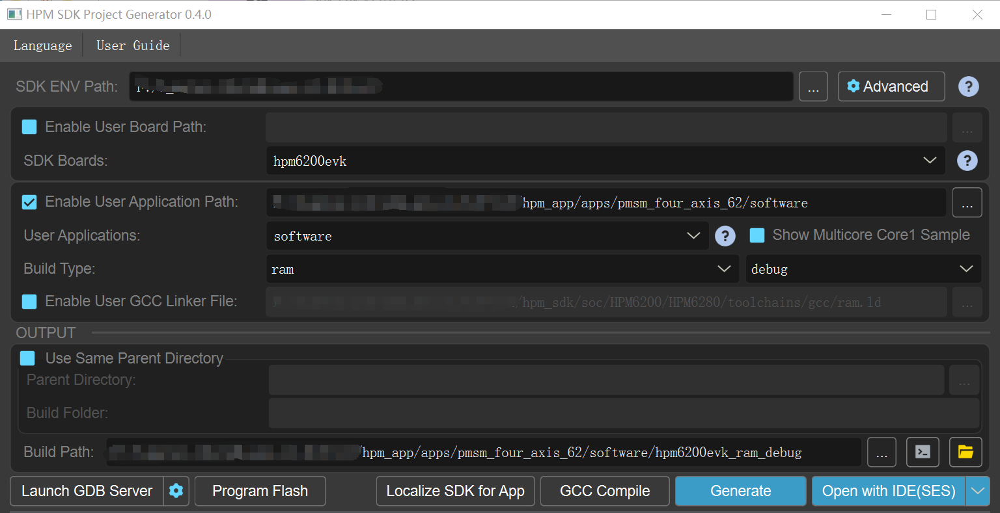

# HPM6200 four-axis servo-driver Solution

## Depend on SDK1.10.0

## Overview

HPM6200 is a 32-bit high performance microcontroller based on RISC_V kernel from Shanghai HPM Semiconductor Technology Co., LTD.

For HPM6200 series MCUS, HPM Semiconductor has introduced a four-axis servo-drive solution, which adopts FOC control for single axis and synchronizes timer to realize four-axis motor movement with fixed phase difference.

## Software Option

The software design is mainly divided into four parts: pre-positioning, speed/position loop, current loop, S curve, synchronization timer, serial communication and USB communication. 

The following table lists the global parameters.

|  | name | explain | type | 
| ---- | ---- | ---- | ---- |
| PI params | SPEEDLOOP_KP | speed loop gain | define | 
| PI params | SPEEDLOOP_KI | speed loop integral | define | 
| PI params | SPEEDLOOP_OUTMAX | speed loop maximum output | define | 
| PI params | POSITIONLOOP_KP | position loop gain | define | 
| PI params | POSITIONLOOP_KI | position loop integral | define | 
| PI params | POSITIONLOOP_OUTMAX | position loop maximum output | define | 
| operation mode | OpMode_Typ | speed：1 position：0 | enum | 
| velocity trajectory planning | CONSTANT_SPEED_TIME_s | constant speed time | define | 
| velocity trajectory planning | MOVE_SPEED | velocity r/s | define | 
| velocity trajectory planning | MOVE_ACC | acc r/s/s  |define | 
| velocity trajectory planning | MOVE_JERK | jerk r/s/s/s | define |
| position trajectory planning | MOVE_RELATIVE_POS_r | relative position r | define |  
| position trajectory planning | CYCLE_CNT | cycle count | define | 
| position trajectory planning | CONTINOUS_RONUD_MOVE_TYPE | contious round move type | define | 
| position trajectory planning | SIGNLE_MOVE_TYPE | single move type | define | 
| position trajectory planning | MULTIPLE_MOVE_TYPE | multiple move type（Choose one of the above three） | define | 
| position trajectory planning | DWELLTIME_ms | dwell time | define | 
| global control params | MOTOR_CONTROL_Global |  | struct | 
| motor params | MOTOR_PARA |  | struct | 

The specific function interfaces are shown in the following table.

|  API name | description | calling state | 
| ---- | ---- | ---- | 
| pwm_sync | synchronous timer | init | 
| pmsm0_foc_angle_align | axis 0 presets | servo start | 
| motor0_highspeed_loop | axis 0 current loop | 50us interrupt | 
| pos_cmd_gene | position trajectory planning | 1ms interrupt | 
| vel_cmd_gene | velocity trajectory planning | 1ms interrupt | 
| motor_speed_ctrl | velocity/position loop | 1ms interrupt | 

### fix motor rotor position to 0 degrees

During power-on, the position of the motor rotor is random, and there is a fixed Angle difference between the position of the encoder rotor and the motor rotor. Therefore, it is necessary to turn the motor rotor position to a fixed position, at which time both the encoder position and the rotor Angle are known. In this scheme, the encoder rotor position coincides with the motor rotor position before normal operation.

The main implementation steps are divided into three steps:

- set electric angle at 90°,  d axis current is gradually increased to the limiting amplitude.

- keep d axis current, gradually reduce the electric angle to 0 degrees;

- keep electric angle at 0 degrees , gradually reduce the d axis current to 0.

### current loop

The pwm channel generates a comparison interrupt that interrupts the current loop executed inside. Circuit loop loop has two main parts to work:

- current amplitude update: ADC samples the three-phase current and becomes the DQ axis DC component after CLARK, PARK transformation. The current loop PI controller controls the DQ axis current

- electrical angle update: The QEI module obtains the feedback position of the motor, and then calculates the electrical Angle according to the number of poles of the motor

### trajectory planning

There is a step in the speed of the motor when it is started and stopped. A sudden change in motor speed can cause current overload. Therefore, the acceleration and deceleration control algorithm is usually used to plan the motor speed.

In this scheme, we use the trajectory planning algorithm in the motor library, S-curve, to control the change of acceleration through variable acceleration to ensure that acceleration does not mutate, so that the acceleration and deceleration speed curve is smooth and the motor runs more smoothly.

Here, take the motion axis 0 as an example to briefly introduce how to use the trajectory planning algorithm in the motor library:

(1) Add electrical hangar

- Add hpm_motor to the middleware folder

- The project references the hpm_motor library

For details, see the user guide of hpm_motor library (hpm_apps/middleware/hpm_motor/doc)

（2）assign a value to each member of the configuration parameter structure

- define structure variables

CMDGENE_PARA cmdpar[4] = {0};

- speed mode

config cmdpar[0].cmdgene_in_par.velcfgpar 

- position mode

config cmdpar[0].cmdgene_in_par.poscfgpar

（3）trajectory generation

After axis 0 is enabled, the trajectory generation function is called within 1ms interrupt to obtain the speed instruction and position instruction of the corresponding time series

speed mode：vel_cmd_gene

position mode：pos_cmd_gene

（4）trajectory planning reset

API:cmd_gene_disable

Clear the intermediate variable of trajectory planning, so as to plan the starting point, end point and speed of the PTP movement specified by the user again, calculate the acceleration of the connected points, add the acceleration, and then calculate the position and speed of each point.

### speed/position loop

Timer generates 1ms interrupt, control speed loop/position loop update:

- speed/position reference

- position/speed feedback

### synchronous timer

By configuring a synchronous trigger input SYNCI module connected to PWM, the four motors are turned on at a certain phase difference.

### UART/USB communication

In order to facilitate user control of the motor, it supports issuing motion commands using UART or USB debugging tools. Users can choose to use UART or USB in the cmakelist file. The MCU performs corresponding movements based on the received motion instructions.

## test method

### hardware connection

（1）test device

HPM6200 drive control hardware is composed of two boards, the control board is used to communicate with the serial port, debug, send PWM drive signal to the driver board and receive current sampling signal, encoder information.

The power board comprises a power drive module, a current sampling module, and contains an encoder, a motor and a power interface. 

Four-axis drive control prototype picture is shown in the figure below.


Single-axis drive control picture is shown in the figure below.


(2)motor type

The test motor model information of this scheme is shown in the following table. If other motor models are selected, it is necessary to readjust the macro definition of PI control parameters.

| motor type | pairs of poles | encoder type | resolution | 
| ---- | ---- | ---- | ---- |
| leisai BLM57050 | 2 | ABZ | 4000count/r | 

(3)motion parameter

The default motion parameters are shown in the following table. For example, adjust the motion parameters and motion mode, and modify the macro definition according to the section "Configuration example"in hpm_motor libarary user guide. 

| absolute position r | speed r/s | acc r/s/s | jerk r/s/s/s | trajectory planning mode |
| ---- | ---- | ---- | ---- | ---- |
| 20 | 10 | 100 | 1000 | S |

(4)device connection

- connect PC USB0 to the debug port on the control board.

- connect the JTAG to PC USB1.

- connect the motor UVW three-phase, encoder, and 24v power supply to the power board.

### Project creation

Double-click on the gui tool to create the project.



### motor run

（1）compile and run the project successfully

（2）motor action, perform a predetermined position operation

（3）The serial port displays the following information:

```
[14:02:30.037]收←● ==============================
hpm6200evk clock summary
==============================
cpu0:		 600000000Hz
cpu1:		 600000000Hz
axi:		 200000000Hz
ahb:		 200000000Hz
mchtmr0:	 24000000Hz
mchtmr1:	 24000000Hz
xpi0:		 133333333Hz
==================
[14:02:30.061]收←● ============

---------------------------------------------------------------------
$$\   $$\ $$$$$$$\  $$\      $$\ $$\
$$ |  $$ |$$  __$$\ $$$\    $$$ |\__|
$$ |  $$ |$$ |  $$ |$$$$\  $$$$ |$$\  $$$$$$$\  $$$$$$\   $$$$$$\
$$$$$$$$ |$$$$$$$  |$$\$
[14:02:30.083]收←● $\$$ $$ |$$ |$$  _____|$$  __$$\ $$  __$$\
$$  __$$ |$$  ____/ $$ \$$$  $$ |$$ |$$ /      $$ |  \__|$$ /  $$ |
$$ |  $$ |$$ |      $$ |\$  /$$ |$$ |$$ |      $$ |      $$ |  $$ |
$$ |  $$ |$$ |      $$ | \_/ $$ |$$ |\$$$$$$$\ $$ |      \$$$$$$  |
\__| 
[14:02:30.105]收←●  \__|\__|      \__|     \__|\__| \_______|\__|      \______/
---------------------------------------------------------------------
[32m[I/MONITOR] profile_pidvid:0xffff34b7
[0m[32m[I/MONITOR] profile_version:20241120112339
[0m[32m[I/MONITOR] VERSION:v1.0.0
[0mmotor control and monitor test.
```

（4）Using HPMicroMonitorStudio upper computer, select the motion axis and operation mode to control each motor

## test result

controlw_world [n] is set to 1, with a value range of n [0,3], the same applies below:：

Op_rode [n] set to 0:Axis n in the speed mode runs with S-curve planning: speed accelerates from 0 to 10r/s at a constant speed for a period of time and then decelerates to 0  
Op_rode [n] set to 1:In position mode, the absolute movement distance of axis n is 20r, and the continuous round-trip movement is carried out: the speed is planned by S-curve, accelerating from 0 to 10r/s at a constant speed for a period of time, then decelerating to 0, stopping 500ms, accelerating from 0 to -10r/s at a constant speed for a period of time, then decelerating to 0, stopping 500ms;

controlw_world [n] set to 0：

Axis n stops

## API

:::{eval-rst}

About software API: `API doc <../../_static/apps/pmsm_four_axis_62/html/index.html>`_ .
:::