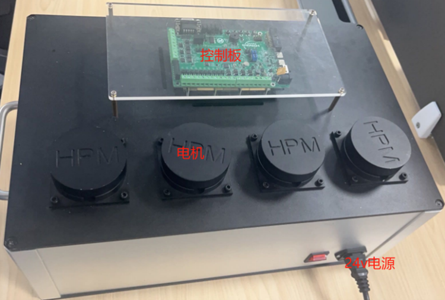
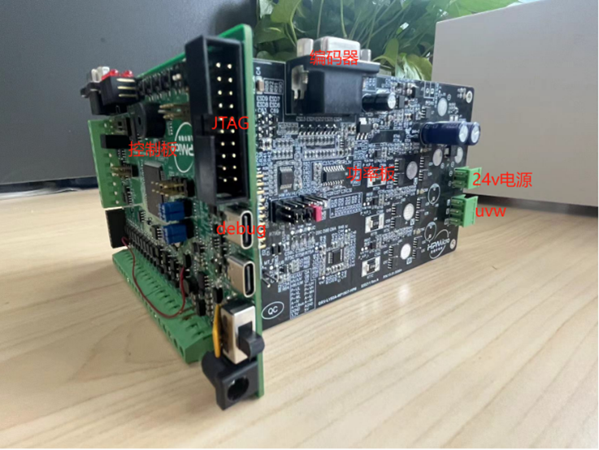
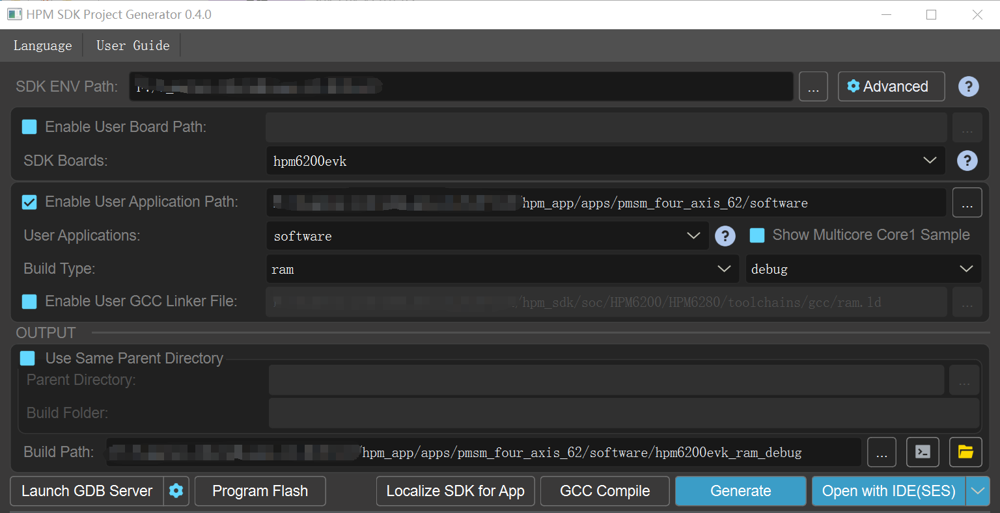

# HPM6200四轴伺服驱控方案

## 依赖SDK1.8.0

## 概述
HPM6200是来自上海先楫半导体科技有限公司的基于RISC_V内核的32位高性能微控制器。

针对HPM6200系列MCU，先楫半导体推出四轴伺服驱控方案，本方案单轴采用FOC控制，同步计时器实现四轴电机以固定相位差运动。

## 软件方案

软件设计主要分为四个部分：预定位，速度/位置环，电流环，S曲线，同步计时器，串口通信和USB通信。

其中全局参数如下表所示。

|  | 名称 | 说明 | 类型 | 
| ---- | ---- | ---- | ---- |
| PI参数 | SPEEDLOOP_KP | 速度环kp | 宏定义 | 
| PI参数 | SPEEDLOOP_KI | 速度环ki | 宏定义 | 
| PI参数 | SPEEDLOOP_OUTMAX | 速度环输出最大值 | 宏定义 | 
| PI参数 | POSITIONLOOP_KP | 位置环kp | 宏定义 | 
| PI参数 | POSITIONLOOP_KI | 位置环ki | 宏定义 | 
| PI参数 | POSITIONLOOP_OUTMAX | 位置环输出最大值 | 宏定义 | 
| 运行模式 | OpMode_Typ | 速度：1位置：0 | 枚举 | 
| 速度轨迹规划 | CONSTANT_SPEED_TIME_s | 匀速时间 | 宏定义 | 
| 速度轨迹规划 | MOVE_SPEED | 运动速度r/s | 宏定义 | 
| 速度轨迹规划 | MOVE_ACC | 加速度r/s/s  |宏定义 | 
| 速度轨迹规划 | MOVE_JERK | 加加速度r/s/s/s | 宏定义 |
| 位置轨迹规划 | MOVE_RELATIVE_POS_r | 绝对运动位置r | 宏定义 |  
| 位置轨迹规划 | CYCLE_CNT | 往返运动次数 | 宏定义 | 
| 位置轨迹规划 | CONTINOUS_RONUD_MOVE_TYPE | 连续往返运动 | 宏定义 | 
| 位置轨迹规划 | SIGNLE_MOVE_TYPE | 单次往返运动 | 宏定义 | 
| 速度轨迹规划 | MULTIPLE_MOVE_TYPE | 多次往返运动（以上三种任选一种） | 宏定义 | 
| 速度轨迹规划 | DWELLTIME_ms | 运行相对距离后停止时间 | 宏定义 | 
| 全局控制 | MOTOR_CONTROL_Global |  | 结构体 | 
| 电机参数 | MOTOR_PARA |  | 结构体 | 


具体函数接口如下表所示。

|  函数接口名称 | 描述 | 调用状态 | 
| ---- | ---- | ---- | 
| pwm_sync | 同步计时器 | 速度环kp | 初始化 | 
| pmsm0_foc_angle_align | 轴0预定位 | 伺服启动 | 
| motor0_highspeed_loop | 轴0电流环 | 50us中断 | 
| pos_cmd_gene | 位置轨迹规划 | 1ms中断 | 
| vel_cmd_gene | 速度轨迹规划 | 1ms中断 | 
| motor_speed_ctrl | 速度/位置环 | 1ms中断 |  

### 预定位

上电时，电机转子位置随机，编码器转子位置与电机转子存在固定角度差。因此需要将电机转子位置转到固定位置，此时既知道编码器的位置也知道转子角度。本方案中采用的是在正常运行之前将编码器转子位置与电机转子位置重合的方法。

主要实现步骤分为三步：

- 电角度90°，逐步增大 d轴电流到限幅；

- 保持d轴电流，逐步减小电角度至0度；

- 保持电角度为0度，逐步减小d轴电流至0。

### 电流环

pwm通道产生比较中断，中断内执行电流环。电路环回路主要有两部分工作：

- 电流幅值更新：ADC采样三相电流，以及经过CLARK，PARK变换后成为DQ轴直流分量。电流环PI控制器控制DQ轴电流

- 电角度更新：QEI模块获得电机反馈位置，再根据电机极对数计算得出电角度

### 轨迹规划

电机在启停时，速度存在阶跃的情况。电机速度的突变可能会导致电流过载。所以通常用加减速控制算法来规划电机速度。

在本方案中，我们使用的是电机库中的轨迹规划算法——S曲线，通过可变加加速度大小来控制加速度的变化，保证加速度不突变，使得加减速的速度曲线平滑，电机更平稳运行。

这里以运动轴0为例，简单介绍下如何使用电机库中的轨迹规划算法：

（1）添加电机库

- 将hpm_motor添加到middleware文件夹下

- 工程引用hpm_motor库

更多细节请查看电机库使用说明文档。(hpm_apps/middleware/hpm_motor/doc)

（2）对配置参数结构体的各成员赋值

- 定义结构体变量

CMDGENE_PARA cmdpar[4] = {0};

- 速度模式下

配置cmdpar[0].cmdgene_in_par.velcfgpar 

- 位置模式下

配置cmdpar[0].cmdgene_in_par.poscfgpar

（3）轨迹生成

轴0使能后，在1ms中断内调用轨迹生成函数，获得对应时间序列的速度指令、位置指令

速度模式下：vel_cmd_gene

位置模式下：pos_cmd_gene

（4）轨迹规划重置

API:cmd_gene_disable

清除轨迹规划中间变量，以便再次对用户指定的PTP运动的起点，终点，速度规划算法，计算连接各点的加速度，加加速度，由此再推算出各点的位置，速度。

### 速度/位置环

计时器产生1ms中断，控制速度环/位置环更新：

- 速度/位置指令

- 反馈位置/反馈速度

### 同步计时器

通过配置连接到PWM的同步触发输入SYNCI模块，让四个电机以一定的相位差开启运动。

### UART/USB通信

为了方便用户控制电机，支持用UART或USB调试工具下发运动指令，用户可在cmakelist文件中选择使用UART或USB。MCU根据接收到的运动指令进行相应的运动。

## 测试方法

### 硬件连接

（1）测试设备

HPM6200驱控硬件由两块板子组成，其中控制板用于与串口通信，调试，向驱动板发送PWM驱动信号并接收电流采样信号，编码器信息。

功率板构成为功率驱动模块，电流采样模块，并载有编码器，电机和电源接口。

四轴驱控样机如下图所示。



单轴驱控细节图如下图所示。



(2)电机型号

本方案测试电机型号信息如下表所示，如选用其他型号电机，需要重新调整PI控制参数相关宏定义即可。

| 电机型号 | 极对数 | 编码器类型 | 分辨率 | 
| ---- | ---- | ---- | ---- |
| 雷赛智能BLM57050 | 2 | 增量式 | 4000count/r | 

(3)运动参数

默认运动参数如下表所示，如调整运动参数，运动模式，参照电机库使用说明文档中“配置示例”章节修改相关宏定义即可。 

| 绝对位置r | 速度r/s | 加速度r/s/s | 加加速度r/s/s/s | 指令规划方式
| ---- | ---- | ---- | ---- | ---- |
| 20 | 10 | 100 | 1000 | S |

(4)设备连接

- 连接PC USB0至控制板debug口；

- 连接JTAG至PC USB1；

- 功率板接入电机UVW三相，编码器，以及24v电源

### 工程创建

双击打开gui工具，建立工程。



### 电机运行

（1）成功编译运行工程

（2）电机动作，执行预定位操作

（3）串口输出如下信息：

```
[14:02:30.037]收←● ==============================
hpm6200evk clock summary
==============================
cpu0:		 600000000Hz
cpu1:		 600000000Hz
axi:		 200000000Hz
ahb:		 200000000Hz
mchtmr0:	 24000000Hz
mchtmr1:	 24000000Hz
xpi0:		 133333333Hz
==================
[14:02:30.061]收←● ============

---------------------------------------------------------------------
$$\   $$\ $$$$$$$\  $$\      $$\ $$\
$$ |  $$ |$$  __$$\ $$$\    $$$ |\__|
$$ |  $$ |$$ |  $$ |$$$$\  $$$$ |$$\  $$$$$$$\  $$$$$$\   $$$$$$\
$$$$$$$$ |$$$$$$$  |$$\$
[14:02:30.083]收←● $\$$ $$ |$$ |$$  _____|$$  __$$\ $$  __$$\
$$  __$$ |$$  ____/ $$ \$$$  $$ |$$ |$$ /      $$ |  \__|$$ /  $$ |
$$ |  $$ |$$ |      $$ |\$  /$$ |$$ |$$ |      $$ |      $$ |  $$ |
$$ |  $$ |$$ |      $$ | \_/ $$ |$$ |\$$$$$$$\ $$ |      \$$$$$$  |
\__| 
[14:02:30.105]收←●  \__|\__|      \__|     \__|\__| \_______|\__|      \______/
---------------------------------------------------------------------
[32m[I/MONITOR] profile_pidvid:0xffff34b7
[0m[32m[I/MONITOR] profile_version:20241120112339
[0m[32m[I/MONITOR] VERSION:v1.0.0
[0mmotor control and monitor test.
```

（4）使用HPMicroMonitorStudio上位机，选择运动轴、运行模式,对各个电机进行控制

## 测试现象

control_world[n]设置为1,n取值范围[0,3],下同：

op_mode[n]设置为0：轴n在速度模式速度以S曲线规划方式，从0加速至10r/s匀速运行一段时间后，再减速至0；
op_mode[n]设置为1：轴n在位置模式下，绝对运动位置为20r，进行连续往返运动：速度以S曲线规划方式，从0加速至10r/s匀速运行一段时间后，再减速至0，停歇500ms, 从0加速至-10r/s匀速运行一段时间后，再减速至0，停500ms；

control_world[n]设置为0：

轴n停止运动；

## API

:::{eval-rst}

关于软件API 请查看 `方案API 文档 <../../_static/apps/pmsm_four_axis_62/html/index.html>`_ 。
:::
