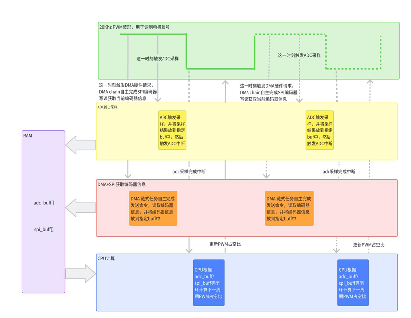
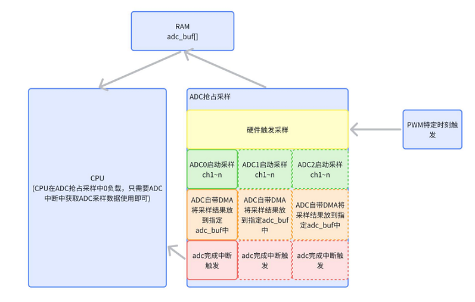
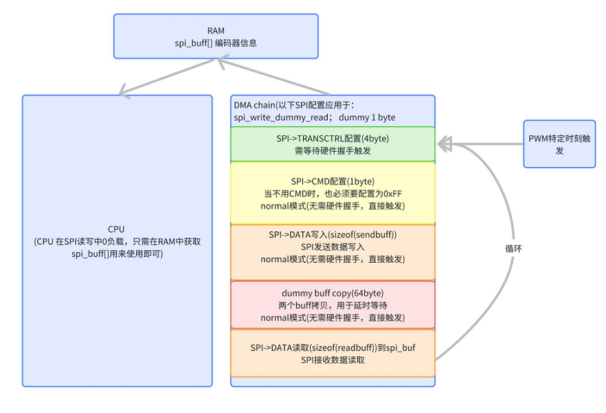
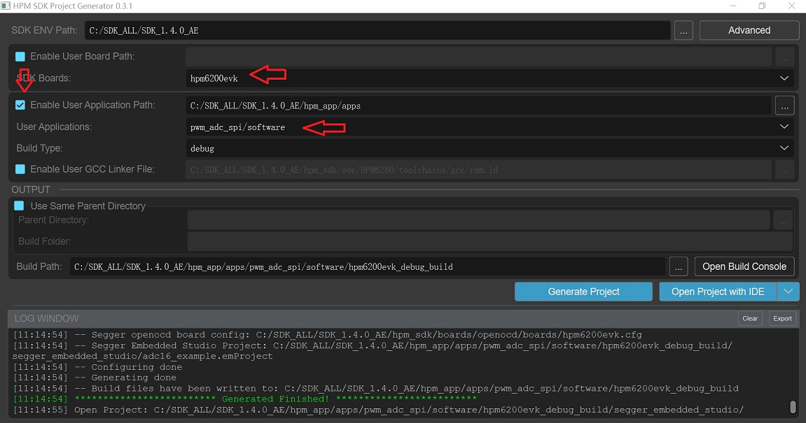
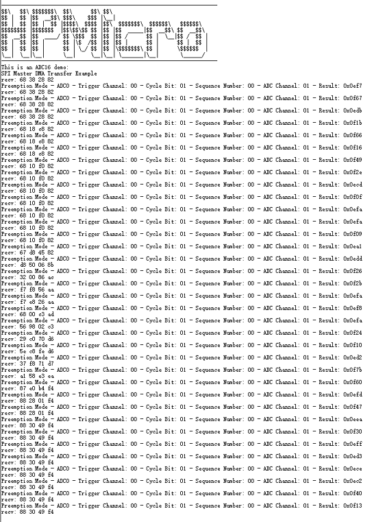

# HPM电机外接SPI编码器方案

## 介绍

该方案通过PWM特定时刻触发ADC采样，同时在PWM另一特定时刻触发HDMA操作SPI控制器，并依靠HDMA链式模式，做成循环链表，由HDMA全自动完成SPI的读写任务，将读到的数据存放到指定内存中，无需CPU参与。

同时HPM ADC控制器也自带DMA，ADC采样完成后自带DMA将采样的数据存放到指定内存中，CPU也无需参与。

用户可直接在ADC采样完成中断中使用ADC采样结果及SPI编码器信息，去做后续闭环算法，最终调整下一周期PWM占空比。

DMA链式传输通常能够降低数据传输的延时以及将规则的连续任务由DMA自主完成。此方案中ADC抢占采样、DMA获取SPI编码器信息并行执行，从而减少了数据从源到目标的传输时间。这对于实时系统和需要快速响应的应用非常关键。

See the [hpmicro.com](https://www.hpmicro.com) site for more information about HPMicro 

## 应用文档

应用文档路径：
[HPM电机外接SPI编码器方案](doc/HPM%20电机外接SPI编码器方案.pdf)

## 整体方案的功能框图

 


## ADC抢占模式下的功能框图



## DMA结合SPI获取编码器信息的功能框图



## 例程

### HDMA链表配置：

```c
void hdma_spi_tx_chain_config(void)
{
    dma_channel_config_t dma_ch_config;
    static uint8_t dummy_cmd = 0xff;
    static uint8_t dummy_buff1 = 0xff, dummy_buff2 = 0xff;

    dma_default_channel_config(HPM_HDMA, &dma_ch_config);

    /* SPI CTRL */
    dma_ch_config.size_in_byte = 4;
    dma_ch_config.src_addr = core_local_mem_to_sys_address(HPM_CORE0, (uint32_t)&spi_transctrl[0]);
    dma_ch_config.dst_addr = core_local_mem_to_sys_address(HPM_CORE0, (uint32_t)&BOARD_APP_SPI_BASE->TRANSCTRL);
    dma_ch_config.src_width = DMA_TRANSFER_WIDTH_WORD;
    dma_ch_config.dst_width = DMA_TRANSFER_WIDTH_WORD;
    dma_ch_config.src_burst_size = DMA_NUM_TRANSFER_PER_BURST_1T;
    dma_ch_config.src_mode = DMA_HANDSHAKE_MODE_HANDSHAKE;
    dma_ch_config.dst_mode = DMA_HANDSHAKE_MODE_HANDSHAKE;
    dma_ch_config.src_addr_ctrl = DMA_ADDRESS_CONTROL_FIXED;
    dma_ch_config.dst_addr_ctrl = DMA_ADDRESS_CONTROL_FIXED;
    dma_ch_config.linked_ptr = core_local_mem_to_sys_address(HPM_CORE0, (uint32_t)&adc_descriptors1[1]);
    dma_config_linked_descriptor(HPM_HDMA, &adc_descriptors1[0], 0, &dma_ch_config);

    /* SPI CMD */
    dma_ch_config.size_in_byte = 1;
    dma_ch_config.src_addr = core_local_mem_to_sys_address(HPM_CORE0, (uint32_t)&dummy_cmd);
    dma_ch_config.dst_addr = core_local_mem_to_sys_address(HPM_CORE0, (uint32_t)&BOARD_APP_SPI_BASE->CMD);
    dma_ch_config.src_width = DMA_TRANSFER_WIDTH_BYTE;
    dma_ch_config.dst_width = DMA_TRANSFER_WIDTH_BYTE;
    dma_ch_config.src_burst_size = DMA_NUM_TRANSFER_PER_BURST_1T;
    dma_ch_config.src_mode = DMA_HANDSHAKE_MODE_NORMAL;
    dma_ch_config.dst_mode = DMA_HANDSHAKE_MODE_NORMAL;
    dma_ch_config.src_addr_ctrl = DMA_ADDRESS_CONTROL_FIXED;
    dma_ch_config.dst_addr_ctrl = DMA_ADDRESS_CONTROL_FIXED;
    dma_ch_config.linked_ptr = core_local_mem_to_sys_address(HPM_CORE0, (uint32_t)&adc_descriptors1[2]);
    dma_config_linked_descriptor(HPM_HDMA, &adc_descriptors1[1], 0, &dma_ch_config);

    dma_ch_config.size_in_byte = sizeof(sendbuff);
    dma_ch_config.src_addr = core_local_mem_to_sys_address(HPM_CORE0, (uint32_t)&sendbuff);
    dma_ch_config.dst_addr = core_local_mem_to_sys_address(HPM_CORE0, (uint32_t)&BOARD_APP_SPI_BASE->DATA);
    dma_ch_config.src_width = DMA_TRANSFER_WIDTH_BYTE;
    dma_ch_config.dst_width = DMA_TRANSFER_WIDTH_BYTE;
    dma_ch_config.src_burst_size = DMA_NUM_TRANSFER_PER_BURST_1T;
    dma_ch_config.src_mode = DMA_HANDSHAKE_MODE_NORMAL;
    dma_ch_config.dst_mode = DMA_HANDSHAKE_MODE_NORMAL;
    dma_ch_config.src_addr_ctrl = DMA_ADDRESS_CONTROL_INCREMENT;
    dma_ch_config.dst_addr_ctrl = DMA_ADDRESS_CONTROL_FIXED;
    dma_ch_config.linked_ptr = core_local_mem_to_sys_address(HPM_CORE0, (uint32_t)&adc_descriptors1[3]);
    dma_config_linked_descriptor(HPM_HDMA, &adc_descriptors1[2], 0, &dma_ch_config);

    // dummy
    dma_ch_config.size_in_byte = 64;
    dma_ch_config.src_addr = core_local_mem_to_sys_address(HPM_CORE0, (uint32_t)&dummy_buff1);
    dma_ch_config.dst_addr = core_local_mem_to_sys_address(HPM_CORE0, (uint32_t)&dummy_buff2);
    dma_ch_config.src_width = DMA_TRANSFER_WIDTH_BYTE;
    dma_ch_config.dst_width = DMA_TRANSFER_WIDTH_BYTE;
    dma_ch_config.src_burst_size = DMA_NUM_TRANSFER_PER_BURST_1T;
    dma_ch_config.src_mode = DMA_HANDSHAKE_MODE_NORMAL;
    dma_ch_config.dst_mode = DMA_HANDSHAKE_MODE_NORMAL;
    dma_ch_config.src_addr_ctrl = DMA_ADDRESS_CONTROL_FIXED;
    dma_ch_config.dst_addr_ctrl = DMA_ADDRESS_CONTROL_FIXED;
    dma_ch_config.linked_ptr = core_local_mem_to_sys_address(HPM_CORE0, (uint32_t)&adc_descriptors1[4]);
    dma_config_linked_descriptor(HPM_HDMA, &adc_descriptors1[3], 0, &dma_ch_config);

    // read
    dma_ch_config.size_in_byte = sizeof(spi_buf);
    dma_ch_config.src_addr = core_local_mem_to_sys_address(HPM_CORE0, (uint32_t)&BOARD_APP_SPI_BASE->DATA);
    dma_ch_config.dst_addr = core_local_mem_to_sys_address(HPM_CORE0, (uint32_t)&spi_buf);
    dma_ch_config.src_width = DMA_TRANSFER_WIDTH_BYTE;
    dma_ch_config.dst_width = DMA_TRANSFER_WIDTH_BYTE;
    dma_ch_config.src_burst_size = DMA_NUM_TRANSFER_PER_BURST_1T;
    dma_ch_config.src_mode = DMA_HANDSHAKE_MODE_NORMAL;
    dma_ch_config.dst_mode = DMA_HANDSHAKE_MODE_NORMAL;
    dma_ch_config.src_addr_ctrl = DMA_ADDRESS_CONTROL_FIXED;
    dma_ch_config.dst_addr_ctrl = DMA_ADDRESS_CONTROL_INCREMENT;
    dma_ch_config.linked_ptr = core_local_mem_to_sys_address(HPM_CORE0, (uint32_t)&adc_descriptors1[0]);
    dma_config_linked_descriptor(HPM_HDMA, &adc_descriptors1[4], 0, &dma_ch_config);
}
```

### PWM两个触发源配置：

```c
#define PWM_FREQUENCY (20000)
#define PWM_RELOAD (clock_get_frequency(clock_mot0) / PWM_FREQUENCY - 1) /*20K hz  = 200 000 000/PWM_RELOAD */

void init_trigger_source(PWM_Type *ptr)
{
    pwm_cmp_config_t pwm_cmp_cfg;
    pwm_cmp_config_t pwm_cmp_cfg_spi[2];
    pwm_output_channel_t pwm_output_ch_cfg;

    /* 需要去配置好PWM 时钟源 和 divider */

    pwm_set_reload(ptr, 0, PWM_RELOAD);

    /* 选择比较器 */
    memset(&pwm_cmp_cfg, 0x00, sizeof(pwm_cmp_config_t));
    pwm_cmp_cfg.enable_ex_cmp = false;
    pwm_cmp_cfg.mode = pwm_cmp_mode_output_compare;
    pwm_cmp_cfg.update_trigger = pwm_shadow_register_update_on_shlk;

    /* 选择comp8并在pwm周期的中间触发 */
    pwm_cmp_cfg.cmp = 2999;
    pwm_config_cmp(ptr, APP_ADC16_PMT_PWM_REFCH_A, &pwm_cmp_cfg);

    pwm_cmp_cfg_spi[0].enable_ex_cmp = false;
    pwm_cmp_cfg_spi[0].mode = pwm_cmp_mode_output_compare;
    pwm_cmp_cfg_spi[0].update_trigger = pwm_shadow_register_update_on_shlk;
    pwm_cmp_cfg_spi[0].cmp = 4999;
    pwm_config_cmp(ptr, APP_ADC16_PMT_PWM_REFCH_A + 1, &pwm_cmp_cfg_spi[0]);

    pwm_enable_dma_request(HPM_PWM0, PWM_IRQ_CMP(9));

    /* 影子寄存器 */
    pwm_issue_shadow_register_lock_event(APP_ADC16_PMT_PWM);

    /* 设置比较器通道以产生触发信号 */
    pwm_output_ch_cfg.cmp_start_index = APP_ADC16_PMT_PWM_REFCH_A; /* 输出通道比较开始索引 */
    pwm_output_ch_cfg.cmp_end_index = APP_ADC16_PMT_PWM_REFCH_A;   /* 输出通道比较结束索引 */
    pwm_output_ch_cfg.invert_output = false;
    pwm_config_output_channel(ptr, APP_ADC16_PMT_PWM_REFCH_A, &pwm_output_ch_cfg);

    /* 启动比较器计数器 */
    pwm_start_counter(ptr);
}
```
### 根据不同SPI编码器，写入相应数据：

```c
void prepare_spi_sent_data(void)
{
    sendbuff[0] = 0xA0;
    sendbuff[1] = 0x03;
}
```

### ADC中断中可以直接使用读回来的spi_buf：

```c
void isr_adc16(void)
{
    uint32_t status;

    status = adc16_get_status_flags(BOARD_APP_ADC16_BASE);

    if (ADC16_INT_STS_TRIG_CMPT_GET(status))
    {
        /* 清除 trig_cmpt 状态位 */
        adc16_clear_status_flags(BOARD_APP_ADC16_BASE, adc16_event_trig_complete);
        /* 设置读取内存数据的标志 */
        trig_complete_flag = 1;

        // 使用spi_buf
        // spi_buf[x]
    }
}

```

## 工程路径

- 工程路径：pwm_adc_spi/software/


## 工程配置

无

## 工程构建
- windows下工程构建




## 硬件设置
- 本方案使用电机外接编码器进行测试。
- 用户自行使用可以验证SPI读写功能的设备既可，注意修改SPI初始化配置。

## 工程运行

- 在程序主循环中可以打印spi_buf的值
- 运行工程
- 旋转电机，可以看到SPI编码器获取到的信息随之更新，ADC采样信息也一起更新
- 如下所示：




## 软件API

:::{eval-rst}

关于软件API 请查看 `方案API 文档 <doc/api/index_zh.html>`_ 。
:::
