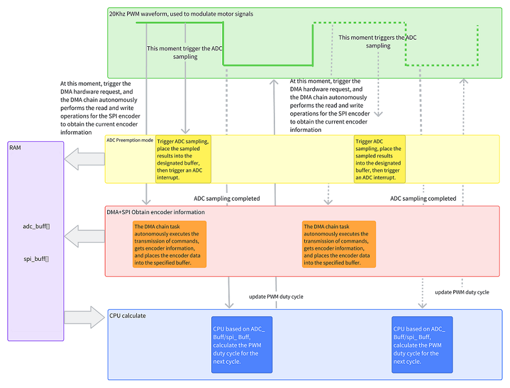
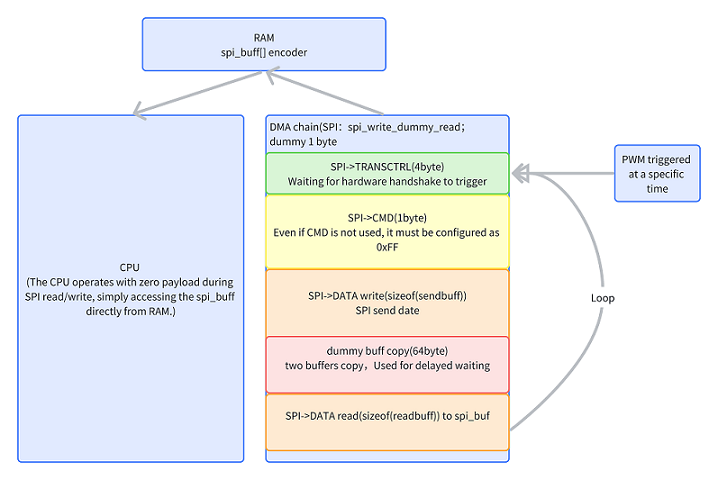

# HPM PWM_ADC_SPI sample Documentation

## Introduction

This solution utilizes PWM to trigger ADC sampling at specific moments . Simultaneously triggers HDMA to operate the SPI controller at another specific time within the PWM cycle.

Using the HDMA (High-Speed Direct Memory Access) chain mode and implementing it as a circular linked list, the HDMA autonomously executes SPI (Serial Peripheral Interface) read and write tasks. The data read is stored in the designated memory without the need for CPU involvement.

Users can directly utilize the ADC sampling results and SPI encoder information within the ADC completion interrupt to implement subsequent closed-loop algorithms. 

Chain transfer with DMA typically reduces the latency of data transfers, which is crucial for real-time systems and applications requiring rapid response.

Welcome to view the [hpmicro.com](https://www.hpmicro.com) site for more information about HPMicro .

## Application note

Application note 
[AN](../../../../doc/HPM%20电机外接SPI编码器方案.pdf)

## general_solution



## adc sampling design process


## SPI_HDMA



## Sample code

### HDMA chain

```c
void hdma_spi_tx_chain_config(void)
{
    dma_channel_config_t dma_ch_config;
    static uint8_t dummy_cmd = 0xff;
    static uint8_t dummy_buff1 = 0xff, dummy_buff2 = 0xff;

    dma_default_channel_config(HPM_HDMA, &dma_ch_config);

    /* SPI CTRL */
    dma_ch_config.size_in_byte = 4;
    dma_ch_config.src_addr = core_local_mem_to_sys_address(HPM_CORE0, (uint32_t)&spi_transctrl[0]);
    dma_ch_config.dst_addr = core_local_mem_to_sys_address(HPM_CORE0, (uint32_t)&BOARD_APP_SPI_BASE->TRANSCTRL);
    dma_ch_config.src_width = DMA_TRANSFER_WIDTH_WORD;
    dma_ch_config.dst_width = DMA_TRANSFER_WIDTH_WORD;
    dma_ch_config.src_burst_size = DMA_NUM_TRANSFER_PER_BURST_1T;
    dma_ch_config.src_mode = DMA_HANDSHAKE_MODE_HANDSHAKE;
    dma_ch_config.dst_mode = DMA_HANDSHAKE_MODE_HANDSHAKE;
    dma_ch_config.src_addr_ctrl = DMA_ADDRESS_CONTROL_FIXED;
    dma_ch_config.dst_addr_ctrl = DMA_ADDRESS_CONTROL_FIXED;
    dma_ch_config.linked_ptr = core_local_mem_to_sys_address(HPM_CORE0, (uint32_t)&adc_descriptors1[1]);
    dma_config_linked_descriptor(HPM_HDMA, &adc_descriptors1[0], 0, &dma_ch_config);

    /* SPI CMD */
    dma_ch_config.size_in_byte = 1;
    dma_ch_config.src_addr = core_local_mem_to_sys_address(HPM_CORE0, (uint32_t)&dummy_cmd);
    dma_ch_config.dst_addr = core_local_mem_to_sys_address(HPM_CORE0, (uint32_t)&BOARD_APP_SPI_BASE->CMD);
    dma_ch_config.src_width = DMA_TRANSFER_WIDTH_BYTE;
    dma_ch_config.dst_width = DMA_TRANSFER_WIDTH_BYTE;
    dma_ch_config.src_burst_size = DMA_NUM_TRANSFER_PER_BURST_1T;
    dma_ch_config.src_mode = DMA_HANDSHAKE_MODE_NORMAL;
    dma_ch_config.dst_mode = DMA_HANDSHAKE_MODE_NORMAL;
    dma_ch_config.src_addr_ctrl = DMA_ADDRESS_CONTROL_FIXED;
    dma_ch_config.dst_addr_ctrl = DMA_ADDRESS_CONTROL_FIXED;
    dma_ch_config.linked_ptr = core_local_mem_to_sys_address(HPM_CORE0, (uint32_t)&adc_descriptors1[2]);
    dma_config_linked_descriptor(HPM_HDMA, &adc_descriptors1[1], 0, &dma_ch_config);

    dma_ch_config.size_in_byte = sizeof(sendbuff);
    dma_ch_config.src_addr = core_local_mem_to_sys_address(HPM_CORE0, (uint32_t)&sendbuff);
    dma_ch_config.dst_addr = core_local_mem_to_sys_address(HPM_CORE0, (uint32_t)&BOARD_APP_SPI_BASE->DATA);
    dma_ch_config.src_width = DMA_TRANSFER_WIDTH_BYTE;
    dma_ch_config.dst_width = DMA_TRANSFER_WIDTH_BYTE;
    dma_ch_config.src_burst_size = DMA_NUM_TRANSFER_PER_BURST_1T;
    dma_ch_config.src_mode = DMA_HANDSHAKE_MODE_NORMAL;
    dma_ch_config.dst_mode = DMA_HANDSHAKE_MODE_NORMAL;
    dma_ch_config.src_addr_ctrl = DMA_ADDRESS_CONTROL_INCREMENT;
    dma_ch_config.dst_addr_ctrl = DMA_ADDRESS_CONTROL_FIXED;
    dma_ch_config.linked_ptr = core_local_mem_to_sys_address(HPM_CORE0, (uint32_t)&adc_descriptors1[3]);
    dma_config_linked_descriptor(HPM_HDMA, &adc_descriptors1[2], 0, &dma_ch_config);

    // dummy
    dma_ch_config.size_in_byte = 64;
    dma_ch_config.src_addr = core_local_mem_to_sys_address(HPM_CORE0, (uint32_t)&dummy_buff1);
    dma_ch_config.dst_addr = core_local_mem_to_sys_address(HPM_CORE0, (uint32_t)&dummy_buff2);
    dma_ch_config.src_width = DMA_TRANSFER_WIDTH_BYTE;
    dma_ch_config.dst_width = DMA_TRANSFER_WIDTH_BYTE;
    dma_ch_config.src_burst_size = DMA_NUM_TRANSFER_PER_BURST_1T;
    dma_ch_config.src_mode = DMA_HANDSHAKE_MODE_NORMAL;
    dma_ch_config.dst_mode = DMA_HANDSHAKE_MODE_NORMAL;
    dma_ch_config.src_addr_ctrl = DMA_ADDRESS_CONTROL_FIXED;
    dma_ch_config.dst_addr_ctrl = DMA_ADDRESS_CONTROL_FIXED;
    dma_ch_config.linked_ptr = core_local_mem_to_sys_address(HPM_CORE0, (uint32_t)&adc_descriptors1[4]);
    dma_config_linked_descriptor(HPM_HDMA, &adc_descriptors1[3], 0, &dma_ch_config);

    // read
    dma_ch_config.size_in_byte = sizeof(spi_buf);
    dma_ch_config.src_addr = core_local_mem_to_sys_address(HPM_CORE0, (uint32_t)&BOARD_APP_SPI_BASE->DATA);
    dma_ch_config.dst_addr = core_local_mem_to_sys_address(HPM_CORE0, (uint32_t)&spi_buf);
    dma_ch_config.src_width = DMA_TRANSFER_WIDTH_BYTE;
    dma_ch_config.dst_width = DMA_TRANSFER_WIDTH_BYTE;
    dma_ch_config.src_burst_size = DMA_NUM_TRANSFER_PER_BURST_1T;
    dma_ch_config.src_mode = DMA_HANDSHAKE_MODE_NORMAL;
    dma_ch_config.dst_mode = DMA_HANDSHAKE_MODE_NORMAL;
    dma_ch_config.src_addr_ctrl = DMA_ADDRESS_CONTROL_FIXED;
    dma_ch_config.dst_addr_ctrl = DMA_ADDRESS_CONTROL_INCREMENT;
    dma_ch_config.linked_ptr = core_local_mem_to_sys_address(HPM_CORE0, (uint32_t)&adc_descriptors1[0]);
    dma_config_linked_descriptor(HPM_HDMA, &adc_descriptors1[4], 0, &dma_ch_config);
}
```

### PWM two trigger sources：
```c
#define PWM_FREQUENCY (20000)
#define PWM_RELOAD (clock_get_frequency(clock_mot0) / PWM_FREQUENCY - 1) /*20K hz  = 200 000 000/PWM_RELOAD */

void init_trigger_source(PWM_Type *ptr)
{
    pwm_cmp_config_t pwm_cmp_cfg;
    pwm_cmp_config_t pwm_cmp_cfg_spi[2];
    pwm_output_channel_t pwm_output_ch_cfg;

    /* TODO: Set PWM Clock Source and divider */

    /* 33.33KHz reload at 200MHz */
    pwm_set_reload(ptr, 0, PWM_RELOAD);

    /* Set a comparator */
    memset(&pwm_cmp_cfg, 0x00, sizeof(pwm_cmp_config_t));
    pwm_cmp_cfg.enable_ex_cmp = false;
    pwm_cmp_cfg.mode = pwm_cmp_mode_output_compare;
    pwm_cmp_cfg.update_trigger = pwm_shadow_register_update_on_shlk;

    /* Select comp8 and trigger at the middle of a pwm cycle */
    pwm_cmp_cfg.cmp = 2999;
    pwm_config_cmp(ptr, APP_ADC16_PMT_PWM_REFCH_A, &pwm_cmp_cfg);

    pwm_cmp_cfg_spi[0].enable_ex_cmp = false;
    pwm_cmp_cfg_spi[0].mode = pwm_cmp_mode_output_compare;
    pwm_cmp_cfg_spi[0].update_trigger = pwm_shadow_register_update_on_shlk;
    pwm_cmp_cfg_spi[0].cmp = 4999;
    pwm_config_cmp(ptr, APP_ADC16_PMT_PWM_REFCH_A + 1, &pwm_cmp_cfg_spi[0]);

    pwm_enable_dma_request(HPM_PWM0, PWM_IRQ_CMP(9));

    /* Issue a shadow lock */
    pwm_issue_shadow_register_lock_event(APP_ADC16_PMT_PWM);

    /* Set comparator channel to generate a trigger signal */
    pwm_output_ch_cfg.cmp_start_index = APP_ADC16_PMT_PWM_REFCH_A; /* start channel */
    pwm_output_ch_cfg.cmp_end_index = APP_ADC16_PMT_PWM_REFCH_A;   /* end channel */
    pwm_output_ch_cfg.invert_output = false;
    pwm_config_output_channel(ptr, APP_ADC16_PMT_PWM_REFCH_A, &pwm_output_ch_cfg);

    /* Start the comparator counter */
    pwm_start_counter(ptr);
}
```
### According to different SPI encoders, write the corresponding data:

```c
void prepare_spi_sent_data(void)
{
    sendbuff[0] = 0xA0;
    sendbuff[1] = 0x03;
}
```

### spi_buf can be used directly in ADC interrupts:
```c
void isr_adc16(void)
{
    uint32_t status;

    status = adc16_get_status_flags(BOARD_APP_ADC16_BASE);

    if (ADC16_INT_STS_TRIG_CMPT_GET(status))
    {
        /* Clear trig_cmpt status */
        adc16_clear_status_flags(BOARD_APP_ADC16_BASE, adc16_event_trig_complete);
        /* Set flag to read memory data */
        trig_complete_flag = 1;

        // use spi_buf to do
        // spi_buf[x]
    }
}
```

## Code Path

- Code Path：pwm_adc_spi/software/


## Code Configuration

None

## Code Build
- Build for windows


## Hardware
- In this solution, a motor with encoder is used for testing.
- Users can use devices that can verify SPI read and write functions. Please pay attention to modifying the SPI initialization configuration.

## Code Run

- The value of spi_buf can be printed in the main loop of the program
- Code Run
- Rotating the motor, it can see that the information obtained by the SPI encoder is updated, and the ADC sampling information is also updated
- As follows:


## Licensing

HPM APP is permissively licensed using the BSD 3-clause license.