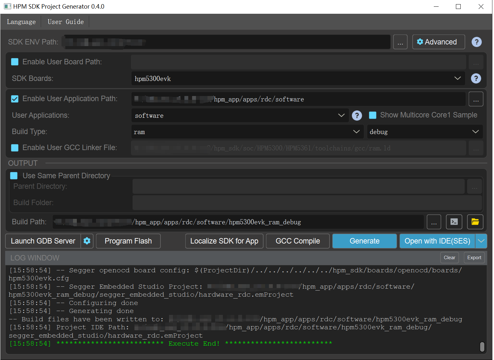

# HPM 5300 series rotary transformer hardware decoding scheme

## INTROduction

- This scheme is a decoding scheme for the encoder in the field of motor control with the combination of HPM 5300 series of special peripherals for rotary decoding.

- This solution includes software configuration, hardware guidance design, and white-box test documentation.

- The software configuration of this solution is mainly to tell the reader how to get the decoding position of the 5300 series special rotary peripherals through notes and white box test documents.

- The hardware guidance design of this scheme mainly informs the reader of the rotary excitation amplifier and the analog front-end circuit.

- The white box test document of this scheme is mainly based on the motor test platform of ABZ encoder to do performance comparison test.

Notes:
- Engineers using this solution need to have a certain understanding of the basic knowledge of rotation.

## Software configuration

 - Read the note.

## Hardware-directed design

See the user guide for detailed technical specifications: [《HPM5300_RDC_UG》](doc/HPM5300_RDC_UG.pdf)

Schematics please see: [《HPM5300_RDC_SCH》](doc/HPM5300_RDC_SCH.pdf)

Install screen printing please see: [《HPM5300_RDC_installation》](doc/HPM5300_RDC_installation.pdf)

## Code Path

- Code Path：rdc/software

## Code Configuration
- none

## Code Build

- Build for windows\n

## Hardware

- This scheme uses HPM 5300 series evk, HPM rotary drive board.

## Code Run

- Operation Engineering
- Using an oscilloscope, you can see the actual excitation signal, the excitation signal, by means of the motor rotation.
- Using oscilloscopes, excel, online monitoring can see the rotation position changes by using the motor rotation.

See the detailed signal waveform and ABZ platform performance comparison test results:[《HPMicro_RDC_Report》](doc/HPMicro_RDC_Report.pdf)

## API

:::{eval-rst}

About software API: `API doc <doc/api/index.html>`_ .
:::