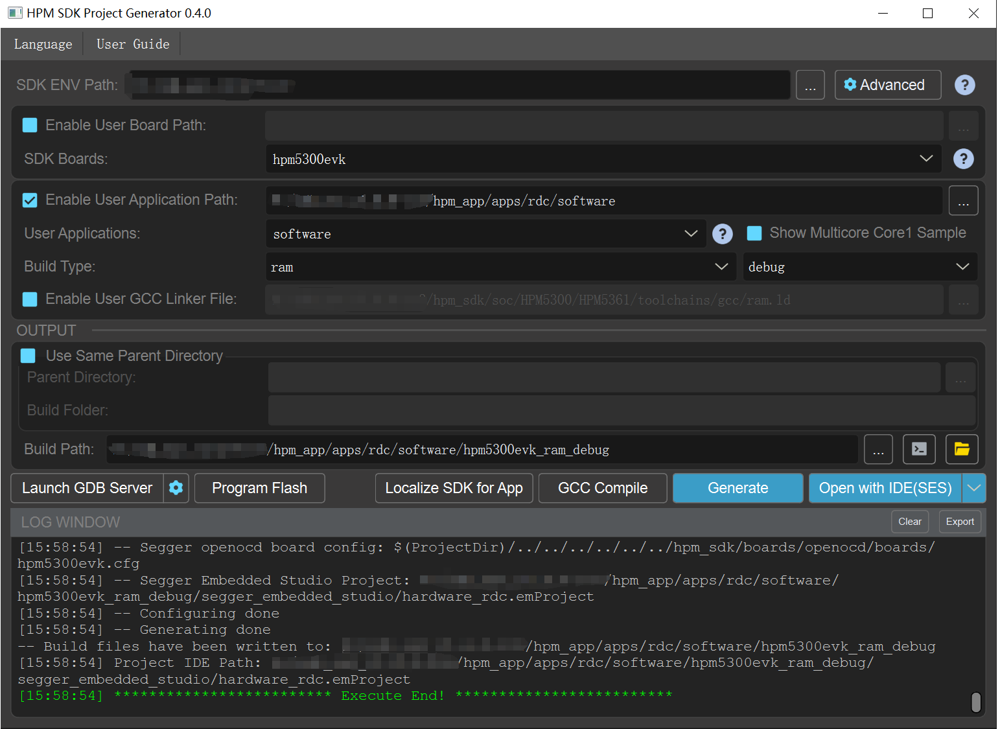

# HPM 5300系列旋转变压器硬件解码方案

## 依赖SDK1.8.0

## 概述

- 本方案是结合HPM 5300系列旋变解码专用外设、针对电机控制领域编码器为旋变的一种解码方案。

- 本方案包括软件配置、硬件指导设计、白盒测试文档。

- 本方案软件配置主要是通过注释、白盒测试文档，告知读者如何得到5300系列专用旋变外设解码后的位置。

- 本方案硬件指导设计主要告知读者旋变的励磁放大器和模拟前端电路。

- 本方案白盒测试文档主要是基于ABZ编码器的电机测试平台，去做性能对比测试。

注意：
- 使用本方案的工程师需要对旋变的基础知识有一定了解。

## 软件配置

 - 详看注释。

## 硬件指导设计

详细技术参数请查看用户指南: [《HPM5300_RDC_UG》](doc/HPM5300_RDC_UG.pdf)

原理图请查看: [《HPM5300_RDC_SCH》](doc/HPM5300_RDC_SCH.pdf)

安装丝印请查看: [《HPM5300_RDC_installation》](doc/HPM5300_RDC_installation.pdf)

## 工程路径

- 工程路径：rdc/software

## 工程配置
- 无

## 工程构建

- windows下工程构建\n

## 硬件设置

- 本方案使用的是HPM 5300系列evk、HPM旋变驱动板。

## 工程运行

- 运行工程
- 使用示波器可以看到实际的激励信号、励磁信号，通过借助电机旋转。
- 使用示波器、excel、在线监控可以查看旋转位置变化，通过借助电机旋转。

详细信号波形图、基于ABZ平台的性能对比测试结果请查阅:[《HPMicro_RDC_Report》](doc/HPMicro_RDC_Report.pdf)

## API

:::{eval-rst}

关于软件API 请查看 `方案API 文档 <../../_static/apps/rdc/html/index.html>`_ 。
:::