# HPM5300_RDC

## Depend on SDK1.10.0

## Overview

High performance motor control applications traditionally require a speed or position sensor for control loop feedback. The position feedback link has a critical impact on the performance of the system. Rotary transformers have become popular Angle sensors due to their advantages such as impact resistance, high temperature resistance, oil pollution resistance, high reliability, and long life.

At present, most of the existing rotary solutions in the market are discrete, with high BOM cost and large board area.

In order to simplify the design, HPM provides a functional rotary decode board integrating excitation op amp circuit, boost DC-DC chip, analog front end, rotary digital converter, rotary signal loss detection and multiple format data (position/speed) output interface.

## RDC theory

- rotary signal 

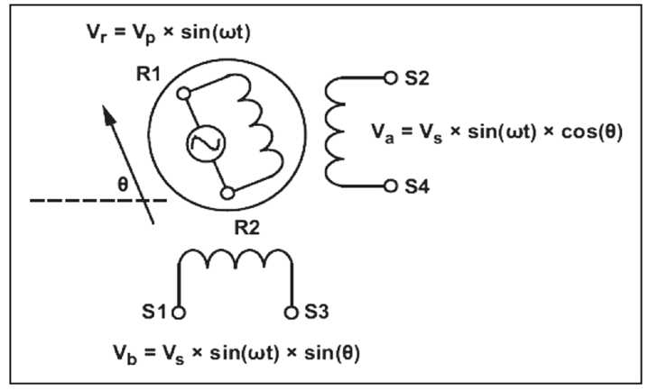

The rotor is composed of a rotor and a stator core. The middle rotor is composed of a laminated magnetic steel plate. The stator core is equipped with a single-phase excitation coil winding (R1-R2) and a two-phase output coil winding (S1-S3,S2-S4). When the excitation coil is excited by AC voltage, according to the transformer principle, there is a corresponding AC voltage on the output winding.

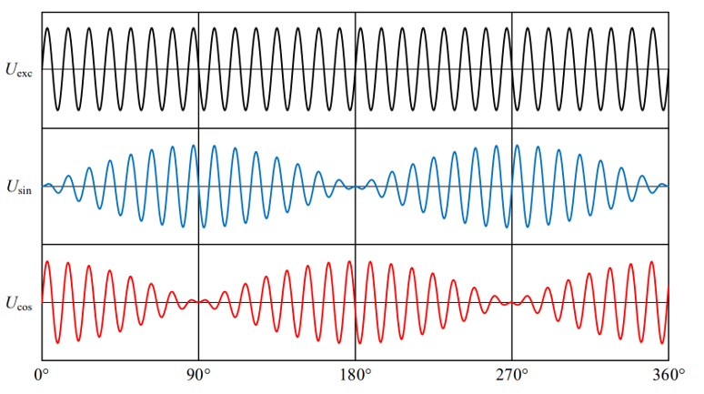

- operating principle - integral demodulation

Integral demodulation can be divided into two processes: shaping and integration.

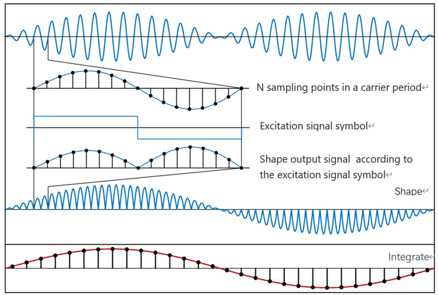

（1）shaping：

The sines and cosines of the output of the rotary transformer are multiplied by the sign function of the same frequency as the excitation signal

（2）integration：

The shaping results over the excitation period are integrated

After shaping and integration, the high frequency excitation signal is removed, and the demodulation signal containing the rotor information is obtained.

From the working principle, integral demodulation requires a high sampling rate, and the integration process has certain requirements on the computing rate of the processor.

- position acquisition method

（1）arctan

Arctangent method is the most simple and direct method to solve the rotor Angle.

The arctangent function has a relatively large slope at the zero crossing, and a small interference in the output signal will cause a large Angle solution error. Therefore, arctangent is mostly used in situations where noise and accuracy are not required.

(2)Closed-loop Angle observer -PLL

It is mainly composed of phase discriminator (PD), loop filter (LF) composed of PI controller and voltage control oscillator (VCO) composed of integration.

The phase discriminator is used to generate a signal containing the phase deviation between the real Angle and the estimated Angle;

The loop filter uses PI controller to suppress noise interference, which determines the dynamic performance, tracking performance and stability of PLL. Its output is the rotor angular frequency.

A VCO is used to integrate angular frequencies to produce an estimated Angle value.

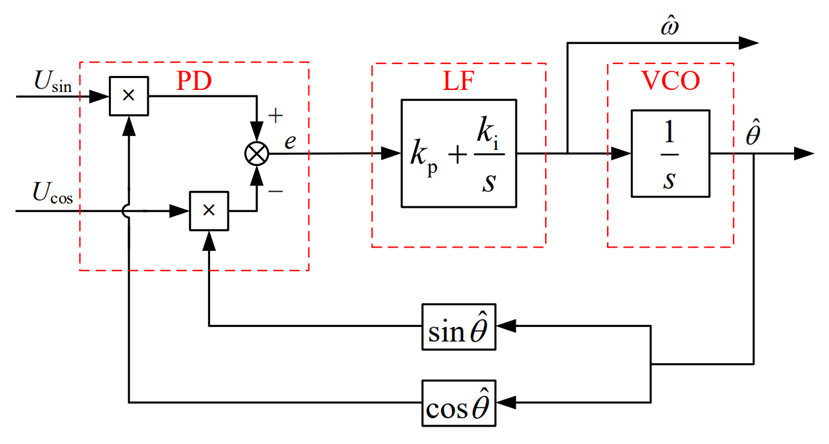

(3)TYPE_II loop tracking

TYPE_II loop tracking consists of three parts, integrator 1, filter compensator (one pole, one zero), integrator 2. The integrator is used to generate the Angle output from the velocity signal, and the filter is used to reduce the high frequency noise.

## hardware solution

The overall scheme of RDC  is shown in the figure below:

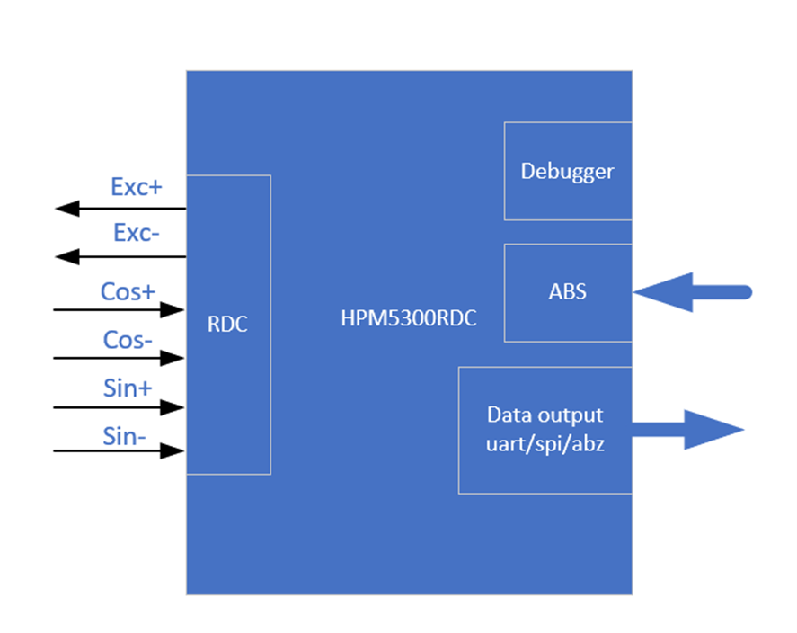

HPM5300RDC board has the following functions: two ADC, one uart, one spi, two DAC, QEO output, SEI master/slave, LED display, etc.

HPM5300RDCschematic diagram: [《HPM5300_RDC_REVB》](hardware/00_原理图/HPM5300RDCRevB.pdf)

## software solution

The software solution is mainly composed of the following parts:

pwm generates excitation signals, ADC samples, sei module obtains absolute encoder position information, three position/speed calculation methods (PLL_II/PLL/ arc-cut), incremental encoder simulation output (A_guad_B format), two data communication (uart/spi).

The sei module is used as the host to compare the obtained RDC Angle with the absolute encoder Angle for error analysis.

sei module can also be used as a slave. When used as a slave, there are bissc and TAMAGAWA output modes.

## TEST

The test of this scheme is divided into three parts:

(1) Hardware test: pwm modulated sinusoidal differential signal (EXC_P/EXC_N), rotary sinusoidal winding signal (OSIN/OCOS)
(2) Data output test: uart, spi,abz,bissc and TAMAGAWA
(3) Error test: Angle error, speed fluctuation

### test instrument

（1）Motor drive platform

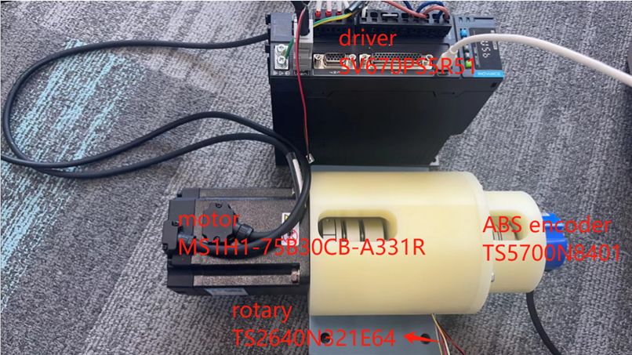

（2）hHPM5300RDC

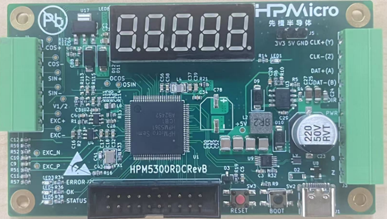

（3）HPM5300EVK


### testing environment

(1)HPM_RDC decoding software: hardware_rdc
(2) Data communication software: pc_debug
(3) ozone debugging tool
(4) Huichuan driver debugging software: InoDriverShop
(5) Jlink
(6) RDC board pin description
| function |rotary plate location | note | 
| ---- | ---- | ---- | 
| EXC+ | J4[5] | rotary exc signal | 
| EXC- | J4[6] | rotary exc signal  | 
| COS+ | J4[1] | rotary cos signal | 
| COS- | J4[2] | rotary cos signal  | 
| SIN+ | J4[3] | rotary sin signal  | 
| SIN- | J4[4] | rotary sin signal  | 
| DAT+ | J3[8] | ABS signal | 
| DAT- | J3[7] | ABS signal| 
| PWR  | J3[5] |  24v,150mA| 
| GND  | J3[4] |  GND| 
| RX   | J3[1] | uart 10M | 
| TX   | J3[6] | uart 10M| 
| MOSI | J3[6] | spi | 
| CS   | J3[3] | spi |
| SCLK | J3[2] | spi |
| MISO | J3[1] | spi |
| QEO_A | J3[3] | ABZ |
| QEO_B | J3[2] | ABZ |
| QEO_Z | J3[1] | ABZ|

### creat project

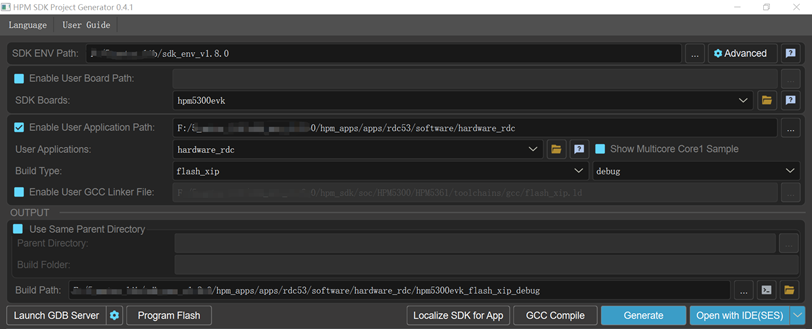

### hardware test

（1）static state：

- connect  rotary signal to RDC

- open the hardware_rdc project

- Connect the debugger to the JTAG interface

- Run the program

- measure key signals by oscilloscope:

pwm modulated sinusoidal differential signal：EXC_P(yellow)，EXC_N(pink)

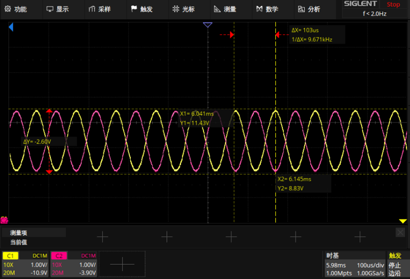

OSIN(yellow)，OCOS(pink)

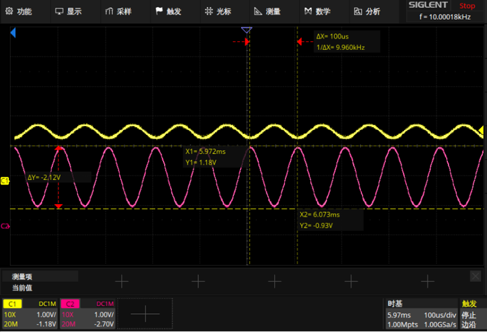

(2)In motion：

- connect  rotary signal to RDC

- Create and open the hardware_rdc project

- Connect the debugger to the JTAG interface

- Run the program

- move the motor manually

- measure key signals by oscilloscope:

OSIN(yellow)，OCOS(pink)

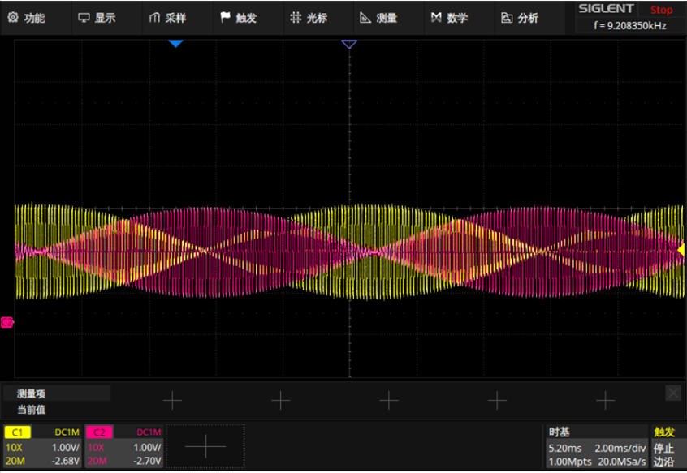

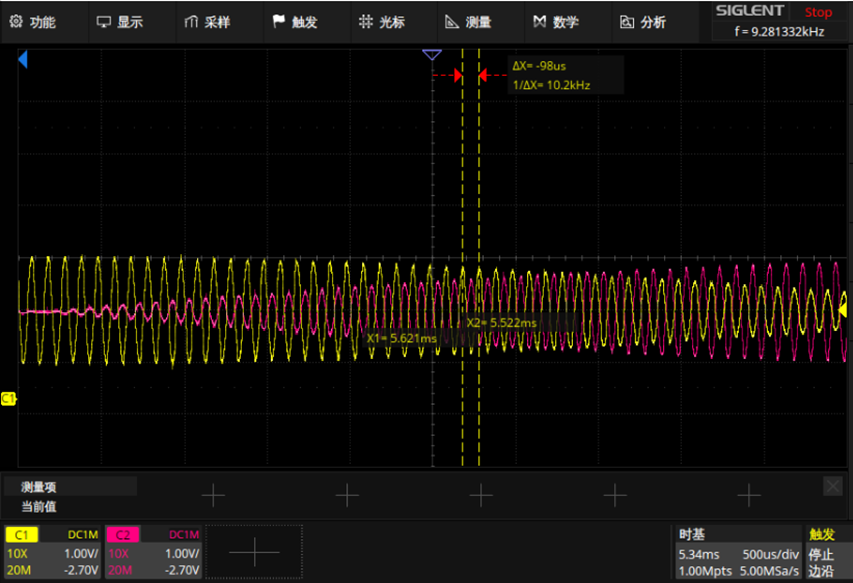


## data output test

### ABZ

#### test step

- Wiring: Connect the ABZ signal to the logic analyzer

 | function | rotary plate location|  
| ---- | ---- | 
|QEO_A|J3[3]|
|QEO_B|J3[2]|
|QEO_Z|J3[1]|

- Create and open the hardware_rdc project. 

- Open the ABZ_OUTPUT macro definition in rdc program: #define ABZ_OUTPUT 1

- Open the InoDriverShop debugging software and drive the motor to run one cycle at 100r/min
  
InoDriverShop debug refer to: [SV670P系列伺服调试手册](doc/SV670P系列伺服调试手册-CN-A07.pdf)

#### result

(1)The motor moves forward one cycle, phase A is 90 degrees ahead of phase B, output 1024 line pulse.

overall_fig：
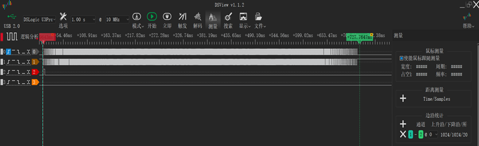

detail_acc：
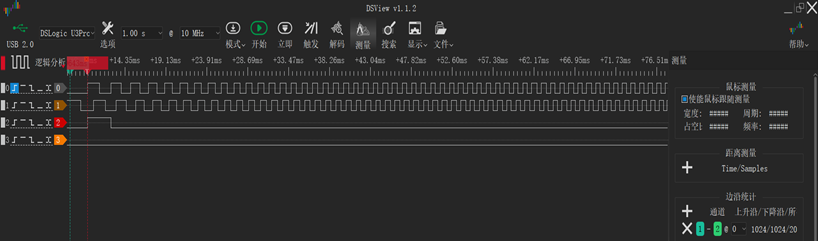

detail_dec：
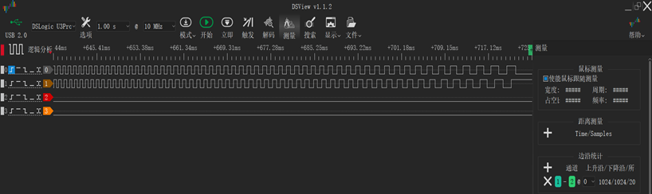

(2)The motor moves reverse one cycle, phase A is 90 degrees ahead of phase B, output 1024 line pulse.

overall_fig：
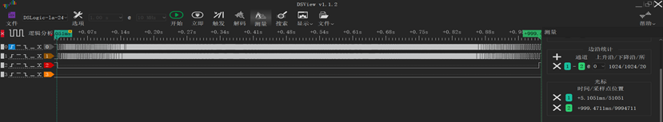

detail_acc：
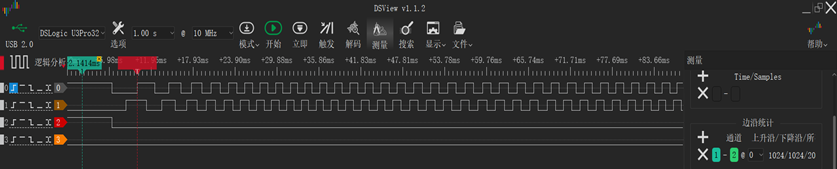

detail_dec：
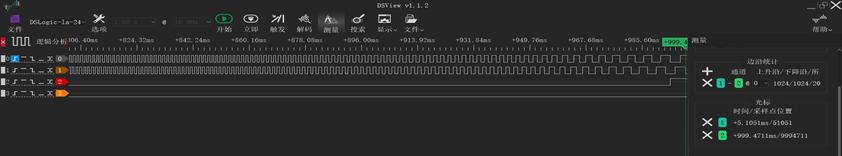

### uart

#### test step

- Wiring, rotary plate and 5300evk plate common ground.

| function | rotary plate location|5300evk location|  
| ---- | ---- | ----|
|uart.rx|J3[1]|P1[8]/PB08|
|uart.tx|J3[6]|P1[10]/PB09|

- Open UART_DEBUG_CONTROL macro definition in rdc program: #define UART_DEBUG_CONTROL 1

- Run the rdc program

- Create and open pc_debug program, select serial port communication mode: #define UART_DEBUG 1

- Running motor

- When the motor is running at constant speed, run pc_debug program

- Take out the Angle and position information stored in the array theta_rdc,pll_vel, and process it with excel (divide the original data by 100)

#### test result

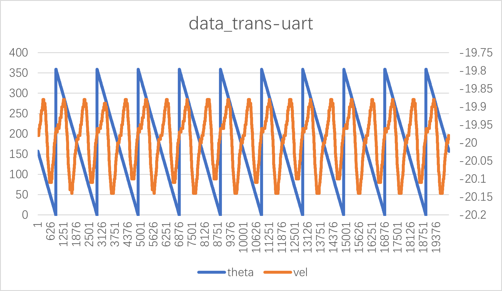

### SPI

#### test step

- Wiring, rotary plate and 5300evk plate common ground.

| function | rotary plate location|5300evk location|  
| ---- | ---- | ----|
|SPI.MOSI|J3[6]|P1[19]/PA29|
|SPI.CS|J3[3]|P1[24]/PA26|
|SPI.SCLK|J3[2]|P1[23]/PA27|
|SPI.MISO|J3[1]|P1[21]/PA28|

- Open SPI_DEBUG_CONTROL macro definition in rdc program: #define SPI_DEBUG_CONTROL 1

- Run the rdc program

- Open SPI_DEBUG macro definition in pc_debug program :#define SPI_DEBUG 1

- Running motor

- When the motor is running at constant speed, run pc_debug program

- Take out the Angle and velocity information stored in the array rdc_theta,vel_pll, and process it with excel (divide the original data by 100)

#### test result

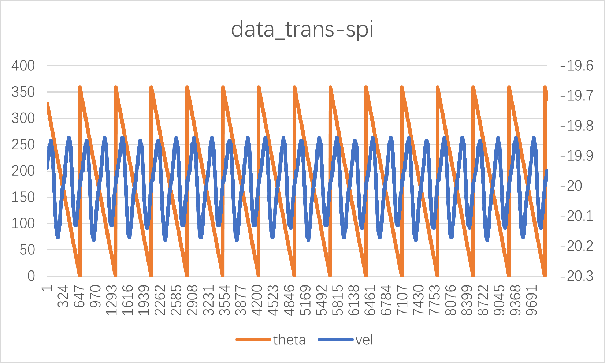

### bissc clave mode

The SEI module is configured in slave mode and acts as an encoder to send out the rotary decoding position information. There are two ways:

- Hardware tirg pos

rdc->qei->sei

0 corresponds to 0°, 0x100000000 corresponds to 360° (electrical Angle)

- Software writes pos

#### Test procedure

- When the data interface of HPM5300RDC board outputs bissc communication protocol, the 5 pins and 6 pins of U10 need to be cut off.

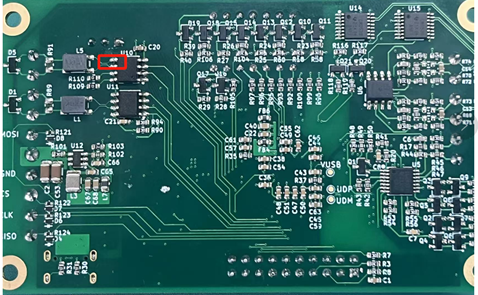

- Master code paths: samples/drivers/sei/Master/bissc, and make the following changes:

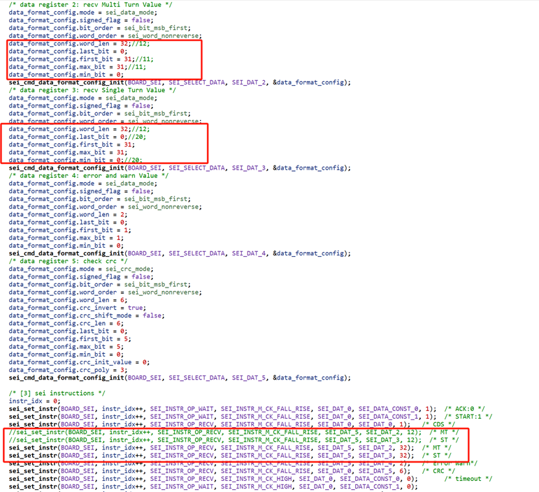

- Hardware triggered

a. Set the relevant macro definition in rdc_cfg.h

#define BISSC_SLAVE 1
#define BISSC_SLAVE_POS_HARDWARE_INJECT 1

b. Prepare a HPM5300evk board as the main machine.

Cross the Master's SEI_CLK span needle to the Master side

Connect the Master's SEI interface signal DATA_P/DATA_N with the Slave's SEI interface signal DATA_P/DATA_N.

Connect the Master's SEI interface signal CLKO_P/CLKO_N with the Slave's SEI interface signal CLKI_P/CLKI_N.

Connect the Master's GND to the Slave's GND.

c. Download the master program to the HPM5300EVK board and the rdc program to the rotary board

d. View the log information output by each board through the serial terminal

- Software writing

a. Set the relevant macro definition

#define BISSC_SLAVE 1
#define BISSC_SLAVE_POS_HARDWARE_INJECT 0

Step b.c.d is the same as (hardware injection)

#### Test results

(1) Hardware triggering

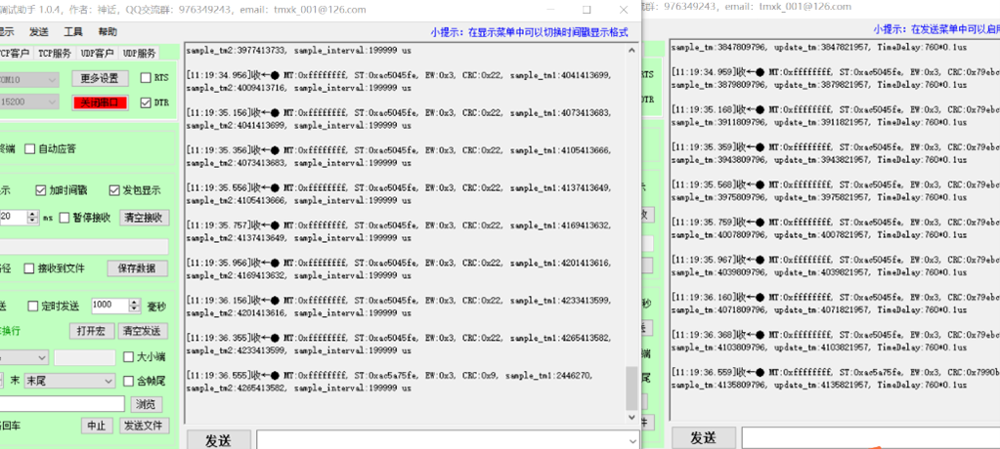

(2) Software injection

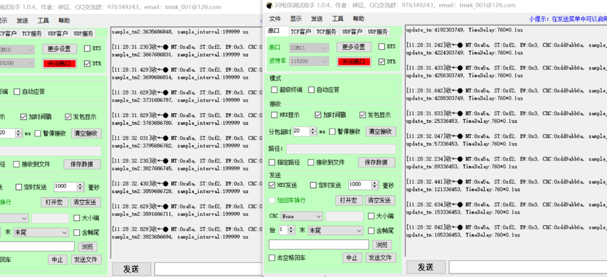

### Tamagawa slave mode

The SEI module is configured in slave mode and acts as an encoder to send out the position information decoded by rotation. There are two ways:

- Hardware tirg pos
rdc->qei->sei
0 corresponds to 0°, 0x100000000 corresponds to 360° (electrical Angle)
- Software writes pos

#### Test procedure

- Hardware triggered

a. Set the relevant macro definition in rdc_cfg.h

#define TAMAGAWA_SLAVE_POS_HARDWARE_INJECT 1
#define TAMAGAWA_SLAVE 1

b. Prepare A USB-to-485 module to connect the SEI interface signal DATA_P/DATA_N with the A/B signal of USB-to-485

c. Download the program to the development board and run it.

d. Send Hex data through the serial debug assistant: '1A' or '02' or '8A' or '92', and the encoder simulated by the development board will respond. At the same time, you can view the log information output by the development board through the serial port terminal.

- Software writing

a. Set the relevant macro definition

#define TAMAGAWA_SLAVE_POS_HARDWARE_INJECT 0
#define TAMAGAWA_SLAVE 1

b. Prepare A USB-to-485 module to connect the SEI interface signal DATA_P/DATA_N with the A/B signal of USB-to-485

c. Download the program to the development board and run it.

d. Send Hex data through the serial debug assistant: '1A' or '02' or '8A' or '92', and the encoder simulated by the development board will respond. At the same time, you can view the log information output by the development board through the serial port terminal

#### Test results

- Hardware triggered

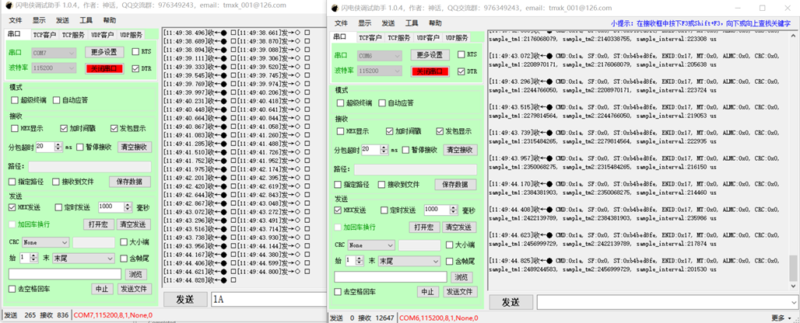

- Software injection

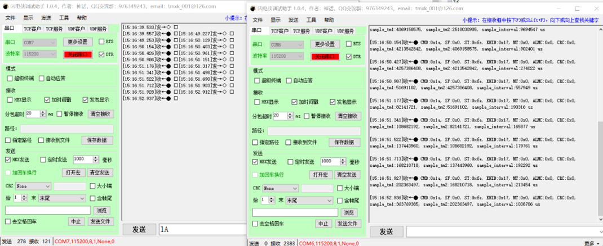

- Note: Since the maximum baud rate of USB to 485 module used in the test is less than 2.5Mbps, the communication baud rate in the modified program is 115200, and it is changed back to 2.5Mbps in actual use.

## error test

The Angle error test is based on the above motor driven platform, and the Angle difference is obtained by comparing the Angle of the rotary decoding board with the Angle of the absolute value encoder under steady speed.

There are three ways to calculate the Angle in the rotary decoding board: arctangent, pll,pll_ii; There are two corresponding speed calculation methods: the speed information is obtained based on the change of the fixed reading Angle, the speed information is directly output by the pll module ,and the speed information is directly output by the pll_ii module.

The speed fluctuation test is also based on the motor driven platform mentioned above, and the given speed at steady speed is compared with the sampling speed.

### Angle error

#### test step

- Connect the rotary signal, absolute encoder signal and power supply to the rotary plate according to the pin instructions in the test environment

- Add to cmalist.txt in hardware_rdc:
```
sdk_compile_definitions(-DCONFIG_NDEBUG_CONSOLE=1)
sdk_ses_opt_lib_io_type(RTT)
```
- start_gui.exe regenerate and open the hardware_rdc program

- Open SEGGER_RTT_DEBUG, ABS_encoder_23bit macro definition in rdc program
```
#define SEGGER_RTT_DEBUG 1
#define ABS_encoder_23bit 1
```

- open  SEGGER_RTT_printf(0, "%d,%d,%d,%d,%d\r\n",rdc_error,pll_error,pll_ii_error,pll_vel,pll_ii_vel);

- build rdc program

- Select debug with ozone and click the download button

- Open Jlink-RTT-Logger v8.10d

- Configure Target interface:JTAG,interface speed:9600, RTT control address:0x0008242C (find the address of _SEGGER_RTT in the demo.map file),RTT channel:0

- Run the rdc program

- Run the motor at 10, 20, 30, 40, 50r/s, respectively

- Stop running the rdc program after collecting the location information for a period of time

- Find the RTTLogger_Channel_Terminal.log file in C:\Users\XJXXX\AppData\Roaming\SEGGER

- open data by excel, there are four columns of data collected, namely rdc_sei_theta_error,pll_sei_theta_error,pll_ii_sei_theta_error,pll_vel,pll_ii_vel

- Data analysis: The Angle is periodic data of 0-360, and there is hysteresis in the Angle calculation. After calculating the error with the following formula, the points in the interval of (-300,300) are selected, and the points in the constant speed section can be taken.

#### result

- Angle error

| vel_ref r/s | sei_rdc_error|sei_pll_error|sei_pll_ii_error|
| ---- | ---- | ----|----|
|-10|(-0.51,1.13)|(-0.2,1.57)|(-0.04,1.45)|
|-20|(-1,0.92)|(-0.91,2.3)|(-0.4,1.58)|
|-30|(-1.5,0.2)|(-0.44,1.26)|(-0.54,1.36)|
|-40|(-1.89,0.26)|(-0.3,1.59)|(-0.7,1.93)|
|-50|(-2.42,0)|(0.047,1.136)|(-0.79,1.86)|

(1)-10r/s

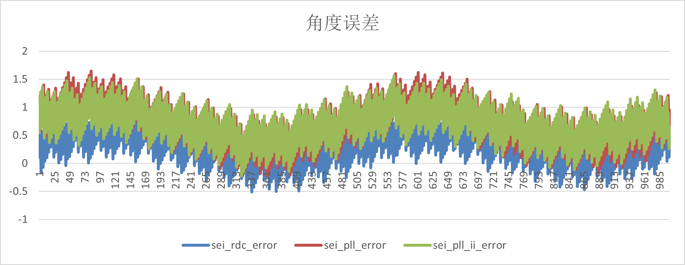

(2)-20r/s

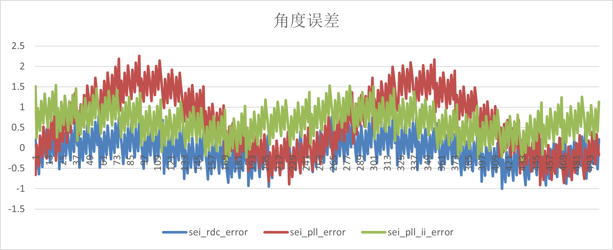

(3)-30r/s

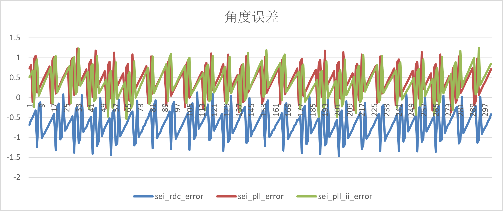

(4)-40r/s

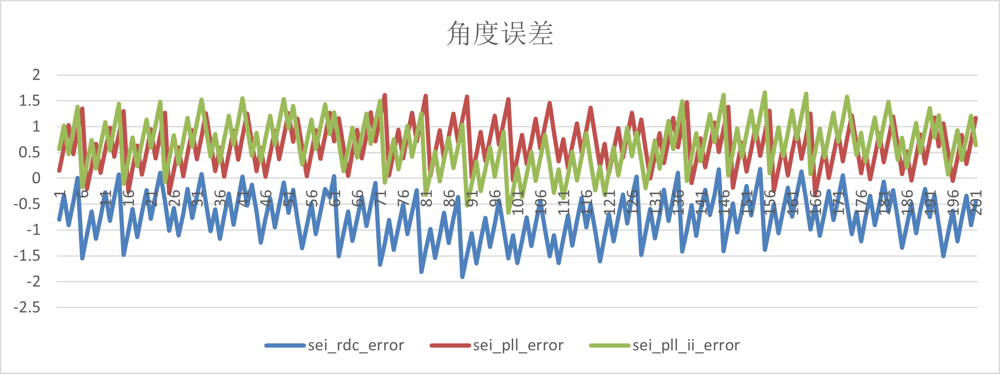

(5)-50r/s

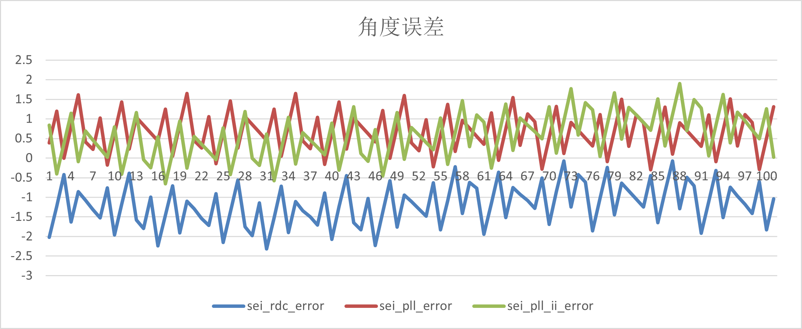
- Velocity fluctuation

| vel_ref r/s | pll_vel|pll_ii_vel|  
| ---- | ---- | ----|
|-10|(-9.86,-10.17)|(-9.93,-10.11)|
|-20|(-19.5,-20.7)|(-19.85,-20.14)|
|-30|(-29.9,-30.13)|(-29.9,-30.11)|
|-40|(-39.82,-40.2)|(-39.83,-40.22)|
|-50|(-49.9,-50.14)|(-49.8,-50.22)|

(1)-10r/s

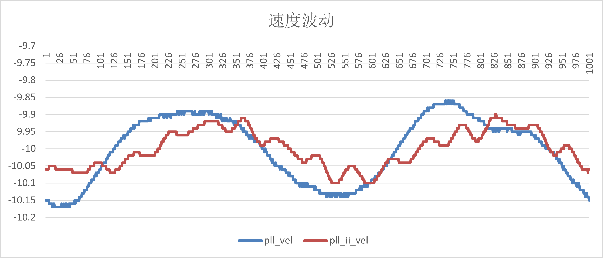

(2)-20r/s

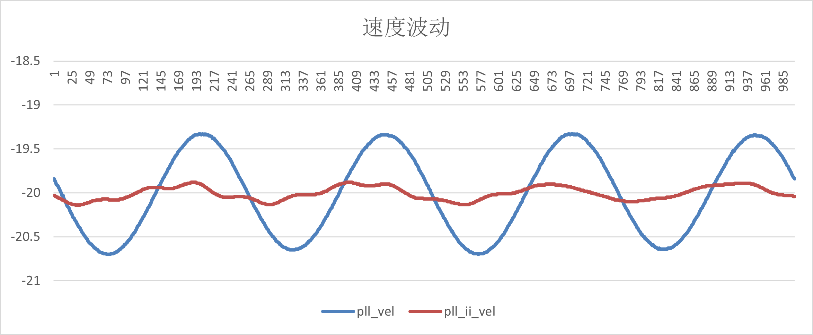

(3)-30r/s

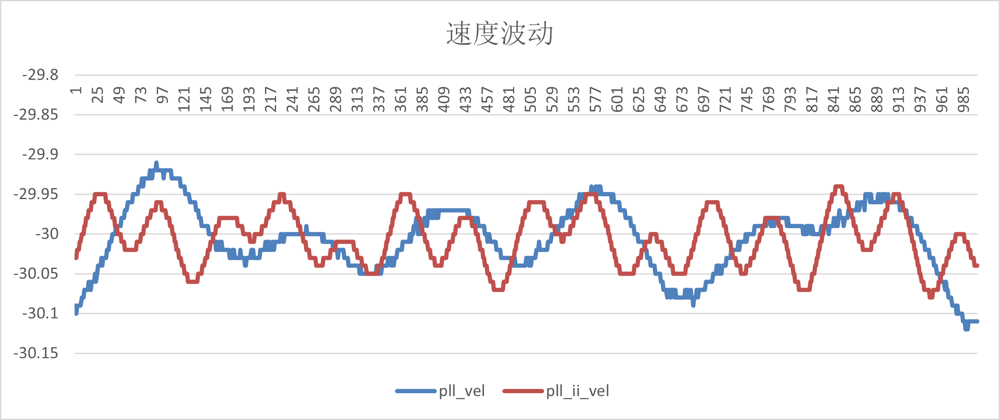

(4)-40r/s

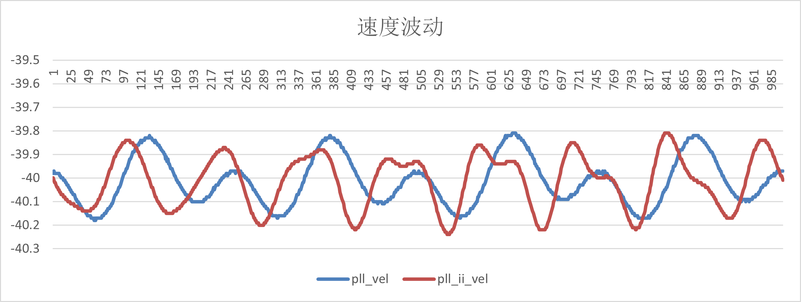

(5)-50r/s

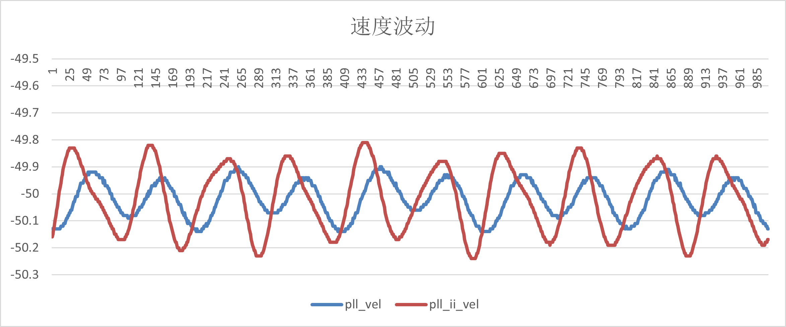


### Test Summary

(1) EXC_P, EXC_N, OSIN and OCOS signals of static and dynamic tests meet the requirements;

(2)UART and SPI communication function is normal, and the read data is consistent with the set motor parameters;

(3)bissc from the mode, Tamagawa from the mode correct output Angle, location information;

(4) The A/B/Z phase output of QEO is normal, and the output waveform is consistent with the set motor parameters;

(5) The Angle error data were tested at 10r/s, 20r/s, 30r/s, 40r/s and 50r/s speeds respectively. Compared with the absolute encoder, the arctangent Angle error of RDC was ±2.5 electrical Angle, the Angle error of PLL observer was ±2.3 electrical Angle, and the Angle error of PLL_II was ±2 electrical Angle. All meet the spec of ±3.

(6) The speed fluctuation range of PLL and PLL_II is ±0.3r/s at medium, low and high speeds.

## API

:::{eval-rst}

About software API: `API doc <../../_static/apps/rdc53_2.0/html/index.html>`_ .
:::
