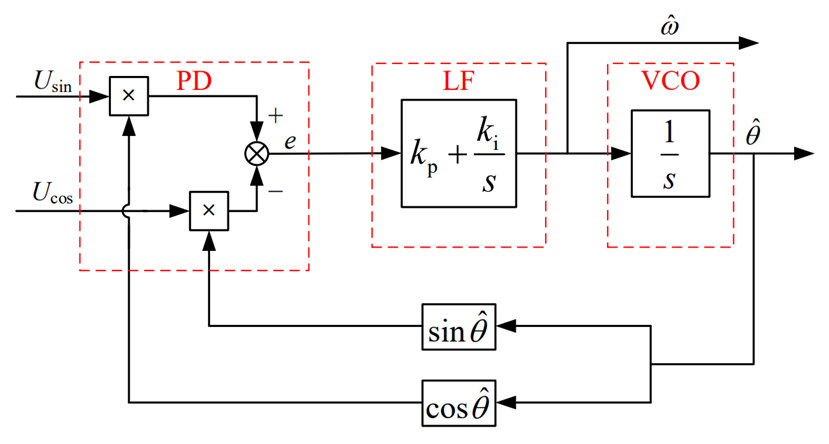
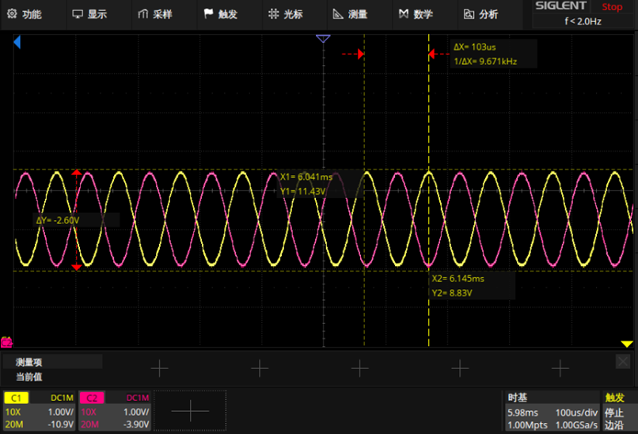
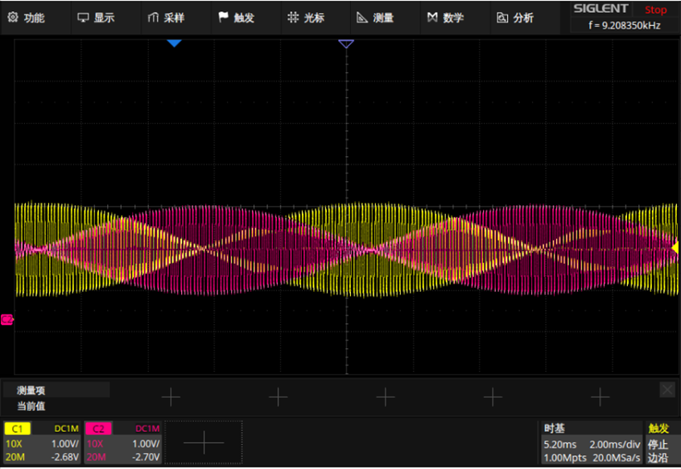
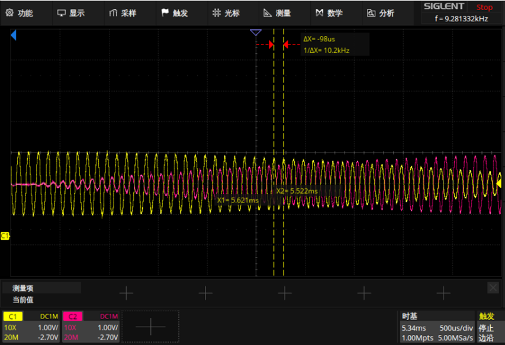
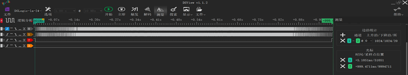
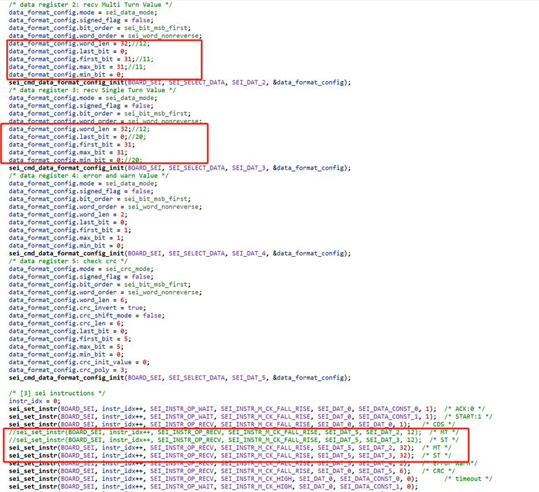
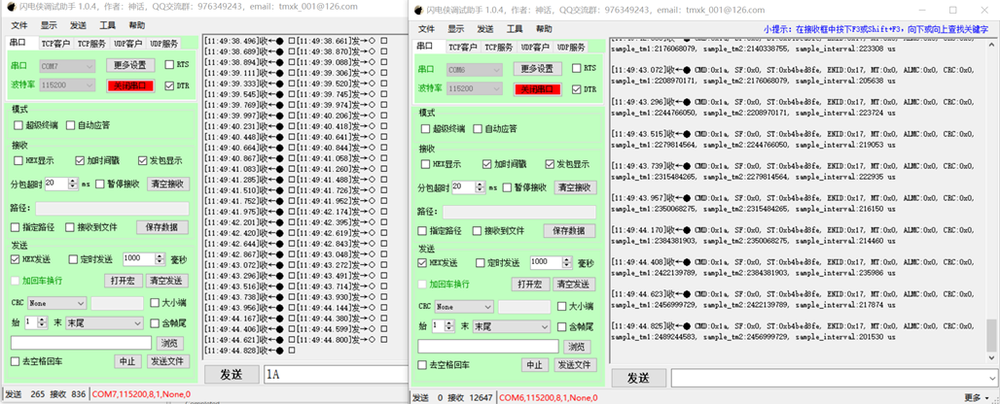
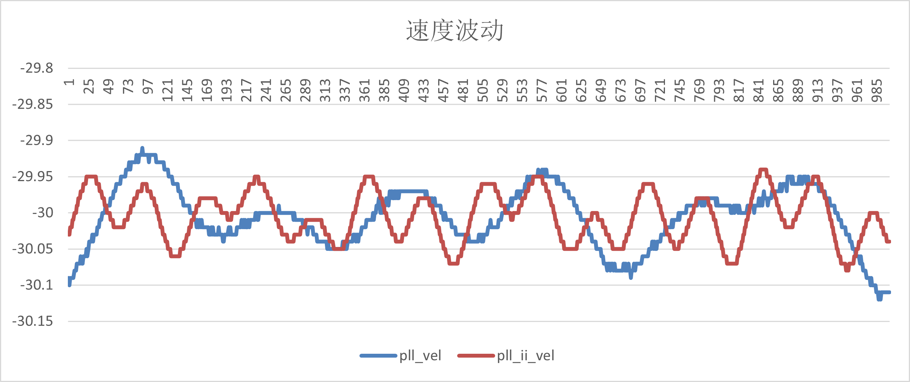
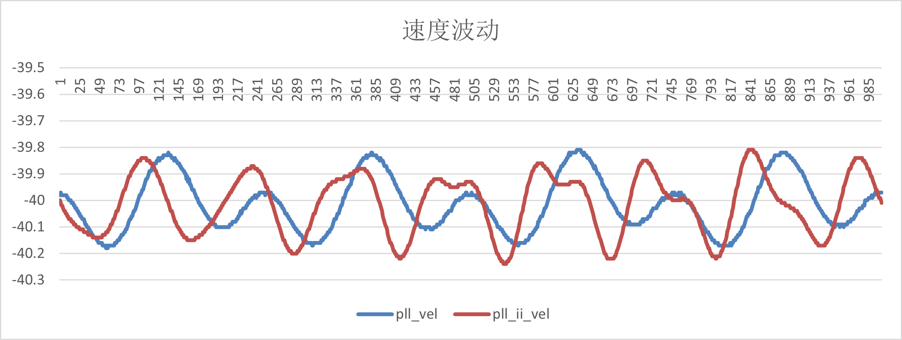
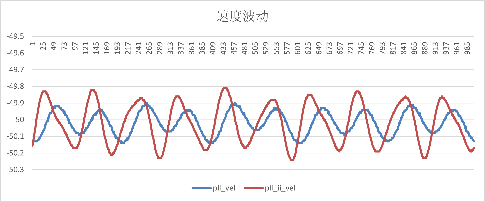

# HPM5300_RDC硬解码

## 依赖SDK1.10.0

## 概述

高性能电机控制应用传统上需要一个速度或位置传感器的控制回路反馈。位置反馈环节对系统的性能有关键性的影响。旋转变压器因其耐冲击，耐高温，耐油污，高可靠，长寿命等优点，成为受欢迎的角度传感器。

目前，市场现有的旋变解决方案多为分立式，BOM成本高，占板面积大。

为了简化设计，HPM提供了集励磁运放电路，升压DC-DC芯片，模拟前端，旋变数字转换器，旋变信号丢失检测以及多种格式数据（位置/速度）输出接口于一体的功能型旋变解码板。

## 硬解码原理

- 旋变器格式信号


旋转变压器由转子和定子铁芯组成，中间转子由层压磁性钢板组成，定子铁芯上有单相励磁线圈绕组（R1-R2）和两相输出线圈绕组（S1-S3,S2-S4），两对输出绕组隔90°摆放。当励磁线圈由交流电压激励时，根据变压器原理，输出绕组上有相应交流电压。


- 工作原理-积分解调

积分解调可以分为整形和积分两个过程。


（1）整形：

将旋转变压器输出的正余弦信号乘以与励磁信号同频率的符号函数

（2）积分：

对励磁周期内的整形结果进行积分

经过整形和积分后，高频的励磁信号被去除，得到包含转子信息的解调信号。

从工作原理看，积分解调需要较高的采样速率，并且积分过程中对处理器的运算速率有一定的要求。

- 位置获取方式

（1）反正切

反正切法是实现转子角度解算最简单直接的方法

反正切函数在过零点处斜率比较大，输出信号中有较小的干扰会造成较大的角度解算误差。因此反正切多用于对噪声和精度要求不高的场合。

(2)闭环角度观测器-PLL

主要有鉴相器（PD）、PI控制器构成的环路滤波器(LF)以及积分构成的压控震荡器（VCO）三部分组成。
其中鉴相器用于产生一个包含真实角度和估算角度之间的相位偏差的信号；

环路滤波器使用PI控制器负责抑制噪声干扰，决定了PLL的动态性能、跟踪性能和稳定性，其输出是转子角频率；

压控震荡器用来对角频率积分产生估计角度值。



(3)TYPE_II环路跟踪

TYPE_II环路跟踪由三部分组成，积分器1，滤波补偿器（一个极点，一个零点），积分器2。积分器的用于从速度信号生成角度输出，滤波器用于减小高频噪声。

## 硬件方案
RDC硬解码整体方案图如下图所示：


HPM5300RDC板具有的功能有：两路ADC，一路uart，一路spi,两路DAC，QEO输出，SEI主/从，LED显示等。

HPM5300RDC原理图: [《HPM5300_RDC_REVB》](hardware/00_原理图/HPM5300RDCRevB.pdf)

## 软件方案

软件方案主要由以下几部分组成：

pwm产生激励信号，ADC采样，sei模块获取绝对式编码器位置信息，三种位置/速度计算方式（PLL_II/PLL/反正切），增量式编码器仿真输出（A_guad_B格式），两种数据通信（uart/spi）。

其中sei模块作主机使用，是为了将获得RDC角度与绝对式编码器角度做对比，进行误差分析。

sei模块也可做从机使用，做从机使用时，有bissc和TAMAGAWA两种输出模式。

## 测试

本方案测试分为三大部分：

（1）硬件测试：pwm调制后正弦差分信号(EXC_P/EXC_N)，旋变正余弦绕组信号(OSIN/OCOS)
（2）数据输出测试：uart，spi,abz，bissc,TAMAGAWA
（3）误差测试:角度误差，速度波动

### 测试仪器

（1）电机驱动平台


（2）旋变解码板


（3）HPM5300EVK


### 测试环境

(1)HPM_RDC解码软件：hardware_rdc
(2)数据通信软件：pc_debug
(3) ozone调试工具
(4) 汇川驱动器调试软件：InoDriverShop
(5) Jlink
(6) RDC板引脚说明

 | 功能 | 旋变板位置| 说明 | 
| ---- | ---- | ---- | 
| EXC+ | J4[5] | 旋变激励信号 | 
| EXC- | J4[6] | 旋变激励信号 | 
| COS+ | J4[1] | 旋变余弦信号 | 
| COS- | J4[2] | 旋变余弦信号 | 
| SIN+ | J4[3] | 旋变正弦信号 | 
| SIN- | J4[4] | 旋变正弦信号 | 
| DAT+ | J3[8] | 绝对值编码器信号 | 
| DAT- | J3[7] | 绝对值编码器信号 | 
| PWR  | J3[5] |  24v,150mA| 
| GND  | J3[4] |  GND| 
| RX   | J3[1] | 串口10M | 
| TX   | J3[6] | 串口10M| 
| MOSI | J3[6] | spi | 
| CS   | J3[3] | spi|
| SCLK | J3[2] | spi |
| MISO | J3[1] | spi |
| QEO_A | J3[3] | ABZ |
| QEO_B | J3[2] | ABZ |
| QEO_Z | J3[1] | ABZ |

### 工程创建


### 硬件测试

（1）静态下：

- 旋变板接入旋变信号

- 打开hardware_rdc工程

- 连接调试器到JTAG接口

- 运行程序

- 示波器测量关键信号：

pwm调制后正弦差分信号：EXC_P(黄)，EXC_N(粉红)



OSIN(黄)，OCOS(粉红)


(2)动态下：

- 旋变板接入旋变信号
- 创建，打开hardware_rdc工程
- 连接调试器到JTAG接口
- 运行程序
- 手动旋转电机
- 示波器测量关键信号：

OSIN(黄)，OCOS(粉红)






## 数据输出测试

### ABZ

#### 测试步骤

- 接线：将ABZ信号接入逻辑分析仪

 | 功能 | 旋变板位置|  
| ---- | ---- | 
|QEO_A|J3[3]|
|QEO_B|J3[2]|
|QEO_Z|J3[1]|

- 创建，打开hardware_rdc工程。

- 打开rdc程序中ABZ_OUTPUT宏定义: #define  ABZ_OUTPUT    1

- 打开InoDriverShop调试软件，驱动电机以100r/min的速度运行一圈

  InoDriverShop调试请参考 [SV670P系列伺服调试手册](doc/SV670P系列伺服调试手册-CN-A07.pdf)

#### 测试结果

(1)电机正转一圈，A相超前于B相90度，输出1024线脉冲。

整体图：


加速段：


减速段：


(2)电机反转一圈，B相超前于A相90度，输出1024线脉冲。

整体图：


加速段：


减速段：


### 串口

#### 测试步骤

- 接线，旋变板与5300evk板共地。

| 功能 | 旋变板位置|5300evk板位置|  
| ---- | ---- | ----|
|uart.rx|J3[1]|P1[8]/PB08|
|uart.tx|J3[6]|P1[10]/PB09|

- 打开rdc程序中UART_DEBUG_CONTROL宏定义： #define UART_DEBUG_CONTROL 1

- 运行rdc程序 

- 创建并打开pc_debug程序，选择串口通信模式：#define UART_DEBUG 1

- 运行电机

- 待电机匀速运行时，运行pc_debug程序

- 取出存放在数组theta_rdc,pll_vel中的角度和位置信息，用excel处理（原数据除以100）

#### 测试结果


### SPI

#### 测试步骤

- 接线，旋变板与5300evk板共地。

| 功能 | 旋变板位置|5300evk板位置|  
| ---- | ---- | ----|
|SPI.MOSI|J3[6]|P1[19]/PA29|
|SPI.CS|J3[3]|P1[24]/PA26|
|SPI.SCLK|J3[2]|P1[23]/PA27|
|SPI.MISO|J3[1]|P1[21]/PA28|

- 打开rdc程序中SPI_DEBUG_CONTROL宏定义：#define  SPI_DEBUG_CONTROL 1

- 运行rdc程序

- 打开pc_debug程序中SPI_DEBUG宏定义:#define SPI_DEBUG 1

- 运行电机

- 待电机匀速运行时，运行pc_debug程序

-取出存放在数组rdc_theta,vel_pll中的角度和速度信息，用excel处理（原数据除以100）

#### 测试结果


### bissc从模式

SEI模块配置为从机模式，作为编码器，将旋变解码位置信息发送出去，有两种方式：
- 硬件tirg pos
rdc->qei->sei
0对应0°，0x100000000对应360°（电角度）
-	软件写入pos

#### 测试步骤

-HPM5300RDC板数据接口做bissc通信协议输出时，需要将U10的5脚6脚剪掉。
 


- Master代码路径：samples/drivers/sei/master/bissc，并做如下修改：
 


- 硬件触发

a.设置rdc_cfg.h中相关宏定义

#define  BISSC_SLAVE                   1
#define  BISSC_SLAVE_POS_HARDWARE_INJECT  1

b.准备一个HPM5300evk板作为主机。

将Master的SEI_CLK跨针跨至Master侧

将Master的SEI接口信号DATA_P/DATA_N与Slave的SEI接口信号DATA_P/DATA_N相连接。

将Master的SEI接口信号CLKO_P/CLKO_N与Slave的SEI接口信号CLKI_P/CLKI_N相连接。

将Master的GND与Slave的GND相连接。

c.将master程序下载至HPM5300EVK板，将rdc程序下载至旋变板

d.通过串口终端查看各板输出的log信息

- 软件写入

a.设置相关宏定义

#define  BISSC_SLAVE                   1
#define  BISSC_SLAVE_POS_HARDWARE_INJECT  0

b.c.d步骤同（硬件注入）

#### 测试结果

（1）硬件触发
 


（2）软件注入
 


### 多摩川从模式

SEI模块配置为从机模式，作为编码器，将旋变解码的位置信息发送出去，有两种方式：

- 硬件tirg pos
rdc->qei->sei
0对应0°，0x100000000对应360°（电角度）
- 软件写入pos

#### 测试步骤
- 硬件触发

a.设置rdc_cfg.h中相关宏定义

#define TAMAGAWA_SLAVE_POS_HARDWARE_INJECT         1
#define TAMAGAWA_SLAVE                  1

b.准备一个USB转485模块，将SEI接口信号DATA_P/DATA_N与USB转485的A/B信号相连接

c.将程序下载至开发板并运行。

d.通过串口调试助手发送Hex数据：`1A` 或 `02` 或 `8A` 或 `92`，开发板模拟的编码器将会进行响应。同时，可通过串口终端查看开发板输出的log信息

- 软件写入

a.设置相关宏定义

#define TAMAGAWA_SLAVE_POS_HARDWARE_INJECT         0
#define TAMAGAWA_SLAVE                  1

b.准备一个USB转485模块，将SEI接口信号DATA_P/DATA_N与USB转485的A/B信号相连接

c.将程序下载至开发板并运行。

d.通过串口调试助手发送Hex数据：`1A` 或 `02` 或 `8A` 或 `92`，开发板模拟的编码器将会进行响应。同时，可通过串口终端查看开发板输出的log信息

#### 测试结果

- 硬件触发



- 软件注入

 

- 注：由于测试使用的USB转485模块的最大波特率小于2.5Mbps，所以修改程序中的通讯波特率为115200，实际使用时，修改回2.5Mbps。


## 误差测试

角度误差测试是基于上述电机驱动平台，将稳速下的旋变解码板的角度与绝对值编码器的角度进行对比，获得角度差。

旋变解码板中角度计算有三种方式:反正切，pll，pll_ii；则对应的速度计算方式也有三种：基于固定的时常读取角度的变化获得速度信息，pll模块直接输出的速度信息，pll_ii模块直接输出的速度信息。

速度波动测试同样是基于上述电机驱动平台，将稳速下的给定速度与采样速度进行对比。

### 角度误差

#### 测试步骤

- 参照测试环境中的引脚说明，将旋变信号，绝对值编码器信号，电源接入旋变板 

- 在hardware_rdc的cmalist.txt中添加：
```
sdk_compile_definitions(-DCONFIG_NDEBUG_CONSOLE=1)
sdk_ses_opt_lib_io_type(RTT)
```
- start_gui.exe中重新生成并打开hardware_rdc程序

- 打开rdc程序中SEGGER_RTT_DEBUG，ABS_encoder_23bit宏定义
```
#define SEGGER_RTT_DEBUG 1
#define ABS_encoder_23bit 1
```

- 打开 SEGGER_RTT_printf(0, "%d,%d,%d,%d,%d\r\n",rdc_error,pll_error,pll_ii_error,pll_vel,pll_ii_vel);

- build rdc程序

- 选择debug with ozone,点击download按钮

- 打开Jlink-RTT-Logger v8.10d

- 配置 Target interface:JTAG,interface speed:9600，RTT control address:0x0008242C（在demo.map文件中找到_SEGGER_RTT的地址）,RTT channel:0

- 运行rdc程序

- 分别以10、20、30、40、50r/s的速度运行电机

- 采集一段时间位置信息后，停止运行rdc程序

- 在C:\Users\XJXXX\AppData\Roaming\SEGGER中找到RTTLogger_Channel_Terminal.log文件

- excel打开，采集到的数据一共有五列，分别是rdc_sei_theta_error,pll_sei_theta_error,pll_ii_sei_theta_error,pll_vel,pll_ii_vel

- 数据分析:角度呈0-360的周期性数据，角度计算存在滞后现象，筛选出（-300,300）区间内的点，并取匀速段的点即可。

#### 测试结果

- 角度误差

| 给定速度r/s | sei_rdc_error|sei_pll_error|sei_pll_ii_error|
| ---- | ---- | ----|----|
|-10|(-0.51,1.13)|(-0.2,1.57)|(-0.04,1.45)|
|-20|(-1,0.92)|(-0.91,2.3)|(-0.4,1.58)|
|-30|(-1.5,0.2)|(-0.44,1.26)|(-0.54,1.36)|
|-40|(-1.89,0.26)|(-0.3,1.59)|(-0.7,1.93)|
|-50|(-2.42,0)|(0.047,1.136)|(-0.79,1.86)|

(1)-10r/s


(2)-20r/s


(3)-30r/s


(4)-40r/s


(5)-50r/s


- 速度波动

| 给定速度r/s | pll_vel|pll_ii_vel|  
| ---- | ---- | ----|
|-10|(-9.86,-10.17)|(-9.93,-10.11)|
|-20|(-19.5,-20.7)|(-19.85,-20.14)|
|-30|(-29.9,-30.13)|(-29.9,-30.11)|
|-40|(-39.82,-40.2)|(-39.83,-40.22)|
|-50|(-49.9,-50.14)|(-49.8,-50.22)|

(1)-10r/s


(2)-20r/s


(3)-30r/s



(4)-40r/s



(5)-50r/s



## 测试小结

(1)静态测试和动态测试的EXC_P、EXC_N、OSIN和OCOS信号符合要求；

(2)UART和SPI通信功能正常，读取的数据与设置的电机参数一致；

(3)bissc从模式、多摩川从模式正确输出角度、位置信息；

(4)QEO的A/B/Z相输出正常，输出波形与设置的电机参数相符合；

(5)在10r/s、20r/s、30r/s、40r/s和50r/s转速下分别测试了角度误差数据，与绝对值编码器相比，RDC反正切角度误差最大为±2.5电角度，PLL观测器角度误差最大为±2.3电角度，PLL_II角度误差最大为±2电角度，均满足±3的spec。

(6)中低高各速度下，PLL与PLL_II速度波动范围为±0.3r/s。

## API

:::{eval-rst}

关于软件API 请查看 `方案API 文档 <../../_static/apps/rdc53_2.0/html/index.html>`_ 。
:::
